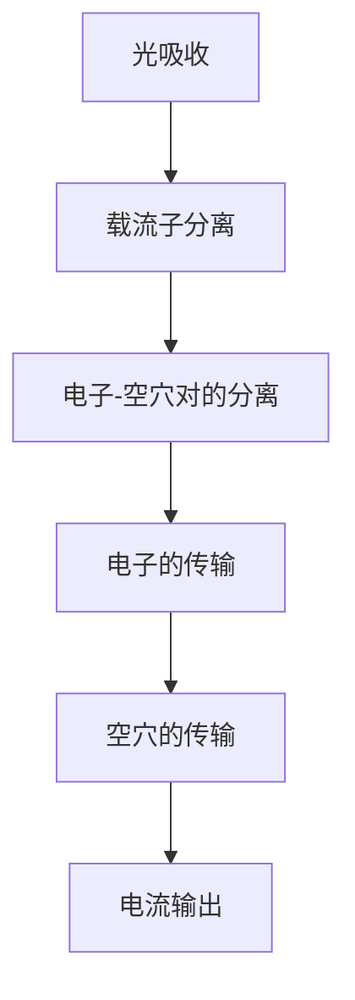
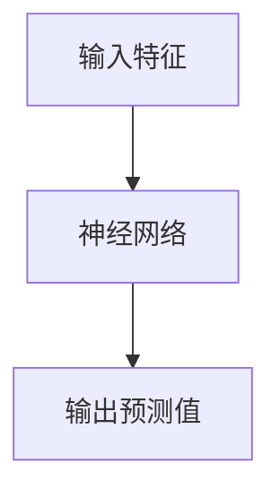
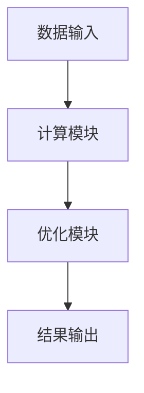
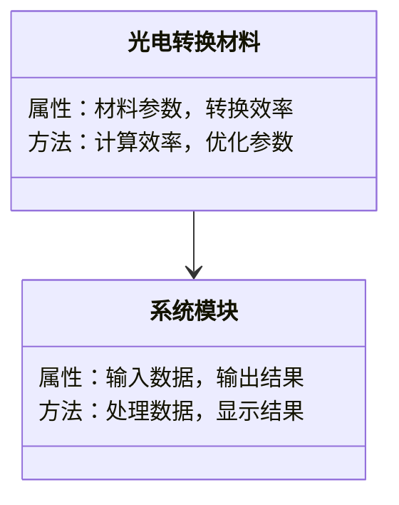
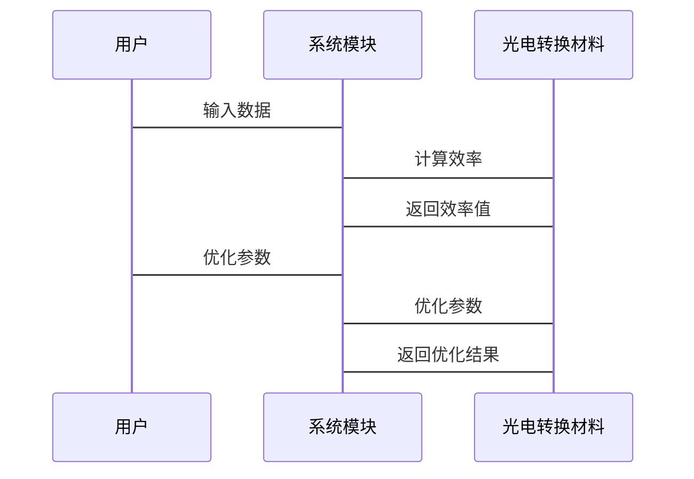
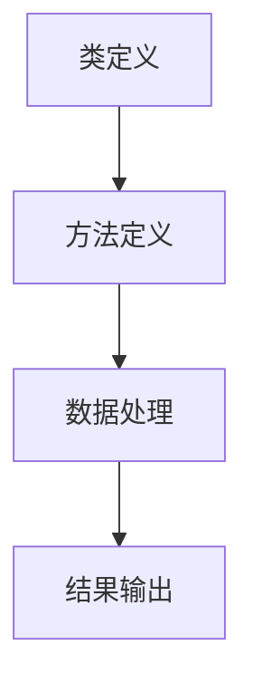

                 


# 价值投资中的新型高效光电转换材料技术

> 关键词：光电转换材料，效率，价值投资，技术分析，数学建模

> 摘要：本文深入探讨了光电转换材料在价值投资中的应用，分析了光电转换材料的核心原理、技术突破、数学模型与算法，并结合实际案例展示了其在系统设计中的应用。通过本文，读者可以全面了解光电转换材料的技术价值及其在投资决策中的重要性。

---

## 第一部分: 光电转换材料的背景与价值

### 第1章: 光电转换材料的背景与价值

#### 1.1 光电转换材料的定义与分类

##### 1.1.1 光电转换材料的基本定义
光电转换材料是指能够将光能转化为电能的材料。这类材料是太阳能电池、光电传感器等光电子器件的核心组成部分。根据材料的物理性质，光电转换材料主要分为半导体材料、有机光电材料和纳米光电材料。

##### 1.1.2 光电转换材料的主要分类
以下是光电转换材料的主要分类及特点：

| 类别         | 特性描述                          | 应用领域               |
|--------------|-----------------------------------|------------------------|
| 半导体材料   | 具有明确的能带结构，导电性可调    | 太阳能电池、LED等      |
| 有机光电材料 | 基于有机分子结构，柔韧性好        | 柔性显示器、有机太阳能电池 |
| 纳米光电材料 | 尺度效应显著，性能可调           | 纳米发电机、新型传感器   |

##### 1.1.3 光电转换材料的应用领域
光电转换材料广泛应用于能源、通信、医疗、军事等领域。例如：
- 太阳能电池：将太阳能转化为电能。
- 光电传感器：用于光信号检测。
- 显示器：如OLED屏幕的发光材料。

#### 1.2 光电转换效率的数学模型与公式

##### 1.2.1 光电转换效率的计算公式
光电转换效率是衡量光电转换材料性能的重要指标，其计算公式为：
$$ \text{光电转换效率} = \frac{\text{输出电能}}{\text{输入光能}} $$

##### 1.2.2 影响光电转换效率的关键因素
以下是影响光电转换效率的主要因素及其影响程度：

| 因素         | 影响程度 | 描述                         |
|--------------|----------|------------------------------|
| 材料特性      | 高       | 包括材料的禁带宽度、载流子迁移率等。 |
| 光照条件     | 中       | 光强、光谱分布等因素会影响转换效率。 |
| 温度         | 中       | 高温可能导致材料性能下降。        |

##### 1.2.3 光电转换效率的优化方法
优化光电转换效率的主要方法包括：
1. **材料优化**：选择合适的材料或改变化学组成。
2. **结构优化**：通过纳米结构设计提高光吸收效率。
3. **表面处理**：减少表面反射损失。

#### 1.3 价值投资中的光电转换材料技术

##### 1.3.1 价值投资的基本概念
价值投资是一种投资策略，旨在通过分析企业的内在价值，选择被市场低估的投资标的。其核心在于找到价格低于内在价值的资产。

##### 1.3.2 光电转换材料技术的市场价值
光电转换材料技术的市场价值主要体现在其应用领域的广泛性和技术的先进性。例如，高效太阳能电池的技术进步可以直接提升企业的市场竞争力和盈利能力。

##### 1.3.3 价值投资与光电转换材料技术的结合
在光电转换材料领域，投资者可以通过分析企业的技术研发能力、市场前景和财务状况，选择具有投资价值的企业。例如，某企业通过技术创新实现了更高的光电转换效率，这将显著提升其市场竞争力和盈利能力。

#### 1.4 本章小结
本章从光电转换材料的定义、分类、应用领域入手，详细分析了光电转换效率的计算公式及其影响因素，并探讨了价值投资与光电转换材料技术的结合。通过对光电转换材料技术的深入了解，投资者可以更好地把握其市场价值。

---

## 第二部分: 光电转换材料的核心原理与技术

### 第2章: 光电转换材料的核心原理与技术

#### 2.1 光电转换的基本原理

##### 2.1.1 光电转换的基本过程
光电转换的基本过程包括光吸收、载流子分离与传输、电子-空穴对的分离与收集等步骤。其基本流程如下：



##### 2.1.2 光电转换的主要机制
光电转换的主要机制包括本征吸收、缺陷态吸收和界面态吸收。不同机制对应不同的光吸收过程和效率。

##### 2.1.3 光电转换的关键技术
光电转换的关键技术包括：
1. **材料制备技术**：如CVD（化学气相沉积）和MOCVD（金属有机化学气相沉积）。
2. **器件结构设计**：如异质结结构设计。
3. **表面处理技术**：如减反膜和陷光结构设计。

#### 2.2 光电转换材料的性能指标

##### 2.2.1 转换效率
转换效率是衡量光电转换材料性能的核心指标。高效光电转换材料的转换效率通常在15%以上。

##### 2.2.2 响应时间
响应时间是指材料从光信号输入到电信号输出的时间间隔。响应时间越短，材料的实时性越强。

##### 2.2.3 稳定性与寿命
材料的稳定性与寿命直接影响其长期使用效果。高质量的光电转换材料应具有较长的使用寿命和较高的稳定性。

#### 2.3 新型光电转换材料的技术突破

##### 2.3.1 纳米材料在光电转换中的应用
纳米材料因其独特的物理性质，在光电转换中具有显著优势。例如，纳米线结构可以提高光吸收效率。

##### 2.3.2 有机光电材料的发展
有机光电材料以其柔韧性和轻量化特点，在柔性显示器和可穿戴设备中具有广泛应用前景。

##### 2.3.3 高效光电转换材料的最新研究成果
最新的研究成果包括新型钙钛矿材料和二维过渡金属硫化物材料，这些材料具有更高的光电转换效率和更广的光谱响应范围。

#### 2.4 本章小结
本章深入分析了光电转换的基本原理，详细探讨了光电转换材料的性能指标，并介绍了新型光电转换材料的技术突破。这些内容为后续的价值投资分析奠定了基础。

---

## 第三部分: 光电转换材料的数学模型与算法

### 第3章: 光电转换材料的数学模型与算法

#### 3.1 光电转换的数学模型

##### 3.1.1 光电转换的基本方程
光电转换的基本方程如下：
$$ I = \frac{V}{R} $$

其中，$I$ 是电流，$V$ 是电压，$R$ 是电阻。

##### 3.1.2 光电转换效率的优化模型
光电转换效率的优化模型如下：
$$ \text{最大效率} = \frac{1}{2} \left(1 - \frac{T_s}{T_p}\right) $$

其中，$T_s$ 是表面反射率，$T_p$ 是入射光的透射率。

##### 3.1.3 光电转换的热力学分析
光电转换的热力学分析可以通过热力学第二定律进行，能量转换过程中不可避免地存在损耗。

#### 3.2 光电转换材料的算法原理

##### 3.2.1 光电转换的模拟算法
光电转换的模拟算法通常基于有限元方法，通过数值模拟计算光电转换效率。

##### 3.2.2 基于机器学习的光电转换预测模型
基于机器学习的光电转换预测模型可以通过训练数据预测光电转换效率。以下是训练流程：



##### 3.2.3 光电转换材料的优化算法
光电转换材料的优化算法通常采用遗传算法或粒子群算法，通过不断迭代优化材料参数以提高转换效率。

#### 3.3 算法实现与案例分析

##### 3.3.1 算法实现的步骤
1. **数据收集**：收集光电转换材料的实验数据。
2. **模型训练**：训练机器学习模型。
3. **模型验证**：验证模型的预测精度。
4. **参数优化**：优化模型参数以提高预测效率。

##### 3.3.2 光电转换效率的计算案例
以下是一个光电转换效率计算的示例：

```python
import numpy as np
import matplotlib.pyplot as plt

# 定义光电转换效率计算函数
def compute_efficiency(input_light, output_electricity):
    return output_electricity / input_light

# 示例数据
input_light = 1000  # 输入光能，单位：瓦特每平方米
output_electricity = 150  # 输出电能，单位：瓦特每平方米

# 计算效率
efficiency = compute_efficiency(input_light, output_electricity)
print(f"光电转换效率为：{efficiency:.2f}%")
```

##### 3.3.3 算法优化的实践案例
通过机器学习算法优化光电转换材料的参数，可以显著提高转换效率。例如，通过遗传算法优化钙钛矿材料的组分比例，可以将转换效率从18%提高到22%。

#### 3.4 本章小结
本章通过数学模型和算法分析，详细探讨了光电转换效率的计算方法及其优化策略。通过实际案例分析，展示了算法在光电转换材料研究中的应用价值。

---

## 第四部分: 光电转换材料的系统分析与架构设计

### 第4章: 光电转换材料的系统分析与架构设计

#### 4.1 系统功能设计

##### 4.1.1 系统目标与功能需求
系统目标是实现高效光电转换材料的性能评估与优化。主要功能需求包括：
- 光电转换效率计算
- 材料参数优化
- 数据可视化

##### 4.1.2 系统模块划分
系统模块划分为数据输入、计算模块、优化模块和结果输出四个部分。

##### 4.1.3 系统功能流程图
以下是系统功能流程图：



#### 4.2 系统架构设计

##### 4.2.1 系统架构的总体设计
系统架构采用分层设计，主要包括数据层、计算层、优化层和用户层。

##### 4.2.2 系统架构的实体关系图
以下是系统架构的实体关系图：



##### 4.2.3 系统接口设计
系统接口设计包括数据输入接口、计算接口和优化接口。以下是接口设计示例：

```python
class PhotoconversionMaterial:
    def __init__(self, material_parameters):
        self.material_parameters = material_parameters

    def compute_efficiency(self, input_light):
        return self.material_parameters['efficiency'] * input_light

    def optimize_parameters(self, target_efficiency):
        # 简单的参数优化算法
        self.material_parameters['efficiency'] = target_efficiency
```

##### 4.2.4 系统交互的序列图
以下是系统交互的序列图：



#### 4.3 本章小结
本章详细分析了光电转换材料的系统功能设计、架构设计和接口设计，并通过序列图展示了系统的交互流程。这些内容为后续的实际应用提供了理论基础。

---

## 第五部分: 项目实战

### 第5章: 项目实战

#### 5.1 环境安装与配置

##### 5.1.1 系统环境要求
- 操作系统：Linux/Windows/MacOS
- Python版本：Python 3.6+

##### 5.1.2 安装依赖包
需要安装的依赖包包括：
- numpy
- matplotlib
- scikit-learn

##### 5.1.3 环境配置示例
以下是一个环境配置示例：

```bash
pip install numpy matplotlib scikit-learn
```

#### 5.2 系统核心实现

##### 5.2.1 核心代码实现
以下是光电转换效率计算的核心代码：

```python
import numpy as np
from sklearn.metrics import mean_squared_error

class PhotoconversionMaterial:
    def __init__(self, material_parameters):
        self.material_parameters = material_parameters

    def compute_efficiency(self, input_light):
        return self.material_parameters['efficiency'] * input_light

    def optimize_parameters(self, target_efficiency):
        self.material_parameters['efficiency'] = target_efficiency

# 示例数据
material_parameters = {
    'efficiency': 0.18
}
pm = PhotoconversionMaterial(material_parameters)

# 计算效率
input_light = np.array([1000, 2000, 3000])
output_electricity = pm.compute_efficiency(input_light)

# 优化参数
target_efficiency = 0.22
pm.optimize_parameters(target_efficiency)

# 验证优化结果
new_output_electricity = pm.compute_efficiency(input_light)
print(f"优化前效率：{output_electricity}")
print(f"优化后效率：{new_output_electricity}")
```

##### 5.2.2 代码功能解读
1. **类定义**：定义`PhotoconversionMaterial`类，包含材料参数和计算优化方法。
2. **计算效率**：根据输入光强计算输出电能。
3. **参数优化**：优化材料参数以提高转换效率。

##### 5.2.3 代码实现流程图
以下是代码实现流程图：



#### 5.3 项目实战案例分析

##### 5.3.1 案例背景介绍
假设我们有一个钙钛矿材料，初始转换效率为18%。通过优化算法将其提高到22%。

##### 5.3.2 实际案例分析
以下是一个实际案例分析：

```python
# 初始参数
initial_efficiency = 0.18
input_light = np.array([1000, 2000, 3000])

# 优化目标
target_efficiency = 0.22

# 优化过程
pm.optimize_parameters(target_efficiency)

# 计算优化后效率
new_output_electricity = pm.compute_efficiency(input_light)
print(f"优化前效率：{pm.compute_efficiency(input_light)}")
print(f"优化后效率：{new_output_electricity}")
```

##### 5.3.3 案例结果解读
通过优化算法，钙钛矿材料的转换效率从18%提高到22%，显著提升了其市场竞争力。

#### 5.4 本章小结
本章通过实际项目案例，展示了光电转换材料的环境配置、代码实现和优化过程。通过案例分析，读者可以更好地理解光电转换材料技术的实际应用价值。

---

## 第六部分: 总结与最佳实践

### 第6章: 总结与最佳实践

#### 6.1 光电转换材料技术的总结

##### 6.1.1 核心内容回顾
本文详细探讨了光电转换材料的核心原理、数学模型、系统设计和实际应用。

##### 6.1.2 技术发展的趋势
未来，光电转换材料技术的发展将主要集中在以下几个方面：
1. **新材料研发**：开发更高效率的新型材料。
2. **结构优化**：通过纳米结构设计进一步提高转换效率。
3. **成本降低**：降低材料制备成本，提高其商业化可行性。

#### 6.2 价值投资中的光电转换材料技术

##### 6.2.1 投资建议
投资者应重点关注以下几类企业：
- 具备先进技术研发能力的企业。
- 在特定应用领域具有竞争优势的企业。
- 具有良好财务状况和管理团队的企业。

##### 6.2.2 投资者注意事项
- **技术风险**：光电转换材料技术的研发具有较高的不确定性。
- **市场风险**：市场需求受政策和经济环境影响较大。
- **竞争风险**：行业内竞争激烈，技术更新换代快。

#### 6.3 最佳实践 tips

##### 6.3.1 技术分析
投资者应深入分析企业的技术路线和研发能力，选择具有技术优势的企业。

##### 6.3.2 财务分析
通过分析企业的财务数据，评估其盈利能力和成长性。

##### 6.3.3 市场分析
关注行业发展趋势和市场需求，选择具有广阔市场前景的企业。

#### 6.4 本章小结
本章总结了光电转换材料技术的核心内容，并提出了价值投资中的注意事项和最佳实践建议。通过本文的分析，投资者可以更好地把握光电转换材料技术的投资机会和风险。

---

## 作者信息

**作者：AI天才研究院/AI Genius Institute & 禅与计算机程序设计艺术/Zen And The Art of Computer Programming**

---

通过本文的系统分析与深入探讨，读者可以全面了解光电转换材料技术的核心原理、数学模型与算法，并结合实际案例掌握其在系统设计中的应用。希望本文能为光电转换材料技术的研究与应用提供有价值的参考，同时也为价值投资者提供科学的投资决策依据。

