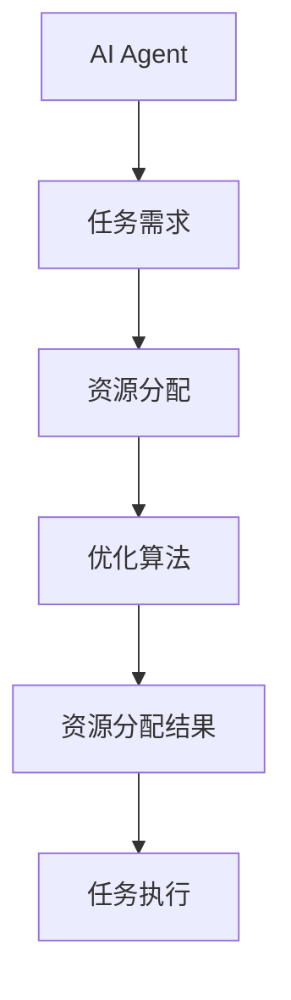

                 


# 企业AI Agent的边缘计算资源优化配置

> 关键词：企业AI Agent，边缘计算，资源优化，计算资源分配，算法优化

> 摘要：本文详细探讨了在企业环境中AI Agent与边缘计算的结合，分析了边缘计算资源优化配置的核心问题，提出了基于数学建模和算法优化的解决方案。文章从AI Agent的基本原理、边缘计算的特点出发，结合资源分配算法和系统架构设计，给出了实际项目实施的步骤和最佳实践。

---

## 第一部分: 企业AI Agent与边缘计算基础

### 第1章: 企业AI Agent与边缘计算概述

#### 1.1 问题背景与描述

随着人工智能技术的快速发展，企业AI Agent的应用场景日益广泛。AI Agent（人工智能代理）是一种能够感知环境、自主决策并执行任务的智能体。在企业环境中，AI Agent通常需要处理大量的数据和任务，而这些数据和任务的处理往往需要依赖边缘计算资源。边缘计算是一种分布式计算范式，将计算能力从云端转移到数据生成的边缘设备，从而减少延迟、提高效率。

在企业AI Agent的实际应用中，资源优化配置是一个关键问题。由于边缘设备的计算资源有限，如何高效地分配资源以满足AI Agent的需求，成为企业技术团队面临的重要挑战。

#### 1.2 问题解决与边界

##### 1.2.1 企业AI Agent的定义与分类
企业AI Agent是指在企业环境中运行的智能代理，能够根据企业的业务需求自主决策并执行任务。根据功能的不同，AI Agent可以分为以下几类：
- **简单反射型代理**：基于当前输入做出反应，没有内部状态。
- **基于模型的反射型代理**：维护环境模型，能够根据模型做出决策。
- **目标驱动型代理**：基于预定义的目标采取行动。
- **效用驱动型代理**：通过最大化效用函数来决策。

##### 1.2.2 边缘计算的定义与特点
边缘计算是指在靠近数据源的地方进行数据处理和计算的技术。其特点包括：
- **低延迟**：边缘设备能够快速响应，减少数据传输到云端的时间。
- **高带宽**：边缘设备通常具有较高的计算能力和数据处理能力。
- **分布式**：计算资源分布在多个边缘设备上，能够实现负载均衡。

##### 1.2.3 企业AI Agent与边缘计算的结合场景
企业AI Agent与边缘计算的结合主要体现在以下几个方面：
- **实时决策**：AI Agent通过边缘计算能力，实时处理数据并做出决策。
- **数据隐私**：通过边缘计算，企业可以在本地处理敏感数据，减少数据泄露的风险。
- **高效资源利用**：边缘计算能够充分利用本地资源，减少对云端的依赖。

#### 1.3 核心概念结构

##### 1.3.1 AI Agent的核心要素
AI Agent的核心要素包括：
- **感知能力**：能够感知环境中的数据和信息。
- **决策能力**：基于感知到的信息做出决策。
- **执行能力**：根据决策结果执行具体任务。

##### 1.3.2 边缘计算资源的核心属性
边缘计算资源的核心属性包括：
- **计算能力**：包括CPU、GPU等计算资源。
- **存储能力**：包括本地存储和分布式存储。
- **网络能力**：包括边缘设备之间的通信能力。

##### 1.3.3 优化配置的目标与约束条件
优化配置的目标是最大化资源利用率，同时满足AI Agent的性能需求。主要的约束条件包括：
- **资源限制**：边缘设备的计算资源有限。
- **延迟要求**：AI Agent需要在一定时间内完成任务。
- **数据隐私**：需要保护企业数据的隐私和安全。

#### 1.4 本章小结

---

## 第二部分: AI Agent的核心概念与原理

### 第2章: AI Agent的核心概念与原理

#### 2.1 AI Agent的基本原理

##### 2.1.1 AI Agent的定义与分类
AI Agent的定义可以分为以下几种：
- **反射型代理**：基于当前输入做出反应，没有内部状态。
- **目标驱动型代理**：基于预定义的目标采取行动。
- **效用驱动型代理**：通过最大化效用函数来决策。

##### 2.1.2 AI Agent的工作流程
AI Agent的工作流程通常包括以下几个步骤：
1. **感知环境**：通过传感器或其他方式感知环境中的数据。
2. **分析数据**：对感知到的数据进行分析和处理。
3. **做出决策**：基于分析结果做出决策。
4. **执行任务**：根据决策结果执行具体任务。

##### 2.1.3 AI Agent的核心功能与特点
AI Agent的核心功能包括：
- **自主性**：能够自主决策并执行任务。
- **反应性**：能够实时感知环境并做出反应。
- **学习能力**：能够通过学习不断提高自己的性能。

#### 2.2 边缘计算资源优化配置的核心概念

##### 2.2.1 边缘计算资源的类型
边缘计算资源的类型包括：
- **计算资源**：包括CPU、GPU等。
- **存储资源**：包括本地存储和分布式存储。
- **网络资源**：包括边缘设备之间的通信能力。

##### 2.2.2 资源分配的基本原则
资源分配的基本原则包括：
- **负载均衡**：确保资源的充分利用。
- **延迟优化**：减少数据处理的延迟。
- **数据隐私**：保护企业数据的隐私和安全。

##### 2.2.3 优化配置的目标与约束条件
优化配置的目标是最大化资源利用率，同时满足AI Agent的性能需求。主要的约束条件包括：
- **资源限制**：边缘设备的计算资源有限。
- **延迟要求**：AI Agent需要在一定时间内完成任务。
- **数据隐私**：需要保护企业数据的隐私和安全。

#### 2.3 核心概念之间的关系

##### 2.3.1 AI Agent与边缘计算的实体关系图
```mermaid
er
actor: AI Agent
actor: 边缘计算资源
actor: 优化算法
```

##### 2.3.2 AI Agent的优化流程图


#### 2.4 本章小结

---

## 第三部分: 边缘计算资源优化配置原理与算法实现

### 第3章: 边缘计算资源优化配置的基本原理

#### 3.1 边缘计算资源优化配置的背景与意义

##### 3.1.1 边缘计算的特点
边缘计算的特点包括：
- **低延迟**：边缘设备能够快速响应，减少数据传输到云端的时间。
- **高带宽**：边缘设备通常具有较高的计算能力和数据处理能力。
- **分布式**：计算资源分布在多个边缘设备上，能够实现负载均衡。

##### 3.1.2 资源分配问题的重要性
资源分配问题的重要性体现在以下几个方面：
- **资源利用率**：资源分配不当可能导致资源浪费或性能瓶颈。
- **延迟优化**：资源分配不合理可能导致任务处理延迟增加。
- **数据隐私**：资源分配不当可能导致数据泄露风险增加。

#### 3.2 资源分配问题的数学建模

##### 3.2.1 资源分配问题的数学模型
资源分配问题的数学模型通常包括以下几个部分：
- **目标函数**：通常是最小化延迟或最大化资源利用率。
- **约束条件**：包括资源限制、延迟要求等。

##### 3.2.2 资源分配的优化目标
资源分配的优化目标包括：
- **最小化延迟**：确保任务处理的延迟最小。
- **最大化资源利用率**：充分利用计算资源。
- **保护数据隐私**：确保数据的安全性和隐私性。

#### 3.3 边缘计算资源优化配置的实现步骤

##### 3.3.1 问题建模
问题建模是资源优化配置的第一步，需要明确目标函数和约束条件。

##### 3.3.2 算法选择
根据问题的特性选择合适的算法，例如贪心算法、动态规划等。

##### 3.3.3 算法实现
实现选择的算法，并进行测试和优化。

##### 3.3.4 结果分析
对算法的运行结果进行分析，评估其性能和效果。

#### 3.4 本章小结

---

### 第4章: 资源分配算法的实现与优化

#### 4.1 资源分配算法的基本原理

##### 4.1.1 贪心算法
贪心算法是一种常见的资源分配算法，其核心思想是每次选择能够带来最大收益的资源进行分配。例如，在分配计算资源时，优先分配给任务处理时间最短的任务。

##### 4.1.2 动态规划算法
动态规划算法是一种通过分解问题并存储子问题的解来优化资源分配的算法。例如，在分配存储资源时，可以将问题分解为多个子问题，分别求解后组合起来得到最优解。

##### 4.1.3 分布式优化算法
分布式优化算法是一种在分布式系统中进行资源优化的算法，例如使用拉格朗日乘数法进行优化。

#### 4.2 资源分配算法的实现步骤

##### 4.2.1 算法选择
根据问题的特性选择合适的算法，例如贪心算法、动态规划等。

##### 4.2.2 算法实现
实现选择的算法，并进行测试和优化。

##### 4.2.3 算法优化
通过对算法的运行结果进行分析，进一步优化算法的性能。

#### 4.3 算法实现的代码示例

##### 4.3.1 贪心算法的Python实现
```python
def greedy_algorithm(tasks, resources):
    # 按照任务处理时间排序
    sorted_tasks = sorted(tasks, key=lambda x: x['time'])
    # 分配资源
    for task in sorted_tasks:
        if task['time'] <= resources:
            resources -= task['time']
            print(f"分配资源 {resources} 给任务 {task['id']}")
        else:
            print(f"无法分配资源给任务 {task['id']}")
    return resources
```

##### 4.3.2 动态规划算法的Python实现
```python
def dynamic_programming(tasks, resources):
    # 初始化动态规划表
    dp = [0] * (resources + 1)
    for task in tasks:
        for r in range(resources, task['time'] - 1, -1):
            dp[r] = max(dp[r], dp[r - task['time']] + task['value'])
    return dp[resources]
```

#### 4.4 算法优化的数学模型

##### 4.4.1 贪心算法的优化
贪心算法的优化可以通过调整任务的排序策略来实现，例如按照任务的处理时间或优先级进行排序。

##### 4.4.2 动态规划算法的优化
动态规划算法的优化可以通过减少状态空间或使用动态规划的变种（如分支限界法）来实现。

#### 4.5 本章小结

---

## 第四部分: 系统架构设计与项目实战

### 第5章: 系统架构设计与实现

#### 5.1 系统架构设计

##### 5.1.1 系统功能设计
系统功能设计包括以下几个方面：
- **任务管理**：管理AI Agent的任务，包括任务分配、任务监控等。
- **资源管理**：管理边缘设备的计算资源，包括资源分配、资源监控等。
- **优化配置**：根据任务需求和资源情况，动态调整资源分配策略。

##### 5.1.2 系统架构设计
系统架构设计包括以下几个部分：
- **前端界面**：用于用户操作和任务管理。
- **后端逻辑**：用于任务分配和资源管理。
- **边缘设备**：用于计算资源的分配和任务执行。

##### 5.1.3 系统交互设计
系统交互设计包括以下几个方面：
- **用户与系统交互**：用户通过前端界面提交任务，系统接收任务并进行处理。
- **系统与边缘设备交互**：系统将任务分配给边缘设备，边缘设备执行任务并返回结果。
- **边缘设备之间的交互**：边缘设备之间可以通过网络进行通信，协同完成任务。

#### 5.2 系统实现

##### 5.2.1 系统实现的步骤
系统实现的步骤包括：
1. **环境搭建**：安装必要的软件和工具，例如Python、Docker等。
2. **代码实现**：根据系统架构设计，编写相应的代码，实现任务管理、资源管理等功能。
3. **系统测试**：对系统进行功能测试和性能测试，确保系统的稳定性和高效性。
4. **系统优化**：根据测试结果，进一步优化系统的性能和功能。

##### 5.2.2 系统实现的代码示例
```python
# 系统实现的代码示例
class TaskManager:
    def __init__(self):
        self.tasks = []
        self.resources = {}

    def add_task(self, task):
        self.tasks.append(task)
        print(f"任务 {task['id']} 已添加")

    def allocate_resources(self):
        for task in self.tasks:
            if task['time'] <= self.resources['compute']:
                self.resources['compute'] -= task['time']
                print(f"资源 {self.resources['compute']} 已分配给任务 {task['id']}")
            else:
                print(f"无法分配资源给任务 {task['id']}")
```

#### 5.3 系统优化

##### 5.3.1 系统优化的策略
系统优化的策略包括：
- **负载均衡**：通过动态调整资源分配策略，确保资源的充分利用。
- **延迟优化**：通过优化任务调度算法，减少任务处理的延迟。
- **数据隐私**：通过加密和访问控制，保护企业数据的安全性和隐私性。

##### 5.3.2 系统优化的实现
系统优化的实现包括：
- **动态调整资源分配策略**：根据任务的实时需求和资源的使用情况，动态调整资源分配策略。
- **优化任务调度算法**：通过改进任务调度算法，减少任务处理的延迟。
- **加强数据隐私保护**：通过加密和访问控制，确保数据的安全性和隐私性。

#### 5.4 本章小结

---

### 第6章: 项目实战与案例分析

#### 6.1 项目实战

##### 6.1.1 项目背景
项目背景可以是企业中某个具体的场景，例如企业的智能监控系统，需要实时处理大量的视频数据。

##### 6.1.2 项目需求
项目需求包括：
- **实时监控**：需要实时处理视频数据，识别异常情况。
- **资源优化**：需要优化视频数据的处理资源，减少延迟和资源浪费。

##### 6.1.3 项目实现
项目实现包括：
- **环境搭建**：安装必要的软件和工具，例如Python、OpenCV等。
- **代码实现**：编写视频处理代码，实现实时监控和异常检测。
- **系统测试**：对系统进行功能测试和性能测试，确保系统的稳定性和高效性。
- **系统优化**：根据测试结果，进一步优化系统的性能和功能。

#### 6.2 案例分析

##### 6.2.1 案例背景
案例背景可以是企业的智能监控系统，需要实时处理大量的视频数据。

##### 6.2.2 案例分析
案例分析包括：
- **任务需求分析**：分析任务的需求，确定资源分配策略。
- **资源分配优化**：根据任务需求和资源情况，动态调整资源分配策略。
- **系统实现与测试**：实现系统并进行测试，确保系统的稳定性和高效性。
- **系统优化与改进**：根据测试结果，进一步优化系统的性能和功能。

#### 6.3 本章小结

---

## 第五部分: 总结与展望

### 第7章: 总结与展望

#### 7.1 总结

##### 7.1.1 核心概念总结
- **AI Agent**：AI Agent是一种能够感知环境、自主决策并执行任务的智能体。
- **边缘计算**：边缘计算是一种分布式计算范式，将计算能力从云端转移到数据生成的边缘设备。

##### 7.1.2 资源优化配置的核心总结
- **资源分配问题**：资源分配问题是企业AI Agent与边缘计算结合中的关键问题。
- **优化配置的目标**：优化配置的目标是最大化资源利用率，同时满足AI Agent的性能需求。

##### 7.1.3 实现的关键技术总结
- **算法优化**：通过算法优化，提高资源分配的效率和效果。
- **系统架构设计**：通过合理的系统架构设计，确保系统的稳定性和高效性。

#### 7.2 展望

##### 7.2.1 未来技术发展
随着人工智能和边缘计算技术的不断发展，企业AI Agent与边缘计算的结合将更加紧密。未来的技术发展包括：
- **更高效的算法**：更高效的算法将被开发，以提高资源分配的效率和效果。
- **更先进的系统架构**：更先进的系统架构将被设计，以提高系统的稳定性和高效性。

##### 7.2.2 应用场景拓展
企业AI Agent与边缘计算的结合将拓展到更多的应用场景，例如：
- **智能制造**：在智能制造中，AI Agent可以通过边缘计算实现实时监控和优化生产过程。
- **智慧城市**：在智慧城市中，AI Agent可以通过边缘计算实现智能交通管理和城市安全监控。

##### 7.2.3 技术挑战与解决方案
随着企业AI Agent与边缘计算的结合越来越紧密，技术挑战也将越来越大。未来的技术挑战包括：
- **资源限制**：如何在资源受限的环境中实现高效的资源分配。
- **数据隐私**：如何在边缘计算环境中保护企业的数据隐私。
- **算法优化**：如何开发更高效的算法，以提高资源分配的效率和效果。

#### 7.3 本章小结

---

## 作者：AI天才研究院/AI Genius Institute & 禅与计算机程序设计艺术/Zen And The Art of Computer Programming

---

**本文是基于对AI Agent与边缘计算结合的深入研究，从理论到实践，详细分析了资源优化配置的核心问题，并提出了基于数学建模和算法优化的解决方案。文章内容丰富，涵盖了从背景介绍到算法实现的各个环节，为企业的技术团队提供了宝贵的参考和指导。**

