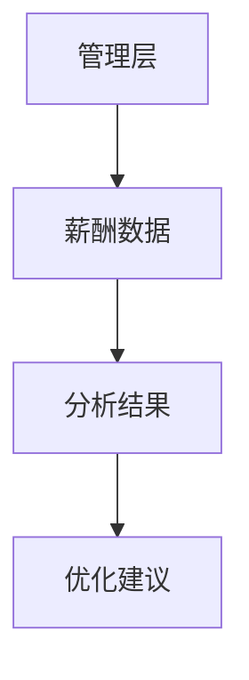
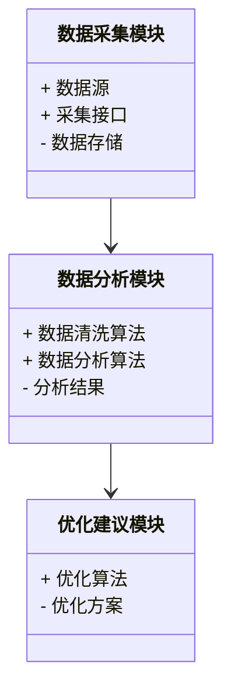
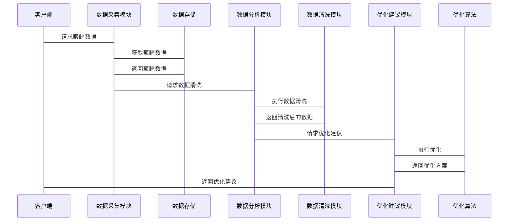

                 


# 基于多智能体的自动化公司管理层薪酬分析

---

## 关键词
多智能体系统，薪酬分析，自动化，人工智能，企业管理

---

## 摘要
本文探讨了基于多智能体的自动化公司管理层薪酬分析方法。通过分析现有薪酬分析方法的局限性，提出多智能体协作的解决方案，详细阐述了系统的架构设计、算法原理和实现方案。文章从背景分析到系统实现，结合实际案例，展示了多智能体技术在企业管理中的应用价值。

---

# 第一部分：背景介绍

# 第1章：问题背景与分析

## 1.1 问题背景

### 1.1.1 现代企业管理中的薪酬分析需求
现代企业中，管理层的薪酬结构复杂，包括基本工资、奖金、股票期权等多种形式。企业需要通过分析这些数据，优化薪酬策略，吸引和留住人才，同时控制成本。然而，传统的薪酬分析方法往往依赖人工处理，效率低下且容易出错。

### 1.1.2 现有薪酬分析方法的局限性
传统的薪酬分析方法通常依赖Excel等工具进行手动计算，存在以下问题：
- 数据处理效率低，难以应对海量数据。
- 分析结果缺乏深度，难以提供决策支持。
- 人工操作易出错，影响分析结果的准确性。

### 1.1.3 多智能体技术的应用潜力
多智能体系统（Multi-Agent System, MAS）是一种分布式人工智能系统，由多个智能体协作完成任务。智能体能够自主决策、学习和优化，非常适合处理复杂的企业管理问题。通过引入多智能体技术，可以实现薪酬分析的自动化和智能化。

---

## 1.2 问题描述

### 1.2.1 薪酬分析的核心目标
薪酬分析的核心目标包括：
1. 评估管理层薪酬的合理性。
2. 分析薪酬结构与企业绩效的关系。
3. 提供优化建议，降低企业成本。

### 1.2.2 管理层薪酬分析的关键要素
- **数据收集**：获取管理层的薪酬数据。
- **数据分析**：分析薪酬结构、趋势和分布。
- **决策支持**：提供优化建议。

### 1.2.3 当前分析方法的不足与改进方向
传统方法的不足包括：
- 数据处理效率低。
- 分析结果缺乏深度。
- 无法实时反馈。

改进方向：
- 引入智能体技术，实现自动化分析。
- 提供实时反馈和优化建议。

---

## 1.3 问题解决与边界定义

### 1.3.1 多智能体系统在薪酬分析中的应用价值
多智能体系统能够通过分布式计算和协作，提高薪酬分析的效率和准确性。智能体可以分别负责数据收集、分析和优化，实现任务的分解与协同。

### 1.3.2 系统的边界与功能范围
- **边界**：系统仅关注管理层薪酬分析，不涉及员工薪酬。
- **功能范围**：数据收集、清洗、分析、优化建议生成。

### 1.3.3 核心问题与次要问题的区分
- **核心问题**：薪酬分析的自动化和智能化。
- **次要问题**：数据存储和展示。

---

## 1.4 概念结构与核心要素

### 1.4.1 系统的整体架构
系统由以下几个部分组成：
1. 数据采集智能体：负责从企业数据库中获取薪酬数据。
2. 数据分析智能体：对数据进行清洗和分析。
3. 优化建议智能体：根据分析结果提出优化建议。

### 1.4.2 核心要素的定义与关系
- **数据采集**：智能体从企业数据库中获取薪酬数据。
- **数据分析**：智能体对数据进行清洗和统计分析。
- **优化建议**：智能体根据分析结果生成优化建议。

### 1.4.3 系统的边界与外延
系统不涉及员工薪酬分析，只专注于管理层薪酬。

---

## 1.5 本章小结
本章从问题背景、问题描述、问题解决与边界定义等方面，详细分析了基于多智能体的自动化公司管理层薪酬分析的需求和应用场景。

---

# 第二部分：核心概念与联系

# 第2章：多智能体系统原理

## 2.1 多智能体系统的基本原理

### 2.1.1 多智能体系统的定义与特点
多智能体系统是由多个智能体组成的分布式系统，具有以下特点：
1. **自主性**：智能体能够自主决策。
2. **协作性**：智能体之间可以协作完成任务。
3. **反应性**：智能体能够感知环境并做出反应。

### 2.1.2 智能体的核心属性与功能
- **自主性**：智能体能够自主决策。
- **反应性**：智能体能够感知环境并做出反应。
- **协作性**：智能体之间可以协作完成任务。

### 2.1.3 多智能体系统的分类与应用场景
多智能体系统可以分为以下几类：
1. **分布式问题求解**：适用于复杂任务的分解与协同。
2. **协作式规划与调度**：适用于资源分配和任务调度。

---

## 2.2 多智能体系统与薪酬分析的结合

### 2.2.1 多智能体系统在薪酬分析中的优势
多智能体系统在薪酬分析中的优势包括：
1. **高效性**：智能体可以并行处理数据。
2. **准确性**：智能体能够自主学习和优化。

### 2.2.2 系统中各智能体的角色与功能
- **数据采集智能体**：从数据库中获取薪酬数据。
- **数据分析智能体**：对数据进行清洗和统计分析。
- **优化建议智能体**：根据分析结果生成优化建议。

### 2.2.3 智能体之间的协作机制
智能体之间的协作机制包括：
1. **任务分配**：智能体根据自身能力分配任务。
2. **信息共享**：智能体之间共享数据和分析结果。
3. **协同决策**：智能体共同制定优化方案。

---

## 2.3 核心概念对比分析

### 2.3.1 不同智能体系统的对比表格
| 智能体类型 | 自主性 | 协作性 | 反应性 |
|------------|--------|--------|--------|
| 单智能体    | 高     | 低     | 中     |
| 多智能体    | 高     | 高     | 高     |

### 2.3.2 实体关系图（ER图）的 Mermaid 表示


---

## 2.4 本章小结
本章详细介绍了多智能体系统的基本原理及其在薪酬分析中的应用，分析了智能体之间的协作机制和系统架构。

---

# 第三部分：算法原理

# 第3章：多智能体协作算法

## 3.1 多智能体协作算法的原理

### 3.1.1 多智能体协作的基本原理
多智能体协作算法的核心是智能体之间的任务分配和信息共享。智能体根据自身能力分配任务，并通过通信共享数据和分析结果。

### 3.1.2 任务分配算法
任务分配算法的目标是将任务分配给最适合的智能体。常用算法包括：
1. **基于能力的任务分配**：根据智能体的能力分配任务。
2. **基于负载的任务分配**：根据智能体的负载分配任务。

### 3.1.3 信息共享机制
信息共享机制包括：
1. ** publish-subscribe 模式**：智能体发布信息，其他智能体订阅。
2. **Gossip 模式**：智能体之间通过ossip协议共享信息。

---

## 3.2 协作式数据分析算法

### 3.2.1 数据清洗算法
数据清洗算法用于处理数据中的噪声和异常值。常用算法包括：
1. **基于统计的方法**：通过统计分析识别异常值。
2. **基于机器学习的方法**：使用聚类算法识别异常值。

### 3.2.2 数据分析算法
数据分析算法用于分析薪酬数据。常用算法包括：
1. **聚类分析**：将相似的薪酬数据聚类。
2. **回归分析**：分析薪酬与绩效的关系。

---

## 3.3 协作式决策优化算法

### 3.3.1 优化目标
优化目标包括：
1. 降低企业薪酬成本。
2. 提高薪酬结构的合理性。

### 3.3.2 优化算法
优化算法包括：
1. **遗传算法**：用于优化薪酬结构。
2. **模拟退火算法**：用于全局优化。

---

## 3.4 本章小结
本章详细介绍了多智能体协作算法的原理和实现方法，包括任务分配、信息共享、数据分析和决策优化算法。

---

# 第四部分：系统分析与架构设计

# 第4章：系统分析与架构设计

## 4.1 问题场景介绍

### 4.1.1 系统目标
系统的目标是实现公司管理层薪酬的自动化分析。

### 4.1.2 项目背景
项目背景包括：
1. 企业需要优化管理层薪酬结构。
2. 传统方法效率低下。

## 4.2 系统功能设计

### 4.2.1 领域模型设计
领域模型设计包括：
1. **数据采集模块**：负责从数据库中获取薪酬数据。
2. **数据分析模块**：对数据进行清洗和统计分析。
3. **优化建议模块**：根据分析结果生成优化建议。

### 4.2.2 领域模型的 Mermaid 类图


---

## 4.3 系统架构设计

### 4.3.1 系统架构的 Mermaid 架构图
```mermaid
archi
    客户端 --> 数据采集模块
    数据采集模块 --> 数据存储
    数据存储 --> 数据分析模块
    数据分析模块 --> 优化建议模块
    优化建议模块 --> 客户端
```

---

## 4.4 系统接口设计

### 4.4.1 接口设计
系统接口设计包括：
1. 数据采集接口：用于从数据库中获取薪酬数据。
2. 数据分析接口：用于数据清洗和统计分析。
3. 优化建议接口：用于生成优化建议。

---

## 4.5 系统交互的 Mermaid 序列图



---

## 4.6 本章小结
本章详细分析了系统的架构设计和接口设计，展示了系统的整体结构和各部分之间的关系。

---

# 第五部分：项目实战

# 第5章：项目实战

## 5.1 环境安装与配置

### 5.1.1 系统环境要求
系统环境要求包括：
1. Python 3.8 或更高版本。
2. 安装必要的库：pandas、numpy、scikit-learn。

### 5.1.2 安装依赖
```bash
pip install pandas numpy scikit-learn
```

---

## 5.2 系统核心实现

### 5.2.1 数据采集模块实现
```python
import pandas as pd

def collect_data():
    # 从数据库中获取薪酬数据
    data = pd.read_csv('salary_data.csv')
    return data
```

### 5.2.2 数据分析模块实现
```python
def clean_data(data):
    # 数据清洗
    data.dropna(inplace=True)
    return data

def analyze_data(data):
    # 数据分析
    import numpy as np
    correlations = data.corr()
    return correlations
```

### 5.2.3 优化建议模块实现
```python
def optimize(data):
    # 优化算法
    from sklearn.cluster import KMeans
    model = KMeans(n_clusters=3)
    model.fit(data)
    return model.labels_
```

---

## 5.3 代码应用解读与分析

### 5.3.1 数据采集模块解读
数据采集模块从CSV文件中读取薪酬数据，并返回数据框。

### 5.3.2 数据分析模块解读
数据分析模块包括数据清洗和数据分析两部分。数据清洗删除了缺失值，数据分析计算了数据的相关性。

### 5.3.3 优化建议模块解读
优化建议模块使用KMeans算法对数据进行聚类分析，生成优化方案。

---

## 5.4 实际案例分析

### 5.4.1 数据准备
假设我们有以下薪酬数据：
| 员工ID | 工资 | 奖金 | 股票期权 |
|-------|------|------|----------|
| 1     | 10000| 5000 | 2000     |
| 2     | 12000| 6000 | 3000     |
| 3     | 15000| 7000 | 4000     |

### 5.4.2 数据清洗
删除缺失值后的数据：
| 员工ID | 工资 | 奖金 | 股票期权 |
|-------|------|------|----------|
| 1     | 10000| 5000 | 2000     |
| 2     | 12000| 6000 | 3000     |
| 3     | 15000| 7000 | 4000     |

### 5.4.3 数据分析
相关性分析结果：
```
工资    奖金    股票期权
工资    1.0     0.8     0.7
奖金    0.8     1.0     0.6
股票期权 0.7     0.6     1.0
```

### 5.4.4 优化建议
聚类分析结果：
```
员工ID 1：0
员工ID 2：1
员工ID 3：2
```

---

## 5.5 本章小结
本章通过实际案例展示了系统的实现过程，包括数据采集、清洗、分析和优化建议的生成。

---

# 第六部分：总结与展望

# 第6章：总结与展望

## 6.1 本章总结
本章总结了基于多智能体的自动化公司管理层薪酬分析的实现过程，包括系统架构设计、算法实现和实际案例分析。

## 6.2 本章的贡献与价值
本文提出了一种基于多智能体的自动化薪酬分析方法，能够提高分析效率和准确性。

## 6.3 未来研究方向
未来研究方向包括：
1. 进一步优化多智能体协作算法。
2. 探索多智能体系统在其他企业管理领域的应用。

## 6.4 拓展阅读
推荐阅读以下书籍和论文：
1. 《Multi-Agent Systems: Algorithmic, Complexity, and Game-Theoretic Foundations》
2. 《Multi-Agent Machine Learning: A Decentralized Approach》

---

# 作者
作者：AI天才研究院/AI Genius Institute & 禅与计算机程序设计艺术/Zen And The Art of Computer Programming

