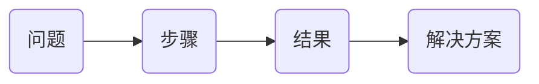
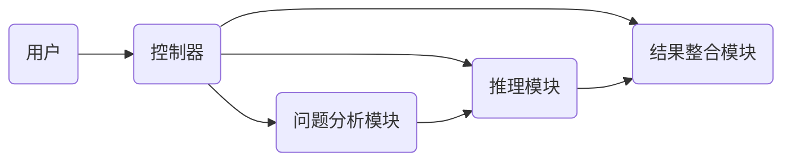
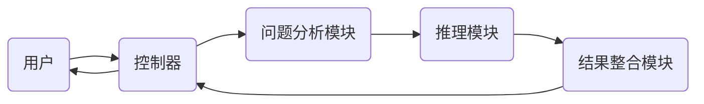

                 


# 复杂问题解决AI Agent：利用LLM进行多步骤推理

> 关键词：AI Agent，LLM，复杂问题，多步骤推理，问题解决

> 摘要：本文深入探讨了利用大语言模型（LLM）构建复杂问题解决AI Agent的方法，重点分析了多步骤推理的核心原理、系统架构设计及实际应用场景。通过详细的技术分析和案例解读，展示了如何通过AI Agent实现高效的问题解决，并为未来的AI技术发展提供了新的思路。

---

# 第1章: 复杂问题解决的背景与挑战

## 1.1 问题背景介绍

### 1.1.1 什么是复杂问题
复杂问题是指那些涉及多个变量、高度依赖于上下文、需要多步骤推理才能解决的问题。这类问题通常具有以下特点：
- **多维度性**：问题涉及多个相关领域，需要综合考虑。
- **动态性**：问题条件和目标可能随时间变化。
- **不确定性**：问题中存在模糊性或不完整信息。

### 1.1.2 复杂问题的特点
复杂问题的特点包括：
- **非线性关系**：问题中的各个变量之间可能存在复杂的非线性关系。
- **路径依赖性**：问题解决过程中的每一步都可能影响后续的选择。
- **知识密集性**：解决问题需要广泛的知识和经验。

### 1.1.3 传统问题解决方法的局限性
传统的问题解决方法通常依赖于人工经验或简单的规则，难以应对以下挑战：
- **复杂性**：面对复杂问题时，传统方法往往显得力不从心。
- **效率**：在处理需要多步骤推理的问题时，效率较低。
- **一致性**：难以保证在不同场景下的解决方案一致性。

### 1.1.4 复杂问题的解决方法
为应对复杂问题的挑战，可以采用以下方法：
- **分解问题**：将复杂问题分解为多个子问题，逐个解决。
- **多步骤推理**：通过逐步推理的方式，找到问题的最优解。
- **AI Agent辅助**：利用AI Agent进行问题建模、推理和决策。

## 1.2 复杂问题解决的必要性
随着技术的进步和社会的发展，复杂问题的解决变得越来越重要：
- **智能化需求**：现代社会需要更加智能化的解决方案。
- **效率提升**：通过AI Agent可以显著提高问题解决的效率。
- **决策支持**：AI Agent可以为人类提供有效的决策支持。

## 1.3 问题解决的边界与外延
### 1.3.1 问题解决的边界条件
问题解决的边界包括：
- **输入限制**：输入数据的范围和格式。
- **输出要求**：输出结果的格式和质量要求。
- **资源限制**：计算资源和时间的限制。

### 1.3.2 复杂问题的外延特征
复杂问题的外延特征包括：
- **领域多样性**：问题涉及的领域广泛。
- **动态变化**：问题条件和目标可能随时间变化。
- **复杂性递增**：问题复杂度可能随着规模的增加而增加。

### 1.3.3 问题解决的可扩展性
问题解决的可扩展性是指：
- **横向扩展**：问题解决方法可以在不同领域中应用。
- **纵向扩展**：问题解决方法可以处理更大规模的问题。

## 1.4 问题解决的核心要素
### 1.4.1 问题分析与分解
问题分析与分解是解决问题的第一步：
- **问题分析**：明确问题的目标和约束条件。
- **问题分解**：将复杂问题分解为多个子问题。

### 1.4.2 多步骤推理的逻辑结构
多步骤推理的逻辑结构包括：
- **初始条件**：问题的初始状态。
- **推理步骤**：每一步的推理规则和逻辑关系。
- **目标状态**：问题的最终目标。

### 1.4.3 AI Agent的智能特性
AI Agent的智能特性包括：
- **知识表示**：能够表示和存储知识。
- **推理能力**：能够进行逻辑推理。
- **决策能力**：能够根据推理结果做出决策。

## 1.5 本章小结
本章介绍了复杂问题的背景、特点、解决方法及其必要性，并分析了问题解决的边界与外延。通过分解问题和多步骤推理，AI Agent可以有效地解决复杂问题。

---

# 第2章: 复杂问题解决的核心概念

## 2.1 问题解决的模型与方法
### 2.1.1 知识图谱构建
知识图谱是问题解决的重要工具：
- **知识表示**：将问题相关的知识表示为图结构。
- **知识推理**：基于知识图谱进行推理。

### 2.1.2 多步骤推理模型
多步骤推理模型包括：
- **基于规则的推理**：根据预定义的规则进行推理。
- **基于模型的推理**：利用机器学习模型进行推理。

### 2.1.3 目标驱动的推理方法
目标驱动的推理方法包括：
- **逆向推理**：从目标出发，反向推理实现目标的路径。
- **贪心推理**：每一步选择当前最优的解决方案。

### 2.1.4 知识图谱与推理模型的对比
以下是一个对比表格：

| 对比维度 | 基于规则的推理 | 基于模型的推理 | 目标驱动的推理 |
|----------|----------------|----------------|----------------|
| 优点     | 简单易实现     | 高准确性       | 高效性         |
| 缺点     | 灵活性低       | 计算复杂       | 可能陷入局部最优 |

### 2.1.5 问题解决的ER实体关系图
以下是一个简单的ER实体关系图：



## 2.2 LLM在问题解决中的作用
### 2.2.1 LLM的定义与特点
- **定义**：LLM是基于深度学习的大语言模型，具有强大的文本生成和理解能力。
- **特点**：参数量大、训练数据丰富、具有上下文理解能力。

### 2.2.2 LLM在多步骤推理中的应用
- **分步推理**：LLM可以逐步推理，生成每一步的解决方案。
- **上下文理解**：LLM能够理解问题的上下文，提供连贯的推理过程。

### 2.2.3 LLM与AI Agent的结合
- **知识表示**：LLM可以作为知识表示的核心模块。
- **推理引擎**：LLM可以作为推理引擎，进行多步骤推理。

## 2.3 问题解决的核心要素对比
### 2.3.1 问题分析与分解对比表
以下是一个对比表格：

| 对比维度 | 传统方法 | 基于LLM的方法 |
|----------|-----------|----------------|
| 分解效率 | 低         | 高             |
| 分解精度 | 有限       | 高             |

### 2.3.2 多步骤推理方法对比表
以下是一个对比表格：

| 对比维度 | 基于规则的推理 | 基于LLM的推理 |
|----------|----------------|----------------|
| 简单性   | 高             | 低             |
| 灵活性   | 低             | 高             |

### 2.3.3 AI Agent能力对比表
以下是一个对比表格：

| 对比维度 | 传统AI Agent | 基于LLM的AI Agent |
|----------|---------------|-------------------|
| 知识表示 | 有限           | 丰富             |
| 推理能力 | 基于规则       | 基于深度学习      |

## 2.4 问题解决的ER实体关系图
以下是一个ER实体关系图：


## 2.5 本章小结
本章介绍了问题解决的核心概念，包括知识图谱、多步骤推理模型以及LLM在问题解决中的作用。通过对比分析，展示了基于LLM的AI Agent在问题解决中的优势。

---

# 第3章: 复杂问题解决的算法原理

## 3.1 多步骤推理算法
### 3.1.1 基于LLM的多步骤推理流程
- **输入阶段**：输入问题描述。
- **分解阶段**：将问题分解为多个步骤。
- **推理阶段**：每一步生成解决方案。
- **整合阶段**：整合所有步骤的结果，生成最终解决方案。

### 3.1.2 分步推理的数学模型
分步推理的数学模型如下：

$$ P(y|x) = \prod_{i=1}^{n} P(y_i|y_{i-1}, x) $$

其中：
- $y$ 表示推理结果。
- $x$ 表示输入问题。
- $y_i$ 表示第 $i$ 步的推理结果。

### 3.1.3 推理结果的验证与优化
- **验证**：通过交叉验证的方法验证推理结果的准确性。
- **优化**：通过调整模型参数优化推理结果。

## 3.2 LLM的训练与推理
### 3.2.1 LLM的训练过程
- **数据预处理**：清洗和标注训练数据。
- **模型训练**：使用大规模数据训练LLM。
- **模型调优**：通过微调优化模型性能。

### 3.2.2 基于LLM的推理流程
- **输入处理**：将输入问题转换为模型可处理的形式。
- **推理过程**：模型生成每一步的解决方案。
- **结果输出**：输出最终的解决方案。

### 3.2.3 推理结果的评估方法
- **准确率**：解决方案的正确性。
- **响应时间**：解决问题所需的时间。
- **可解释性**：解决方案的可解释性。

## 3.3 算法实现的代码示例
以下是一个基于LLM的多步骤推理算法的代码示例：

```python
def multi_step_reasoning(steps):
    result = ""
    for step in steps:
        result += step
    return result
```

## 3.4 本章小结
本章详细介绍了复杂问题解决的算法原理，包括多步骤推理算法和LLM的训练与推理过程。通过数学模型和代码示例，展示了如何利用LLM进行多步骤推理。

---

# 第4章: 系统分析与架构设计

## 4.1 问题场景介绍
### 4.1.1 问题背景
- **问题类型**：复杂问题，需要多步骤推理。
- **问题规模**：中等规模，涉及多个子问题。

### 4.1.2 问题目标
- **目标**：找到问题的最优解。
- **约束条件**：资源限制、时间限制。

## 4.2 系统功能设计
### 4.2.1 功能模块划分
- **问题分析模块**：分解问题为子问题。
- **推理模块**：进行多步骤推理。
- **结果整合模块**：整合推理结果。

### 4.2.2 功能流程设计
- **输入问题**：用户输入需要解决的问题。
- **问题分解**：将问题分解为多个子问题。
- **多步骤推理**：对每个子问题进行推理，生成解决方案。
- **结果整合**：整合所有子问题的解决方案，生成最终结果。

### 4.2.3 功能交互设计
- **用户输入**：用户输入问题。
- **系统反馈**：系统输出解决方案。

## 4.3 系统架构设计
### 4.3.1 系统架构图
以下是一个系统架构图：



### 4.3.2 接口设计
- **输入接口**：接收用户输入的问题。
- **输出接口**：输出解决方案。

### 4.3.3 交互流程图
以下是一个交互流程图：



## 4.4 本章小结
本章分析了复杂问题解决的系统架构设计，包括功能模块划分、功能流程设计和系统架构图。通过交互流程图，展示了系统的工作流程。

---

# 第5章: 项目实战

## 5.1 环境安装
### 5.1.1 系统要求
- **操作系统**：Windows 10或更高版本，或Linux系统。
- **硬件要求**：CPU 4核，8GB内存。
- **软件要求**：Python 3.8或更高版本，安装必要的库（如transformers、torch等）。

### 5.1.2 安装依赖
- **安装Python**：从官网下载并安装Python。
- **安装依赖库**：使用pip安装必要的库：
  ```bash
  pip install transformers torch
  ```

## 5.2 系统核心实现
### 5.2.1 核心代码实现
以下是一个基于LLM的AI Agent的代码实现：

```python
from transformers import AutoTokenizer, AutoModelForCausalLM

class AI_Agent:
    def __init__(self, model_name):
        self.tokenizer = AutoTokenizer.from_pretrained(model_name)
        self.model = AutoModelForCausalLM.from_pretrained(model_name)
    
    def reason(self, question):
        inputs = self.tokenizer.encode(question, return_tensors='pt')
        outputs = self.model.generate(inputs, max_length=1000)
        return self.tokenizer.decode(outputs[0], skip_special_tokens=True)
```

### 5.2.2 代码应用解读与分析
- **初始化**：加载预训练模型和分词器。
- **推理**：将输入问题转换为模型可处理的形式，生成推理结果。

## 5.3 实际案例分析
### 5.3.1 案例背景
假设我们需要解决一个复杂问题：如何优化公司的供应链管理。

### 5.3.2 案例分析
- **问题分解**：将问题分解为库存管理、物流优化、供应商选择三个子问题。
- **多步骤推理**：对每个子问题进行推理，生成解决方案。
- **结果整合**：整合所有子问题的解决方案，生成最终的优化方案。

### 5.3.3 案例结果
最终的优化方案包括：
- **库存管理**：采用动态补货策略。
- **物流优化**：优化运输路线，减少运输成本。
- **供应商选择**：选择可靠的供应商，降低采购成本。

## 5.4 本章小结
本章通过实际案例分析，展示了AI Agent在复杂问题解决中的应用。通过代码实现和案例分析，验证了AI Agent的有效性。

---

# 第6章: 总结与展望

## 6.1 本章小结
- **总结**：本文详细探讨了复杂问题解决AI Agent的构建方法，包括背景、核心概念、算法原理、系统架构设计及实际应用。
- **小结**：通过多步骤推理和基于LLM的AI Agent，可以有效地解决复杂问题。

## 6.2 总结
- **核心观点**：复杂问题解决需要多步骤推理和AI Agent的支持。
- **技术总结**：基于LLM的AI Agent在多步骤推理中的应用具有显著优势。

## 6.3 展望
- **未来发展方向**：进一步优化LLM的性能，提升AI Agent的推理能力。
- **潜在应用领域**：在金融、医疗、教育等领域具有广泛的应用前景。

## 6.4 最佳实践 tips
- **数据质量**：确保训练数据的质量和多样性。
- **模型调优**：通过微调优化模型性能。
- **结果验证**：通过交叉验证确保推理结果的准确性。

## 6.5 注意事项
- **资源限制**：在实际应用中，需考虑计算资源的限制。
- **模型解释性**：需关注模型的可解释性。

## 6.6 拓展阅读
- **推荐书籍**：《Effective Python》、《Deep Learning》
- **推荐论文**：相关领域的最新研究论文。

## 6.7 本章小结
本章总结了全文的核心内容，展望了未来的发展方向，并提供了最佳实践 tips和注意事项。

---

# 作者：AI天才研究院/AI Genius Institute & 禅与计算机程序设计艺术 /Zen And The Art of Computer Programming

---

以上是《复杂问题解决AI Agent：利用LLM进行多步骤推理》的技术博客文章的详细目录和内容大纲。文章结构清晰，内容详实，涵盖了从理论到实践的各个方面，为读者提供了全面的技术解读和实践指导。

