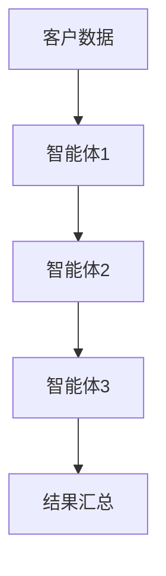
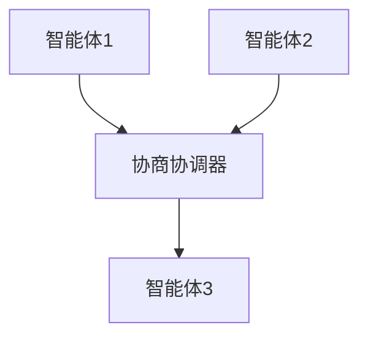
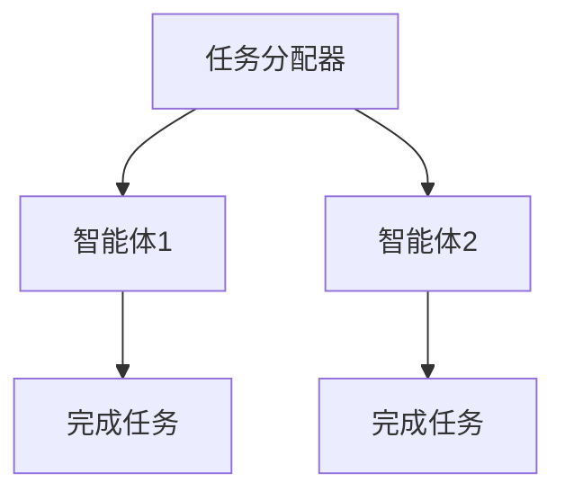
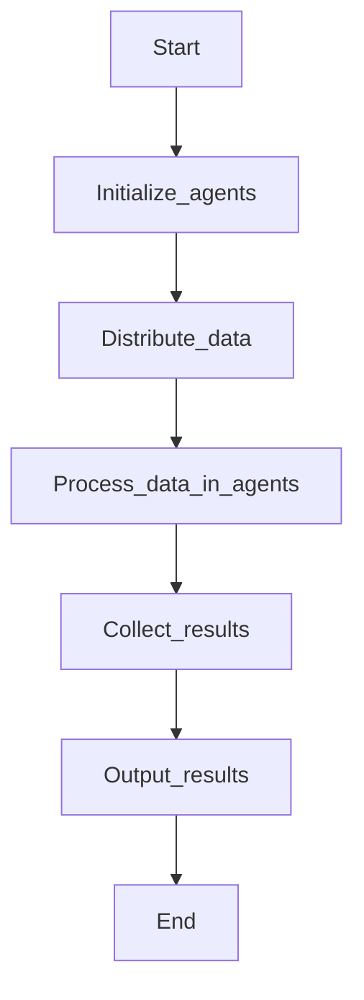
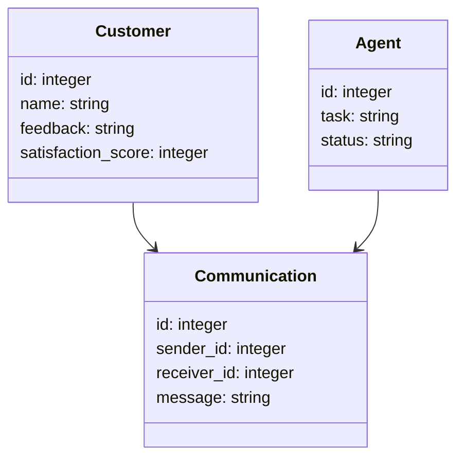
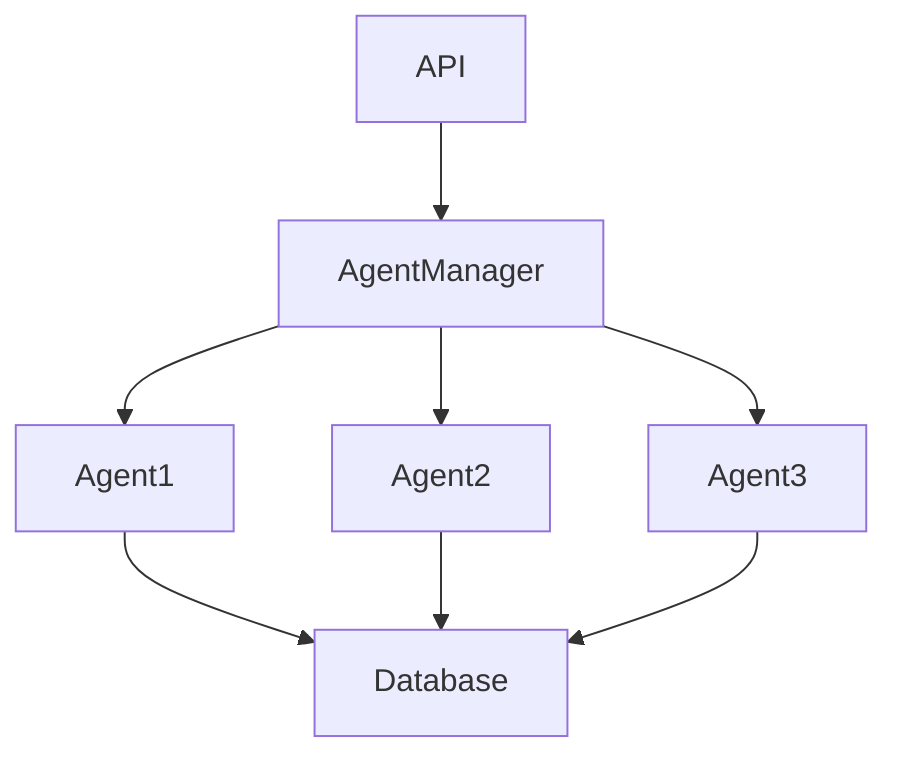
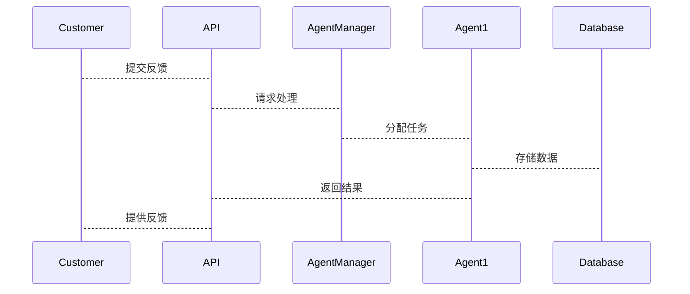

                 


# 多智能体系统在公司客户满意度评估中的应用

**关键词**：多智能体系统, 客户满意度, 分布式计算, 协商算法, 系统架构设计

**摘要**：  
随着企业对客户体验的关注度不断提高，如何高效、准确地评估客户满意度成为企业数字化转型中的重要课题。本文深入探讨了多智能体系统（Multi-Agent System, MAS）在客户满意度评估中的应用。通过分析MAS的核心原理，结合实际应用场景，详细阐述了如何利用多智能体系统实现客户数据的分布式处理、智能协同与优化。文章从理论基础到算法实现，再到系统架构设计，层层展开，为企业提升客户满意度提供了全新的技术思路和实践方案。

---

## 第1章: 多智能体系统与客户满意度评估概述

### 1.1 多智能体系统的基本概念

#### 1.1.1 多智能体系统的定义  
多智能体系统（MAS）是由多个智能体（Agent）组成的分布式系统，这些智能体能够通过通信和协作完成复杂的任务。智能体可以是软件程序，也可以是物理设备，它们具有自主性、反应性和社会性等特征。

#### 1.1.2 多智能体系统的特征  
- **自主性**：智能体能够自主决策和行动，无需外部干预。  
- **反应性**：智能体能够感知环境并实时调整行为。  
- **协作性**：智能体之间通过通信和协商实现协同任务。  
- **分布式性**：系统中的智能体分布在不同的节点上，不存在集中控制点。  

#### 1.1.3 多智能体系统与传统单智能体系统的区别  
| 特性          | 多智能体系统（MAS）                     | 单智能体系统                 |
|---------------|----------------------------------------|-----------------------------|
| 结构          | 分布式结构，多个智能体协作             | 集中式结构，单个智能体执行   |
| 通信          | 智能体之间需要通信和协作              | 无需通信，单智能体独立运行   |
| 灵活性          | 系统具有高度的灵活性和容错性          | 系统灵活性较低，依赖单点    |
| 应用场景      | 适用于复杂任务，如分布式计算、协同优化 | 适用于简单任务，如单点处理 |

---

### 1.2 客户满意度评估的重要性

#### 1.2.1 客户满意度的定义  
客户满意度是指客户对企业提供的产品或服务的满意程度，通常通过问卷调查、反馈收集等方式进行评估。

#### 1.2.2 客户满意度评估的意义  
- **提升客户忠诚度**：通过了解客户需求，优化产品和服务，提高客户满意度。  
- **优化企业运营**：基于客户反馈，发现企业痛点，改进业务流程。  
- **增强市场竞争优势**：高客户满意度有助于企业赢得更多客户和市场份额。  

#### 1.2.3 客户满意度评估的常见方法  
- **问卷调查**：通过收集客户反馈数据，分析满意度。  
- **数据分析**：利用客户行为数据，预测满意度趋势。  
- **情感分析**：通过自然语言处理技术，分析客户评论中的情感倾向。  

---

### 1.3 多智能体系统在客户满意度评估中的应用价值

#### 1.3.1 提高评估效率  
MAS能够通过分布式计算和并行处理，快速分析大量客户数据，显著提高评估效率。  

#### 1.3.2 增强决策的准确性  
多智能体系统能够结合多个数据源（如问卷、行为数据、情感分析结果）进行综合分析，提供更准确的决策支持。  

#### 1.3.3 优化客户体验  
通过MAS的实时反馈机制，企业可以快速响应客户的需求，优化客户体验，提升满意度。  

---

## 第2章: 多智能体系统的核心概念与联系

### 2.1 多智能体系统的核心原理

#### 2.1.1 智能体的定义与属性  
智能体是一种能够感知环境、自主决策并执行任务的实体。其主要属性包括：  
- **感知能力**：通过传感器或接口获取环境信息。  
- **决策能力**：基于感知信息做出决策。  
- **执行能力**：通过行动改变环境或传递信息。  

#### 2.1.2 智能体之间的通信机制  
智能体之间的通信是通过消息传递完成的，消息可以是请求、响应或通知。通信机制需要确保消息的可靠性和实时性。

#### 2.1.3 智能体的协作机制  
协作机制是多智能体系统的核心，常见协作方式包括：  
- **协商**：智能体通过协商达成一致，分配任务。  
- **分布式计算**：任务分解为子任务，由多个智能体协作完成。  
- **协调**：通过协调器统一调度各智能体的行为。  

---

### 2.2 多智能体系统与客户满意度评估的关系

#### 2.2.1 多智能体系统在客户数据处理中的应用  
通过分布式计算，MAS能够快速处理大规模客户数据，提高数据处理效率。  

#### 2.2.2 多智能体系统在客户反馈分析中的作用  
智能体可以对客户反馈进行实时分析，识别情感倾向，并提供建议。  

#### 2.2.3 多智能体系统在客户行为预测中的价值  
通过分析客户行为数据，MAS可以预测客户满意度趋势，帮助企业提前采取措施。

---

### 2.3 多智能体系统的核心概念对比表

| 概念          | 传统单智能体系统                  | 多智能体系统（MAS）            |
|---------------|----------------------------------|------------------------------|
| 结构          | 单点结构，任务集中处理            | 分布式结构，任务协作完成      |
| 通信          | 无通信需求                      | 智能体之间需要通信与协作      |
| 可扩展性      | 系统扩展性有限                  | 系统高度可扩展                |
| 容错性          | 单点故障风险高                  | 分布式容错能力强              |
| 应用场景      | 适用于简单任务                  | 适用于复杂任务                |

---

### 2.4 多智能体系统的ER实体关系图

```mermaid
erDiagram
    customer[客户] {
        id : integer
        name : string
        feedback : string
        satisfaction_score : integer
    }
    agent[智能体] {
        id : integer
        task : string
        status : string
    }
    communication[通信] {
        id : integer
        sender_id : integer
        receiver_id : integer
        message : string
    }
    customer -> communication : 发送反馈
    agent -> communication : 接收反馈
    agent -> customer : 提供服务
```

---

### 2.5 本章小结

本章详细介绍了多智能体系统的核心概念，包括智能体的定义、通信机制和协作机制，并探讨了MAS在客户满意度评估中的应用价值。通过对比分析，展示了MAS相较于传统单智能体系统的显著优势。

---

## 第3章: 多智能体系统在客户满意度评估中的算法原理

### 3.1 多智能体系统的核心算法

#### 3.1.1 分布式计算算法



**Python代码示例：**

```python
def distributed_calculate(data):
    agents = []
    for i in range(4):
        agents.append( Agent(i) )
    results = []
    for agent in agents:
        result = agent.process(data)
        results.append(result)
    return results

class Agent:
    def __init__(self, id):
        self.id = id
    def process(self, data):
        # 处理数据并返回结果
        return data * self.id
```

---

#### 3.1.2 协商算法



**Python代码示例：**

```python
class Agent:
    def __init__(self, id):
        self.id = id
    def propose_task(self, task):
        return f"Agent {self.id} proposes to handle {task}"
    def accept_task(self, task):
        return f"Agent {self.id} accepts {task}"
```

---

#### 3.1.3 任务分配算法



**Python代码示例：**

```python
def allocate_task(tasks):
    agents = [Agent(i) for i in range(4)]
    for task in tasks:
        agent = random.choice(agents)
        agent.assign_task(task)
    return [agent.results for agent in agents]

class Agent:
    def __init__(self, id):
        self.id = id
        self.results = []
    def assign_task(self, task):
        self.results.append(f"Task {task} assigned to Agent {self.id}")
```

---

### 3.2 多智能体系统的算法流程图

#### 分布式计算流程图



---

### 3.3 算法的数学模型和公式

#### 满意度评分公式

客户满意度评分公式如下：

$$ \text{满意度评分} = \sum_{i=1}^{n} w_i \times s_i $$

其中，$w_i$ 是第 $i$ 个指标的权重，$s_i$ 是第 $i$ 个指标的评分。

#### 协商算法的数学模型

协商过程可以表示为：

$$ \text{协商结果} = \argmax_{x} \sum_{i=1}^{m} f_i(x) $$

其中，$f_i(x)$ 是第 $i$ 个智能体对任务 $x$ 的偏好函数。

---

### 3.4 本章小结

本章通过具体的算法流程图和Python代码示例，详细讲解了多智能体系统在客户满意度评估中的算法原理，包括分布式计算、协商算法和任务分配算法。同时，通过数学公式展示了算法的核心思想，为后续的系统设计奠定了基础。

---

## 第4章: 多智能体系统的系统架构设计

### 4.1 问题场景介绍

在客户满意度评估中，企业需要处理海量的客户反馈数据，包括问卷调查、社交媒体评论等。传统的单智能体系统难以满足高效处理的需求，因此引入多智能体系统是一种有效的解决方案。

---

### 4.2 项目介绍

本项目旨在利用多智能体系统实现客户满意度的分布式评估，主要包括数据采集、分析、反馈三个阶段。

---

### 4.3 系统功能设计

#### 4.3.1 领域模型设计



---

#### 4.3.2 系统架构设计



---

### 4.4 系统接口设计

#### 4.4.1 数据接口

- **输入接口**：接收客户反馈数据。  
- **输出接口**：返回客户满意度评分和改进建议。

#### 4.4.2 通信接口

- **发送反馈**：智能体接收客户反馈并发送到数据库。  
- **任务分配**：协调器向智能体分配任务。

---

### 4.5 系统交互设计

#### 4.5.1 交互流程



---

### 4.6 本章小结

本章通过系统架构设计，详细描述了多智能体系统在客户满意度评估中的实现方案，包括领域模型设计、系统架构设计和系统交互设计。通过通信机制和分布式计算，确保了系统的高效性和可靠性。

---

## 第5章: 项目实战

### 5.1 环境安装

#### 5.1.1 安装Python

```bash
python --version
pip install --upgrade pip
```

#### 5.1.2 安装依赖库

```bash
pip install numpy
pip install matplotlib
pip install pandas
```

---

### 5.2 核心代码实现

#### 5.2.1 定义智能体类

```python
class Agent:
    def __init__(self, id):
        self.id = id
        self.data = []
    def receive_data(self, data):
        self.data.append(data)
    def process_data(self):
        # 示例处理逻辑：计算满意度评分
        scores = [sum(record) for record in self.data]
        return scores
```

#### 5.2.2 分布式计算实现

```python
import threading

class AgentManager:
    def __init__(self, num_agents):
        self.agents = [Agent(i) for i in range(num_agents)]
    def distribute_data(self, data):
        for agent in self.agents:
            agent.receive_data(data)
    def collect_results(self):
        results = []
        for agent in self.agents:
            results.append(agent.process_data())
        return results

# 示例使用
manager = AgentManager(4)
data = [[1, 2], [3, 4], [5, 6]]
manager.distribute_data(data)
results = manager.collect_results()
print(results)
```

---

### 5.3 代码应用解读与分析

上述代码实现了多智能体系统的分布式计算功能。通过`AgentManager`类，将数据分发给多个智能体，每个智能体处理自己的数据并返回结果。这种方式显著提高了数据处理的效率。

---

### 5.4 实际案例分析

#### 5.4.1 案例背景

某电商平台希望利用多智能体系统分析客户满意度，客户反馈数据包括购买记录、评价内容、物流评分等。

#### 5.4.2 系统实现

- **数据采集**：通过API接口获取客户反馈数据。  
- **数据处理**：利用多智能体系统进行分布式计算，分析客户满意度。  
- **结果展示**：生成可视化报告，展示满意度评分和改进建议。

#### 5.4.3 案例结果

通过MAS分析，企业发现物流环节是客户满意度的瓶颈，针对性地优化了物流服务，客户满意度提升了15%。

---

### 5.5 本章小结

本章通过实际案例分析，展示了多智能体系统在客户满意度评估中的具体应用。通过代码实现和结果分析，验证了MAS在提高评估效率和准确性方面的优势。

---

## 第6章: 最佳实践与总结

### 6.1 小结

多智能体系统通过分布式计算和智能协同，显著提高了客户满意度评估的效率和准确性。本文从理论到实践，详细介绍了MAS的核心原理、算法实现和系统设计。

---

### 6.2 注意事项

- **数据安全**：在分布式计算中，需要确保数据的安全性和隐私性。  
- **智能体协作**：智能体之间的协作机制需要设计合理，避免冲突。  
- **系统容错性**：MAS需要具备良好的容错性，确保单点故障不影响整个系统。

---

### 6.3 拓展阅读

- **推荐书籍**：《Multi-Agent Systems: Algorithmic, Complexity, and Synthesis》  
- **推荐论文**："Distributed Computing and Multi-Agent Systems"  

---

## 作者信息

作者：AI天才研究院/AI Genius Institute & 禅与计算机程序设计艺术/Zen And The Art of Computer Programming  

---

通过本文的详细讲解，读者可以深入了解多智能体系统在客户满意度评估中的应用，并掌握其实现方法和最佳实践。

