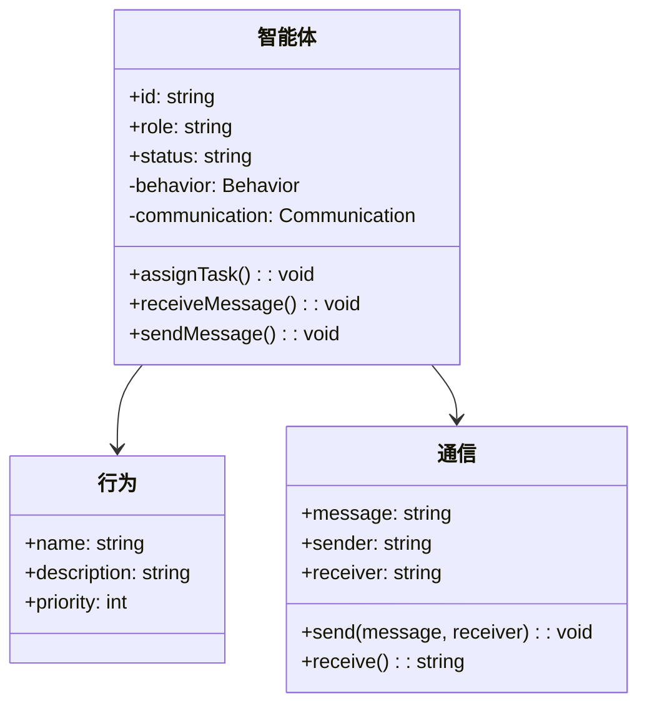
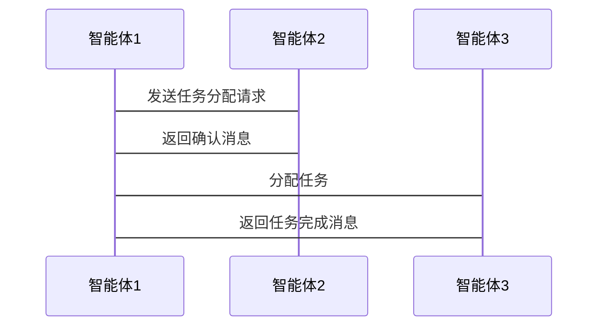

                 


# 多智能体系统在公司技术创新评估中的应用

> 关键词：多智能体系统、技术创新评估、协同决策、智能优化、系统架构

> 摘要：多智能体系统（Multi-Agent Systems, MAS）通过多个智能体的协作，能够高效地处理复杂的公司技术创新评估问题。本文系统地介绍了多智能体系统的核心概念、技术创新评估的理论基础，以及如何在实际中应用MAS进行技术创新评估。通过详细分析MAS的协作机制、算法原理、系统架构，结合项目实战，展示了MAS在技术创新评估中的优势和应用前景。

---

## 第1章: 多智能体系统概述

### 1.1 多智能体系统的基本概念

#### 1.1.1 多智能体系统的定义
多智能体系统（MAS）是由多个智能体组成的分布式系统，这些智能体通过协作完成共同目标。每个智能体都是一个独立的实体，能够感知环境、自主决策并与其他智能体进行通信。

#### 1.1.2 多智能体系统的分类
多智能体系统可以分为以下几类：
- **简单反应式智能体**：仅基于当前感知做出反应。
- **基于模型的反射式智能体**：利用内部模型和记忆进行决策。
- **目标驱动型智能体**：基于明确的目标进行行动。
- **协作型智能体**：专注于与多个智能体协作完成任务。

#### 1.1.3 多智能体系统的特点与优势
- **分布式计算**：多个智能体分布在不同的节点上，避免单点故障。
- **协作性**：智能体之间通过通信和协商完成任务。
- **自治性**：每个智能体具有自主决策能力。
- **适应性**：能够动态调整策略以应对环境变化。

### 1.2 技术创新评估的基本概念

#### 1.2.1 技术创新的内涵
技术创新是指引入新的技术或改进现有技术，以提高产品或服务的性能、效率和竞争力。

#### 1.2.2 技术创新评估的意义
技术创新评估帮助企业识别和评估潜在的技术创新项目，优化资源配置，降低创新风险。

#### 1.2.3 技术创新评估的常见方法
- **定量评估**：通过数据和指标进行评估。
- **定性评估**：通过专家意见和描述性分析进行评估。
- **混合评估**：结合定量和定性方法。

### 1.3 多智能体系统在技术创新评估中的作用

#### 1.3.1 多智能体系统与技术创新评估的关系
MAS通过分布式协作和自主决策，能够高效地处理技术创新评估中的复杂问题。

#### 1.3.2 多智能体系统在技术创新评估中的优势
- **高效性**：多个智能体同时处理不同任务，提高评估效率。
- **协作性**：智能体之间协同工作，提供全面的评估结果。
- **适应性**：能够快速响应环境变化，调整评估策略。

---

## 第2章: 多智能体系统的核心概念

### 2.1 智能体的基本概念

#### 2.1.1 智能体的定义
智能体是一个能够感知环境、自主决策并采取行动的实体。

#### 2.1.2 智能体的分类
- **反应式智能体**：基于当前感知做出反应。
- **认知式智能体**：具备复杂推理和规划能力。
- **协作式智能体**：专注于与多个智能体协作完成任务。

#### 2.1.3 智能体的特征
- **自主性**：无需外部干预。
- **反应性**：能够感知环境并做出反应。
- **协作性**：能够与其他智能体协作。

### 2.2 多智能体系统的协作机制

#### 2.2.1 协作的基本概念
协作是指多个智能体共同完成任务的过程。

#### 2.2.2 协作的实现方式
- **基于规则的协作**：通过预定义规则进行协作。
- **基于目标的协作**：通过共享目标进行协作。
- **基于协商的协作**：通过动态协商达成一致。

#### 2.2.3 协作中的通信与协调
- **通信**：智能体之间通过消息传递进行通信。
- **协调**：通过协商和规划实现任务协调。

### 2.3 多智能体系统的体系结构

#### 2.3.1 分层体系结构
将系统划分为多个层次，每个层次负责不同的功能。

#### 2.3.2 分布式体系结构
智能体分布在网络中，通过通信进行协作。

#### 2.3.3 混合体系结构
结合分层和分布式体系结构，适用于复杂场景。

---

## 第3章: 技术创新评估的理论基础

### 3.1 技术创新评估的指标体系

#### 3.1.1 技术创新的评估维度
- **技术可行性**：技术的实现难度和可行性。
- **市场潜力**：技术的市场需求和潜在收益。
- **竞争性**：技术在市场中的竞争力。

#### 3.1.2 评估指标的权重分配
通过专家评分或数据分析确定各指标的权重。

#### 3.1.3 评估模型的构建
构建数学模型，综合考虑各指标的影响。

### 3.2 技术创新评估的模型构建

#### 3.2.1 评估模型的设计
- **数据收集**：收集相关技术数据和市场信息。
- **模型构建**：基于数据构建评估模型。
- **模型验证**：通过实际案例验证模型的准确性。

#### 3.2.2 评估方法的选择
- **定量分析**：使用数学模型进行定量评估。
- **定性分析**：通过专家意见进行定性评估。
- **混合分析**：结合定量和定性方法。

### 3.3 多智能体系统在技术创新评估中的应用

#### 3.3.1 多智能体系统的应用优势
- **分布式计算**：提高评估效率。
- **协作性**：提供全面的评估结果。
- **适应性**：快速响应环境变化。

---

## 第4章: 多智能体系统在技术创新评估中的应用

### 4.1 多智能体系统的协作机制

#### 4.1.1 智能体的协作流程
1. **任务分配**：智能体根据自身能力分配任务。
2. **通信与协商**：智能体之间通过通信协商任务。
3. **协同决策**：基于协商结果做出决策。
4. **执行任务**：智能体协同执行任务。
5. **反馈与调整**：根据反馈调整协作策略。

#### 4.1.2 协作中的冲突解决
- **协商解决**：通过协商达成一致。
- **仲裁解决**：由仲裁智能体进行裁决。
- **妥协解决**：通过妥协达成共识。

### 4.2 技术创新评估的MAS模型

#### 4.2.1 模型的设计
- **智能体设计**：每个智能体负责评估的一部分。
- **通信机制**：智能体之间通过通信共享数据。
- **协作机制**：通过协作完成综合评估。

#### 4.2.2 模型的实现
- **数据收集**：收集技术创新相关数据。
- **任务分配**：分配任务给不同的智能体。
- **协同评估**：智能体协同完成综合评估。
- **结果输出**：输出评估结果。

### 4.3 技术创新评估MAS的实现步骤

#### 4.3.1 系统需求分析
- **目标**：明确技术创新评估的目标。
- **功能需求**：确定系统需要实现的功能。
- **性能需求**：确定系统的性能要求。

#### 4.3.2 系统设计
- **功能模块设计**：设计系统的功能模块。
- **智能体设计**：设计每个智能体的功能和行为。
- **通信协议设计**：设计智能体之间的通信协议。

#### 4.3.3 系统实现
- **环境搭建**：搭建开发环境。
- **代码实现**：实现系统的各个模块。
- **测试与调试**：测试系统并进行调试。

#### 4.3.4 系统优化
- **性能优化**：优化系统的性能。
- **功能优化**：优化系统功能，提高用户体验。

---

## 第5章: 算法原理与技术创新评估

### 5.1 多智能体系统的算法原理

#### 5.1.1 分布式计算
- **定义**：分布式计算是将计算任务分配到多个节点上进行计算。
- **实现**：通过通信和协调完成计算任务。
- **优势**：提高计算效率，避免单点故障。

#### 5.1.2 协商算法
- **定义**：协商算法是指智能体之间通过协商达成一致的过程。
- **实现**：通过协商协议进行通信和协调。
- **优势**：能够动态调整任务分配，适应环境变化。

### 5.2 技术创新评估的算法实现

#### 5.2.1 多目标优化
- **定义**：多目标优化是指在多个目标之间找到最优解。
- **实现**：通过数学模型和优化算法进行求解。
- **优势**：能够综合考虑多个目标的影响。

#### 5.2.2 协商与协作算法
- **定义**：协商与协作算法是指智能体之间通过协商和协作完成任务。
- **实现**：通过协商协议和协作机制进行实现。
- **优势**：能够动态调整任务分配，提高协作效率。

### 5.3 技术创新评估的数学模型

#### 5.3.1 技术创新评估的指标权重
- **数学表达式**：权重 $w_i$ 表示第 $i$ 个指标的权重。
- **计算公式**：$\sum_{i=1}^{n} w_i x_i$，其中 $x_i$ 是第 $i$ 个指标的值。

#### 5.3.2 多目标优化模型
- **目标函数**：$\text{min} \ f(x)$。
- **约束条件**：$g(x) \leq 0$，$h(x) = 0$。

---

## 第6章: 系统分析与架构设计

### 6.1 系统问题场景介绍

#### 6.1.1 问题背景
技术创新评估是一个复杂的过程，需要考虑多个因素。

#### 6.1.2 问题描述
公司需要对多个技术创新项目进行评估，传统的评估方法效率低下。

#### 6.1.3 问题解决
通过MAS实现分布式协作，提高评估效率和准确性。

### 6.2 系统功能设计

#### 6.2.1 功能模块
- **数据采集模块**：采集技术创新相关数据。
- **任务分配模块**：分配任务给不同的智能体。
- **协作评估模块**：智能体协同完成综合评估。
- **结果输出模块**：输出评估结果。

#### 6.2.2 领域模型类图


### 6.3 系统架构设计

#### 6.3.1 系统架构图


#### 6.3.2 接口设计
- **API接口**：智能体之间通过API接口进行通信。
- **消息队列**：使用消息队列实现异步通信。

#### 6.3.3 交互序列图


---

## 第7章: 项目实战与技术创新评估应用

### 7.1 项目实战

#### 7.1.1 环境安装
```bash
pip install multi-agent-systems
```

#### 7.1.2 系统核心代码实现
```python
class Agent:
    def __init__(self, id):
        self.id = id
        self.role = "Evaluator"
        self.status = "Idle"

    def assign_task(self, task):
        print(f"Agent {self.id} assigned task: {task}")

    def receive_message(self, message):
        print(f"Agent {self.id} received message: {message}")

    def send_message(self, message, receiver):
        print(f"Agent {self.id} sent message: {message} to {receiver}")

# 初始化智能体
agent1 = Agent(1)
agent2 = Agent(2)

# 任务分配
agent1.assign_task("Data collection")
agent2.assign_task("Analysis")

# 智能体通信
agent1.send_message("Start data collection", "agent2")
agent2.receive_message("Start data collection")
```

#### 7.1.3 代码应用解读与分析
- **Agent类**：定义智能体的基本功能。
- **assign_task方法**：分配任务。
- **receive_message和send_message方法**：处理通信。

#### 7.1.4 技术创新评估案例分析
假设公司有5个技术创新项目，每个智能体负责评估一个项目，最终协同完成综合评估。

#### 7.1.5 项目小结
通过MAS实现技术创新评估，提高了效率和准确性。

---

## 第8章: 总结与展望

### 8.1 总结

#### 8.1.1 多智能体系统的优势
- **分布式计算**：提高效率。
- **协作性**：提供全面的评估结果。
- **适应性**：快速响应环境变化。

#### 8.1.2 技术创新评估的意义
技术创新评估是公司持续创新的重要基础。

### 8.2 展望

#### 8.2.1 MAS在技术创新评估中的未来发展
- **智能化**：引入更智能的算法。
- **实时性**：提高评估的实时性。
- **可扩展性**：增强系统的可扩展性。

#### 8.2.2 提升MAS性能的建议
- **优化算法**：提高协作效率。
- **增强通信**：提高通信效率和安全性。
- **提升计算能力**：通过分布式计算提高处理能力。

---

## 作者：AI天才研究院/AI Genius Institute & 禅与计算机程序设计艺术 /Zen And The Art of Computer Programming

---

### 参考文献
1. 维基百科：多智能体系统
2. 《多智能体系统的算法与应用》
3. 《技术创新评估的理论与实践》

---

### 代码示例

```python
# 一个简单的多智能体系统实现

class Agent:
    def __init__(self, id):
        self.id = id
        self.role = "Evaluator"
        self.status = "Idle"

    def assign_task(self, task):
        print(f"Agent {self.id} assigned task: {task}")

    def receive_message(self, message):
        print(f"Agent {self.id} received message: {message}")

    def send_message(self, message, receiver):
        print(f"Agent {self.id} sent message: {message} to {receiver}")

# 初始化智能体
agent1 = Agent(1)
agent2 = Agent(2)

# 任务分配
agent1.assign_task("Data collection")
agent2.assign_task("Analysis")

# 智能体通信
agent1.send_message("Start data collection", "agent2")
agent2.receive_message("Start data collection")
```

---

### 小结
本文系统地介绍了多智能体系统在公司技术创新评估中的应用，通过详细分析MAS的核心概念、算法原理、系统架构，并结合项目实战，展示了MAS在技术创新评估中的优势和应用前景。未来，随着人工智能和分布式计算技术的不断发展，MAS在技术创新评估中的应用将更加广泛和深入。

