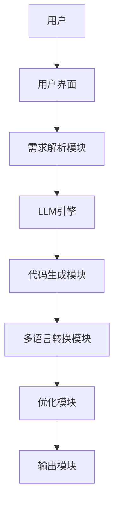
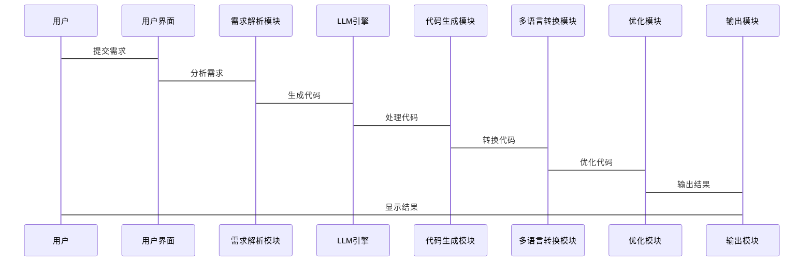

                 


# 多语言编程AI Agent：LLM在软件开发全周期的应用

> 关键词：多语言编程，AI Agent，LLM，软件开发，全周期应用

> 摘要：本文探讨了多语言编程AI Agent在软件开发全生命周期中的应用，重点分析了LLM技术如何在需求分析、设计、开发、测试、部署和维护阶段发挥作用。文章详细介绍了LLM的基本原理、多语言处理技术，以及AI Agent的实现方法，并通过实际案例展示了其在项目中的应用。最后，本文总结了多语言编程AI Agent的优势与挑战，并展望了未来的发展方向。

---

# 第1章: 多语言编程AI Agent的背景与概念

## 1.1 多语言编程的背景

### 1.1.1 软件开发的多语言现状

现代软件开发中，多语言编程已经成为一种趋势。不同编程语言适用于不同的场景，例如前端开发使用JavaScript，后端开发使用Python或Java，数据处理使用R或SQL等。然而，多语言编程也带来了挑战，如代码风格不统一、开发效率低下以及维护成本增加。

### 1.1.2 多语言编程的重要性

多语言编程能够提高开发效率，优化性能，增强代码的可维护性和扩展性。例如，前端使用高效的编译型语言如TypeScript，后端使用功能强大的Python或Java，数据处理使用R或SQL等。多语言编程还能够满足不同项目的需求，提高整体开发质量。

### 1.1.3 多语言编程面临的挑战

多语言编程的主要挑战包括语言间的兼容性问题、代码风格的统一性、开发工具的多样性以及团队协作的复杂性。此外，不同语言的语法和语义差异可能导致代码难以维护和调试。

### 1.1.4 多语言编程的未来趋势

随着技术的发展，多语言编程将更加普及，AI Agent在其中扮演越来越重要的角色。通过AI技术，可以实现跨语言代码的自动转换、语法检查和代码生成，从而简化多语言开发流程，提高开发效率。

## 1.2 AI Agent的基本概念

### 1.2.1 AI Agent的定义

AI Agent（人工智能代理）是指能够感知环境并采取行动以实现目标的智能实体。它可以是一个软件程序，能够根据输入的信息做出决策并执行相应的操作。

### 1.2.2 AI Agent的核心特征

AI Agent的核心特征包括自主性、反应性、目标导向和学习能力。自主性意味着AI Agent能够独立决策；反应性意味着它能够实时感知环境变化并做出反应；目标导向意味着它有明确的目标；学习能力意味着它能够通过经验改进自身性能。

### 1.2.3 AI Agent与传统编程的区别

与传统编程相比，AI Agent具有更强的自主性和适应性。传统编程依赖于固定的算法和规则，而AI Agent能够根据环境动态调整行为。此外，AI Agent还具备学习和进化的能力，能够不断优化自身性能。

## 1.3 LLM在多语言编程中的作用

### 1.3.1 LLM的定义与特点

大语言模型（LLM，Large Language Model）是一种基于深度学习的自然语言处理模型，能够理解和生成人类语言。LLM具有强大的上下文理解和生成能力，能够处理复杂的语言任务。

### 1.3.2 LLM在多语言编程中的应用

LLM在多语言编程中的应用包括代码生成、语法检查、文档翻译、代码解释和调试等。例如，LLM可以生成多种语言的代码，帮助开发人员快速完成任务。

### 1.3.3 LLM的优势与局限性

LLM的优势在于其强大的语言处理能力和通用性，能够适应多种编程任务。然而，LLM也存在一些局限性，如对代码上下文理解的不足、生成代码的准确性问题以及对计算资源的高需求。

## 1.4 多语言编程AI Agent的总体架构

### 1.4.1 系统架构概述

多语言编程AI Agent的总体架构包括输入模块、处理模块、输出模块和反馈模块。输入模块负责接收用户输入，处理模块负责解析需求并生成代码，输出模块将结果呈现给用户，反馈模块根据用户反馈优化系统性能。

### 1.4.2 核心模块组成

核心模块包括需求解析模块、代码生成模块、多语言转换模块和优化模块。需求解析模块理解用户需求，代码生成模块生成相应代码，多语言转换模块实现跨语言转换，优化模块优化生成代码的性能和可读性。

### 1.4.3 模块之间的关系

各模块之间相互协作，共同完成多语言编程任务。需求解析模块为代码生成模块提供输入，代码生成模块生成代码后，多语言转换模块将其转换为目标语言，优化模块对代码进行优化，最后输出模块将结果呈现给用户。

---

# 第2章: 多语言编程AI Agent的核心技术

## 2.1 大语言模型（LLM）的原理

### 2.1.1 语言模型的基本原理

语言模型通过概率分布预测下一个词，帮助生成连贯的文本。基本原理包括词袋模型、n-gram模型和转换器模型。

### 2.1.2 LLM的训练过程

LLM的训练过程包括数据准备、模型构建、损失函数定义、优化器选择和训练循环。常用的数据预处理方法包括分词、去除停用词和数据增强。

### 2.1.3 LLM的推理机制

推理机制包括解码策略（贪心解码和随机采样）和注意力机制。解码策略决定了生成文本的方式，注意力机制帮助模型关注输入中的重要部分。

## 2.2 多语言处理技术

### 2.2.1 多语言NLP的基本概念

多语言NLP是指在多种语言上进行自然语言处理，包括语言识别、翻译和文本分析。多语言NLP的核心技术包括语言模型和翻译模型。

### 2.2.2 多语言模型的挑战

多语言模型的挑战包括跨语言数据稀疏性、语言间的语义差异和模型训练的复杂性。解决方法包括使用共享参数、预训练和微调。

### 2.2.3 多语言处理的实现方法

多语言处理的实现方法包括多任务学习、多语言预训练模型和语言适配器。多任务学习通过共享参数处理多个任务，多语言预训练模型在多种语言上进行预训练，语言适配器针对特定语言进行微调。

## 2.3 AI Agent的实现技术

### 2.3.1 Agent的感知与决策

AI Agent的感知包括接收输入和环境反馈，决策基于感知结果和内部状态。决策过程需要考虑目标、环境约束和可能的后果。

### 2.3.2 Agent的执行与反馈

AI Agent根据决策执行操作，并根据反馈调整行为。反馈机制包括正反馈和负反馈，帮助系统不断优化。

### 2.3.3 Agent的自适应能力

自适应能力使AI Agent能够根据环境变化自动调整策略。实现方法包括在线学习、强化学习和迁移学习。

---

# 第3章: LLM在软件开发全周期的应用

## 3.1 软件开发全周期概述

### 3.1.1 软件开发的生命周期

软件开发的生命周期包括需求分析、设计、开发、测试、部署和维护。每个阶段都有其特定的任务和挑战。

### 3.1.2 各阶段的核心任务

需求分析阶段需要明确需求，设计阶段需要制定系统架构，开发阶段需要编写代码，测试阶段需要验证功能，部署阶段需要上线系统，维护阶段需要修复问题。

### 3.1.3 LLM在各阶段的应用潜力

LLM在各阶段都有广泛的应用潜力，例如需求分析中的需求生成和理解，设计阶段的架构设计和代码生成，测试阶段的测试用例生成和缺陷检测，部署阶段的自动化部署和监控，维护阶段的代码修复和性能优化。

## 3.2 需求分析阶段

### 3.2.1 需求理解与提取

LLM可以帮助开发人员理解用户需求，提取关键需求。通过自然语言处理技术，LLM能够从需求文档中提取信息，生成需求规格说明书。

### 3.2.2 需求优先级排序

LLM可以分析需求的重要性，帮助开发人员进行需求优先级排序。基于语言模型的理解，LLM能够评估需求的影响范围和优先级。

### 3.2.3 需求验证与确认

LLM可以辅助验证需求的合理性和一致性，确保需求符合项目目标。通过对比分析，LLM能够发现需求中的矛盾和不一致。

## 3.3 设计阶段

### 3.3.1 系统架构设计

LLM可以帮助生成系统架构图，设计模块结构。通过自然语言处理，LLM能够将需求转化为系统架构，确保设计的合理性。

### 3.3.2 数据流设计

LLM可以协助设计数据流图，明确数据流向和处理流程。通过分析需求，LLM能够生成数据流图，帮助开发人员理解数据处理过程。

### 3.3.3 用户界面设计

LLM可以辅助设计用户界面，生成交互流程图。通过分析用户需求，LLM能够提出界面布局和交互逻辑，提高用户体验。

## 3.4 开发阶段

### 3.4.1 代码生成与优化

LLM可以生成多种语言的代码，帮助开发人员快速完成编码任务。通过分析需求，LLM能够生成高质量的代码，减少开发时间。

### 3.4.2 代码质量保障

LLM可以进行代码审查，检测潜在问题。通过语法检查和静态分析，LLM能够发现代码中的错误，提高代码质量。

### 3.4.3 代码复用与管理

LLM可以辅助代码复用，优化代码管理。通过分析现有代码库，LLM能够识别可复用的代码片段，减少重复劳动。

## 3.5 测试阶段

### 3.5.1 测试用例生成

LLM可以生成测试用例，覆盖各种场景。通过自然语言处理，LLM能够根据需求生成测试用例，提高测试效率。

### 3.5.2 缺陷检测与定位

LLM可以帮助定位缺陷，分析错误原因。通过日志分析和错误报告，LLM能够协助开发人员找到问题根源。

### 3.5.3 自动化测试

LLM可以协助实现自动化测试，减少人工干预。通过生成测试脚本，LLM能够自动化执行测试用例，提高测试效率。

## 3.6 部署阶段

### 3.6.1 自动化部署

LLM可以协助实现自动化部署，生成部署脚本。通过分析系统架构，LLM能够生成部署文档，指导开发人员完成部署工作。

### 3.6.2 监控与日志分析

LLM可以辅助监控系统运行状态，分析日志信息。通过自然语言处理，LLM能够识别异常情况，帮助开发人员快速定位问题。

### 3.6.3 系统优化

LLM可以提出优化建议，提升系统性能。通过分析系统日志，LLM能够发现性能瓶颈，提出优化方案。

## 3.7 维护阶段

### 3.7.1 代码修复

LLM可以辅助修复代码，解决已知问题。通过分析错误报告，LLM能够生成修复方案，指导开发人员完成代码修复。

### 3.7.2 性能优化

LLM可以提出性能优化建议，提升系统效率。通过分析系统运行数据，LLM能够识别性能瓶颈，提出优化策略。

### 3.7.3 功能扩展

LLM可以协助扩展系统功能，满足新需求。通过分析新需求，LLM能够生成功能设计文档，指导开发人员完成功能扩展。

---

# 第4章: 多语言编程AI Agent的系统架构与实现

## 4.1 系统架构设计

### 4.1.1 系统架构概述

多语言编程AI Agent的系统架构包括用户界面、LLM引擎、多语言处理模块和反馈机制。用户界面是与用户交互的界面，LLM引擎负责语言模型的运行，多语言处理模块实现跨语言转换，反馈机制优化系统性能。

### 4.1.2 系统功能模块

功能模块包括需求解析模块、代码生成模块、多语言转换模块和优化模块。需求解析模块理解用户需求，代码生成模块生成代码，多语言转换模块实现代码转换，优化模块优化代码性能。

### 4.1.3 系统架构图



## 4.2 系统实现细节

### 4.2.1 用户界面设计

用户界面需要简洁直观，支持多种语言输入和输出。通过图形化界面，用户可以输入需求，查看生成代码，监控系统运行状态。

### 4.2.2 LLM引擎实现

LLM引擎负责运行大语言模型，支持多种语言模型的加载和切换。引擎需要高效处理大量文本数据，确保生成结果的准确性和实时性。

### 4.2.3 多语言转换模块

多语言转换模块实现代码的跨语言转换，支持多种编程语言的语法检查和代码生成。模块需要处理语言间的语法差异，确保转换结果的正确性。

### 4.2.4 优化模块实现

优化模块通过分析生成代码，提出优化建议。优化策略包括代码结构优化、性能优化和可读性优化。模块需要结合具体语言特点，制定合理的优化方案。

## 4.3 系统接口设计

### 4.3.1 系统接口概述

系统接口包括用户输入接口、LLM引擎接口、多语言转换接口和优化模块接口。每个接口需要定义输入输出格式，确保系统各部分协同工作。

### 4.3.2 接口设计细节

用户输入接口接收用户的自然语言需求，LLM引擎接口负责模型的调用，多语言转换接口处理代码转换，优化模块接口负责优化建议的生成。

### 4.3.3 接口交互流程

用户通过输入接口提交需求，系统调用LLM引擎生成代码，然后通过多语言转换接口转换代码，优化模块优化代码，最后输出结果。

## 4.4 系统交互流程

### 4.4.1 交互流程概述

用户提交需求，系统解析需求，生成代码，转换代码，优化代码，最后输出结果。整个过程需要高效协同，确保用户体验良好。

### 4.4.2 交互流程详细说明

用户输入需求，系统解析需求并生成代码，转换代码为目标语言，优化代码，最后输出结果。每个步骤都需要精确处理，确保最终结果符合需求。

### 4.4.3 交互流程图



---

# 第5章: 多语言编程AI Agent的项目实战

## 5.1 项目概述

### 5.1.1 项目背景

本项目旨在开发一个多语言编程AI Agent，帮助开发人员在软件开发全周期中提高效率。通过集成LLM技术，实现代码生成、转换和优化。

### 5.1.2 项目目标

项目目标包括实现多语言代码生成、优化代码质量和提高开发效率。通过实际案例，验证系统的有效性和实用性。

## 5.2 环境安装与配置

### 5.2.1 系统环境要求

系统需要安装Python 3.8以上版本，安装TensorFlow、Keras和Hugging Face库。还需要安装自然语言处理工具如spaCy和NLTK。

### 5.2.2 开发工具安装

安装Jupyter Notebook用于开发和调试，安装PyCharm作为代码编辑器，安装Git用于版本控制。

### 5.2.3 依赖管理

使用pip安装所需的Python包，配置虚拟环境，确保各包版本兼容。

## 5.3 核心代码实现

### 5.3.1 需求解析模块

需求解析模块通过自然语言处理技术，理解用户需求并生成代码。代码实现包括文本预处理、模型加载和结果解析。

```python
def parse_request(request):
    # 文本预处理
    preprocessed = preprocess(request)
    # 模型加载
    model = load_model()
    # 模型推理
    result = model.predict(preprocessed)
    return result
```

### 5.3.2 LLM引擎实现

LLM引擎负责运行大语言模型，生成代码。代码实现包括模型加载、输入处理和结果生成。

```python
def generate_code(request):
    # 加载模型
    model = load_llm()
    # 处理输入
    processed_input = process_input(request)
    # 生成代码
    code = model.generate(processed_input)
    return code
```

### 5.3.3 多语言转换模块

多语言转换模块实现代码的跨语言转换。代码实现包括语法检查、代码转换和结果验证。

```python
def convert_code(source_code, target_language):
    # 加载转换器
    converter = load_converter(target_language)
    # 转换代码
    converted_code = converter.convert(source_code)
    return converted_code
```

### 5.3.4 优化模块实现

优化模块通过分析代码，提出优化建议。代码实现包括代码分析、优化策略生成和结果输出。

```python
def optimize_code(code):
    # 加载优化器
    optimizer = load_optimizer()
    # 分析代码
    analysis = analyze_code(code)
    # 生成优化策略
    strategies = generate_strategies(analysis)
    # 应用优化
    optimized_code = apply_strategies(code, strategies)
    return optimized_code
```

## 5.4 项目实战案例

### 5.4.1 案例分析

以一个简单的计算器应用为例，展示多语言编程AI Agent的应用。用户需求是生成一个计算器的Python代码。

### 5.4.2 案例实现

用户输入需求：“生成一个计算器应用，支持加减乘除和幂运算。” AI Agent生成Python代码：

```python
def calculator():
    while True:
        try:
            a = float(input("Enter first number: "))
            b = float(input("Enter second number: "))
            operation = input("Enter operation (+, -, *, /, **): ")
            if operation == '+':
                print(a + b)
            elif operation == '-':
                print(a - b)
            elif operation == '*':
                print(a * b)
            elif operation == '/':
                print(a / b)
            elif operation == '**':
                print(a ** b)
            else:
                print("Invalid operation")
        except ValueError:
            print("Invalid input")
```

### 5.4.3 案例优化

优化后的代码增加了异常处理和用户输入提示，提高了代码的健壮性和用户体验。

---

# 第6章: 多语言编程AI Agent的系统优化与维护

## 6.1 系统优化策略

### 6.1.1 性能优化

通过优化算法和减少计算量，提高系统的运行效率。例如，使用更高效的模型压缩技术，减少模型参数数量。

### 6.1.2 系统维护

定期更新模型，修复已知问题，确保系统的稳定性和可靠性。维护工作包括模型更新、代码修复和性能监控。

## 6.2 系统维护策略

### 6.2.1 模型更新

定期更新LLM模型，确保模型的准确性和先进性。模型更新可以通过微调现有模型或加载新的预训练模型实现。

### 6.2.2 代码优化

通过分析生成代码，不断优化代码质量。优化策略包括减少代码冗余、提高代码可读性和优化执行效率。

### 6.2.3 性能监控

实时监控系统运行状态，及时发现和解决问题。性能监控包括CPU使用率、内存占用和系统响应时间的监控。

## 6.3 系统维护工具

### 6.3.1 日志分析工具

使用日志分析工具，监控系统运行日志，发现异常情况。常用工具包括ELK（Elasticsearch, Logstash, Kibana）和Prometheus。

### 6.3.2 性能监控工具

使用性能监控工具，实时监控系统性能，优化系统运行效率。常用工具包括New Relic和Datadog。

### 6.3.3 自动化运维工具

使用自动化运维工具，实现系统自动部署和更新。常用工具包括Jenkins和GitLab CI/CD。

---

# 第7章: 多语言编程AI Agent的总结与展望

## 7.1 总结

### 7.1.1 多语言编程AI Agent的核心优势

多语言编程AI Agent通过集成LLM技术，能够提高开发效率，优化代码质量，简化多语言开发流程。其核心优势在于自动化处理和智能化决策。

### 7.1.2 项目实现的关键点

项目实现的关键点包括需求解析、代码生成、多语言转换和优化模块的设计与实现。各模块之间的协同工作是系统成功的关键。

### 7.1.3 项目实现的经验总结

项目实现过程中积累了宝贵经验，包括模型优化、系统架构设计和代码管理。这些经验为后续开发提供了宝贵的参考。

## 7.2 未来展望

### 7.2.1 技术发展的方向

未来，多语言编程AI Agent将更加智能化，支持更多编程语言和开发场景。技术发展方向包括模型小型化、实时推理和人机协作。

### 7.2.2 应用领域的扩展

AI Agent将在更多领域得到应用，如游戏开发、数据分析和人工智能研究。随着技术进步，AI Agent的应用前景将更加广阔。

### 7.2.3 对开发者的影响

多语言编程AI Agent将显著提高开发效率，优化代码质量，推动软件开发进入智能化时代。开发者的角色将更多地转变为系统设计者和优化者，而不是单纯的代码编写者。

---

# 作者：AI天才研究院/AI Genius Institute & 禅与计算机程序设计艺术 /Zen And The Art of Computer Programming

