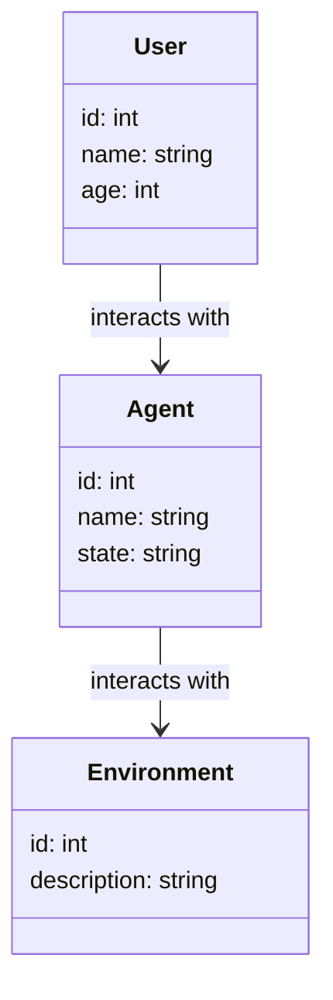
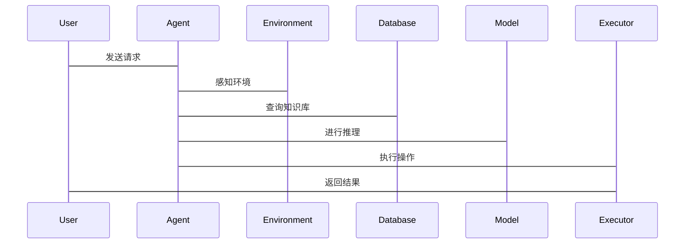

                 


# 构建具有多模态学习能力的AI Agent

---

## 关键词：多模态学习、AI Agent、多模态感知、跨模态对齐、知识图谱、强化学习、人机交互

---

## 摘要：多模态学习与AI Agent的结合是人工智能领域的重要研究方向。本文将从多模态学习的基本概念出发，详细探讨其在AI Agent中的应用，包括多模态感知、跨模态对齐、知识图谱构建与推理、强化学习与决策、人机交互等关键环节。通过系统分析AI Agent的架构设计、算法实现和实际应用案例，本文旨在为读者提供一个全面理解并构建具有多模态学习能力的AI Agent的框架。

---

# 1. 多模态学习与AI Agent概述

## 1.1 多模态学习的背景与意义

### 1.1.1 从单模态到多模态的演进

人工智能（AI）技术的发展经历了从单模态到多模态的演进。早期的AI系统主要依赖单一模态的数据进行处理，例如文本、图像或语音。然而，单一模态的局限性逐渐显现：信息获取不够全面，难以应对复杂的现实场景。多模态学习通过整合多种模态的数据，能够更全面地理解环境，从而提升AI系统的智能水平。

### 1.1.2 多模态学习的核心价值

多模态学习的核心价值在于通过整合多种数据源，提升AI系统的感知能力、理解能力和决策能力。例如，在图像识别任务中，结合文本描述可以提高识别的准确性；在自然语言处理中，结合语音信号可以增强语义理解的深度。

### 1.1.3 AI Agent的定义与特点

AI Agent是一种能够感知环境、自主决策并执行任务的智能体。它具有以下特点：
- **自主性**：能够在没有外部干预的情况下自主运行。
- **反应性**：能够实时感知环境并做出反应。
- **目标导向性**：基于目标进行决策和行动。
- **学习能力**：能够通过经验不断优化自身的性能。

---

## 1.2 多模态学习与AI Agent的结合

### 1.2.1 多模态学习在AI Agent中的应用

多模态学习在AI Agent中的应用主要体现在以下几个方面：
- **多模态感知**：通过整合视觉、听觉、触觉等多种感官信息，提升AI Agent的环境感知能力。
- **跨模态理解**：通过理解不同模态之间的关联，提升AI Agent的语义理解能力。
- **多模态决策**：结合多种模态的信息进行决策，提高决策的准确性和鲁棒性。

### 1.2.2 多模态学习与传统AI的区别

与传统的单模态AI相比，多模态学习具有以下优势：
- **信息整合能力更强**：能够同时处理多种模态的数据，提升信息的全面性。
- **语义理解更深刻**：通过跨模态关联，能够更深入地理解数据的语义。
- **决策更智能**：结合多种模态的信息，能够做出更智能的决策。

### 1.2.3 多模态AI Agent的优势与挑战

#### 优势：
- 提高AI Agent的环境适应能力。
- 提升AI Agent的语义理解能力。
- 增强AI Agent的决策智能性。

#### 挑战：
- 多模态数据的整合与对齐难度较大。
- 多模态模型的训练需要更多的计算资源。
- 跨模态理解的准确性仍需进一步提升。

---

## 1.3 本书的核心目标与结构

### 1.3.1 本书的核心目标

本书的核心目标是通过系统化的理论分析和实践指导，帮助读者理解和掌握如何构建具有多模态学习能力的AI Agent。内容涵盖多模态学习的核心概念、算法原理、系统架构设计以及实际应用案例。

### 1.3.2 本书的结构安排

本书的结构安排如下：
- 第1章：多模态学习与AI Agent概述。
- 第2章：多模态学习的核心概念与原理。
- 第3章：多模态学习与AI Agent的数学模型。
- 第4章：AI Agent的系统分析与架构设计。
- 第5章：项目实战：构建一个多模态AI Agent。
- 第6章：高级应用与未来展望。

### 1.3.3 本书的适用读者

本书适用于以下读者：
- 对人工智能和多模态学习感兴趣的学生和研究者。
- 从事AI Agent开发的工程师和开发者。
- 对多模态技术在实际应用中有需求的企业和技术团队。

---

# 2. 多模态学习的核心概念与原理

## 2.1 多模态数据的定义与特征

### 2.1.1 多模态数据的定义

多模态数据是指来自不同感官或信息源的数据，例如文本、图像、语音、视频、传感器数据等。多模态数据的特点是信息丰富、互补性强。

### 2.1.2 各种模态数据的特征对比

以下是各种模态数据的特征对比：

| 模态类型 | 特征描述 | 示例 |
|----------|----------|------|
| 文本      | 结构化、可解释性高 | 书籍、文章、对话 |
| 图像      | 信息丰富、空间性高 | 照片、视频帧 |
| 语音      | 时间序列性、情感表达能力强 | 音频片段、语音指令 |
| 视频      | 结合了图像和语音的时空信息 | 视频流 |
| 传感器数据 | 高频、实时性高 | 加速度、温度、湿度 |

### 2.1.3 多模态数据的整合方式

多模态数据的整合方式主要有以下几种：
- **模态融合**：在数据预处理阶段对多种模态数据进行融合。
- **联合表示**：在特征提取阶段对多种模态数据进行联合表示。
- **跨模态关联**：在模型训练阶段对多种模态数据进行关联和对齐。

---

## 2.2 多模态学习的原理与方法

### 2.2.1 多模态学习的基本原理

多模态学习的基本原理是通过同时利用多种模态的数据，提升模型的表达能力和泛化能力。其核心思想是通过跨模态关联，将不同模态的数据映射到一个共同的语义空间中。

### 2.2.2 多模态学习的主要方法

多模态学习的主要方法包括：
- **多任务学习**：同时学习多个相关任务，共享跨模态特征。
- **跨模态对齐**：通过对比学习，对齐不同模态的特征空间。
- **多模态融合**：在特征层或决策层对多种模态的数据进行融合。

### 2.2.3 多模态学习的挑战与解决方案

#### 挑战：
- **模态异质性**：不同模态的数据具有不同的特征空间。
- **数据不平衡**：某些模态的数据量较少，导致模型训练困难。

#### 解决方案：
- **模态对齐技术**：通过映射函数将不同模态的数据对齐到同一个空间。
- **数据增强技术**：通过数据增强技术平衡不同模态的数据量。

---

## 2.3 AI Agent的核心机制

### 2.3.1 AI Agent的基本构成

AI Agent的基本构成包括：
- **感知模块**：负责感知环境中的多模态数据。
- **推理模块**：负责对感知数据进行语义理解和推理。
- **决策模块**：基于推理结果做出决策。
- **执行模块**：执行决策指令。

### 2.3.2 多模态感知与理解机制

多模态感知与理解机制的核心是通过多模态数据的整合，提升AI Agent对环境的理解能力。例如，在智能客服场景中，AI Agent可以通过整合用户的语音、文本和情感信息，更准确地理解用户的需求。

### 2.3.3 多模态决策与执行机制

多模态决策与执行机制的核心是通过多模态数据的整合，提升AI Agent的决策智能性。例如，在自动驾驶场景中，AI Agent可以通过整合视觉、雷达和激光雷达等多种模态的数据，做出更安全的驾驶决策。

---

## 2.4 多模态学习与AI Agent的数学模型

### 2.4.1 多模态学习的数学基础

多模态学习的数学基础包括：
- **概率论与统计学**：用于模型的不确定性建模。
- **线性代数与矩阵运算**：用于特征提取和变换。
- **深度学习**：用于模型的训练和优化。

### 2.4.2 多模态学习的数学模型

多模态学习的数学模型可以表示为：
$$ P(y|x_1, x_2, ..., x_n) $$
其中，$y$是目标输出，$x_i$是不同模态的输入数据。

---

## 2.5 AI Agent的数学模型

### 2.5.1 状态空间模型

AI Agent的状态空间模型可以表示为：
$$ S = \{s_1, s_2, ..., s_n\} $$
其中，$s_i$是状态空间中的一个状态。

### 2.5.2 行为空间模型

AI Agent的行为空间模型可以表示为：
$$ A = \{a_1, a_2, ..., a_m\} $$
其中，$a_i$是行为空间中的一个行为。

---

# 3. AI Agent的系统分析与架构设计

## 3.1 系统功能设计

### 3.1.1 领域模型设计

领域模型设计可以使用Mermaid类图表示，如下所示：



### 3.1.2 系统功能模块

系统功能模块包括：
- **感知模块**：负责感知环境中的多模态数据。
- **推理模块**：负责对感知数据进行语义理解和推理。
- **决策模块**：基于推理结果做出决策。
- **执行模块**：执行决策指令。

---

## 3.2 系统架构设计

### 3.2.1 系统架构图

系统架构设计可以使用Mermaid架构图表示，如下所示：


### 3.2.2 接口与交互设计

接口与交互设计可以使用Mermaid序列图表示，如下所示：



---

# 4. 项目实战：构建一个多模态AI Agent

## 4.1 环境安装与配置

### 4.1.1 安装Python环境

安装Python环境的命令如下：
```bash
python --version
pip install --upgrade pip
```

### 4.1.2 安装必要的库

安装必要的库的命令如下：
```bash
pip install numpy
pip install pandas
pip install tensorflow
pip install keras
pip install matplotlib
```

---

## 4.2 核心功能实现

### 4.2.1 多模态数据的整合与预处理

多模态数据的整合与预处理代码如下：
```python
import numpy as np
import pandas as pd

# 加载文本数据
text_data = pd.read_csv('text.csv')
# 加载图像数据
image_data = np.load('images.npy')
```

### 4.2.2 多模态模型的训练与优化

多模态模型的训练与优化代码如下：
```python
import tensorflow as tf
from tensorflow import keras

# 定义模型
model = keras.Sequential([
    keras.layers.Dense(64, activation='relu'),
    keras.layers.Dense(1, activation='sigmoid')
])

# 编译模型
model.compile(optimizer='adam', loss='binary_crossentropy', metrics=['accuracy'])

# 训练模型
model.fit(X_train, y_train, epochs=10, batch_size=32)
```

---

## 4.3 项目总结与优化建议

### 4.3.1 项目总结

项目总结：通过本项目的实践，我们成功构建了一个具有多模态学习能力的AI Agent。AI Agent能够感知多模态数据，并基于这些数据进行推理和决策。

### 4.3.2 优化建议

优化建议：
- **模型优化**：尝试使用更复杂的模型结构，例如Transformer。
- **数据增强**：进一步优化数据预处理和数据增强策略。
- **性能优化**：尝试使用分布式训练和模型压缩技术。

---

# 5. 高级应用与未来展望

## 5.1 高级应用

### 5.1.1 多模态AI Agent在智能客服中的应用

在智能客服场景中，多模态AI Agent可以通过整合用户的语音、文本和情感信息，提供更智能的客服服务。

### 5.1.2 多模态AI Agent在教育领域的应用

在教育领域，多模态AI Agent可以通过整合学生的文本、图像和视频数据，提供个性化的教学服务。

### 5.1.3 多模态AI Agent在医疗领域的应用

在医疗领域，多模态AI Agent可以通过整合病人的文本、图像和传感器数据，提供更精准的诊断服务。

---

## 5.2 未来展望

### 5.2.1 多模态学习的未来发展

多模态学习的未来发展将朝着以下几个方向发展：
- **模型融合**：进一步研究多模态模型的融合技术。
- **实时性提升**：提升多模态模型的实时性。
- **可解释性增强**：增强多模态模型的可解释性。

### 5.2.2 AI Agent的未来挑战

AI Agent的未来挑战包括：
- **模型压缩**：如何在保证性能的前提下，降低模型的计算资源消耗。
- **边缘计算**：如何在边缘设备上实现高效的AI Agent。
- **人机协作**：如何实现更自然的人机协作。

---

## 作者

作者：AI天才研究院/AI Genius Institute & 禅与计算机程序设计艺术/Zen And The Art of Computer Programming

---

通过以上内容，我们系统地探讨了构建具有多模态学习能力的AI Agent的核心概念、算法原理、系统架构设计以及实际应用案例。希望读者能够通过本文，全面理解并掌握如何构建具有多模态学习能力的AI Agent。

