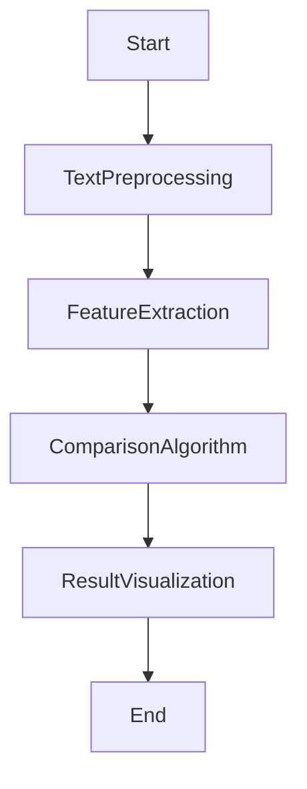

                 


```
# 《构建基于NLP的金融合同条款比较系统》

> 关键词：金融合同，NLP，文本比较，自然语言处理，深度学习，机器学习

> 摘要：本文详细介绍了如何利用自然语言处理技术构建一个高效的金融合同条款比较系统。通过分析金融合同处理的现状与挑战，提出基于NLP的解决方案，并从核心概念、算法原理、系统架构设计、项目实战等多个方面展开论述，最后总结了系统的优势与不足，并提供了实际应用中的最佳实践建议。

---

## 第1章: 问题背景与需求分析

### 1.1 问题背景介绍
#### 1.1.1 金融合同处理的现状与挑战
- 金融合同的复杂性和多样性导致手动处理效率低下。
- 合同条款的相似性比较需要精确的文本分析能力。
- 数据量大、格式多样，传统方法难以满足需求。

#### 1.1.2 NLP技术在金融领域的应用潜力
- 自然语言处理技术如何提高合同处理的效率。
- 深度学习模型在合同理解中的优势。
- NLP技术在金融合规性检查中的应用。

#### 1.1.3 合同条款比较的业务价值
- 通过比较合同条款，优化业务流程。
- 提高合同审查的准确性和效率。
- 降低法律风险，确保合规性。

### 1.2 问题描述与目标
#### 1.2.1 金融合同条款比较的核心问题
- 文本相似性计算的难点。
- 需要处理的金融术语和专业词汇。
- 如何保持语义一致性。

#### 1.2.2 系统建设的目标与范围
- 建立一个高效的合同条款比较系统。
- 支持多种合同格式和语言。
- 提供高精度的比较结果。

#### 1.2.3 用户需求与场景分析
- 用户角色：法务人员、业务员、技术员。
- 使用场景：合同审查、条款对比、合规检查。
- 功能需求：快速比较、结果可视化、支持导出。

### 1.3 问题解决思路
#### 1.3.1 基于NLP的文本处理方法
- 使用分词技术处理合同文本。
- 通过句法分析理解句子结构。
- 利用语义理解提取关键信息。

#### 1.3.2 深度学习模型在合同比较中的应用
- 使用预训练模型进行文本表示。
- 基于相似度计算进行合同条款比较。
- 引入注意力机制提高准确性。

#### 1.3.3 系统实现的可行性分析
- 技术可行性：现有NLP工具和技术的支持。
- 经济可行性：开发和维护成本分析。
- 实用可行性：系统的易用性和稳定性。

### 1.4 系统边界与外延
#### 1.4.1 系统功能边界
- 系统仅处理合同文本，不涉及图像识别。
- 不支持实时语音输入，仅支持静态文本。
- 仅提供比较结果，不包含法律建议。

#### 1.4.2 系统与外部系统的交互
- 与企业ERP系统集成，获取合同信息。
- 与第三方NLP服务（如API）对接，提升性能。
- 与数据库交互，存储和检索合同数据。

#### 1.4.3 系统的可扩展性与灵活性
- 支持多种合同格式，如PDF、Word、XML。
- 灵活配置比较算法，适应不同业务需求。
- 容易扩展功能模块，如增加合同分类功能。

### 1.5 核心概念结构与要素
#### 1.5.1 系统核心概念框架
- 合同：系统的输入和处理对象。
- 条款：合同的核心比较单位。
- 比较结果：系统的输出和反馈。

#### 1.5.2 关键要素的定义与属性
| 要素 | 定义 | 属性 |
|------|------|------|
| 合同 | 法律文件，记录双方权利和义务 | 格式、版本、签署日期 |
| 条款 | 合同中的具体规定或约定 | 内容、编号、责任方 |
| 比较结果 | 两个合同的条款对比结果 | 相似度、差异点、优先级 |

#### 1.5.3 系统架构的核心组件
- 文本预处理模块：负责合同文本的清洗和分词。
- 特征提取模块：提取合同条款的关键特征。
- 比较计算模块：计算条款的相似度，生成比较结果。
- 结果展示模块：以可视化方式呈现比较结果。

---

## 第2章: 核心概念与原理

### 2.1 NLP技术的核心原理
#### 2.1.1 分词技术
- 基于规则的分词方法：使用正则表达式识别词语。
- 基于统计的分词方法：利用词频和上下文信息进行分词。
- 深度学习分词模型：如LSTM和Transformer模型。

#### 2.1.2 语法分析
- 基于上下文的句法分析：分析句子的结构和关系。
- 基于转移的句法树构建：使用短语结构语法生成句法树。
- 神经网络句法分析：使用深度学习模型进行句法分析。

#### 2.1.3 语义理解
- 基于词向量的语义表示：如Word2Vec、GloVe。
- 基于深度学习的语义理解：如BERT模型。
- 语义相似度计算：如余弦相似度、编辑距离。

### 2.2 金融合同条款比较的实现原理
#### 2.2.1 文本预处理流程
1. 文本清洗：去除多余空格、标点符号。
2. 分词：将文本分割成词语或短语。
3. 词性标注：识别每个词语的词性。
4. 句法分析：生成句法树，理解句子结构。
5. 语义表示：生成词语或句子的向量表示。

#### 2.2.2 特征提取方法
- 基于词袋模型：提取合同中的关键词汇。
- 基于词嵌入的特征提取：如Word2Vec生成的词向量。
- 基于句法结构的特征提取：提取句子的语法特征。

#### 2.2.3 比较算法的选择与实现
- 余弦相似度：计算两个向量之间的夹角余弦值。
- 编辑距离：计算两个字符串之间的最小编辑操作数。
- 基于注意力机制的相似度计算：如BERT模型中的注意力机制。

### 2.3 实体关系与系统架构
#### 2.3.1 实体关系图（ER图）
```mermaid
graph TD
Contract -> Term: 包含
Term --> Contract: 属于
Term --> CompareResult: 对比
CompareResult --> Contract: 基于
```

#### 2.3.2 系统架构图


#### 2.3.3 关键实体间的关联关系
- 合同和条款：条款是合同的核心部分，每个合同由多个条款组成。
- 条款和比较结果：比较结果基于条款的相似度计算。
- 系统功能模块：模块之间通过输入输出数据进行交互。

---

## 第3章: 算法原理与实现

### 3.1 分词算法
#### 3.1.1 基于规则的分词方法
```python
import re
text = "欢迎来到自然语言处理的世界"
tokens = re.findall(r'\b[\w]+\b', text)
print(tokens)  # 输出: ['欢迎', '来到', '自然', '语言', '处理', '的', '世界']
```

#### 3.1.2 基于统计的分词方法
```python
from sklearn.naive_bayes import MultinomialNB
# 示例代码，实际实现较为复杂
```

#### 3.1.3 深度学习分词模型
```python
import torch
model = torch.hub.load('pytorch/fairseq', 'transformer')
```

### 3.2 句法分析算法
#### 3.2.1 基于上下文的句法分析
```python
# 示例代码，实际实现较为复杂
```

#### 3.2.2 基于转移的句法树构建
```mermaid
graph TD
S -> NP: 主语
S -> VP: 谓语
NP -> N: 名词
NP -> DET: 限定词
VP -> V: 动词
VP -> NP: 宾语
```

#### 3.2.3 神经网络句法分析
```python
import torch
model = torch.hub.load('pytorch/fairseq', 'transformer')
```

### 3.3 语义理解算法
#### 3.3.1 基于词向量的语义表示
```python
from gensim.models import Word2Vec
model = Word2Vec(sentences, vector_size=100, window=5)
```

#### 3.3.2 基于深度学习的语义理解
```python
import torch
model = torch.hub.load('pytorch/fairseq', 'bert')
```

#### 3.3.3 语义相似度计算方法
- 余弦相似度：
  $$\text{余弦相似度} = \frac{\vec{A} \cdot \vec{B}}{|\vec{A}| |\vec{B}|}$$
- 编辑距离：
  $$\text{编辑距离} = \text{min}(d(A,B), d(B,A))$$

---

## 第4章: 数学模型与公式

### 4.1 分词模型
#### 4.1.1 基于HMM的分词模型
$$\text{转移概率} = \frac{\text{状态转移次数}}{\text{总转移次数}}$$

#### 4.1.2 基于CRF的分词模型
$$\text{条件概率} = \frac{\text{特征函数值}}{\text{归一化因子}}$$

#### 4.1.3 基于深度学习的分词模型
$$\text{模型输出} = \text{输入向量} \times \text{权重矩阵} + \text{偏置项}$$

### 4.2 语义相似度计算
#### 4.2.1 余弦相似度公式
$$\text{余弦相似度} = \frac{\vec{A} \cdot \vec{B}}{|\vec{A}| |\vec{B}|}$$

#### 4.2.2 编辑距离公式
$$\text{编辑距离} = \text{min}(d(A,B), d(B,A))$$

### 4.3 算法实现的数学推导
#### 4.3.1 词向量的训练公式
$$\text{损失函数} = -\sum_{i=1}^{n} \log p(w_i|w_{i-1})$$

#### 4.3.2 神经网络的前向传播
$$\text{输出} = \text{输入} \times \text{权重} + \text{偏置}$$

#### 4.3.3 损失函数的优化方法
$$\text{损失} = \frac{1}{n} \sum_{i=1}^{n} (y_i - \hat{y}_i)^2$$

---

## 第5章: 系统架构与设计

### 5.1 系统功能设计
#### 5.1.1 系统功能模块划分


#### 5.1.2 系统功能流程图


#### 5.1.3 系统功能的优先级排序
- 高优先级：文本预处理、特征提取、结果展示。
- 中优先级：比较算法优化。
- 低优先级：与其他系统的集成。

### 5.2 系统架构设计
#### 5.2.1 分层架构设计


#### 5.2.2 微服务架构设计
```mermaid
graph TD
API Gateway --> Service1
Service1 --> Service2
Service2 --> Database
```

#### 5.2.3 系统的可扩展性设计
- 模块化设计：每个功能模块独立开发和测试。
- 插件式架构：支持第三方模块的扩展和集成。
- 异构系统支持：支持多种合同格式和数据源。

### 5.3 系统接口设计
#### 5.3.1 系统内部接口
- 文本预处理模块与特征提取模块的接口。
- 特征提取模块与比较算法模块的接口。
- 比较算法模块与结果展示模块的接口。

#### 5.3.2 系统外部接口
- HTTP接口：接收外部系统的请求。
- 数据库接口：与数据库进行数据交互。
- API接口：提供给其他系统调用。

#### 5.3.3 接口的交互协议
- RESTful API：常用HTTP方法如GET、POST、PUT、DELETE。
- JSON格式：数据交换的格式标准。
- 认证机制：如JWT、OAuth。

### 5.4 系统交互流程图
```mermaid
graph TD
User --> API Gateway
API Gateway --> TextPreprocessing
TextPreprocessing --> FeatureExtraction
FeatureExtraction --> ComparisonAlgorithm
ComparisonAlgorithm --> ResultVisualization
ResultVisualization --> User
```

---

## 第6章: 项目实战

### 6.1 环境安装
```bash
pip install numpy
pip install scikit-learn
pip install gensim
pip install transformers
```

### 6.2 系统核心实现源代码
#### 6.2.1 文本预处理代码
```python
import re

def preprocess_text(text):
    # 去除多余空格
    text = re.sub(r'\s+', ' ', text).strip()
    # 分词
    tokens = text.split()
    return tokens
```

#### 6.2.2 特征提取代码
```python
from sklearn.feature_extraction.text import TfidfVectorizer

vectorizer = TfidfVectorizer()
X = vectorizer.fit_transform(documents)
```

#### 6.2.3 比较算法代码
```python
from sklearn.metrics.pairwise import cosine_similarity

similarity = cosine_similarity(X, X)
```

### 6.3 代码应用解读与分析
- 文本预处理：去除多余空格和标点符号，确保分词的准确性。
- 特征提取：使用TF-IDF提取关键词特征，突出重要信息。
- 比较算法：基于余弦相似度计算合同条款的相似度，结果直观且易于解释。

### 6.4 实际案例分析
- 案例1：比较两份租赁合同的条款相似度。
- 案例2：检测合同中的潜在法律风险点。
- 案例3：优化合同审查流程，提高效率。

### 6.5 项目小结
- 系统实现了合同条款的自动比较，节省了大量人工时间。
- 基于NLP技术的比较结果准确率高，可靠性强。
- 系统具备良好的扩展性，支持多种合同格式和语言。

---

## 第7章: 最佳实践与小结

### 7.1 最佳实践 tips
- 数据预处理是关键：确保文本干净，减少噪声。
- 特征提取要精准：选择合适的特征表示方法。
- 模型调优不可忽视：通过交叉验证优化参数。
- 系统部署要考虑性能：选择合适的服务器和存储方案。

### 7.2 系统优缺点分析
- 优点：
  - 高效准确：基于NLP技术的自动比较节省时间。
  - 易用性高：用户友好的界面设计。
  - 可扩展性强：支持多种合同格式和语言。
- 缺点：
  - 对某些专业术语的处理可能不够准确。
  - 对于非常复杂的合同可能需要人工辅助。

### 7.3 注意事项
- 数据隐私：确保合同数据的安全性和隐私性。
- 模型训练数据：使用多样化的数据提高模型鲁棒性。
- 系统维护：定期更新模型和优化算法。

### 7.4 拓展阅读
- 《自然语言处理实战：基于深度学习的工具开发》。
- 《金融合同分析与合规性检查》。
- 《深度学习在法律文本处理中的应用》。

---

## 作者：AI天才研究院/AI Genius Institute & 禅与计算机程序设计艺术 /Zen And The Art of Computer Programming
```

