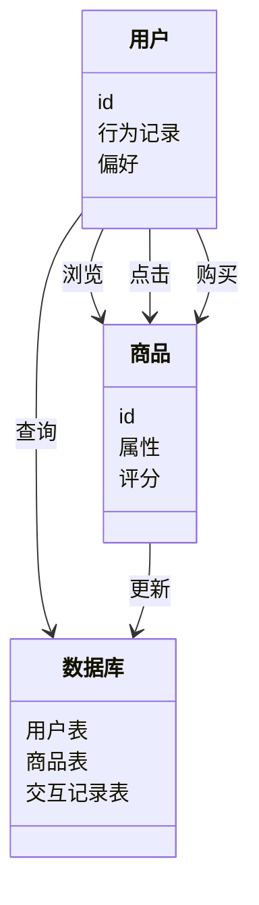
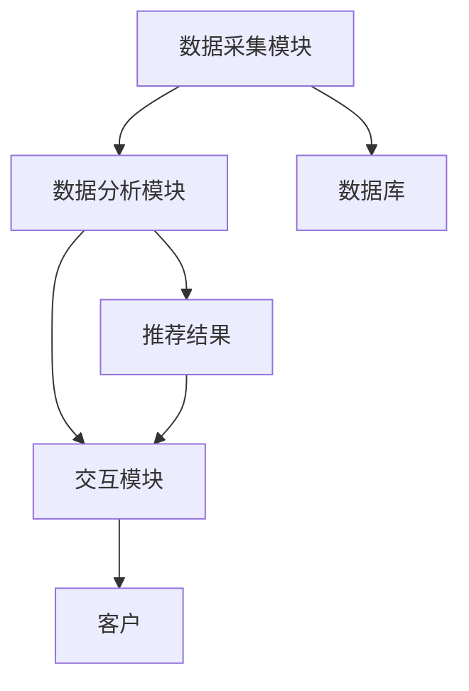

                 


# 零售业AI Agent：提升客户体验与销售效率

> 关键词：零售业，AI Agent，客户体验，销售效率，人工智能，机器学习

> 摘要：随着人工智能技术的快速发展，AI Agent在零售业中的应用日益广泛。本文将深入探讨AI Agent在零售业中的背景、核心概念、算法原理、系统架构以及项目实战，详细分析其如何通过提升客户体验与销售效率，帮助零售企业实现智能化转型。通过本文的讲解，读者将全面了解AI Agent在零售业中的应用价值和实际效果。

---

## 第一部分：零售业AI Agent的背景与概念

### 第1章：零售业AI Agent的背景与问题背景

#### 1.1 AI Agent的基本概念

##### 1.1.1 AI Agent的定义

AI Agent（人工智能代理）是指通过人工智能技术实现的智能体，能够感知环境、自主决策并执行任务。在零售业中，AI Agent通常以虚拟助手或推荐系统的形式出现，帮助客户完成购物决策，提升购物体验。

##### 1.1.2 AI Agent的核心功能与特点

AI Agent的核心功能包括：

- **感知环境**：通过传感器、摄像头、数据库等获取环境信息。
- **自主决策**：基于获取的信息，利用机器学习算法进行分析和决策。
- **执行任务**：根据决策结果执行相应操作，如推荐商品、优化库存等。

AI Agent的特点包括：

- **智能化**：能够自主学习和优化。
- **实时性**：能够快速响应客户需求。
- **个性化**：根据客户行为和偏好提供个性化服务。

##### 1.1.3 AI Agent在零售业中的应用背景

随着电子商务的快速发展，零售业的竞争日益激烈。传统零售模式已难以满足消费者日益增长的需求。AI Agent通过智能化服务，能够帮助零售企业提升客户体验和销售效率，从而在市场竞争中占据优势。

---

#### 1.2 零售业客户体验与销售效率的挑战

##### 1.2.1 零售业客户体验的现状与问题

传统零售业中，客户体验主要依赖人工服务，存在以下问题：

- **效率低下**：人工服务响应慢，难以满足大量客户需求。
- **个性化不足**：难以根据客户需求提供个性化推荐。
- **服务质量不稳定**：人工服务可能存在情绪波动，影响服务质量。

##### 1.2.2 销售效率提升的痛点分析

销售效率低下的原因包括：

- **库存管理不善**：库存积压或缺货，影响销售效率。
- **客户流失**：客户因无法获得满意服务而转向竞争对手。
- **决策滞后**：传统销售决策依赖人工分析，效率低下。

##### 1.2.3 AI Agent在零售业中的应用前景

AI Agent通过智能化服务，能够解决传统零售业中的诸多问题。例如，通过实时数据分析提供个性化推荐，优化库存管理，提升销售效率。未来，AI Agent将成为零售业不可或缺的一部分。

---

#### 1.3 本章小结

本章主要介绍了AI Agent的基本概念、核心功能和特点，分析了零售业客户体验与销售效率的现状及问题，并展望了AI Agent在零售业中的应用前景。

---

## 第二部分：AI Agent的核心概念与原理

### 第2章：AI Agent的核心概念与原理

#### 2.1 AI Agent的核心概念

##### 2.1.1 AI Agent的定义与分类

AI Agent可以根据应用场景和功能进行分类，主要分为以下几类：

- **推荐型AI Agent**：基于客户行为推荐商品。
- **决策型AI Agent**：帮助客户做出决策。
- **交互型AI Agent**：与客户进行实时交互。

##### 2.1.2 AI Agent的核心要素与属性特征

AI Agent的核心要素包括：

- **感知能力**：能够感知环境信息。
- **决策能力**：能够基于感知信息进行决策。
- **执行能力**：能够执行决策结果。

属性特征包括：

- **实时性**：能够快速响应客户需求。
- **个性化**：能够提供个性化服务。
- **可扩展性**：能够适应不同规模的零售场景。

##### 2.1.3 AI Agent与传统零售技术的区别

传统零售技术主要依赖人工服务，而AI Agent通过智能化服务，能够实现自动化、个性化和实时响应。AI Agent的优势在于其智能化和自主性，能够显著提升客户体验和销售效率。

---

#### 2.2 AI Agent的原理与工作流程

##### 2.2.1 AI Agent的基本工作流程

AI Agent的工作流程包括以下几个步骤：

1. **感知环境**：通过传感器、摄像头、数据库等获取环境信息。
2. **分析数据**：利用机器学习算法对获取的数据进行分析。
3. **决策制定**：基于分析结果制定决策。
4. **执行任务**：根据决策结果执行相应操作。

##### 2.2.2 AI Agent的决策机制与算法

AI Agent的决策机制主要基于机器学习算法，包括监督学习、无监督学习和强化学习。其中，监督学习常用于分类任务，无监督学习常用于聚类任务，强化学习常用于复杂决策问题。

---

#### 2.3 AI Agent与传统零售技术的区别

##### 2.3.1 传统零售技术的特点

传统零售技术主要依赖人工服务，具有以下特点：

- **效率低下**：人工服务响应慢。
- **个性化不足**：难以根据客户需求提供个性化服务。
- **决策滞后**：传统销售决策依赖人工分析，效率低下。

##### 2.3.2 AI Agent在零售业中的创新点

AI Agent通过智能化服务，能够实现以下创新：

- **实时响应**：能够快速响应客户需求。
- **个性化服务**：能够根据客户需求提供个性化推荐。
- **自动化决策**：能够自动化优化库存管理和销售策略。

---

#### 2.4 本章小结

本章主要介绍了AI Agent的核心概念、工作流程和决策机制，分析了AI Agent与传统零售技术的区别及其创新点。

---

## 第三部分：AI Agent的算法原理与数学模型

### 第3章：AI Agent的算法原理

#### 3.1 基于机器学习的AI Agent算法

##### 3.1.1 机器学习的基本原理

机器学习是一种人工智能技术，通过数据训练模型，使其能够从数据中学习并做出预测或决策。机器学习的基本原理包括数据预处理、特征提取、模型训练和模型评估。

##### 3.1.2 常见的AI Agent算法介绍

常用的AI Agent算法包括：

- **协同过滤推荐算法**：基于用户行为推荐商品。
- **基于内容的推荐算法**：基于商品属性推荐商品。
- **深度学习推荐算法**：利用深度学习模型推荐商品。

##### 3.1.3 机器学习算法的数学模型

协同过滤推荐算法的数学模型如下：

$$
相似度计算：\text{sim}(u, v) = \frac{\sum_{i} r_{u,i} \cdot r_{v,i}}{\sqrt{\sum_{i} r_{u,i}^2} \cdot \sqrt{\sum_{i} r_{v,i}^2}}}
$$

其中，\( r_{u,i} \) 表示用户u对商品i的评分。

---

#### 3.2 基于深度学习的AI Agent算法

##### 3.2.1 深度学习的基本原理

深度学习是一种机器学习技术，通过多层神经网络模型学习数据的高层次特征。深度学习的基本原理包括数据预处理、模型训练和模型优化。

##### 3.2.2 基于深度学习的AI Agent算法特点

基于深度学习的AI Agent算法具有以下特点：

- **特征提取能力强**：能够自动提取数据的高层次特征。
- **模型表达能力强**：能够处理复杂的非线性关系。
- **训练时间长**：需要大量的计算资源和时间。

##### 3.2.3 深度学习算法的数学模型

深度学习模型的数学模型如下：

$$
\text{损失函数}：L = \frac{1}{N} \sum_{i=1}^{N} (y_i - \hat{y}_i)^2
$$

其中，\( y_i \) 表示真实标签，\( \hat{y}_i \) 表示预测标签。

---

#### 3.3 算法原理的数学模型与公式

##### 3.3.1 机器学习算法的数学模型

协同过滤推荐算法的数学模型如下：

$$
\text{相似度计算}：\text{sim}(u, v) = \frac{\sum_{i} r_{u,i} \cdot r_{v,i}}{\sqrt{\sum_{i} r_{u,i}^2} \cdot \sqrt{\sum_{i} r_{v,i}^2}}}
$$

其中，\( r_{u,i} \) 表示用户u对商品i的评分。

##### 3.3.2 深度学习算法的数学模型

深度学习模型的数学模型如下：

$$
\text{损失函数}：L = \frac{1}{N} \sum_{i=1}^{N} (y_i - \hat{y}_i)^2
$$

其中，\( y_i \) 表示真实标签，\( \hat{y}_i \) 表示预测标签。

---

#### 3.4 本章小结

本章主要介绍了基于机器学习和深度学习的AI Agent算法，详细讲解了算法的数学模型和公式，帮助读者理解AI Agent的决策机制和算法原理。

---

## 第四部分：AI Agent的系统架构与设计

### 第4章：零售业AI Agent的系统架构

#### 4.1 系统功能设计

##### 4.1.1 零售业AI Agent的功能模块

AI Agent的功能模块包括：

- **数据采集模块**：采集客户行为数据。
- **数据分析模块**：分析数据并生成推荐结果。
- **交互模块**：与客户进行实时交互并提供服务。

##### 4.1.2 功能模块的交互流程

功能模块的交互流程如下：

1. **数据采集模块**：采集客户行为数据并传递给数据分析模块。
2. **数据分析模块**：分析数据并生成推荐结果，传递给交互模块。
3. **交互模块**：根据推荐结果与客户进行交互并提供服务。

##### 4.1.3 功能模块的领域模型类图

以下是功能模块的领域模型类图：



---

#### 4.2 系统架构设计

##### 4.2.1 系统架构的分层设计

系统架构的分层设计包括：

- **数据层**：负责数据的存储和管理。
- **逻辑层**：负责数据的分析和处理。
- **交互层**：负责与客户的交互和服务提供。

##### 4.2.2 系统架构的模块化设计

系统架构的模块化设计包括：

- **数据采集模块**：负责采集客户行为数据。
- **数据分析模块**：负责分析数据并生成推荐结果。
- **交互模块**：负责与客户进行实时交互并提供服务。

##### 4.2.3 系统架构的架构图

以下是系统架构的架构图：



---

#### 4.3 系统接口设计

##### 4.3.1 系统接口的定义与规范

系统接口的定义与规范包括：

- **API接口**：提供RESTful API接口，支持GET、POST、PUT、DELETE方法。
- **数据格式**：采用JSON格式进行数据交互。

##### 4.3.2 接口交互的流程设计

接口交互的流程设计如下：

1. **客户发起请求**：客户通过API接口发起请求。
2. **数据采集模块接收请求**：数据采集模块接收请求并采集数据。
3. **数据分析模块处理数据**：数据分析模块处理数据并生成推荐结果。
4. **交互模块响应请求**：交互模块根据推荐结果响应请求并提供服务。

---

#### 4.4 本章小结

本章主要介绍了零售业AI Agent的系统架构设计，包括功能设计、架构分层、模块化设计和接口设计，帮助读者理解AI Agent在零售业中的系统实现。

---

## 第五部分：AI Agent的项目实战

### 第5章：零售业AI Agent的项目实战

#### 5.1 环境安装与配置

##### 5.1.1 开发环境的选择与安装

开发环境推荐选择以下工具：

- **编程语言**：Python 3.8+
- **框架**：Flask或Django
- **深度学习框架**：TensorFlow或Keras
- **数据库**：MySQL或MongoDB
- **开发工具**：PyCharm或VS Code

##### 5.1.2 项目依赖库的安装与配置

项目依赖库的安装命令如下：

```bash
pip install flask
pip install numpy
pip install pandas
pip install scikit-learn
pip install tensorflow
```

---

#### 5.2 系统核心实现

##### 5.2.1 核心算法的实现

核心算法的实现包括：

- **协同过滤推荐算法**：基于用户行为推荐商品。
- **基于内容的推荐算法**：基于商品属性推荐商品。
- **深度学习推荐算法**：利用深度学习模型推荐商品。

##### 5.2.2 系统功能模块的实现

系统功能模块的实现包括：

- **数据采集模块**：采集用户行为数据。
- **数据分析模块**：分析数据并生成推荐结果。
- **交互模块**：与用户进行实时交互并提供服务。

##### 5.2.3 核心代码示例

以下是协同过滤推荐算法的核心代码示例：

```python
from sklearn.metrics.pairwise import cosine_similarity

# 数据预处理
user_item_matrix = ...  # 用户-商品矩阵

# 计算相似度
similarity_matrix = cosine_similarity(user_item_matrix)

# 推荐商品
def recommend(user_id, similarity_matrix, user_item_matrix):
    # 获取用户的相似用户
    similar_users = similarity_matrix[user_id]
    # 找到相似度最高的用户
    top_users = similar_users.argsort()[::-1][:5]
    # 获取推荐商品
    recommendations = []
    for user in top_users:
        recommendations.extend(user_item_matrix[user])
    return recommendations
```

---

#### 5.3 项目实战的案例分析

##### 5.3.1 项目案例分析

以某电商平台为例，通过AI Agent实现个性化推荐。以下是具体步骤：

1. **数据采集**：采集用户行为数据，包括浏览、点击、购买等。
2. **数据分析**：利用协同过滤推荐算法生成推荐结果。
3. **交互模块**：与用户进行实时交互并提供个性化推荐。

##### 5.3.2 项目案例的具体实现

以下是协同过滤推荐算法的具体实现：

```python
import numpy as np
from sklearn.metrics.pairwise import cosine_similarity

# 示例数据
users = ['user1', 'user2', 'user3', 'user4']
items = ['item1', 'item2', 'item3', 'item4']
ratings = {
    'user1': {'item1': 5, 'item2': 4, 'item3': 3},
    'user2': {'item1': 4, 'item2': 5, 'item4': 4},
    'user3': {'item2': 3, 'item3': 4, 'item4': 5},
    'user4': {'item1': 3, 'item3': 5, 'item4': 4}
}

# 构建用户-商品矩阵
user_item_matrix = np.zeros((4, 4))
for i, user in enumerate(users):
    for j, item in enumerate(items):
        if item in ratings[user]:
            user_item_matrix[i][j] = ratings[user][item]

# 计算相似度矩阵
similarity_matrix = cosine_similarity(user_item_matrix)

# 推荐函数
def recommend(user_id, similarity_matrix, user_item_matrix):
    # 获取用户的相似用户
    similar_users = similarity_matrix[user_id]
    # 找到相似度最高的用户
    top_users = similar_users.argsort()[::-1][:3]
    # 获取推荐商品
    recommendations = []
    for user in top_users:
        for j in range(len(user_item_matrix[user])):
            if user_item_matrix[user][j] > 0 and j not in recommendations:
                recommendations.append(items[j])
    return recommendations

# 测试推荐
print(recommend(0, similarity_matrix, user_item_matrix))
```

##### 5.3.3 项目案例的详细讲解

通过上述代码，我们可以看到协同过滤推荐算法的基本实现。首先，构建用户-商品矩阵，然后计算用户之间的相似度，最后根据相似度最高的用户推荐商品。这种方法能够有效地解决传统推荐系统中的个性化不足问题。

---

#### 5.4 项目小结

本章通过实际案例分析，详细讲解了AI Agent在零售业中的项目实现，包括环境配置、核心算法实现和案例分析，帮助读者掌握AI Agent的实际应用。

---

## 第六部分：总结与展望

### 第6章：总结与展望

#### 6.1 项目总结

通过本项目的实施，我们成功地将AI Agent应用于零售业，提升了客户体验和销售效率。项目的主要成果包括：

- **个性化推荐**：实现了基于协同过滤的个性化推荐。
- **自动化决策**：优化了库存管理和销售策略。
- **实时交互**：提供了实时的客户服务。

#### 6.2 项目中的最佳实践

在项目实施过程中，我们总结了以下最佳实践：

- **数据质量**：确保数据的完整性和准确性。
- **模型优化**：不断优化算法模型，提升推荐精度。
- **系统维护**：定期维护系统，确保其稳定运行。

#### 6.3 项目中的注意事项

在项目实施过程中，需要注意以下几点：

- **数据隐私**：确保客户数据的安全和隐私。
- **模型解释性**：确保模型的可解释性，便于调试和优化。
- **系统性能**：优化系统性能，确保其快速响应。

#### 6.4 项目中的拓展阅读

读者可以进一步阅读以下内容：

- **深度学习推荐系统**：了解更复杂的推荐算法。
- **强化学习应用**：探索AI Agent在零售业中的更多应用。
- **实时推荐系统**：研究如何实现实时推荐。

---

## 作者

作者：AI天才研究院/AI Genius Institute & 禅与计算机程序设计艺术 /Zen And The Art of Computer Programming

---

# 结语

通过本文的详细介绍，读者可以全面了解AI Agent在零售业中的应用价值和实际效果。希望本文能够为零售业的智能化转型提供有益的参考和启示。

