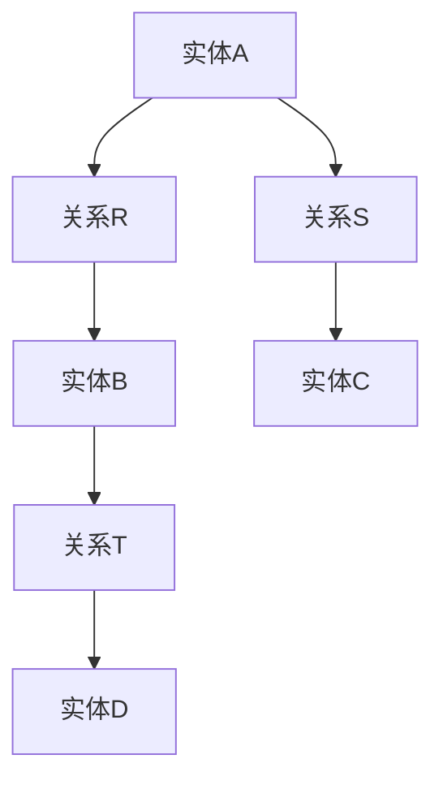
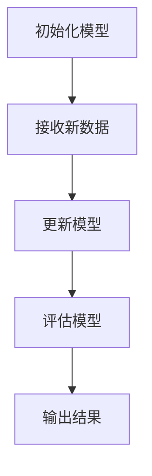
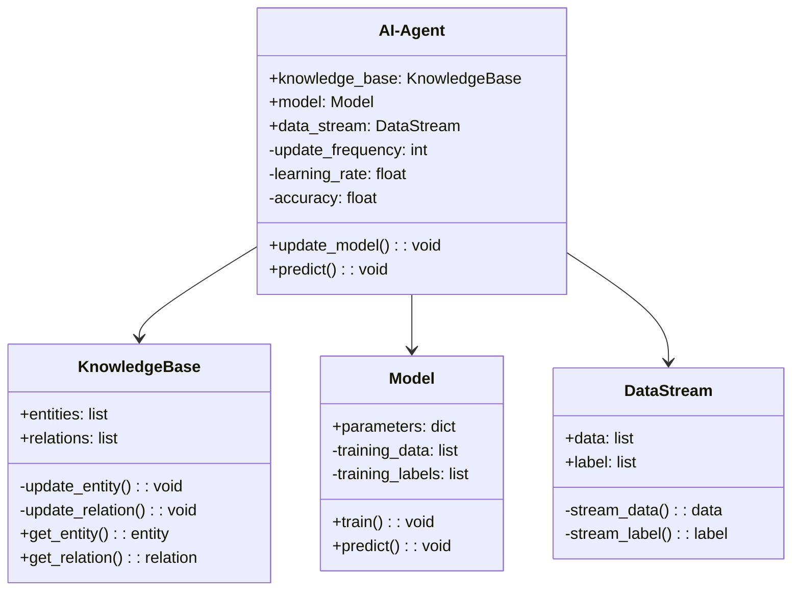
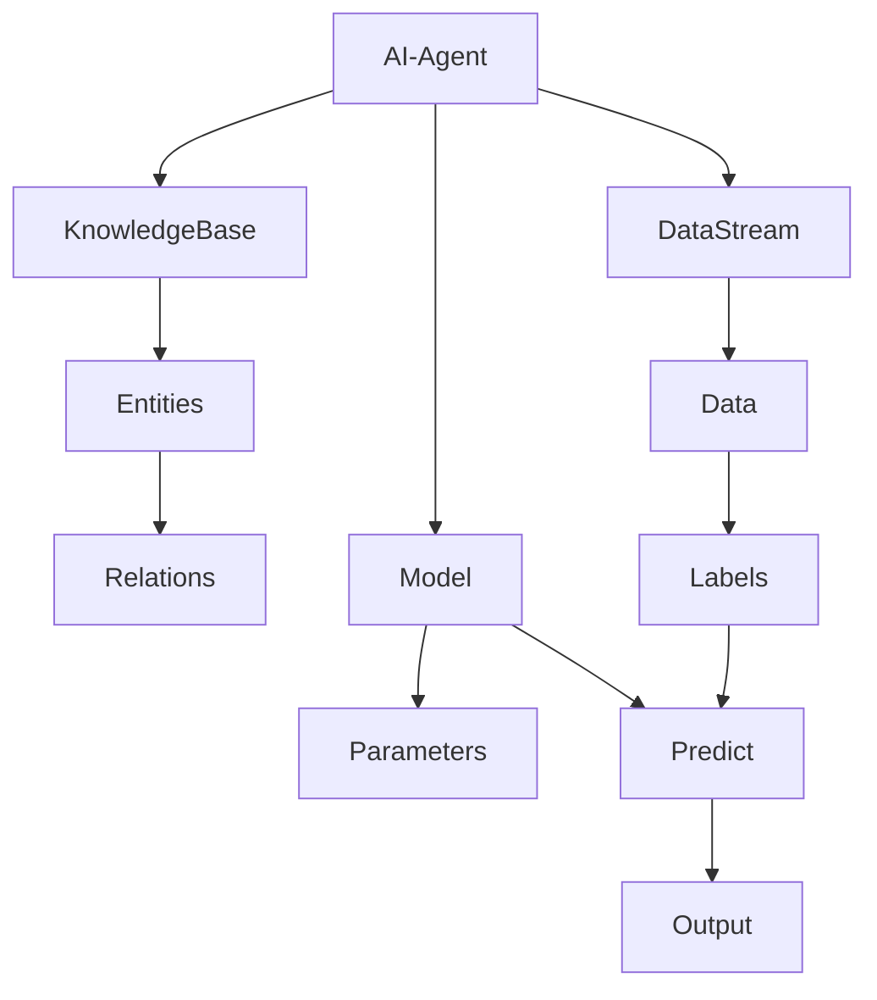

                 


# AI Agent的增量学习与知识更新

> 关键词：AI Agent，增量学习，知识更新，机器学习，自然语言处理，知识图谱，实时学习

> 摘要：本文深入探讨了AI Agent在增量学习与知识更新领域的核心概念、算法原理、系统架构以及实际应用。通过详细分析增量学习的基本原理、数学模型和典型算法，结合实际案例，展示了如何通过增量学习实现AI Agent的知识更新与优化，同时探讨了系统设计与实现中的关键问题。

---

## 第一部分: AI Agent的增量学习与知识更新基础

---

### 第1章: AI Agent与增量学习概述

#### 1.1 AI Agent的基本概念

##### 1.1.1 AI Agent的定义与特点
AI Agent（人工智能代理）是指能够感知环境、自主决策并执行任务的智能实体。AI Agent的特点包括：

1. **自主性**：能够在没有外部干预的情况下自主执行任务。
2. **反应性**：能够实时感知环境变化并做出反应。
3. **目标导向性**：基于目标和优先级进行决策。
4. **学习能力**：通过学习不断优化自身的知识库和行为策略。

##### 1.1.2 增量学习的基本概念
增量学习是一种机器学习方法，其特点是模型在接收到新的数据样本后，能够逐步更新自身的知识库或模型参数，而不是一次性重新训练整个模型。增量学习的核心在于“增量”：数据是逐步到达的，模型需要在每次新数据到来时进行更新。

##### 1.1.3 知识更新的必要性
在动态环境中，AI Agent需要不断适应新的信息和任务需求。知识更新的必要性体现在以下几个方面：

1. **动态环境适应**：环境中的信息和任务需求可能会发生变化，AI Agent需要通过知识更新保持对环境的适应能力。
2. **实时性要求**：在实时应用中，AI Agent需要快速响应新信息，保持知识的及时性和准确性。
3. **资源效率**：增量学习避免了重新训练整个模型的高计算成本，提高了资源利用效率。

#### 1.2 增量学习与知识更新的背景

##### 1.2.1 传统机器学习的局限性
传统的批量机器学习方法通常需要一次性加载所有训练数据，这在以下场景中存在局限性：

1. **数据量大**：当数据量非常大时，一次性加载和训练会消耗大量时间和计算资源。
2. **动态变化**：当数据分布随时间发生变化时，批量训练方法无法及时更新模型。
3. **实时性要求**：在需要实时响应的场景中，批量训练方法无法满足需求。

##### 1.2.2 动态环境中的知识更新需求
在动态环境中，AI Agent需要应对以下挑战：

1. **数据流的实时性**：数据可能是连续的、实时到达的流数据，需要快速处理和更新模型。
2. **模型的可扩展性**：随着数据量的增加，模型需要能够高效扩展，避免性能瓶颈。
3. **知识的准确性**：模型需要能够及时发现并纠正错误，保持知识的准确性。

##### 1.2.3 AI Agent在实时任务中的应用
AI Agent在实时任务中的应用包括：

1. **智能客服系统**：实时响应用户查询，动态更新知识库。
2. **自动驾驶系统**：实时感知环境并做出决策，需要不断更新道路规则和驾驶策略。
3. **金融交易系统**：实时分析市场数据，动态调整交易策略。

#### 1.3 问题背景与目标

##### 1.3.1 动态环境中的知识更新问题
在动态环境中，AI Agent面临以下知识更新问题：

1. **数据稀疏性**：新数据可能稀疏，难以覆盖所有可能的情况。
2. **概念漂移**：数据分布的变化可能需要模型进行重大调整。
3. **计算资源限制**：在资源受限的环境中，模型更新需要高效完成。

##### 1.3.2 增量学习的目标与挑战
增量学习的目标是在新数据到达时，高效地更新模型，保持模型的准确性和性能。主要挑战包括：

1. **模型的可更新性**：模型需要支持在线更新，避免重新训练的高成本。
2. **计算效率**：模型更新需要在有限的计算资源下高效完成。
3. **知识的准确性**：模型更新需要能够有效处理噪声数据和异常情况。

##### 1.3.3 知识更新的边界与外延
知识更新的边界包括：

1. **更新频率**：模型更新的频率和时机。
2. **更新范围**：模型更新的参数范围和知识库的覆盖范围。
3. **更新策略**：模型更新的触发条件和策略。

知识更新的外延包括：

1. **知识表示**：如何表示和存储知识，以便高效更新。
2. **知识验证**：如何验证更新后的知识的准确性。
3. **知识融合**：如何将新知识与旧知识有效融合，避免冲突。

#### 1.4 核心概念与联系

##### 1.4.1 增量学习与在线学习的对比
增量学习与在线学习的对比：

| 对比维度       | 增量学习         | 在线学习         |
|----------------|------------------|------------------|
| 数据处理方式   | 新数据逐步到达   | 新数据逐步到达   |
| 模型更新方式   | 局部更新         | 局部更新         |
| 适用场景       | 数据流场景       | 实时决策场景     |
| 计算效率       | 高              | 高              |

##### 1.4.2 知识图谱在增量学习中的作用
知识图谱是一种结构化的知识表示形式，由实体和关系组成。在增量学习中，知识图谱的作用包括：

1. **知识表示**：将知识以结构化的形式表示，便于理解和推理。
2. **知识更新**：通过图结构的动态更新，保持知识的准确性和一致性。
3. **知识融合**：将新知识与旧知识有效融合，避免冲突。

##### 1.4.3 Mermaid实体关系图展示
以下是一个简单的Mermaid实体关系图，展示知识图谱中实体及其关系：



---

## 第2章: 增量学习的核心原理

### 2.1 增量学习的原理与算法

#### 2.1.1 增量学习的基本原理
增量学习的核心在于“增量”：模型在新数据到达时，逐步更新自身的参数或知识库。增量学习的基本步骤如下：

1. **初始化模型**：建立初始模型，通常基于少量数据或先验知识。
2. **接收新数据**：逐步接收新的数据样本。
3. **更新模型**：基于新数据更新模型，保持模型的准确性和适应性。

#### 2.1.2 增量学习的数学模型
增量学习的数学模型通常涉及参数的逐步更新。以下是一个简单的增量学习模型：

$$ \theta_{t+1} = \theta_t + \eta (y_t - f(x_t; \theta_t)) $$

其中：
- $\theta_t$ 表示第 $t$ 步的模型参数。
- $\eta$ 表示学习率。
- $y_t$ 表示第 $t$ 个样本的真实标签。
- $f(x_t; \theta_t)$ 表示模型在第 $t$ 个样本上的预测值。

#### 2.1.3 增量学习的算法流程
增量学习的算法流程如下：



---

### 2.2 知识更新的机制

#### 2.2.1 知识表示与存储
知识表示是知识更新的基础。常用的表示方法包括：

1. **符号表示**：使用符号逻辑表示知识。
2. **向量表示**：使用向量空间模型表示知识。
3. **图表示**：使用图结构表示知识。

#### 2.2.2 知识更新的触发条件
知识更新的触发条件包括：

1. **时间触发**：定期更新知识库。
2. **事件触发**：检测到特定事件后更新知识库。
3. **性能触发**：模型性能下降后触发更新。

#### 2.2.3 知识更新的验证与评估
知识更新的验证与评估需要考虑以下指标：

1. **准确率**：更新后的知识库的准确率。
2. **召回率**：知识更新的覆盖范围。
3. **更新时间**：知识更新的效率和时间成本。

---

### 2.3 增量学习与知识更新的关系

#### 2.3.1 增量学习如何促进知识更新
增量学习通过逐步更新模型参数，实现了知识的动态更新。增量学习的关键在于如何高效地利用新数据，保持知识的准确性和一致性。

#### 2.3.2 知识更新对增量学习的影响
知识更新的质量直接影响增量学习的效果。高质量的知识更新能够提高模型的准确性和适应性，而低质量的知识更新可能导致模型性能下降。

#### 2.3.3 两者结合的优化策略
为了实现增量学习与知识更新的优化结合，可以采用以下策略：

1. **增量更新**：逐步更新模型参数，保持模型的准确性和适应性。
2. **知识融合**：将新知识与旧知识有效融合，避免冲突。
3. **动态调整**：根据环境变化动态调整模型更新策略。

---

## 第3章: 增量学习的算法实现

### 3.1 增量学习的数学模型

#### 3.1.1 参数更新的数学公式
增量学习的参数更新公式通常涉及梯度下降等优化算法。以下是一个简单的增量学习参数更新公式：

$$ \theta_{t+1} = \theta_t - \eta \cdot \nabla J(\theta_t) $$

其中：
- $\theta_t$ 表示第 $t$ 步的模型参数。
- $\eta$ 表示学习率。
- $\nabla J(\theta_t)$ 表示模型在第 $t$ 步的梯度。

#### 3.1.2 梯度下降的优化算法
梯度下降是一种常用的优化算法，用于更新模型参数。以下是梯度下降的优化步骤：

1. **计算损失函数**：计算当前模型的损失函数值。
2. **计算梯度**：计算损失函数对模型参数的梯度。
3. **更新参数**：根据梯度和学习率更新模型参数。

#### 3.1.3 贝叶斯更新的原理
贝叶斯更新是一种基于概率的更新方法，适用于增量学习中的参数更新。贝叶斯更新的公式如下：

$$ P(\theta|D) = \frac{P(D|\theta)P(\theta)}{P(D)} $$

其中：
- $P(\theta|D)$ 表示在数据 $D$ 下参数 $\theta$ 的后验概率。
- $P(D|\theta)$ 表示参数 $\theta$ 下数据 $D$ 的似然。
- $P(\theta)$ 表示参数 $\theta$ 的先验概率。
- $P(D)$ 表示数据 $D$ 的边际概率。

---

### 3.2 增量学习的算法流程

#### 3.2.1 增量SVM算法
增量SVM算法是一种基于支持向量机的增量学习算法。以下是增量SVM算法的步骤：

1. **初始化模型**：建立初始的支持向量机模型。
2. **接收新数据**：逐步接收新的数据样本。
3. **更新模型**：将新数据样本添加到模型中，调整支持向量和权重。
4. **评估模型**：评估模型的准确性和性能。

#### 3.2.2 增量决策树算法
增量决策树算法是一种基于决策树的增量学习算法。以下是增量决策树算法的步骤：

1. **初始化模型**：建立初始的决策树模型。
2. **接收新数据**：逐步接收新的数据样本。
3. **更新模型**：根据新数据样本更新决策树的结构和参数。
4. **评估模型**：评估模型的准确性和性能。

#### 3.2.3 增量聚类算法
增量聚类算法是一种基于聚类的增量学习算法。以下是增量聚类算法的步骤：

1. **初始化模型**：建立初始的聚类模型。
2. **接收新数据**：逐步接收新的数据样本。
3. **更新模型**：根据新数据样本更新聚类的结构和参数。
4. **评估模型**：评估模型的准确性和性能。

---

### 3.3 算法实现的代码示例

#### 3.3.1 增量SVM的Python实现
以下是增量SVM的Python实现示例：

```python
class IncrementalSVM:
    def __init__(self):
        self.model = None
        self.X = []
        self.y = []

    def fit(self, X, y):
        for xi, yi in zip(X, y):
            self.X.append(xi)
            self.y.append(yi)
            # 更新模型
            self.model = svm.SVC().fit(self.X, self.y)

    def predict(self, X):
        return self.model.predict(X)
```

#### 3.3.2 增量决策树的Python实现
以下是增量决策树的Python实现示例：

```python
class IncrementalDecisionTree:
    def __init__(self):
        self.tree = None
        self.X = []
        self.y = []

    def fit(self, X, y):
        for xi, yi in zip(X, y):
            self.X.append(xi)
            self.y.append(yi)
            # 更新模型
            self.tree = DecisionTreeClassifier().fit(self.X, self.y)

    def predict(self, X):
        return self.tree.predict(X)
```

#### 3.3.3 增量聚类的Python实现
以下是增量聚类的Python实现示例：

```python
class IncrementalClustering:
    def __init__(self):
        self.clusters = []
        self.data = []

    def fit(self, X):
        for xi in X:
            self.data.append(xi)
            # 更新聚类
            new_cluster = self._find_closest_cluster(xi)
            if new_cluster is None:
                self.clusters.append([xi])
            else:
                new_cluster.append(xi)

    def _find_closest_cluster(self, xi):
        # 简单的距离计算方法
        min_distance = float('inf')
        closest_cluster = None
        for cluster in self.clusters:
            distance = self._calculate_distance(xi, cluster[0])
            if distance < min_distance:
                min_distance = distance
                closest_cluster = cluster
        return closest_cluster

    def _calculate_distance(self, xi, xj):
        # 简单的距离计算方法
        return sum((xi[k] - xj[k])**2 for k in range(len(xi)))

    def predict(self, X):
        predictions = []
        for xi in X:
            min_distance = float('inf')
            closest_cluster = None
            for cluster in self.clusters:
                distance = self._calculate_distance(xi, cluster[0])
                if distance < min_distance:
                    min_distance = distance
                    closest_cluster = cluster
            predictions.append(closest_cluster)
        return predictions
```

---

## 第4章: 增量学习的系统分析与架构设计

### 4.1 问题场景介绍

#### 4.1.1 系统介绍
本节将介绍一个基于增量学习的AI Agent系统，该系统能够实时更新知识库，适应动态环境中的新任务需求。

#### 4.1.2 系统功能需求
系统功能需求包括：

1. **实时数据处理**：能够处理实时到达的数据流。
2. **知识更新**：能够基于新数据更新知识库。
3. **模型优化**：能够根据新数据优化模型性能。
4. **结果输出**：能够输出模型的预测结果。

#### 4.1.3 系统功能模块划分
系统功能模块包括：

1. **数据采集模块**：负责实时采集新数据。
2. **知识更新模块**：负责基于新数据更新知识库。
3. **模型优化模块**：负责优化模型性能。
4. **结果输出模块**：负责输出模型的预测结果。

---

### 4.2 系统架构设计

#### 4.2.1 领域模型设计
以下是领域模型的Mermaid类图：



#### 4.2.2 系统架构设计
以下是系统的Mermaid架构图：



---

## 第5章: 项目实战

### 5.1 环境安装

#### 5.1.1 系统环境
- 操作系统：Linux/Windows/MacOS
- Python版本：3.6+
- 依赖库：numpy, scikit-learn, nltk, networkx, mermaid

#### 5.1.2 安装依赖
```bash
pip install numpy scikit-learn nltk networkx mermaid
```

---

### 5.2 系统核心实现

#### 5.2.1 增量学习核心代码实现
以下是增量学习的核心代码实现：

```python
import numpy as np
from sklearn.svm import SVC
from sklearn.tree import DecisionTreeClassifier

class IncrementalLearner:
    def __init__(self):
        self.models = {}
        self.data = {}

    def add_model(self, model_name, model):
        self.models[model_name] = model
        self.data[model_name] = ([], [])

    def update_model(self, model_name, X, y):
        if model_name not in self.models:
            self.add_model(model_name, self._get_model(model_name))
        self.data[model_name][0].extend(X)
        self.data[model_name][1].extend(y)
        self.models[model_name].fit(*self.data[model_name])

    def _get_model(self, model_name):
        if model_name == 'svm':
            return SVC()
        elif model_name == 'tree':
            return DecisionTreeClassifier()
        else:
            raise ValueError("Invalid model name")

    def predict(self, model_name, X):
        return self.models[model_name].predict(X)
```

#### 5.2.2 知识更新核心代码实现
以下是知识更新的核心代码实现：

```python
import networkx as nx

class KnowledgeUpdater:
    def __init__(self):
        self.graph = nx.Graph()

    def add_entity(self, entity):
        self.graph.add_node(entity)

    def add_relation(self, source, target, relation):
        self.graph.add_edge(source, target, relation)

    def update_entity(self, entity):
        # 示例更新逻辑
        pass

    def update_relation(self, relation):
        # 示例更新逻辑
        pass

    def get_entity(self, entity):
        return self.graph.nodes[entity]

    def get_relation(self, source, target):
        return self.graph[source][target].get('relation', 'unknown')
```

---

### 5.3 代码应用解读与分析

#### 5.3.1 增量学习代码解读
增量学习代码解读：

1. **Initialization**：初始化增量学习器，包含多个模型和对应的数据集。
2. **Add Model**：添加新的模型到增量学习器中。
3. **Update Model**：基于新数据更新模型。
4. **Predict**：使用更新后的模型进行预测。

---

## 第6章: 最佳实践与小结

### 6.1 最佳实践 tips

#### 6.1.1 增量学习的关键点
1. **数据质量**：确保新数据的质量，避免噪声数据影响模型性能。
2. **模型选择**：选择适合增量学习的模型，如支持向量机、决策树等。
3. **模型更新频率**：根据应用场景调整模型更新频率，平衡准确性和实时性。

#### 6.1.2 知识更新的注意事项
1. **知识表示**：选择合适的知识表示方法，便于高效更新和推理。
2. **知识验证**：定期验证知识更新的准确性和一致性。
3. **知识融合**：有效融合新知识与旧知识，避免冲突。

### 6.2 小结

通过本文的详细讲解，我们深入探讨了AI Agent在增量学习与知识更新领域的核心概念、算法原理、系统架构以及实际应用。增量学习作为一种高效的机器学习方法，能够帮助AI Agent在动态环境中保持知识的准确性和适应性。通过本文的讲解，读者可以更好地理解增量学习与知识更新的核心原理，并能够将其应用到实际项目中。

### 6.3 注意事项

在实际应用中，需要注意以下几点：

1. **数据质量**：增量学习对新数据的质量要求较高，需要确保数据的准确性和代表性。
2. **模型选择**：根据具体场景选择适合的增量学习算法，避免盲目采用某种方法。
3. **系统性能**：增量学习可能会对系统性能造成一定影响，需要进行优化和调优。

### 6.4 拓展阅读

为了进一步深入理解增量学习与知识更新，建议读者阅读以下书籍和论文：

1. **《机器学习实战》**：Lei Ma
2. **《Incremental Learning: Theory and Algorithms》**：S. M. Erfani, et al.
3. **《Knowledge Representation and Reasoning》**：R. R.cecconi

---

## 作者信息

**作者：AI天才研究院/AI Genius Institute & 禅与计算机程序设计艺术 /Zen And The Art of Computer Programming**

---

# THE END

---

以上是《AI Agent的增量学习与知识更新》的完整目录大纲和具体内容。希望对您有所帮助！

