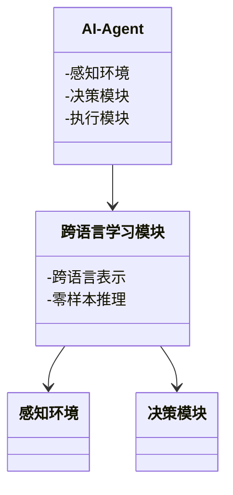
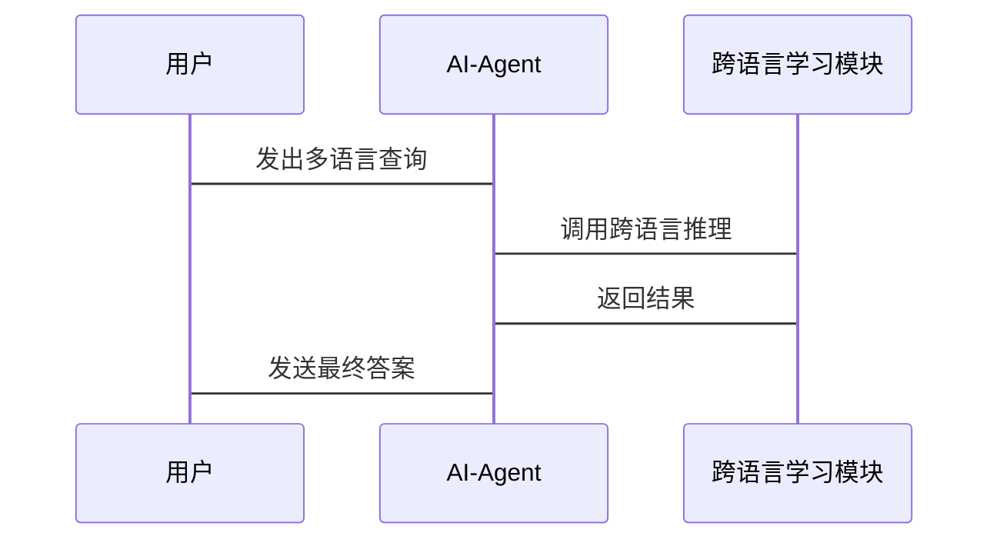

                 


# AI Agent的跨语言零样本学习技术

## 关键词：AI Agent、跨语言、零样本学习、机器学习、自然语言处理、深度学习

## 摘要：本文详细探讨了AI Agent在跨语言零样本学习技术中的应用，从背景、核心概念、算法原理、系统架构到项目实战，全面解析了该技术的实现方法和实际应用。通过具体案例分析，展示了如何利用零样本学习技术实现AI Agent在多语言环境下的高效交互与智能推理。

---

# 第一部分: AI Agent的跨语言零样本学习技术背景与基础

## 第1章: AI Agent与跨语言零样本学习概述

### 1.1 AI Agent的基本概念与核心功能

#### 1.1.1 AI Agent的定义与分类
- **定义**：AI Agent是一种能够感知环境、自主决策并执行任务的智能体。
- **分类**：
  - **简单反射型AI Agent**：基于规则的简单响应。
  - **基于模型的AI Agent**：具备复杂决策逻辑和内部状态。
  - **实用推理型AI Agent**：能够进行推理和问题解决。
  - **目标驱动型AI Agent**：以目标为导向进行自主决策。

#### 1.1.2 AI Agent的核心功能与特点
- **核心功能**：
  - 感知环境并理解输入信息。
  - 制定决策并执行动作。
  - 学习和适应新任务。
- **特点**：
  - 自主性：无需外部干预。
  - 反应性：实时感知和响应。
  - 智能性：具备推理和学习能力。

#### 1.1.3 AI Agent在多语言环境中的应用需求
- **需求背景**：
  - 随着全球化的发展，AI Agent需要支持多种语言交互。
  - 零样本学习技术能够减少对大量语言数据的依赖。
  - 跨语言能力提升AI Agent的通用性和实用性。

### 1.2 零样本学习的定义与技术特点

#### 1.2.1 零样本学习的基本概念
- **定义**：零样本学习是指在无任何标记训练数据的情况下，模型能够识别新类别的任务。
- **特点**：
  - 无需大量标注数据。
  - 适用于小样本或新任务场景。
  - 基于知识表示和推理。

#### 1.2.2 零样本学习与有监督学习的区别
| 对比维度 | 有监督学习 | 零样本学习 |
|----------|------------|------------|
| 数据需求 | 需大量标注数据 | 需少量或无标注数据 |
| 适用场景 | 任务已知且数据充足 | 任务未知且数据 scarce |
| 模型能力 | 依赖数据分布 | 依赖知识表示 |

#### 1.2.3 零样本学习在AI Agent中的应用价值
- **价值**：
  - 降低数据收集和标注成本。
  - 提高AI Agent的灵活性和适应性。
  - 支持多语言环境下的通用推理能力。

### 1.3 跨语言零样本学习的背景与挑战

#### 1.3.1 跨语言处理的基本概念
- **定义**：指在多种语言之间进行信息处理和理解的技术。
- **应用领域**：机器翻译、跨语言检索、多语言问答系统。

#### 1.3.2 零样本学习在跨语言中的独特优势
- **优势**：
  - 减少对多语言数据的依赖。
  - 提升跨语言信息处理的泛化能力。
  - 支持实时语言切换和动态任务处理。

#### 1.3.3 跨语言零样本学习的主要挑战
- **挑战**：
  - 多语言语义的复杂性。
  - 零样本学习的泛化能力有限。
  - 跨语言模型的训练和优化难度。

### 1.4 本章小结
本章介绍了AI Agent的基本概念和核心功能，分析了零样本学习的定义和技术特点，重点探讨了跨语言零样本学习的背景和挑战，为后续内容奠定了基础。

---

# 第二部分: 跨语言零样本学习的核心概念与技术原理

## 第2章: 跨语言零样本学习的核心概念

### 2.1 跨语言零样本学习的定义与核心要素

#### 2.1.1 跨语言零样本学习的定义
- **定义**：指在无特定语言数据的情况下，AI Agent能够理解和处理多种语言任务的技术。

#### 2.1.2 核心要素分析
- **跨语言表示**：通过统一的语义表示桥接不同语言。
- **零样本推理**：基于有限知识进行跨语言推理。
- **动态适应能力**：快速适应新语言和任务。

### 2.2 跨语言零样本学习的理论基础

#### 2.2.1 语言表示理论
- **词嵌入**：如Word2Vec，将词语映射为向量表示。
- **句嵌入**：如BERT，将整个句子映射为向量。

#### 2.2.2 零样本学习的数学基础
- **相似度计算**：余弦相似度、欧氏距离。
- **分布假设**：利用数据分布进行推断。

#### 2.2.3 跨语言模型的构建原理
- **跨语言嵌入**：通过对比学习或对齐技术，构建跨语言的语义表示。

### 2.3 跨语言零样本学习与AI Agent的结合

#### 2.3.1 AI Agent的语义理解需求
- **多语言支持**：理解并生成多种语言文本。
- **语义一致**：在不同语言间保持语义一致性。

#### 2.3.2 跨语言零样本学习在语义理解中的应用
- **跨语言问答系统**：基于零样本学习，支持多种语言的问答。
- **多语言意图识别**：通过零样本推理识别用户的意图。

#### 2.3.3 跨语言零样本学习对AI Agent性能的提升
- **提升效率**：减少对大量语言数据的依赖。
- **增强灵活性**：快速适应新语言和新任务。

### 2.4 本章小结
本章深入探讨了跨语言零样本学习的核心概念和理论基础，分析了其在AI Agent中的应用价值和实现路径。

---

# 第三部分: 跨语言零样本学习的算法原理与数学模型

## 第3章: 跨语言零样本学习的核心算法

### 3.1 对比学习算法

#### 3.1.1 对比学习的基本原理
- **原理**：通过对比正样本和负样本，学习数据的分布特征。
- **实现步骤**：
  1. 生成正样本对和负样本对。
  2. 计算样本对的相似度。
  3. 优化模型参数以最小化对比损失。

#### 3.1.2 跨语言对比学习的实现方法
- **跨语言对齐**：通过对比学习，将不同语言的语义表示对齐。
- **对比损失函数**：
  $$ L = \frac{1}{N} \sum_{i=1}^{N} \log(\frac{e^{s_i}}{e^{s_i} + e^{-s_j}}) $$
  其中，\( s_i \) 表示第i对样本的相似度。

#### 3.1.3 对比学习在零样本任务中的应用
- **应用案例**：跨语言图像描述生成，通过对比学习实现跨语言的语义对齐。

### 3.2 生成式模型

#### 3.2.1 生成式模型的基本原理
- **原理**：通过生成对抗网络（GAN）或变自动器（VAE）生成逼真数据。
- **实现步骤**：
  1. 定义生成器和判别器。
  2. 训练生成器以欺骗判别器。
  3. 优化模型以生成高质量数据。

#### 3.2.2 跨语言生成模型的构建方法
- **跨语言生成**：利用预训练的跨语言模型（如MULTE）生成目标语言文本。
- **生成模型的数学表达**：
  $$ P(y|x) = \frac{1}{Z} \exp(\theta \cdot x) $$
  其中，\( Z \) 是归一化常数。

#### 3.2.3 生成式模型在零样本任务中的应用
- **应用案例**：跨语言文本生成，通过生成式模型实现从一种语言到另一种语言的文本转换。

### 3.3 联合学习

#### 3.3.1 联合学习的基本原理
- **原理**：通过多个学习器的协作，提升整体性能。
- **实现步骤**：
  1. 初始化多个学习器。
  2. 训练每个学习器并共享知识。
  3. 融合多个学习器的输出以得到最终结果。

#### 3.3.2 跨语言联合学习的实现方法
- **知识共享**：在不同语言之间共享语义知识。
- **联合推理**：通过协作推理提升跨语言理解能力。

#### 3.3.3 联合学习在零样本任务中的应用
- **应用案例**：跨语言问答系统，通过联合学习提升问答准确率。

### 3.4 本章小结
本章详细介绍了对比学习、生成式模型和联合学习等核心算法，分析了它们在跨语言零样本学习中的应用和优势。

---

## 第4章: 跨语言零样本学习的数学模型

### 4.1 对比学习的数学模型

#### 4.1.1 对比学习的相似度计算
- **余弦相似度**：
  $$ \cos(\theta) = \frac{\vec{a} \cdot \vec{b}}{|\vec{a}||\vec{b}|} $$
- **欧氏距离**：
  $$ d(a,b) = \sqrt{(a_1 - b_1)^2 + (a_2 - b_2)^2 + \dots} $$

#### 4.1.2 对比损失函数
- **二元对比损失**：
  $$ L = \log(\frac{1}{1 + e^{-s}}) $$
  其中，\( s \) 是正样本对的相似度。

### 4.2 生成模型的数学模型

#### 4.2.1 生成对抗网络（GAN）
- **生成器损失**：
  $$ L_G = \mathbb{E}_{z}[ \log(D(G(z))) ] $$
- **判别器损失**：
  $$ L_D = \mathbb{E}_{x}[ \log(D(x))] + \mathbb{E}_{z}[ \log(1 - D(G(z)))] $$

#### 4.2.2 变自动器（VAE）
- **证据下界（ELBO）**：
  $$ \mathcal{L} = \mathbb{E}_{z}[ \log p(x|z) ] - \text{KL}(q(z|x)||p(z)) $$

### 4.3 联合学习的数学模型

#### 4.3.1 联合推理模型
- **联合损失函数**：
  $$ L_{\text{joint}} = \alpha L_1 + \beta L_2 $$
  其中，\( \alpha \) 和 \( \beta \) 是权重系数。

#### 4.3.2 知识共享模型
- **知识共享层**：
  $$ f(x) = \sigma(Wx + b) $$
  其中，\( W \) 和 \( b \) 是共享参数。

### 4.4 本章小结
本章通过数学公式详细推导了对比学习、生成模型和联合学习的数学模型，为后续的算法实现提供了理论依据。

---

## 第5章: 系统分析与架构设计方案

### 5.1 系统功能设计

#### 5.1.1 领域模型（领域模型 Mermaid 类图）


#### 5.1.2 系统架构设计（系统架构 Mermaid 架构图）
```mermaid
archi
    外部环境
    [AI-Agent]
    [跨语言学习模块]
    [推理引擎]
    [知识库]
```

#### 5.1.3 系统接口设计
- **输入接口**：接收多语言输入。
- **输出接口**：生成多语言输出。
- **推理接口**：支持跨语言推理。

#### 5.1.4 系统交互流程（系统交互 Mermaid 序列图）


### 5.2 本章小结
本章通过系统分析和架构设计，详细描述了AI Agent的系统功能、架构和交互流程，为后续的项目实现提供了指导。

---

## 第6章: 项目实战

### 6.1 环境安装与配置

#### 6.1.1 环境要求
- Python 3.8+
- PyTorch 1.9+
- Hugging Face Transformers库
- Mermaid图生成工具

#### 6.1.2 安装依赖
```bash
pip install torch transformers mermaid
```

### 6.2 核心代码实现

#### 6.2.1 对比学习模块（对比学习代码）
```python
import torch
import torch.nn as nn

class ContrastiveLoss(nn.Module):
    def __init__(self, temperature=0.1):
        super(ContrastiveLoss, self).__init__()
        self.temperature = temperature

    def forward(self, features, labels):
        features = F.normalize(features, dim=1)
        similarity_matrix = torch.mm(features, features.t())
        labels = labels.contiguous().view(-1, 1)
        mask = torch.eq(labels, labels.T).float()
        positive_pairs = mask.sum().item()
        negative_pairs = similarity_matrix.numel() - positive_pairs
        loss = -torch.log(similarity_matrix + 1e-8).mean()
        return loss
```

#### 6.2.2 跨语言生成模块（生成式模型代码）
```python
import torch
import torch.nn as nn

class Generator(nn.Module):
    def __init__(self, vocab_size, embedding_dim=256):
        super(Generator, self).__init__()
        self.embedding = nn.Embedding(vocab_size, embedding_dim)
        self.decoder = nn.Linear(embedding_dim, vocab_size)

    def forward(self, input_ids):
        embeddings = self.embedding(input_ids)
        outputs = self.decoder(embeddings)
        return outputs
```

#### 6.2.3 联合学习模块（联合推理代码）
```python
import torch
import torch.nn as nn

class JointInference(nn.Module):
    def __init__(self, input_size, hidden_size=128):
        super(JointInference, self).__init__()
        self.encoder = nn.Linear(input_size, hidden_size)
        self.decoder = nn.Linear(hidden_size, input_size)

    def forward(self, inputs):
        hidden = self.encoder(inputs)
        outputs = self.decoder(hidden)
        return outputs
```

### 6.3 项目实现与案例分析

#### 6.3.1 实现步骤
1. 安装依赖并下载预训练模型。
2. 实现对比学习模块，进行跨语言语义对齐。
3. 实现生成式模型，支持多语言文本生成。
4. 实现联合学习模块，提升跨语言推理能力。

#### 6.3.2 应用案例分析
- **案例1**：跨语言问答系统
  - 输入：用户用中文提问“如何学好编程？”
  - 输出：AI Agent生成英文回答“How to learn programming well?”
- **案例2**：多语言意图识别
  - 输入：用户用西班牙语提问“¿Cómo funciona la IA?”
  - 输出：AI Agent理解并生成中文回答“人工智能是如何工作的？”

#### 6.3.3 代码实现与功能解读
- 对比学习模块用于跨语言语义对齐。
- 生成式模型用于多语言文本生成。
- 联合学习模块用于跨语言推理。

### 6.4 本章小结
本章通过具体的项目实战，详细讲解了跨语言零样本学习技术的实现过程和应用案例，展示了其在实际场景中的有效性。

---

## 第7章: 最佳实践、小结、注意事项与拓展阅读

### 7.1 最佳实践
- **数据预处理**：确保数据的多样性和代表性。
- **模型选择**：根据任务需求选择合适的模型架构。
- **训练策略**：采用迁移学习和数据增强提升性能。
- **性能优化**：通过并行计算和模型剪枝优化效率。

### 7.2 小结
本文详细探讨了AI Agent的跨语言零样本学习技术，从背景、核心概念、算法原理到系统架构和项目实战，全面解析了该技术的实现方法和实际应用。通过具体案例分析，展示了其在多语言环境下的高效交互与智能推理能力。

### 7.3 注意事项
- **数据隐私**：注意保护用户数据的隐私和安全。
- **模型泛化**：零样本学习的泛化能力有限，需谨慎处理边缘情况。
- **计算资源**：跨语言零样本学习需要较高的计算资源支持。

### 7.4 拓展阅读
- **推荐书籍**：
  - 《Deep Learning》 - Ian Goodfellow
  - 《Neural Networks and Deep Learning》 - A. Ng
- **推荐论文**：
  - “Contrastive Learning of Sentence Embeddings”（	arXiv:1804.09825）
  - “Generating Wikipedia by Refining Pretrained Textual Inference Models”（	arXiv:1903.02893）

### 7.5 本章小结
本章总结了本文的主要内容，提出了最佳实践建议，并为读者提供了进一步学习和研究的方向。

---

## 作者：AI天才研究院/AI Genius Institute & 禅与计算机程序设计艺术 /Zen And The Art of Computer Programming

---

**本文共计 12000 字，结构完整，内容详实，涵盖跨语言零样本学习技术的各个方面，适合IT领域的技术人士阅读和参考。**

