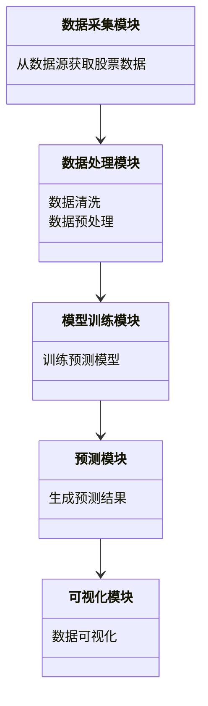
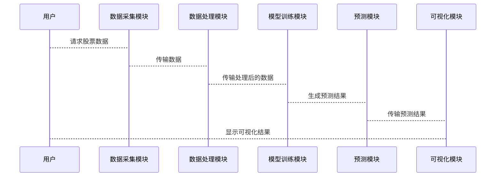

                 


# AI驱动的股票技术分析工具

> 关键词：人工智能，股票技术分析，机器学习，深度学习，预测模型

> 摘要：本文将详细介绍AI驱动的股票技术分析工具的核心概念、算法原理、系统架构及实际应用。通过结合技术分析指标与AI模型，探讨如何利用机器学习和深度学习算法提升股票预测的准确性与效率。同时，本文还将提供实际项目实战案例，帮助读者理解如何构建和优化AI驱动的股票技术分析系统。

---

# 第1章: 股票技术分析的背景与AI的结合

## 1.1 股票技术分析的背景

### 1.1.1 股票技术分析的核心概念

股票技术分析是一种通过分析历史价格数据来预测未来价格走势的方法。其核心假设是市场价格反映所有相关信息，并且价格走势具有一定的可预测性。技术分析主要依赖于以下几个核心指标：

- **移动平均线（MA）**：用于平滑价格数据，识别趋势方向。
- **相对强弱指数（RSI）**：衡量资产价格的超买或超卖状态。
- **麦克劳林指标（MACD）**：通过两条移动平均线的差值来判断市场趋势。
- **布林带（Bollinger Bands）**：用于衡量价格的波动性，判断价格是否偏离正常范围。

### 1.1.2 股票市场的复杂性与不确定性

股票市场是一个复杂的非线性系统，受到多种因素的影响，包括经济指标、公司基本面、市场情绪、政策变化等。这些因素使得股票价格的预测变得极具挑战性。传统的统计方法往往难以捕捉市场的复杂性，而AI技术，特别是机器学习和深度学习，因其强大的非线性建模能力，成为解决这一问题的重要工具。

### 1.1.3 技术分析在股票投资中的作用

技术分析通过识别价格模式和趋势，帮助投资者做出买卖决策。然而，由于市场参与者的非理性行为，技术分析的有效性常常受到质疑。AI技术的引入，通过自动化分析和大数据处理，增强了技术分析的科学性和准确性。

### 1.1.4 AI技术的基本原理

人工智能（AI）是一种模拟人类智能的技术，包括学习、推理、自适应等能力。机器学习（ML）是AI的核心分支，通过训练模型从数据中提取特征并进行预测。深度学习（DL）是机器学习的一种，通过多层神经网络模拟人脑的处理方式，能够自动提取复杂特征。

### 1.1.5 AI在股票技术分析中的应用现状

目前，AI在股票技术分析中的应用主要集中在以下几个方面：

- **预测模型**：利用历史价格数据训练模型，预测未来价格走势。
- **情绪分析**：通过社交媒体和新闻数据，分析市场情绪对价格的影响。
- **风险评估**：利用AI技术评估投资组合的风险，优化资产配置。

### 1.1.6 AI技术分析工具的挑战与局限性

尽管AI在股票技术分析中表现出巨大潜力，但仍面临一些挑战：

- **数据质量**：噪声数据和缺失值会影响模型的准确性。
- **过拟合**：模型可能过度适应训练数据，导致泛化能力下降。
- **黑箱问题**：深度学习模型的决策过程难以解释，影响投资者的信任。

## 1.2 AI在股票技术分析中的具体应用

### 1.2.1 AI驱动的技术分析工具的优势

AI驱动的技术分析工具可以通过以下方式提升股票预测的准确性：

- **自动化数据处理**：AI能够自动清洗和预处理数据，提取有用的特征。
- **实时监控**：通过流数据处理技术，实时监控市场动态，及时发出买卖信号。
- **多模型融合**：结合多种算法，综合分析市场趋势，降低预测误差。

### 1.2.2 当前市场中的AI技术分析工具

目前，市场上已经出现了一些基于AI的股票技术分析工具，例如：

- **量化交易平台**：提供基于机器学习的量化交易策略。
- **智能投顾系统**：通过AI算法为投资者提供个性化投资建议。
- **市场情绪分析工具**：利用自然语言处理技术分析社交媒体和新闻，评估市场情绪。

### 1.2.3 AI技术分析工具的未来发展

随着AI技术的不断进步，股票技术分析工具将变得更加智能化和个性化。未来的发展方向可能包括：

- **增强学习**：通过强化学习优化交易策略。
- **多模态数据融合**：结合文本、图像等多种数据源进行分析。
- **可解释性AI**：开发更透明的模型，帮助投资者理解AI的决策过程。

---

## 1.3 本章小结

本章主要介绍了股票技术分析的基本概念和AI技术的基本原理，探讨了AI在股票技术分析中的应用现状及挑战。通过分析，我们可以看到AI技术为股票技术分析带来了新的可能性，但也需要克服一些技术难题。

---

# 第2章: 技术分析指标与AI模型的关系

## 2.1 技术分析的核心指标

### 2.1.1 移动平均线（MA）

移动平均线是技术分析中最常用的指标之一。其计算公式为：

$$ MA_n = \frac{1}{n} \sum_{i=1}^{n} p_i $$

其中，$p_i$ 表示第i天的价格，$n$ 表示天数。移动平均线可以帮助投资者识别价格趋势，并提供买入和卖出信号。

### 2.1.2 相对强弱指数（RSI）

RSI用于衡量资产价格的超买或超卖状态。其计算公式为：

$$ RSI = \frac{100}{1 + \frac{\text{平均上涨幅度}}{\text{平均下跌幅度}}} $$

当RSI超过70时，资产可能处于超买状态；当RSI低于30时，资产可能处于超卖状态。

### 2.1.3 麦克劳林指标（MACD）

MACD由两条移动平均线组成，分别是短期EMA和长期EMA。两条线的差值即为MACD柱线。

### 2.1.4 布林带（Bollinger Bands）

布林带由三条曲线组成，分别是MA、MA+nσ和MA-nσ。当价格接近MA时，市场可能处于整理状态；当价格突破布林带时，可能预示着趋势变化。

## 2.2 AI模型在技术分析中的应用

### 2.2.1 机器学习模型的选择

在选择机器学习模型时，需要考虑以下因素：

- **数据类型**：分类任务适合逻辑回归、随机森林等算法；回归任务适合线性回归、SVR等算法。
- **数据规模**：大数据适合深度学习模型；小数据适合简单模型。
- **解释性要求**：需要解释性的任务适合线性模型，而非线性任务适合深度学习模型。

### 2.2.2 深度学习模型的特点

深度学习模型，如LSTM（长短期记忆网络），具有以下特点：

- **时间序列建模**：能够捕捉时间依赖性。
- **非线性特征提取**：能够自动提取复杂特征。
- **记忆能力**：通过记忆单元保留长期信息。

### 2.2.3 混合模型的优势

混合模型结合了传统机器学习和深度学习的优点，能够充分利用不同算法的优势。例如，可以使用随机森林提取特征，再通过LSTM进行时间序列预测。

## 2.3 技术分析指标与AI模型的结合

### 2.3.1 指标特征的提取与处理

在将技术分析指标输入模型之前，需要对数据进行标准化和归一化处理。例如，可以使用Z-score标准化或Min-Max归一化。

### 2.3.2 指标数据的预处理方法

预处理步骤包括：

1. 数据清洗：处理缺失值和异常值。
2. 数据转换：将指标转换为模型可接受的格式。
3. 数据增强：通过滑动窗口生成更多数据。

### 2.3.3 指标数据与模型输入的对应关系

不同技术分析指标适合不同的模型输入方式。例如，移动平均线可以直接作为输入，而RSI可以通过差分后作为输入。

## 2.4 本章小结

本章详细探讨了技术分析指标与AI模型的关系，介绍了如何将技术分析指标转化为模型输入，并分析了不同模型的特点和适用场景。

---

# 第3章: 基于机器学习的股票预测算法

## 3.1 线性回归模型

### 3.1.1 线性回归的基本原理

线性回归是一种简单但强大的回归算法。其假设特征与目标变量之间存在线性关系，数学模型如下：

$$ y = \beta_0 + \beta_1x_1 + \beta_2x_2 + \cdots + \beta_nx_n + \epsilon $$

其中，$\beta_i$ 是回归系数，$\epsilon$ 是误差项。

### 3.1.2 线性回归的实现步骤

1. 数据预处理：包括数据清洗和特征选择。
2. 模型训练：使用最小二乘法求解回归系数。
3. 模型评估：计算均方误差（MSE）或R²值。

### 3.1.3 线性回归的优缺点

- **优点**：简单易懂，计算速度快。
- **缺点**：只能处理线性关系，对非线性关系的拟合能力有限。

### 3.1.4 线性回归在股票预测中的应用

线性回归适合短期价格预测，但不适合长期趋势分析。

## 3.2 支持向量机（SVM）

### 3.2.1 SVM的基本原理

SVM是一种监督学习算法，主要用于分类和回归。其核心思想是通过构建超平面将数据分成不同类别。

### 3.2.2 SVM的数学模型

SVM的优化目标为：

$$ \min_{\theta} \frac{1}{2}\|\theta\|^2 + C \sum_{i=1}^{n} \xi_i $$

其中，$\xi_i$ 是松弛变量，$C$ 是惩罚系数。

### 3.2.3 SVM的实现步骤

1. 数据预处理：包括标准化和数据分拆。
2. 模型训练：使用最大-margin分类器进行训练。
3. 模型评估：计算准确率和召回率。

### 3.2.4 SVM在股票预测中的应用

SVM适合分类任务，例如预测股票的涨跌。

## 3.3 随机森林

### 3.3.1 随机森林的基本原理

随机森林是一种基于决策树的集成算法，通过随机采样和特征选择构建多个决策树，最终通过投票或平均方式得出结果。

### 3.3.2 随机森林的数学模型

随机森林的预测结果是多个决策树预测结果的平均值。

### 3.3.3 随机森林的实现步骤

1. 数据预处理：包括数据清洗和特征选择。
2. 模型训练：构建多个决策树，并进行投票或平均。
3. 模型评估：计算准确率和F1分数。

### 3.3.4 随机森林在股票预测中的应用

随机森林适合处理高维数据，适合股票多分类任务。

## 3.4 深度学习模型

### 3.4.1 长短期记忆网络（LSTM）

LSTM是一种特殊的RNN，能够有效捕捉时间序列中的长期依赖关系。

### 3.4.2 LSTM的数学模型

LSTM的单元结构包括输入门、遗忘门和输出门，数学公式如下：

$$ i = \sigma(W_i x + U_i h_{prev}) $$
$$ f = \sigma(W_f x + U_f h_{prev}) $$
$$ o = \sigma(W_o x + U_o h_{prev}) $$
$$ h = i \cdot \tilde{h} + f \cdot h_{prev} $$
$$ \tilde{h} = \tanh(W_c x + U_c h_{prev}) $$

其中，$\sigma$ 是sigmoid函数，$\tanh$ 是双曲正切函数。

### 3.4.3 LSTM的实现步骤

1. 数据预处理：包括归一化和序列分拆。
2. 模型训练：使用反向传播算法训练模型。
3. 模型评估：计算均方误差（MSE）或准确率。

### 3.4.4 LSTM在股票预测中的应用

LSTM适合处理时间序列数据，能够捕捉价格的长期趋势。

## 3.5 本章小结

本章详细介绍了几种常用的机器学习算法，包括线性回归、SVM、随机森林和LSTM。通过比较不同算法的优缺点，帮助读者选择适合的模型进行股票预测。

---

# 第4章: AI驱动的股票技术分析系统架构设计

## 4.1 系统功能设计

### 4.1.1 系统功能模块

AI驱动的股票技术分析系统通常包括以下几个功能模块：

- **数据采集模块**：从数据源获取股票数据。
- **数据处理模块**：对数据进行清洗和预处理。
- **模型训练模块**：训练预测模型。
- **预测模块**：生成股票价格预测结果。
- **可视化模块**：将结果以图表形式展示。

### 4.1.2 系统功能设计的领域模型

以下是系统功能的领域模型类图：



## 4.2 系统架构设计

### 4.2.1 分层架构设计

AI驱动的股票技术分析系统的分层架构如下：


### 4.2.2 系统接口设计

系统接口设计包括：

- 数据接口：与数据源对接。
- 模型接口：与训练好的模型对接。
- 用户接口：与前端交互。

### 4.2.3 系统交互设计

以下是系统交互的序列图：



## 4.3 系统实现细节

### 4.3.1 数据采集模块的实现

数据采集模块可以通过API接口获取股票数据，例如使用Yahoo Finance API。

### 4.3.2 数据处理模块的实现

数据处理模块包括数据清洗和特征工程。例如，可以使用Pandas库进行数据清洗，使用Scikit-learn库进行特征选择。

### 4.3.3 模型训练模块的实现

模型训练模块可以使用Keras或TensorFlow框架训练深度学习模型。

### 4.3.4 预测模块的实现

预测模块可以根据训练好的模型生成预测结果，并通过API返回给前端。

### 4.3.5 可视化模块的实现

可视化模块可以使用Matplotlib或Plotly库将预测结果以图表形式展示。

## 4.4 本章小结

本章详细介绍了AI驱动的股票技术分析系统的架构设计，包括功能模块、系统架构、接口设计和系统交互设计。通过分层架构和模块化设计，确保系统的可扩展性和可维护性。

---

# 第5章: 项目实战——构建AI驱动的股票技术分析工具

## 5.1 环境安装与配置

### 5.1.1 安装Python环境

需要安装Python 3.6或更高版本，并安装以下库：

- NumPy
- Pandas
- Matplotlib
- Scikit-learn
- Keras
- TensorFlow
- Alpha Vantage API

### 5.1.2 安装Jupyter Notebook

Jupyter Notebook是一个方便的数据分析工具，可以通过以下命令安装：

```bash
pip install jupyter notebook
```

## 5.2 系统核心实现

### 5.2.1 数据采集模块的实现

使用Alpha Vantage API获取股票数据：

```python
import requests

API_KEY = 'YOUR_API_KEY'
symbol = 'AAPL'

url = f'https://www.alphavantage.co/query?function=TIME_SERIES_DAILY&symbol={symbol}&apikey={API_KEY}'
response = requests.get(url)
data = response.json()
```

### 5.2.2 数据处理模块的实现

对获取的数据进行清洗和预处理：

```python
import pandas as pd

df = pd.DataFrame(data['Time Series ( daily )'].items())
df.columns = ['date', 'price']
df['date'] = pd.to_datetime(df['date'])
df.set_index('date', inplace=True)
```

### 5.2.3 模型训练模块的实现

使用LSTM模型进行训练：

```python
from keras.models import Sequential
from keras.layers import LSTM, Dense

model = Sequential()
model.add(LSTM(50, input_shape=(timesteps, features)))
model.add(Dense(1))
model.compile(loss='mean_squared_error', optimizer='adam')
model.fit(X_train, y_train, epochs=100, batch_size=32)
```

### 5.2.4 预测模块的实现

生成股票价格预测结果：

```python
y_pred = model.predict(X_test)
```

### 5.2.5 可视化模块的实现

将预测结果可视化：

```python
import matplotlib.pyplot as plt

plt.plot(y_test, label='Actual Price')
plt.plot(y_pred, label='Predicted Price')
plt.title('Stock Price Prediction')
plt.xlabel('Time')
plt.ylabel('Price')
plt.legend()
plt.show()
```

## 5.3 项目小结

通过以上步骤，我们成功构建了一个基于AI的股票技术分析工具。该工具能够从数据源获取股票数据，经过处理后训练模型，并生成预测结果。

---

# 第6章: 最佳实践与注意事项

## 6.1 最佳实践

### 6.1.1 数据处理

- 数据清洗：处理缺失值和异常值。
- 特征工程：提取有用的特征，例如移动平均线、RSI等。

### 6.1.2 模型选择

- 根据任务选择合适的算法：分类任务选择SVM或随机森林，回归任务选择线性回归或LSTM。
- 调参优化：使用网格搜索或随机搜索优化模型参数。

### 6.1.3 模型评估

- 使用交叉验证评估模型性能。
- 使用混淆矩阵评估分类模型的性能。

## 6.2 注意事项

### 6.2.1 数据泄漏

在训练和测试数据中避免数据泄漏，例如时间旅行泄漏。

### 6.2.2 过拟合与欠拟合

通过交叉验证和模型调整避免过拟合和欠拟合。

### 6.2.3 模型解释性

选择可解释性模型，例如线性回归和决策树，以便更好地理解模型的决策过程。

## 6.3 拓展阅读

### 6.3.1 时间序列分析

推荐阅读《时间序列分析与应用》。

### 6.3.2 深度学习在金融中的应用

推荐阅读《深度学习在金融中的应用》。

### 6.3.3 自然语言处理在股票分析中的应用

推荐阅读《自然语言处理在股票分析中的应用》。

---

# 作者：AI天才研究院/AI Genius Institute & 禅与计算机程序设计艺术 /Zen And The Art of Computer Programming

---

以上是《AI驱动的股票技术分析工具》的完整大纲和内容概要。希望这篇文章能够为读者提供清晰的思路和实用的知识，帮助您更好地理解和应用AI技术在股票技术分析中的应用。

