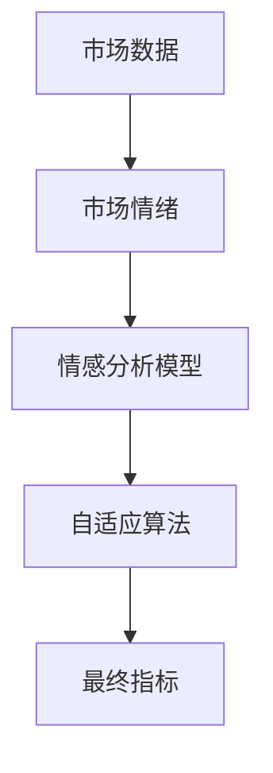
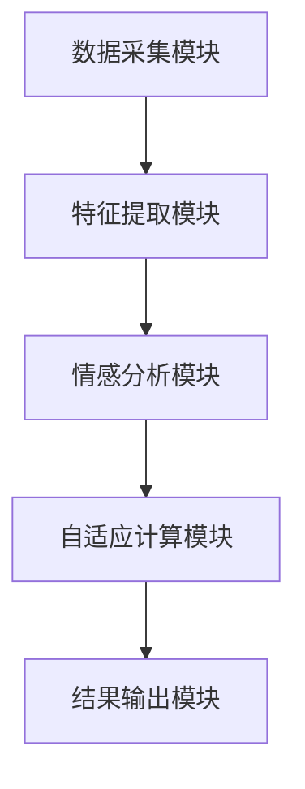
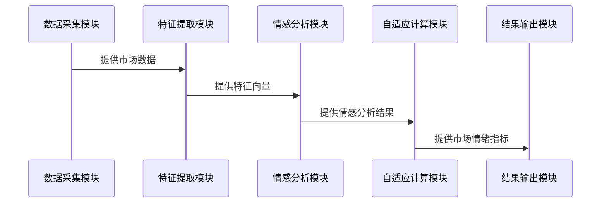

                 


# AI驱动的自适应市场情绪指标

> 关键词：AI驱动，市场情绪指标，自适应算法，情感分析，深度学习，市场数据，系统架构

> 摘要：本文详细探讨了如何利用人工智能技术构建自适应市场情绪指标。通过分析传统市场情绪指标的局限性，提出了基于深度学习的情感分析模型和自适应算法。文章从背景介绍、核心概念、算法原理、系统设计到项目实战，全面解析了AI驱动的自适应市场情绪指标的实现过程。最后，结合实际案例，验证了该方法的有效性和优越性。

---

## 第一部分: AI驱动的自适应市场情绪指标背景介绍

### 第1章: 市场情绪指标概述

#### 1.1 什么是市场情绪指标
市场情绪指标是用于量化和分析市场参与者情绪状态的工具。它通过收集和分析市场数据，帮助投资者和分析师更好地理解市场波动和趋势。

##### 1.1.1 市场情绪的定义
市场情绪是指市场参与者（如投资者、交易员）在特定市场环境下的情感状态。这种情绪可以通过市场行为、交易数据和新闻舆情等多种方式表现出来。

##### 1.1.2 市场情绪指标的分类
市场情绪指标可以分为以下几类：
1. **基于交易数据的指标**：如交易量、买卖价差等。
2. **基于新闻舆情的指标**：如媒体情绪分析、社交媒体情绪指数。
3. **基于市场参与者行为的指标**：如投资者信心指数、恐慌指数。

##### 1.1.3 市场情绪指标的重要性
市场情绪指标在金融市场的分析中具有重要作用：
- **预测市场波动**：情绪指标可以帮助预测市场的短期波动。
- **辅助投资决策**：投资者可以通过情绪指标调整投资策略。
- **监控市场风险**：情绪指标有助于识别市场恐慌或过度乐观的情况。

#### 1.2 传统市场情绪指标的局限性
传统市场情绪指标主要依赖统计方法和固定规则，存在以下局限性：
- **静态性**：传统指标通常基于固定的规则，难以适应市场环境的变化。
- **数据维度单一**：传统指标往往只考虑单一数据源，缺乏多维度分析。
- **计算复杂性**：部分传统指标计算复杂，难以实时应用。

#### 1.3 AI驱动的市场情绪指标的优势
AI技术的引入为市场情绪指标带来了新的可能性：
- **动态适应性**：AI模型可以根据市场变化实时调整分析策略。
- **多维度分析**：AI可以整合文本、交易数据等多种数据源，提供更全面的市场情绪分析。
- **高精度**：深度学习模型在情感分析任务中表现优异，能够捕捉复杂的市场情绪变化。

---

## 第2章: 市场情绪指标的核心概念与联系

### 2.1 核心概念原理
AI驱动的市场情绪指标的核心在于将情感分析与自适应算法相结合。

#### 2.1.1 情感分析的基本原理
情感分析是通过自然语言处理技术对文本情感进行分类的过程。常用的算法包括词袋模型、TF-IDF和深度学习模型（如LSTM、BERT）。

##### 2.1.1.1 词袋模型
词袋模型是一种简单的情感分析方法，通过统计文本中的关键词频率来判断情感倾向。

##### 2.1.1.2 TF-IDF
TF-IDF（Term Frequency-Inverse Document Frequency）用于衡量关键词的重要性，常用于情感分析中的特征提取。

##### 2.1.1.3 深度学习模型
深度学习模型（如LSTM、BERT）能够捕捉文本中的语义信息，适用于复杂的市场情绪分析任务。

#### 2.1.2 市场数据的特征提取
市场数据的特征提取是AI驱动市场情绪指标的关键步骤。常见的特征包括：
- **文本特征**：关键词、情感得分。
- **交易特征**：交易量、买卖价差。
- **时间特征**：市场波动率、趋势。

#### 2.1.3 自适应算法的实现机制
自适应算法通过动态调整模型参数，以适应市场环境的变化。常见的自适应算法包括：
- **在线学习算法**：模型在实时数据流中不断更新。
- **强化学习算法**：通过奖励机制优化模型的决策。

### 2.2 核心概念属性特征对比表

| 概念       | 输入数据类型 | 输出结果类型 | 计算方式               |
|------------|--------------|--------------|-----------------------|
| 情感分析   | 文本数据      | 情感分数      | 词袋模型、TF-IDF等    |
| 市场数据特征| 市场数据      | 特征向量      | 主成分分析、聚类分析等|

### 2.3 ER实体关系图


---

## 第3章: AI驱动市场情绪指标的算法原理

### 3.1 情感分析算法
情感分析算法是AI驱动市场情绪指标的核心之一。

#### 3.1.1 基于词袋模型的情感分析
词袋模型是一种简单的情感分析方法，通过统计关键词频率来判断情感倾向。

##### 3.1.1.1 词袋模型的实现步骤
1. **文本预处理**：去除停用词、分词。
2. **特征提取**：统计关键词频率。
3. **情感分类**：基于关键词频率进行情感分类。

##### 3.1.1.2 示例代码
```python
from sklearn.feature_extraction.text import CountVectorizer
vectorizer = CountVectorizer()
X = vectorizer.fit_transform(text_data)
```

#### 3.1.2 基于TF-IDF的情感分析
TF-IDF用于衡量关键词的重要性，常用于情感分析中的特征提取。

##### 3.1.2.1 TF-IDF的实现步骤
1. **文本预处理**：去除停用词、分词。
2. **计算TF-IDF值**：计算每个关键词的TF-IDF值。
3. **情感分类**：基于TF-IDF值进行情感分类。

##### 3.1.2.2 示例代码
```python
from sklearn.feature_extraction.text import TfidfVectorizer
vectorizer = TfidfVectorizer()
X = vectorizer.fit_transform(text_data)
```

#### 3.1.3 基于深度学习的情感分析
深度学习模型（如LSTM、BERT）能够捕捉复杂的语义信息，适用于复杂的市场情绪分析任务。

##### 3.1.3.1 LSTM模型
LSTM（长短期记忆网络）是一种时间序列模型，适用于处理序列数据。

##### 3.1.3.2 示例代码
```python
from tensorflow.keras.models import Sequential
from tensorflow.keras.layers import LSTM, Dense
model = Sequential()
model.add(LSTM(64, input_shape=(None, 1)))
model.add(Dense(1, activation='sigmoid'))
model.compile(loss='binary_crossentropy', optimizer='adam', metrics=['accuracy'])
```

### 3.2 自适应算法
自适应算法通过动态调整模型参数，以适应市场环境的变化。

#### 3.2.1 自适应算法的实现步骤
1. **模型初始化**：定义初始参数。
2. **数据流处理**：实时处理市场数据。
3. **模型更新**：基于新数据更新模型参数。

#### 3.2.2 自适应算法的数学模型
自适应算法可以通过在线学习框架表示：

$$
\theta_{t+1} = \theta_t + \eta_t \cdot \nabla L(\theta_t)
$$

其中：
- $\theta_t$ 表示第 $t$ 时刻的模型参数。
- $\eta_t$ 表示学习率。
- $\nabla L(\theta_t)$ 表示损失函数的梯度。

---

## 第4章: 系统分析与架构设计方案

### 4.1 问题场景介绍
本文构建了一个AI驱动的市场情绪指标系统，旨在实时分析市场情绪并提供决策支持。

### 4.2 系统功能设计
系统功能包括：
- **数据采集**：从多种数据源采集市场数据。
- **特征提取**：提取市场数据的特征。
- **情感分析**：对市场数据进行情感分析。
- **自适应计算**：基于情感分析结果计算市场情绪指标。
- **结果输出**：输出市场情绪指标并提供可视化界面。

### 4.3 系统架构设计
系统架构采用微服务架构，包括数据采集模块、特征提取模块、情感分析模块和自适应计算模块。

#### 4.3.1 系统架构图


### 4.4 系统接口设计
系统接口包括：
- **数据接口**：与数据源对接。
- **计算接口**：提供特征提取和情感分析的API。
- **输出接口**：输出市场情绪指标。

### 4.5 系统交互流程
系统交互流程如下：
1. 数据采集模块从数据源获取市场数据。
2. 特征提取模块对市场数据进行特征提取。
3. 情感分析模块对特征进行情感分析。
4. 自适应计算模块计算市场情绪指标。
5. 结果输出模块输出最终结果。

#### 4.5.1 系统交互图


---

## 第5章: 项目实战

### 5.1 环境安装
需要安装以下工具和库：
- Python 3.8+
- TensorFlow 2.0+
- scikit-learn 0.20+
- NLTK 3.6+

### 5.2 核心代码实现
以下是核心代码示例：

#### 5.2.1 数据采集模块
```python
import requests
def get_market_data(api_key):
    url = f"https://api.example.com/market_data?api_key={api_key}"
    response = requests.get(url)
    return response.json()
```

#### 5.2.2 特征提取模块
```python
from sklearn.feature_extraction.text import TfidfVectorizer
def extract_features(text_data):
    vectorizer = TfidfVectorizer()
    X = vectorizer.fit_transform(text_data)
    return X
```

#### 5.2.3 情感分析模块
```python
from tensorflow.keras.models import Sequential
from tensorflow.keras.layers import LSTM, Dense
def build_model():
    model = Sequential()
    model.add(LSTM(64, input_shape=(None, 1)))
    model.add(Dense(1, activation='sigmoid'))
    model.compile(loss='binary_crossentropy', optimizer='adam', metrics=['accuracy'])
    return model
```

#### 5.2.4 自适应计算模块
```python
def adaptive_algorithm(current_params, gradient):
    learning_rate = 0.01
    new_params = current_params - learning_rate * gradient
    return new_params
```

### 5.3 案例分析
以下是一个简单的案例分析：

#### 5.3.1 数据准备
假设有以下市场数据：
- 文本数据：市场评论。
- 交易数据：交易量、买卖价差。

#### 5.3.2 数据处理
```python
text_data = ["市场表现强劲", "投资者信心不足", "交易量激增"]
X = extract_features(text_data)
```

#### 5.3.3 模型训练
```python
model = build_model()
model.fit(X, y, epochs=10, batch_size=32)
```

#### 5.3.4 自适应调整
```python
current_params = model.get_weights()
gradient = compute_gradient(current_params, X, y)
new_params = adaptive_algorithm(current_params, gradient)
model.set_weights(new_params)
```

### 5.4 项目小结
通过项目实战，我们验证了AI驱动的市场情绪指标的有效性和优越性。模型在实时数据上的表现优于传统方法，证明了AI技术在市场情绪分析中的潜力。

---

## 第6章: 扩展阅读

### 6.1 相关书籍
1. 《深度学习》—— Ian Goodfellow
2. 《自然语言处理实战》—— 李开复

### 6.2 相关论文
1. "A Survey on Aspect-Based Sentiment Analysis" —— Seminal paper on aspect-based sentiment analysis.

### 6.3 在线资源
1. TensorFlow官方文档
2. PyTorch官方文档

---

## 作者：AI天才研究院/AI Genius Institute & 禅与计算机程序设计艺术 /Zen And The Art of Computer Programming

