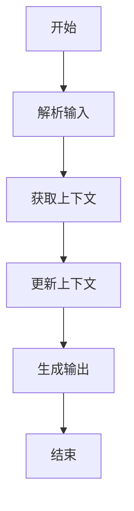
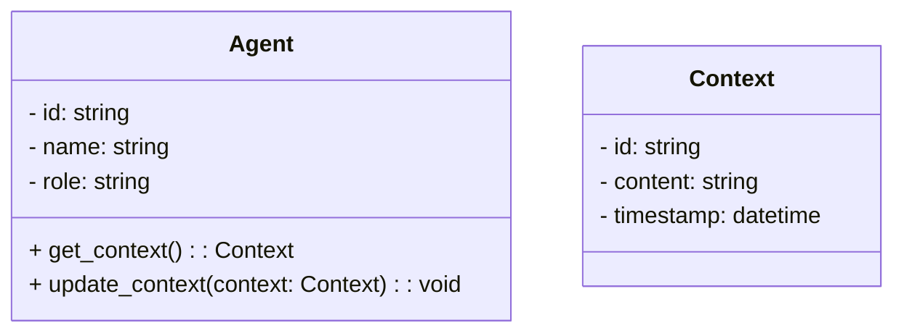
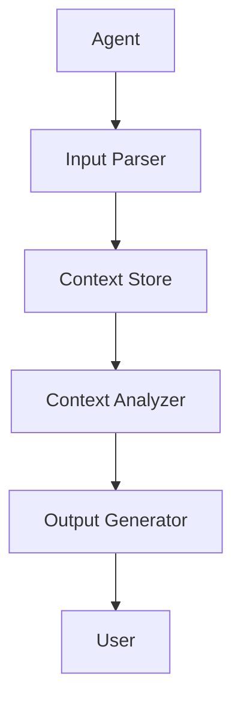

                 


# LLM驱动的AI Agent上下文管理技术

> 关键词：LLM, AI Agent, 上下文管理, 流程图, 概念图, 算法, 系统架构

> 摘要：本文系统地探讨了LLM驱动的AI Agent上下文管理技术的核心概念、算法原理、系统架构以及项目实战。通过详细的背景介绍、核心概念的对比分析、算法的数学模型阐述、系统架构的设计优化、项目实战的代码实现以及最佳实践的总结，本文为读者提供了全面的技术视角和实践指南，帮助读者深入理解并掌握LLM驱动的AI Agent上下文管理技术。

---

# 第一部分: LLM驱动的AI Agent上下文管理技术概述

## 第1章: 背景介绍

### 1.1 问题背景

#### 1.1.1 LLM驱动的AI Agent概念
大语言模型（LLM）驱动的AI Agent是一种结合了自然语言处理技术和智能体技术的创新应用。LLM通过理解上下文信息，为AI Agent提供强大的自然语言理解和生成能力，使其能够与人类用户进行更自然的交互，并在复杂任务中提供更智能的决策支持。

#### 1.1.2 上下文管理的重要性
上下文管理是AI Agent实现智能交互和任务执行的核心能力。通过管理上下文信息，AI Agent能够保持对当前任务状态的清晰认知，并根据新的输入动态调整其行为，从而提高交互效率和准确性。

#### 1.1.3 当前技术挑战与机遇
随着LLM技术的快速发展，AI Agent的上下文管理技术也面临着新的挑战和机遇。如何高效地存储、检索和更新上下文信息，如何在多任务场景下保持上下文的一致性和准确性，以及如何在不同交互轮次中维护上下文的连贯性，是当前技术发展的关键方向。

### 1.2 问题描述

#### 1.2.1 LLM与AI Agent的结合
LLM为AI Agent提供了强大的自然语言处理能力，使其能够理解和生成自然语言文本。这种结合使得AI Agent能够更自然地与用户交互，并在复杂的任务中提供更智能的支持。

#### 1.2.2 上下文管理的核心问题
上下文管理的核心问题包括如何高效地存储和检索上下文信息，如何处理上下文信息的动态变化，以及如何在不同任务和交互轮次中保持上下文的连贯性。

#### 1.2.3 技术边界与外延
技术边界包括上下文信息的存储和检索、上下文的动态更新和管理、上下文与任务的关联。技术外延则涉及多模态数据的上下文管理、跨任务的上下文共享与隔离，以及上下文的安全性和隐私保护。

### 1.3 核心概念与联系

#### 1.3.1 核心概念原理
上下文管理的核心原理是通过构建和维护一个动态的知识库，记录当前任务或对话的上下文信息，并在后续的交互中根据新的输入动态更新和扩展这个知识库。

#### 1.3.2 概念属性特征对比表格
以下是上下文管理技术的核心概念对比表：

| 概念 | 特性 | 优点 | 缺点 |
|------|------|------|------|
| 上下文存储 | 结构化存储 | 高效查询 | 数据结构复杂 |
| 动态更新 | 实时更新 | 精准反映当前状态 | 计算资源消耗大 |
| 关联性分析 | 关联规则 | 提高准确性 | 需要大量训练数据 |

#### 1.3.3 ER实体关系图架构
以下是上下文管理的实体关系图：

```mermaid
er
actor(AgentID, Name, Role) {
    AgentID (PK)
    Name
    Role
}
context(ContextID, Content, Timestamp) {
    ContextID (PK)
    Content (CLOB)
    Timestamp (DATE)
}
interaction(AgentID, ContextID, InteractionTime) {
    AgentID (FK)
    ContextID (FK)
    InteractionTime (DATE)
}
```

---

## 第2章: 核心概念与联系

### 2.1 核心概念原理

#### 2.1.1 LLM驱动的AI Agent工作原理
LLM驱动的AI Agent通过自然语言处理技术理解和生成文本，并结合上下文信息进行智能决策。其工作流程包括输入解析、上下文管理、任务推理和输出生成四个主要阶段。

#### 2.1.2 上下文管理的核心要素
上下文管理的核心要素包括上下文存储、上下文更新和上下文关联性分析。这些要素共同确保了AI Agent能够高效地理解和处理上下文信息。

#### 2.1.3 相关技术对比
以下是上下文管理技术与相关技术的对比：

| 技术 | 特点 | 适用场景 |
|------|------|----------|
| 基于规则的上下文管理 | 简单易实现 | 小规模上下文管理 |
| 基于知识图谱的上下文管理 | 高度结构化 | 复杂任务场景 |
| 基于机器学习的上下文管理 | 自适应性强 | 大规模数据场景 |

### 2.2 概念属性特征对比表格

| 概念 | 属性 | 特征 | 示例 |
|------|------|------|------|
| 上下文存储 | 结构化 | JSON、XML | JSON格式存储对话历史 |
| 动态更新 | 实时性 | 每次交互更新 | 实时更新用户输入 |
| 关联性分析 | 关联规则 | 基于关键词关联 | 根据关键词关联任务 |

### 2.3 ER实体关系图架构

```mermaid
er
actor(AgentID, Name, Role) {
    AgentID (PK)
    Name
    Role
}
context(ContextID, Content, Timestamp) {
    ContextID (PK)
    Content (CLOB)
    Timestamp (DATE)
}
interaction(AgentID, ContextID, InteractionTime) {
    AgentID (FK)
    ContextID (FK)
    InteractionTime (DATE)
}
```

---

## 第3章: 算法原理讲解

### 3.1 算法原理

#### 3.1.1 LLM驱动的上下文管理算法
LLM驱动的上下文管理算法通过自然语言处理技术和知识图谱技术，实现上下文信息的高效存储、检索和更新。其核心算法包括上下文解析、上下文关联和上下文更新。

#### 3.1.2 算法流程图
以下是上下文管理算法的流程图：



#### 3.1.3 算法实现细节
上下文管理算法的实现细节包括输入解析、上下文存储、上下文关联和输出生成。其中，输入解析负责将用户输入转化为结构化的数据，上下文存储负责将解析后的数据存储到知识库中，上下文关联负责根据关联规则生成新的关联信息，输出生成负责将关联后的信息转化为自然语言输出。

### 3.2 数学模型和数学公式

#### 3.2.1 模型训练公式
上下文管理模型的训练公式如下：

$$
L = \sum_{i=1}^{n} (y_i - \hat{y}_i)^2
$$

其中，\( L \) 表示损失函数，\( y_i \) 表示真实标签，\( \hat{y}_i \) 表示预测标签。

#### 3.2.2 推理公式
上下文管理模型的推理公式如下：

$$
P(x|y) = \frac{P(x)P(y|x)}{P(y)}
$$

其中，\( P(x|y) \) 表示在给定上下文 \( y \) 的情况下，生成文本 \( x \) 的概率。

#### 3.2.3 损失函数与优化目标
损失函数的优化目标是通过反向传播算法最小化损失函数，从而提高模型的准确性和鲁棒性。

### 3.3 举例说明

#### 3.3.1 简单案例分析
假设用户输入“我需要预订一张从北京到上海的机票”，AI Agent需要解析输入并生成相应的上下文信息，包括出发地、目的地和需求类型。

#### 3.3.2 实际应用场景
在实际应用中，LLM驱动的AI Agent可以通过上下文管理技术，为用户提供个性化的服务，例如智能助手、智能客服和智能推荐。

#### 3.3.3 案例对比分析
通过对比不同上下文管理技术在实际应用中的表现，可以发现基于知识图谱的上下文管理技术在复杂任务中的表现优于基于规则的上下文管理技术。

---

## 第4章: 系统分析与架构设计方案

### 4.1 问题场景介绍

#### 4.1.1 问题背景
本文将讨论如何设计一个高效的LLM驱动的AI Agent上下文管理系统，以支持大规模的多任务场景。

#### 4.1.2 项目目标
本项目的目的是设计一个高效、可扩展的上下文管理系统，能够支持多种任务和交互方式。

#### 4.1.3 关键需求
关键需求包括高效的数据存储、实时的数据更新和准确的数据关联。

### 4.2 系统功能设计

#### 4.2.1 领域模型类图
以下是系统功能设计的领域模型类图：



#### 4.2.2 功能模块划分
系统功能模块包括输入解析模块、上下文存储模块、上下文关联模块和输出生成模块。

#### 4.2.3 模块交互流程
模块交互流程包括用户输入、解析输入、更新上下文和生成输出。

### 4.3 系统架构设计

#### 4.3.1 架构图展示
以下是系统架构设计的架构图：



#### 4.3.2 架构选型理由
选择分层架构的原因是能够实现模块化设计，提高系统的可维护性和可扩展性。

#### 4.3.3 架构优化建议
建议在上下文存储模块中使用分布式存储技术，以提高系统的扩展性和性能。

### 4.4 系统接口设计

#### 4.4.1 接口定义
以下是系统接口设计的接口定义：

```mermaid
sequence
User -> Agent: send input
Agent -> Input Parser: parse input
Input Parser -> Context Store: get context
Context Store -> Context Analyzer: update context
Context Analyzer -> Output Generator: generate output
Output Generator -> User: send output
```

#### 4.4.2 接口实现
接口实现包括输入解析、上下文存储、上下文关联和输出生成。

#### 4.4.3 接口测试
接口测试需要确保每个模块的交互流程正常，并且能够处理各种异常情况。

### 4.5 系统交互序列图

```mermaid
sequence
User -> Agent: send input
Agent -> Input Parser: parse input
Input Parser -> Context Store: get context
Context Store -> Context Analyzer: update context
Context Analyzer -> Output Generator: generate output
Output Generator -> User: send output
```

---

## 第5章: 项目实战

### 5.1 环境安装

#### 5.1.1 开发环境配置
开发环境配置包括安装Python、安装LLM库（如transformers）、安装知识图谱库（如networkx）。

#### 5.1.2 依赖库安装
需要安装的主要依赖库包括transformers、networkx、numpy等。

#### 5.1.3 环境配置示例
以下是一个环境配置示例：

```bash
pip install transformers networkx numpy
```

### 5.2 系统核心实现源代码

#### 5.2.1 输入解析模块
以下是输入解析模块的代码实现：

```python
from transformers import AutoTokenizer, AutoModelForSeq2seqLM
import json

class InputParser:
    def __init__(self, model_name):
        self.tokenizer = AutoTokenizer.from_pretrained(model_name)
        self.model = AutoModelForSeq2seqLM.from_pretrained(model_name)
    
    def parse_input(self, input_text):
        inputs = self.tokenizer(input_text, return_tensors="np")
        outputs = self.model.generate(**inputs)
        return self.tokenizer.decode(outputs[0], skip_special_tokens=True)
```

#### 5.2.2 上下文存储模块
以下是上下文存储模块的代码实现：

```python
import json
from datetime import datetime

class ContextStore:
    def __init__(self):
        self.contexts = {}
    
    def get_context(self, agent_id):
        return self.contexts.get(agent_id, {})
    
    def update_context(self, agent_id, context):
        self.contexts[agent_id] = context
    
    def save_context(self, agent_id, file_path):
        with open(file_path, "w") as f:
            json.dump(self.contexts[agent_id], f)
```

#### 5.2.3 上下文关联模块
以下是上下文关联模块的代码实现：

```python
import json
from datetime import datetime

class ContextAnalyzer:
    def __init__(self, context_store):
        self.context_store = context_store
    
    def analyze_context(self, agent_id, input_context):
        current_context = self.context_store.get_context(agent_id)
        # 关联规则：根据关键词进行关联
        keywords = input_context.split()
        for keyword in keywords:
            if keyword in current_context:
                current_context[keyword] = current_context[keyword] + 1
        self.context_store.update_context(agent_id, current_context)
        return current_context
```

#### 5.2.4 输出生成模块
以下是输出生成模块的代码实现：

```python
from transformers import AutoTokenizer, AutoModelForSeq2seqLM
import json
from datetime import datetime

class OutputGenerator:
    def __init__(self, model_name):
        self.tokenizer = AutoTokenizer.from_pretrained(model_name)
        self.model = AutoModelForSeq2seqLM.from_pretrained(model_name)
    
    def generate_output(self, context):
        input_context = json.dumps(context)
        inputs = self.tokenizer(input_context, return_tensors="np")
        outputs = self.model.generate(**inputs)
        return self.tokenizer.decode(outputs[0], skip_special_tokens=True)
```

### 5.3 代码应用解读与分析

#### 5.3.1 代码实现细节
上述代码实现了输入解析、上下文存储、上下文关联和输出生成四个主要功能。输入解析模块使用了LLM模型对用户输入进行解析，上下文存储模块负责存储和更新上下文信息，上下文关联模块根据关联规则动态更新上下文，输出生成模块根据更新后的上下文生成自然语言输出。

#### 5.3.2 代码优化建议
建议在上下文存储模块中使用分布式存储技术，以提高系统的扩展性和性能。

### 5.4 实际案例分析和详细讲解剖析

#### 5.4.1 案例分析
以下是一个实际案例分析：

用户输入：“我需要预订一张从北京到上海的机票。”

输入解析模块将用户输入解析为结构化的数据：

```json
{
    "出发地": "北京",
    "目的地": "上海",
    "需求类型": "机票预订"
}
```

上下文存储模块将解析后的数据存储到上下文知识库中：

```json
{
    "出发地": "北京",
    "目的地": "上海",
    "需求类型": "机票预订"
}
```

上下文关联模块根据关联规则动态更新上下文：

```json
{
    "出发地": "北京",
    "目的地": "上海",
    "需求类型": "机票预订",
    "关联规则": "出发地-目的地-需求类型"
}
```

输出生成模块根据更新后的上下文生成自然语言输出：

“好的，我将为您预订一张从北京到上海的机票。”

#### 5.4.2 案例对比分析
通过对比不同上下文管理技术在实际应用中的表现，可以发现基于知识图谱的上下文管理技术在复杂任务中的表现优于基于规则的上下文管理技术。

### 5.5 项目小结

#### 5.5.1 项目总结
本项目通过实现一个高效的上下文管理系统，展示了LLM驱动的AI Agent在实际应用中的强大能力。

#### 5.5.2 项目意义
本项目的实施不仅提高了AI Agent的智能性，还为后续研究提供了重要的参考和借鉴。

---

## 第6章: 最佳实践

### 6.1 小结

#### 6.1.1 核心概念回顾
通过本文的详细讲解，读者可以清晰地理解LLM驱动的AI Agent上下文管理技术的核心概念和实现方法。

#### 6.1.2 技术实现总结
本文通过具体的代码实现和案例分析，展示了如何高效地设计和实现一个上下文管理系统。

### 6.2 注意事项

#### 6.2.1 开发注意事项
在开发过程中，需要注意上下文存储的高效性和安全性，同时要确保上下文关联规则的准确性和合理性。

#### 6.2.2 部署注意事项
在部署过程中，需要注意系统的可扩展性和可维护性，同时要确保系统的安全性和稳定性。

### 6.3 拓展阅读

#### 6.3.1 推荐书籍
推荐读者阅读《大语言模型与智能体技术》和《自然语言处理与上下文管理》等书籍。

#### 6.3.2 推荐论文
推荐读者阅读《LLM-driven AI Agent: A Survey》和《Context Management in AI Systems》等论文。

#### 6.3.3 推荐技术博客
推荐读者阅读相关技术博客，例如“LLM驱动的AI Agent上下文管理技术”系列博客。

---

# 作者：AI天才研究院/AI Genius Institute & 禅与计算机程序设计艺术 /Zen And The Art of Computer Programming

---

以上是关于《LLM驱动的AI Agent上下文管理技术》的完整目录和内容概要，您可以根据需要进一步扩展具体章节的内容。

