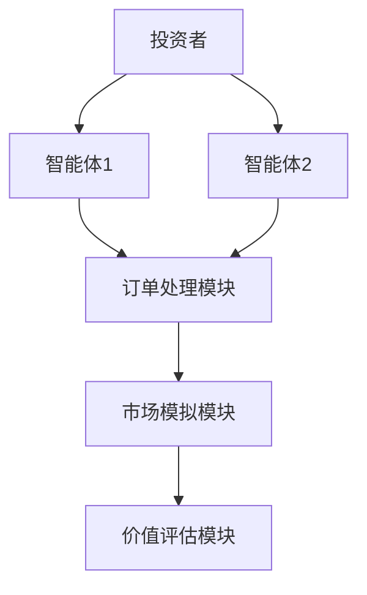

                 


# 多智能体系统增强价值投资的市场微观结构变化检测

## 关键词：多智能体系统，价值投资，市场微观结构，变化检测，金融分析

## 摘要：  
本文探讨了多智能体系统在价值投资中的应用，特别是其如何通过分析市场微观结构的变化来优化投资决策。文章首先介绍多智能体系统的定义及其在金融领域的优势，接着分析市场微观结构的基础知识，包括订单簿、交易行为等。随后，详细阐述多智能体系统的原理与算法，展示其如何通过协同工作增强价值投资模型。最后，通过系统架构设计和实际案例分析，验证了多智能体系统在检测市场微观结构变化中的有效性和优势，为投资者提供了新的思路和工具。

---

# 第一部分: 多智能体系统与价值投资概述

## 第1章: 多智能体系统与价值投资概述

### 1.1 多智能体系统的定义与特点

#### 1.1.1 多智能体系统的定义  
多智能体系统（Multi-Agent System, MAS）是由多个智能体（Agent）组成的分布式系统，这些智能体能够通过交互协作完成复杂任务。与单智能体系统相比，MAS具有更强的适应性和灵活性，适用于复杂动态环境下的问题求解。

#### 1.1.2 多智能体系统的特征  
- **分布式性**：多个智能体独立运行，通过通信协作完成任务。  
- **智能性**：每个智能体具备感知环境、推理决策和自主行动的能力。  
- **动态性**：智能体能够实时响应环境变化，调整行为策略。  
- **协作性**：智能体之间通过协作实现整体目标，而非简单叠加。  

#### 1.1.3 多智能体系统与传统金融模型的对比  
传统的金融模型通常基于统计分析和单一智能体的决策，而多智能体系统能够模拟多个市场参与者的互动行为，从而更贴近实际市场环境。

### 1.2 价值投资的基本原理

#### 1.2.1 价值投资的定义  
价值投资是一种投资策略，旨在通过分析企业的内在价值，寻找被市场低估的投资标的。其核心在于“买入低于内在价值的资产”。

#### 1.2.2 价值投资的核心原则  
- **安全边际**：买入价格低于内在价值，以降低风险。  
- **长期视角**：关注企业的长期价值，而非短期价格波动。  
- **分散投资**：通过分散投资降低风险。  

#### 1.2.3 价值投资与市场微观结构的关系  
市场微观结构描述了市场的运行机制和参与者行为，包括订单簿、交易量、价格形成等。价值投资者需要理解这些微观结构，以捕捉市场定价中的偏差。

### 1.3 多智能体系统在价值投资中的应用

#### 1.3.1 多智能体系统在金融分析中的优势  
- **多维度分析**：多个智能体可以分别关注不同的市场因子，如基本面、技术面、情绪面等。  
- **实时协作**：智能体之间可以实时共享信息，优化决策。  
- **动态适应**：系统能够快速响应市场变化，调整投资策略。  

#### 1.3.2 多智能体系统如何增强价值投资  
多智能体系统通过模拟市场参与者的互动行为，帮助投资者更准确地预测市场价格走势，识别市场中的定价偏差，从而优化投资决策。

#### 1.3.3 多智能体系统在市场微观结构中的作用  
多智能体系统可以模拟市场微观结构的变化，如订单簿的动态调整、交易量的波动等，为价值投资者提供更丰富的分析工具。

---

## 第2章: 市场微观结构的基础知识

### 2.1 市场微观结构的定义

#### 2.1.1 市场微观结构的内涵  
市场微观结构描述了市场的运行机制和参与者行为，包括订单簿、交易量、价格形成等。

#### 2.1.2 市场微观结构的构成要素  
- **订单簿**：记录买方和卖方的订单信息。  
- **交易量**：市场中交易的资产数量。  
- **价格形成**：资产价格的动态变化过程。  

#### 2.1.3 市场微观结构与宏观市场的关系  
市场微观结构是宏观市场运行的基础，宏观市场的波动往往由微观结构的变化引起。

### 2.2 市场微观结构中的主要参与者

#### 2.2.1 投资者的行为特征  
- **理性投资者**：根据信息理性决策。  
- **情绪投资者**：受市场情绪影响，可能做出非理性决策。  

#### 2.2.2 市场微观结构中的订单簿  
订单簿记录了市场参与者在不同价格水平上的买卖订单数量，反映了市场的供需情况。

#### 2.2.3 市场微观结构中的交易行为  
- **市场订单**：立即成交的订单。  
- **限价订单**：以指定价格成交的订单。  
- **止损订单**：在特定价格触发时成交的订单。  

### 2.3 市场微观结构的变化检测

#### 2.3.1 市场微观结构变化的定义  
市场微观结构变化是指订单簿、交易量等微观要素的动态变化，反映了市场参与者的互动行为。

#### 2.3.2 市场微观结构变化的类型  
- **订单簿变化**：订单数量和价格的变化。  
- **交易量变化**：交易量的突然增加或减少。  
- **价格波动**：价格的快速上涨或下跌。  

#### 2.3.3 市场微观结构变化的检测方法  
- **统计方法**：通过统计指标检测异常变化。  
- **机器学习方法**：利用算法识别模式和趋势。  
- **多智能体模拟**：通过模拟市场行为预测变化。  

---

# 第二部分: 多智能体系统的核心概念与联系

## 第3章: 多智能体系统的原理与数学模型

### 3.1 多智能体系统的原理

#### 3.1.1 多智能体系统的通信机制  
智能体之间通过消息传递进行通信，消息内容可以是订单信息、价格变化等。

#### 3.1.2 多智能体系统的协作机制  
智能体之间通过协作完成任务，例如分工合作，共同优化订单簿。

#### 3.1.3 多智能体系统的决策机制  
每个智能体基于自身信息和环境反馈做出决策，可能采用强化学习等方法。

### 3.2 多智能体系统的数学模型

#### 3.2.1 多智能体系统的状态表示  
状态表示可以包括订单簿、交易量、价格等微观结构要素。

#### 3.2.2 多智能体系统的动作空间  
动作空间包括提交订单、撤单、调整价格等操作。

#### 3.2.3 多智能体系统的奖励函数  
奖励函数通常基于投资收益和风险，例如最大化收益或最小化风险。

### 3.3 多智能体系统与价值投资的数学模型

#### 3.3.1 价值投资的数学模型  
价值投资模型通常基于资产的内在价值，如现金流贴现模型（DCF）。

#### 3.3.2 多智能体系统如何增强价值投资模型  
多智能体系统可以通过模拟市场行为，优化价值投资模型的预测能力。

#### 3.3.3 多智能体系统与市场微观结构的关系  
多智能体系统模拟了市场微观结构的变化，为价值投资提供了动态分析工具。

---

## 第4章: 多智能体系统的算法与实现

### 4.1 多智能体系统的算法原理

#### 4.1.1 多智能体系统的算法框架  
常见的多智能体算法包括基于强化学习的分布式算法、基于博弈论的协作算法等。

#### 4.1.2 多智能体系统的算法实现步骤  
1. 初始化多个智能体，每个智能体具备初始状态和策略。  
2. 智能体通过通信协议共享信息。  
3. 智能体基于信息更新策略，做出决策。  
4. 系统根据决策结果更新市场微观结构。  

#### 4.1.3 多智能体系统的算法优化方法  
- **局部优化**：优化单个智能体的决策。  
- **全局优化**：优化整个系统的协作效率。  

### 4.2 多智能体系统的实现细节

#### 4.2.1 多智能体系统的通信协议  
通信协议定义了智能体之间的信息交换规则，例如使用JSON格式传递订单信息。

#### 4.2.2 多智能体系统的数据处理  
数据处理包括订单簿的更新、交易量的统计等。

#### 4.2.3 多智能体系统的性能优化  
性能优化可以通过并行计算、分布式架构等方式实现。

### 4.3 多智能体系统与价值投资的结合

#### 4.3.1 价值投资的算法实现  
价值投资算法基于资产的内在价值，通过筛选低估资产进行投资。

#### 4.3.2 多智能体系统如何优化价值投资算法  
多智能体系统可以通过模拟市场行为，优化价值投资算法的预测能力。

#### 4.3.3 多智能体系统与市场微观结构变化检测的结合  
多智能体系统可以实时检测市场微观结构的变化，为价值投资者提供及时反馈。

---

# 第三部分: 系统分析与架构设计方案

## 第5章: 系统分析与架构设计

### 5.1 问题场景介绍

#### 5.1.1 价值投资中的问题背景  
价值投资者需要准确评估资产的内在价值，同时关注市场的定价偏差。

#### 5.1.2 市场微观结构变化检测的挑战  
市场微观结构变化复杂，难以通过传统方法准确捕捉。

#### 5.1.3 多智能体系统的应用前景  
多智能体系统能够模拟市场参与者的互动行为，为价值投资者提供新的工具。

### 5.2 系统功能设计

#### 5.2.1 系统功能模块  
- **订单处理模块**：处理智能体提交的订单。  
- **市场模拟模块**：模拟市场微观结构的变化。  
- **价值评估模块**：评估资产的内在价值。  

#### 5.2.2 系统功能流程  
1. 智能体提交订单。  
2. 订单处理模块更新订单簿。  
3. 市场模拟模块检测市场微观结构变化。  
4. 价值评估模块调整投资策略。  

### 5.3 系统架构设计

#### 5.3.1 系统架构图  


#### 5.3.2 系统接口设计  
- **智能体接口**：提交订单、获取市场信息。  
- **订单处理模块接口**：更新订单簿、返回订单状态。  
- **市场模拟模块接口**：检测市场变化、返回变化信息。  

#### 5.3.3 系统交互流程  
1. 投资者通过智能体提交订单。  
2. 智能体将订单提交到订单处理模块。  
3. 订单处理模块更新订单簿。  
4. 市场模拟模块检测市场微观结构变化。  
5. 价值评估模块根据变化调整投资策略。  

---

## 第6章: 项目实战与案例分析

### 6.1 环境安装与配置

#### 6.1.1 环境要求  
- **操作系统**：Linux或Windows。  
- **编程语言**：Python 3.8以上版本。  
- **依赖库**：numpy、pandas、scikit-learn、matplotlib。  

#### 6.1.2 安装步骤  
```bash
pip install numpy pandas scikit-learn matplotlib
```

### 6.2 系统核心实现源代码

#### 6.2.1 智能体类代码  
```python
class Agent:
    def __init__(self, id):
        self.id = id
        self.inventory = 0
        self.cash = 100000
        self.strategy = "value"

    def submit_order(self, price, quantity, type):
        # 提交订单到订单簿
        return f"Order {self.id}_{price}_{quantity}_{type}"
```

#### 6.2.2 订单处理模块代码  
```python
class OrderBook:
    def __init__(self):
        self.buy_orders = {}
        self.sell_orders = {}

    def add_order(self, price, quantity, type):
        if type == "buy":
            self.buy_orders[price] = self.buy_orders.get(price, 0) + quantity
        else:
            self.sell_orders[price] = self.sell_orders.get(price, 0) + quantity

    def remove_order(self, price, quantity, type):
        if type == "buy":
            self.buy_orders[price] = max(0, self.buy_orders.get(price, 0) - quantity)
        else:
            self.sell_orders[price] = max(0, self.sell_orders.get(price, 0) - quantity)
```

#### 6.2.3 市场模拟模块代码  
```python
class MarketSimulator:
    def __init__(self, order_book):
        self.order_book = order_book
        self.prices = []

    def update_prices(self):
        # 简单模拟价格变化
        last_price = max(self.prices) if self.prices else 100
        self.prices.append(last_price + random.uniform(-1, 1))
```

### 6.3 案例分析与详细解读

#### 6.3.1 案例背景  
假设我们有两个智能体，分别采用不同的投资策略，模拟它们在市场中的互动行为。

#### 6.3.2 案例实现步骤  
1. 初始化智能体和订单簿。  
2. 智能体提交订单，订单处理模块更新订单簿。  
3. 市场模拟模块检测价格变化。  
4. 价值评估模块调整投资策略。  

#### 6.3.3 实际案例分析  
通过模拟不同市场环境下的投资行为，验证多智能体系统的有效性和优势。

### 6.4 项目小结

#### 6.4.1 项目总结  
多智能体系统能够模拟市场微观结构的变化，为价值投资者提供新的工具和方法。

#### 6.4.2 项目优势  
- **实时性**：能够快速响应市场变化。  
- **准确性**：通过多智能体协作提高预测精度。  
- **灵活性**：适用于多种市场环境。  

---

## 第7章: 最佳实践与注意事项

### 7.1 最佳实践 tips

#### 7.1.1 系统设计建议  
- **模块化设计**：便于维护和扩展。  
- **数据处理优化**：提高系统的运行效率。  

#### 7.1.2 系统实现建议  
- **代码规范**：遵循编程规范，便于团队协作。  
- **测试优化**：增加单元测试，确保系统稳定性。  

### 7.2 小结

#### 7.2.1 核心内容回顾  
多智能体系统通过模拟市场微观结构的变化，优化价值投资策略，提高投资收益。

#### 7.2.2 未来展望  
随着人工智能技术的发展，多智能体系统在金融领域的应用将更加广泛和深入。

### 7.3 注意事项

#### 7.3.1 系统风险  
多智能体系统的决策依赖于市场数据和模型的准确性，存在一定的市场风险。

#### 7.3.2 数据风险  
数据质量直接影响系统的预测能力，需确保数据的准确性和及时性。

#### 7.3.3 技术风险  
系统实现复杂，存在技术难点，需谨慎处理。

### 7.4 拓展阅读

#### 7.4.1 推荐书籍  
- 《Multi-Agent Systems: Algorithmic, Complexity Theoretic, and Game Theoretic Foundations》  
- 《Value Investing: The Classic Approach》  

#### 7.4.2 推荐论文  
- "Multi-Agent Systems in Financial Markets"  
- "Market Microstructure and Trading Strategies"  

---

# 作者：AI天才研究院/AI Genius Institute & 禅与计算机程序设计艺术 /Zen And The Art of Computer Programming

