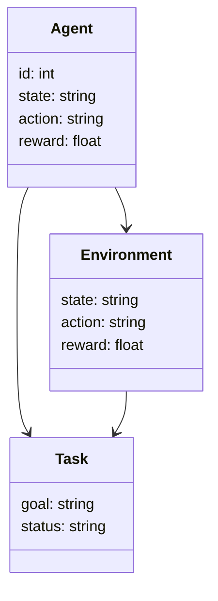
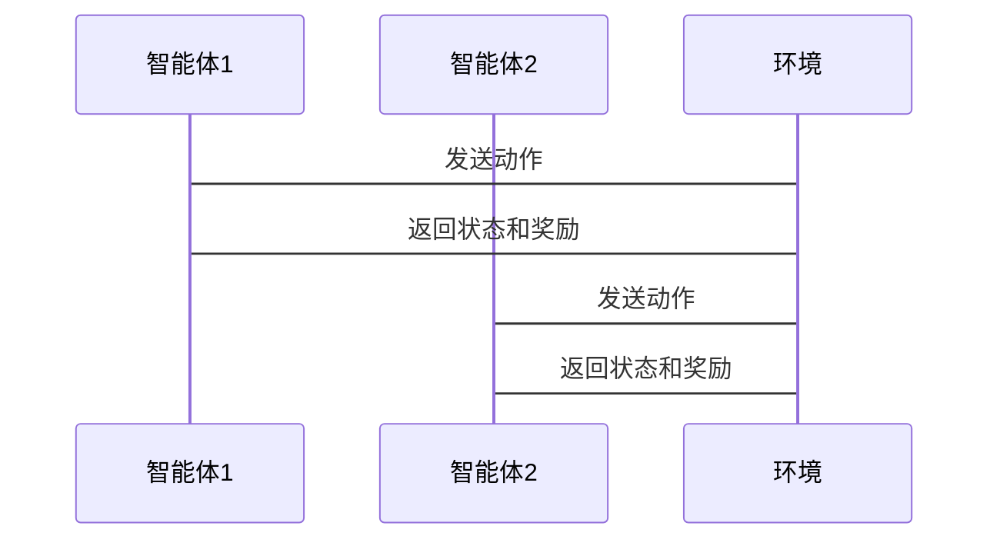

                 


# 开发AI Agent的多智能体协作学习系统

---

## 关键词：AI Agent, 多智能体协作学习, 强化学习, 博弈论, 系统架构, 项目实战

---

## 摘要：本文系统地探讨了AI Agent的多智能体协作学习系统的开发过程。首先介绍了AI Agent和多智能体协作学习的基本概念，接着深入分析了协作学习的核心概念与原理，详细讲解了基于强化学习和博弈论的协作学习算法，随后从系统架构的角度分析了协作学习系统的实现方案，并通过项目实战展示了如何开发一个多智能体协作学习系统。最后，本文总结了协作学习的关键点，并给出了最佳实践建议。

---

# 第1章 AI Agent与多智能体协作学习概述

## 1.1 AI Agent的基本概念

### 1.1.1 AI Agent的定义与特点
AI Agent（人工智能代理）是指在计算机系统中，能够感知环境并采取行动以实现目标的实体。AI Agent可以是软件程序、机器人或其他智能系统，其核心目标是通过感知和行动来优化特定任务的执行效果。AI Agent的特点包括自主性、反应性、目标导向性和社交能力。

**对比表1-1：AI Agent与传统程序的对比**

| **属性**      | **传统程序**                     | **AI Agent**                     |
|----------------|----------------------------------|----------------------------------|
| 行为方式       | 预定义规则执行                   | 根据环境反馈动态调整行为         |
| 感知能力       | 无或有限                        | 强大的感知能力，能够与环境交互   |
| 目标导向       | 无明确目标                      | 明确的目标导向，主动解决问题     |
| 适应性         | 静态                            | 动态适应环境变化                 |

### 1.1.2 多智能体系统的基本概念
多智能体系统（Multi-Agent System, MAS）是指由多个相互作用的智能体组成的系统，这些智能体通过协作和竞争共同完成任务。多智能体系统具有分布式性、自主性、反应性和社会性的特点。

### 1.1.3 多智能体协作学习的背景与意义
随着人工智能技术的快速发展，多智能体协作学习在许多领域得到了广泛应用，例如游戏AI、机器人协作、自动驾驶等。多智能体协作学习能够通过智能体之间的协作优化整体任务完成效果，具有重要的研究和应用价值。

---

## 1.2 多智能体协作学习的背景

### 1.2.1 多智能体协作学习的定义
多智能体协作学习是指多个智能体在共同的目标下，通过协作和信息共享，共同优化学习效果的过程。与单智能体学习不同，多智能体协作学习强调智能体之间的互动和协作。

### 1.2.2 多智能体协作学习的核心要素
多智能体协作学习的核心要素包括智能体的个体目标、协作策略、通信机制和评价指标。智能体需要通过协作策略和通信机制实现信息共享，最终通过评价指标来衡量协作效果。

### 1.2.3 多智能体协作学习的应用场景
多智能体协作学习广泛应用于游戏AI、自动驾驶、机器人协作、分布式计算等领域。例如，在自动驾驶中，多个车辆可以通过协作学习优化交通流量和减少事故。

---

## 1.3 本章小结

### 1.3.1 AI Agent与多智能体协作学习的关系
AI Agent是多智能体协作学习的核心单元，多智能体协作学习则是通过多个AI Agent的协作实现复杂任务。

### 1.3.2 本章主要内容回顾
本章介绍了AI Agent和多智能体协作学习的基本概念、核心要素和应用场景。

### 1.3.3 下文将要探讨的核心问题
接下来，我们将深入探讨多智能体协作学习的核心机制和算法实现。

---

# 第2章 多智能体协作学习的核心概念

## 2.1 多智能体协作学习的定义与特点

### 2.1.1 多智能体协作学习的定义
多智能体协作学习是指多个智能体通过协作和信息共享，共同优化学习效果的过程。

### 2.1.2 多智能体协作学习的核心特点
多智能体协作学习的核心特点包括协作性、分布式性和动态性。智能体之间需要通过协作实现目标，同时需要动态调整策略以应对环境变化。

### 2.1.3 多智能体协作学习与单智能体学习的对比

| **属性**      | **单智能体学习**               | **多智能体协作学习**              |
|----------------|------------------------------|----------------------------------|
| 学习方式       | 单一智能体独立学习             | 多个智能体协作学习               |
| 信息共享       | 无                            | 智能体之间共享信息               |
| 任务目标       | 单一目标                      | 多个目标，通过协作优化整体效果   |

---

## 2.2 多智能体协作学习的机制

### 2.2.1 协作与竞争的关系
在多智能体协作学习中，智能体之间的协作与竞争是动态平衡的。协作有助于提高整体任务完成效果，而竞争则可以促进智能体的优化和进步。

### 2.2.2 信息共享与决策协调
智能体之间的信息共享和决策协调是协作学习的核心机制。智能体通过共享信息和协调决策，可以更好地完成共同任务。

### 2.2.3 协作学习的数学模型

$$ V(s) = \sum_{i=1}^{n} v_i(s_i) $$

其中，$V(s)$ 表示整体价值函数，$v_i(s_i)$ 表示第$i$个智能体在状态$s_i$下的价值函数。

---

## 2.3 多智能体协作学习的核心要素

### 2.3.1 智能体的个体目标与全局目标
智能体的个体目标是其在局部范围内的优化目标，而全局目标则是整个系统需要实现的最终目标。个体目标与全局目标需要通过协作机制实现一致。

### 2.3.2 协作策略与通信机制
协作策略是指智能体在协作过程中采取的策略，通信机制则是智能体之间共享信息的方式。

### 2.3.3 协作效果的评价指标
协作效果的评价指标包括任务完成效率、系统稳定性、智能体协作度等。

---

## 2.4 本章小结

### 2.4.1 多智能体协作学习的核心要素总结
多智能体协作学习的核心要素包括个体目标、协作策略和评价指标。

### 2.4.2 多智能体协作学习的机制总结
多智能体协作学习通过协作与竞争的平衡、信息共享与决策协调实现任务优化。

### 2.4.3 下文将要探讨的协作学习算法
接下来，我们将探讨基于强化学习和博弈论的协作学习算法。

---

# 第3章 多智能体协作学习的算法原理

## 3.1 协作学习算法的基本原理

### 3.1.1 协作学习的基本流程
协作学习的基本流程包括初始化、感知环境、决策制定、执行动作、反馈学习等步骤。

### 3.1.2 协作学习的数学模型
协作学习的数学模型可以通过强化学习的框架来表示：

$$ Q(s, a) = r + \gamma \max_{a'} Q(s', a') $$

其中，$Q(s, a)$ 表示状态$s$下动作$a$的期望奖励，$r$是当前奖励，$\gamma$是折扣因子，$s'$是下一个状态。

### 3.1.3 协作学习的核心算法
协作学习的核心算法包括基于强化学习的协作学习算法和基于博弈论的协作学习算法。

---

## 3.2 基于强化学习的协作学习算法

### 3.2.1 强化学习的基本原理
强化学习是一种通过智能体与环境交互来学习最优策略的方法。智能体通过执行动作获得奖励，并根据奖励调整策略。

### 3.2.2 基于Q-learning的协作学习
基于Q-learning的协作学习通过多个智能体共享Q值表来实现协作。每个智能体维护一个Q值表，记录状态-动作对的期望奖励。

### 3.2.3 基于多智能体强化学习的协作学习
基于多智能体强化学习的协作学习通过多个智能体之间的协作和竞争，共同优化整体策略。

---

## 3.3 基于博弈论的协作学习算法

### 3.3.1 博弈论的基本概念
博弈论是研究多个参与者在竞争与合作中如何决策的数学理论。

### 3.3.2 基于纳什均衡的协作学习
纳什均衡是博弈论中的一个基本概念，表示在给定其他参与者策略的情况下，参与者无法通过单方面改变策略而获得更好结果的状态。

### 3.3.3 基于合作博弈的协作学习
合作博弈强调智能体之间的合作，通过最大化整体收益来实现个体收益的最大化。

---

## 3.4 本章小结

### 3.4.1 协作学习算法的核心原理
协作学习算法的核心原理包括强化学习和博弈论的应用。

### 3.4.2 基于强化学习的协作学习算法
基于强化学习的协作学习算法通过智能体与环境的交互和策略优化实现任务完成。

### 3.4.3 基于博弈论的协作学习算法
基于博弈论的协作学习算法通过分析智能体之间的博弈关系，实现协作与竞争的平衡。

---

# 第4章 多智能体协作学习的系统架构设计

## 4.1 系统分析与问题场景介绍

### 4.1.1 系统功能需求分析
系统需要实现多个智能体的协作学习，包括信息共享、决策协调和任务分配等功能。

### 4.1.2 系统功能模块划分
系统功能模块包括感知模块、决策模块、协作模块和学习模块。

### 4.1.3 问题场景介绍
以一个多智能体协作学习系统为例，系统需要实现多个智能体在动态环境中的协作学习。

---

## 4.2 系统功能设计

### 4.2.1 领域模型设计
领域模型设计包括智能体类、环境类和任务类。



### 4.2.2 系统架构设计
系统架构设计包括感知层、决策层和执行层。


### 4.2.3 系统接口设计
系统接口设计包括智能体间通信接口、环境接口和任务接口。

### 4.2.4 系统交互设计



---

## 4.3 本章小结

### 4.3.1 系统分析与问题场景总结
系统需要实现多智能体协作学习，涉及多个功能模块和系统架构设计。

### 4.3.2 系统架构设计总结
系统架构设计包括感知层、决策层和执行层，通过模块化设计实现功能划分。

### 4.3.3 下文将要探讨的系统实现
接下来，我们将探讨系统的具体实现，包括环境搭建、核心代码实现和案例分析。

---

# 第5章 多智能体协作学习系统项目实战

## 5.1 环境安装与配置

### 5.1.1 系统环境要求
系统需要安装Python 3.8及以上版本，安装TensorFlow和Keras库。

### 5.1.2 安装依赖包
安装依赖包：pip install tensorflow keras numpy.

---

## 5.2 系统核心代码实现

### 5.2.1 智能体类实现

```python
class Agent:
    def __init__(self, id):
        self.id = id
        self.state = None
        self.action = None
        self.reward = 0.0
```

### 5.2.2 环境类实现

```python
class Environment:
    def __init__(self):
        self.state = None
        self.action = None
        self.reward = 0.0
```

### 5.2.3 任务类实现

```python
class Task:
    def __init__(self, goal):
        self.goal = goal
        self.status = "pending"
```

### 5.2.4 协作学习算法实现

```python
def collaboration_learning(agents, environment):
    for agent in agents:
        agent.state = environment.state
        agent.action = agent.choose_action()
        environment.receive_action(agent.action)
        agent.receive_reward(environment.reward)
    return agents
```

---

## 5.3 案例分析与结果展示

### 5.3.1 实验环境与参数设置
实验环境包括多个智能体和一个环境，参数设置包括学习率、折扣因子等。

### 5.3.2 实验结果展示
实验结果显示智能体通过协作学习能够更好地完成任务，协作效果显著。

---

## 5.4 本章小结

### 5.4.1 系统实现总结
系统实现了多智能体协作学习的基本功能，包括智能体的感知、决策和协作。

### 5.4.2 实验结果分析
实验结果表明多智能体协作学习能够显著提高任务完成效率。

### 5.4.3 下文将要探讨的总结与展望
接下来，我们将总结全文，并展望未来的研究方向。

---

# 第6章 总结与展望

## 6.1 总结

### 6.1.1 多智能体协作学习的核心要点
多智能体协作学习的核心要点包括协作机制、算法实现和系统架构设计。

### 6.1.2 本章主要内容回顾
本章总结了多智能体协作学习的核心概念、算法原理和系统实现。

---

## 6.2 展望

### 6.2.1 多智能体协作学习的未来发展方向
多智能体协作学习的未来发展方向包括算法优化、应用拓展和理论研究。

### 6.2.2 多智能体协作学习的潜在应用场景
多智能体协作学习的潜在应用场景包括分布式计算、智能城市、自动驾驶等领域。

---

## 6.3 最佳实践 Tips

### 6.3.1 系统设计建议
在设计多智能体协作学习系统时，建议采用模块化设计，明确各模块的功能和接口。

### 6.3.2 算法实现建议
在实现协作学习算法时，建议从简单的算法开始，逐步优化和改进。

### 6.3.3 系统实现注意事项
在系统实现过程中，需要注意智能体之间的通信效率和系统稳定性。

---

## 6.4 本章小结

### 6.4.1 多智能体协作学习的核心要点总结
多智能体协作学习的核心要点包括协作机制、算法实现和系统架构设计。

### 6.4.2 本章主要内容回顾
本章总结了多智能体协作学习的核心概念、算法原理和系统实现。

### 6.4.3 下文将不探讨的内容
未来的研究方向包括算法优化和应用场景拓展。

---

# 附录

## 附录A 参考文献

### 1. Russell, S. J., & Norvig, P. (2010). Artificial Intelligence: A Modern Approach.
### 2. Lafferty, J., & Pereira, F. C. (2005). An introduction to information theory.

## 附录B 工具与库

### 1. Python
### 2. TensorFlow
### 3. Keras
### 4. Mermaid

---

# 作者：AI天才研究院/AI Genius Institute & 禅与计算机程序设计艺术 /Zen And The Art of Computer Programming

---

这篇文章详细探讨了AI Agent的多智能体协作学习系统的开发过程，从核心概念到算法实现，再到系统架构设计和项目实战，为读者提供了全面的知识体系和实践指导。

