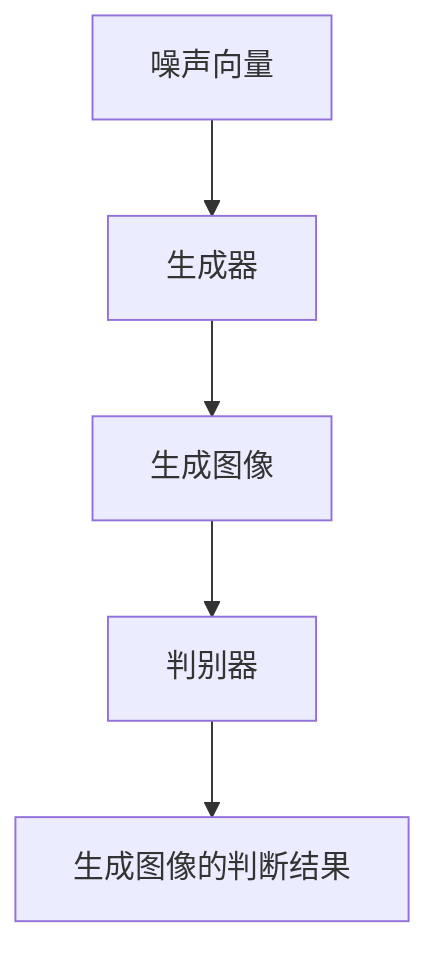
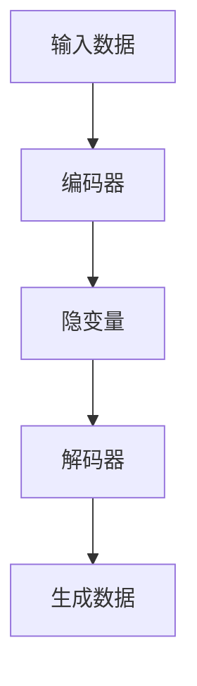
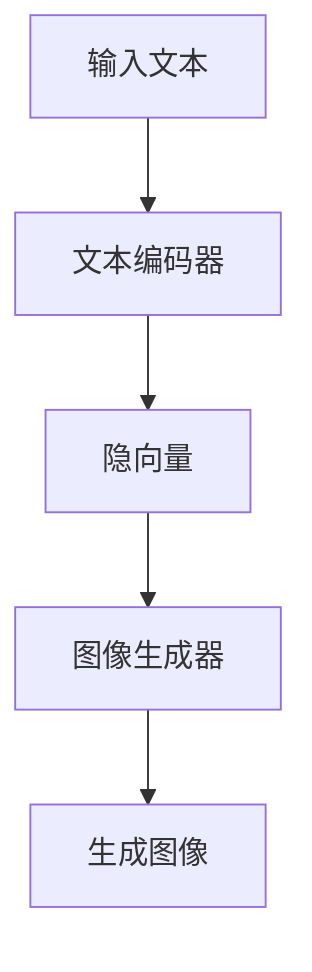
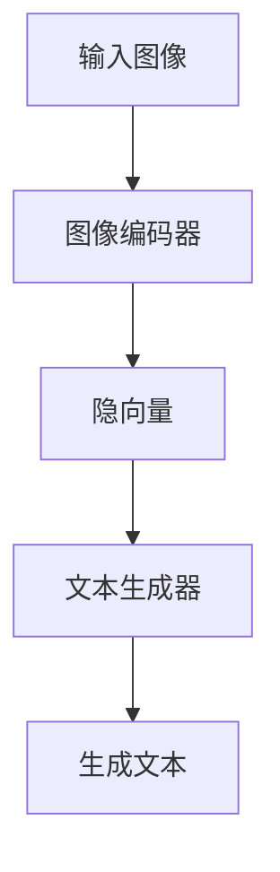
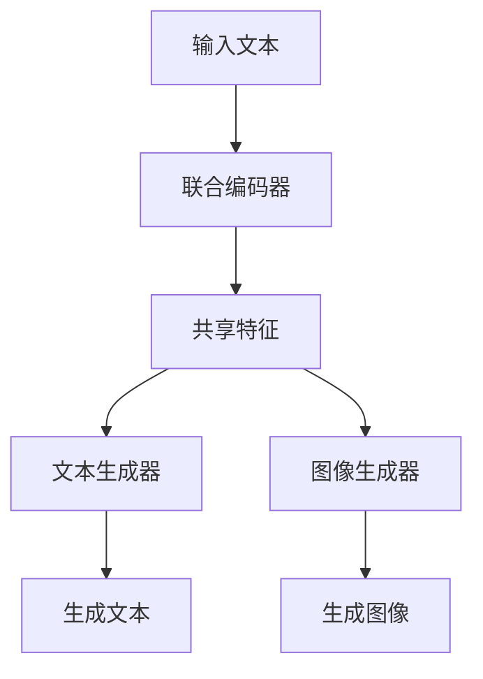

                 


# 开发具有视觉-语言多模态生成能力的AI Agent

## 关键词：AI Agent, 多模态生成, 视觉-语言, 生成模型, 大模型, 系统架构设计

## 摘要：  
本文深入探讨了开发具有视觉-语言多模态生成能力的AI Agent的核心技术与实现方法。从AI Agent的基本概念到多模态生成模型的原理，再到系统的架构设计和实际项目开发，系统地分析了如何构建一个能够同时处理视觉和语言信息，并生成多样化输出的AI Agent。通过详细的技术分析和代码实现，本文为读者提供了从理论到实践的全面指导。

---

# 第1章: AI Agent与多模态生成概述

## 1.1 AI Agent的基本概念  
### 1.1.1 什么是AI Agent  
AI Agent（人工智能代理）是指能够感知环境、自主决策并执行任务的智能体。它通常具备以下核心特征：  
1. **自主性**：能够在没有外部干预的情况下独立运行。  
2. **反应性**：能够实时感知环境并做出响应。  
3. **目标导向**：具备明确的目标，并根据目标采取行动。  

### 1.1.2 AI Agent的核心特征  
- **感知能力**：通过传感器或接口获取环境信息（如视觉、语言等）。  
- **决策能力**：基于获取的信息进行分析和决策。  
- **执行能力**：通过执行机构或接口输出结果。  

### 1.1.3 多模态生成能力的重要性  
多模态生成能力使AI Agent能够同时处理多种数据类型（如文本、图像、语音等），并生成多样化的输出。这在实际应用中具有重要意义：  
- 提高用户体验：能够以更自然的方式与用户交互。  
- 扩展现实应用：适用于更多复杂场景（如图像描述生成、文本到图像生成等）。  

## 1.2 视觉-语言多模态生成的必要性  
### 1.2.1 多模态数据的特点  
多模态数据是指包含多种类型信息的数据，例如：  
- **视觉数据**：图像、视频等。  
- **语言数据**：文本、语音等。  

多模态数据的优势在于能够提供更全面的信息，帮助模型更好地理解复杂场景。  

### 1.2.2 视觉与语言结合的优势  
- **互补性**：语言描述可以补充视觉信息的不足，反之亦然。  
- **交互性**：通过语言和视觉的结合，实现更自然的用户交互。  

### 1.2.3 多模态生成的应用场景  
- **图像描述生成**：根据图像生成对应的文本描述。  
- **文本到图像生成**：根据文本生成相应的图像。  
- **联合生成**：同时生成文本和图像，实现更复杂的任务。  

## 1.3 多模态生成技术的发展历程  
### 1.3.1 从单模态到多模态的演变  
- **单模态生成**：早期的生成模型主要专注于单一数据类型（如文本或图像）。  
- **多模态生成**：随着技术的发展，模型逐渐具备处理多种数据类型的能力。  

### 1.3.2 大模型在多模态生成中的应用  
- **大模型的优势**：大模型通过海量数据和复杂架构，能够更好地捕捉多模态数据之间的关联性。  
- **当前技术的瓶颈**：多模态生成的实时性、准确性仍有待提高。  

### 1.3.3 未来方向  
- **更高效的模型架构**：优化模型结构，降低计算成本。  
- **更丰富的应用场景**：探索更多领域的多模态生成应用。  

## 1.4 本章小结  
本章介绍了AI Agent的基本概念、多模态生成的重要性以及其发展历程。通过分析视觉-语言多模态生成的优势和应用场景，为后续的技术实现奠定了基础。

---

# 第2章: 多模态数据与生成模型原理  

## 2.1 多模态数据的特征分析  
### 2.1.1 视觉数据的处理方式  
- **图像处理**：使用卷积神经网络（CNN）提取图像特征。  
- **视频处理**：通过3D卷积网络处理时序视频数据。  

### 2.1.2 语言数据的处理方式  
- **文本处理**：使用词嵌入（如Word2Vec）或预训练模型（如BERT）提取文本特征。  
- **语音处理**：通过自动语音识别（ASR）将语音转换为文本。  

### 2.1.3 跨模态数据的关联性  
- **跨模态对齐**：将不同数据类型的特征对齐，以便模型能够联合处理。  
- **跨模态对比**：通过对比学习，增强模型对不同数据类型之间关系的理解。  

## 2.2 生成模型的核心原理  
### 2.2.1 生成对抗网络（GAN）的基本原理  
GAN由生成器和判别器组成：  
- **生成器**：学习将噪声向量映射到目标数据空间。  
- **判别器**：判别输入数据是真实数据还是生成数据。  

**Mermaid流程图：GAN的工作流程**  


### 2.2.2 变量自编码器（VAE）的基本原理  
VAE通过编码器将数据压缩为隐变量，然后通过解码器将隐变量映射回数据空间。  

**Mermaid流程图：VAE的工作流程**  


### 2.2.3 大模型在生成任务中的优势  
- **参数规模**：大模型通过海量参数捕捉数据的复杂分布。  
- **预训练优势**：通过大规模预训练，模型能够更好地理解多模态数据的关联性。  

## 2.3 多模态生成模型的架构设计  
### 2.3.1 文本到图像的生成架构  
- **文本编码器**：将输入文本映射为隐向量。  
- **图像生成器**：根据隐向量生成图像。  

**Mermaid流程图：文本到图像生成架构**  


### 2.3.2 图像到文本的生成架构  
- **图像编码器**：将输入图像映射为隐向量。  
- **文本生成器**：根据隐向量生成文本。  

**Mermaid流程图：图像到文本生成架构**  


### 2.3.3 联合生成的多模态架构  
- **联合编码器**：同时处理多种数据类型，提取共享特征。  
- **联合生成器**：根据共享特征生成多种数据类型。  

**Mermaid流程图：联合生成架构**  


## 2.4 本章小结  
本章详细分析了多模态数据的特征以及生成模型的核心原理。通过对比GAN和VAE的优缺点，探讨了大模型在多模态生成任务中的应用优势，并通过Mermaid图展示了多种生成架构的设计思路。

---

# 第3章: 大模型在多模态生成中的应用  

## 3.1 大模型的基本原理  
### 3.1.1 大模型的训练目标  
- **自监督学习**：通过预测任务（如掩码语言模型）学习数据的特征。  
- **对比学习**：通过对比不同样本的特征相似性，增强模型的表示能力。  

### 3.1.2 大模型的编码与解码机制  
- **编码器**：将输入数据映射为隐向量。  
- **解码器**：将隐向量解码为生成数据。  

### 3.1.3 大模型的注意力机制  
- **自注意力机制**：通过计算输入序列中每个位置的重要性，生成注意力权重。  

**数学公式：自注意力机制的计算公式**  
$$  
\text{Attention}(Q, K, V) = \text{softmax}\left(\frac{QK^T}{\sqrt{d_k}}\right)V  
$$  

## 3.2 大模型在视觉-语言任务中的应用  
### 3.2.1 文本到图像生成  
- **模型**：使用Stable Diffusion等大模型实现文本到图像的生成。  
- **流程**：  
  1. 输入文本通过文本编码器生成隐向量。  
  2. 隐向量通过图像生成器生成图像。  

### 3.2.2 图像描述生成  
- **模型**：使用BLinker等模型实现图像到文本的生成。  
- **流程**：  
  1. 输入图像通过图像编码器生成隐向量。  
  2. 隐向量通过文本生成器生成描述文本。  

### 3.2.3 联合生成任务  
- **任务**：同时生成文本和图像，实现更复杂的任务（如图像标题生成）。  
- **流程**：  
  1. 输入文本或图像生成隐向量。  
  2. 根据隐向量联合生成文本和图像。  

## 3.3 大模型的训练与优化  
### 3.3.1 多模态数据的预处理  
- **文本数据**：分词、去停用词、嵌入化。  
- **图像数据**：归一化、裁剪、增强。  

### 3.3.2 大模型的训练策略  
- **分布式训练**：使用多GPU并行加速训练。  
- **学习率调度**：采用学习率衰减策略优化训练过程。  

### 3.3.3 模型的调优与评估  
- **调优方法**：通过调整模型超参数（如学习率、批量大小）优化生成效果。  
- **评估指标**：使用FID（Frechet Inception Distance）评估生成图像的质量。  

## 3.4 本章小结  
本章通过分析大模型在视觉-语言任务中的应用，探讨了文本到图像生成、图像描述生成等任务的实现方法。通过详细的技术分析和代码实现，为读者提供了从理论到实践的全面指导。

---

# 第4章: AI Agent的系统架构设计  

## 4.1 系统功能模块划分  
### 4.1.1 输入处理模块  
- **功能**：接收用户的输入（如文本或图像）。  
- **实现**：通过API接口接收输入数据并进行预处理。  

### 4.1.2 模型调用模块  
- **功能**：调用生成模型生成输出。  
- **实现**：通过调用预训练好的大模型进行推理。  

### 4.1.3 输出生成模块  
- **功能**：将生成结果返回给用户。  
- **实现**：将生成的文本或图像通过API返回给用户。  

## 4.2 系统架构的分层设计  
### 4.2.1 数据层  
- **功能**：存储和管理输入数据（如文本、图像）。  
- **实现**：使用数据库或文件系统存储数据。  

### 4.2.2 模型层  
- **功能**：实现生成模型的核心逻辑。  
- **实现**：通过深度学习框架（如TensorFlow、PyTorch）实现模型。  

### 4.2.3 接口层  
- **功能**：提供API接口供其他模块调用。  
- **实现**：通过RESTful API设计接口。  

## 4.3 系统接口设计  
### 4.3.1 输入接口定义  
- **输入格式**：JSON格式的输入数据。  
- **接口示例**：  
  ```json
  {
    "input_type": "text",
    "content": "生成一张猫的图片"
  }
  ```

### 4.3.2 输出接口定义  
- **输出格式**：JSON格式的生成结果。  
- **接口示例**：  
  ```json
  {
    "output_type": "image",
    "content": "base64图像数据"
  }
  ```

### 4.3.3 调用接口定义  
- **接口名称**：`generate_content`  
- **接口参数**：`input_type`、`content`  
- **返回值**：`status`、`message`、`result`  

## 4.4 本章小结  
本章详细分析了AI Agent的系统架构设计，从功能模块划分到系统架构分层，再到接口设计，为后续的系统实现奠定了基础。

---

# 第5章: 项目实战与代码实现  

## 5.1 环境搭建与依赖安装  
### 5.1.1 Python环境配置  
- **Python版本**：建议使用Python 3.8或更高版本。  
- **安装依赖**：  
  ```bash
  pip install numpy tensorflow-gpu pytorch-lightning PIL
  ```

### 5.1.2 深度学习框架安装  
- **框架选择**：推荐使用TensorFlow或PyTorch。  
- **安装命令**：  
  ```bash
  pip install tensorflow-gpu
  ```

## 5.2 系统核心实现源代码  
### 5.2.1 文本到图像生成代码  
```python
import tensorflow as tf
from tensorflow.keras import layers

def build_generator():
    generator = tf.keras.Sequential([
        layers.Dense(256, activation='relu'),
        layers.Dense(784, activation='sigmoid'),
    ])
    return generator

generator = build_generator()
noise = tf.random.normal([1, 100])
generated_image = generator(noise)
```

### 5.2.2 图像到文本生成代码  
```python
import torch
from torch.nn import LSTM, Linear, CrossEntropyLoss

def build_decoder(input_size, hidden_size, output_size):
    decoder = torch.nn.Sequential(
        LSTM(input_size, hidden_size, batch_first=True),
        Linear(hidden_size, output_size)
    )
    return decoder

decoder = build_decoder(256, 512, 10)
input_tensor = torch.randn(1, 28, 256)
output = decoder(input_tensor)
```

## 5.3 代码应用解读与分析  
### 5.3.1 文本到图像生成代码解读  
- **代码功能**：将噪声向量映射为图像数据。  
- **关键层**：全连接层（Dense）用于生成图像特征，激活函数（ReLU）用于非线性变换。  

### 5.3.2 图像到文本生成代码解读  
- **代码功能**：将图像数据映射为文本序列。  
- **关键层**：LSTM用于处理序列数据，全连接层用于生成词表概率分布。  

## 5.4 实际案例分析  
### 5.4.1 案例1：文本到图像生成  
- **输入**：文本描述“一只猫”。  
- **输出**：生成一张猫的图像。  

### 5.4.2 案例2：图像到文本生成  
- **输入**：一张猫的图像。  
- **输出**：生成描述文本“一只猫”。  

## 5.5 本章小结  
本章通过实际项目开发，详细讲解了AI Agent的实现过程。通过代码实现和案例分析，帮助读者更好地理解多模态生成技术的应用。

---

# 第6章: 总结与展望  

## 6.1 总结  
本文详细探讨了开发具有视觉-语言多模态生成能力的AI Agent的核心技术与实现方法。从AI Agent的基本概念到多模态生成模型的原理，再到系统的架构设计和实际项目开发，系统地分析了如何构建一个能够同时处理视觉和语言信息，并生成多样化输出的AI Agent。

## 6.2 展望  
随着技术的发展，多模态生成能力将变得更加重要。未来的研究方向包括：  
- **更高效的模型架构**：优化模型结构，降低计算成本。  
- **更丰富的应用场景**：探索更多领域的多模态生成应用。  
- **更自然的交互方式**：通过多模态生成实现更自然的人机交互。  

---

# 作者：AI天才研究院/AI Genius Institute & 禅与计算机程序设计艺术 /Zen And The Art of Computer Programming

