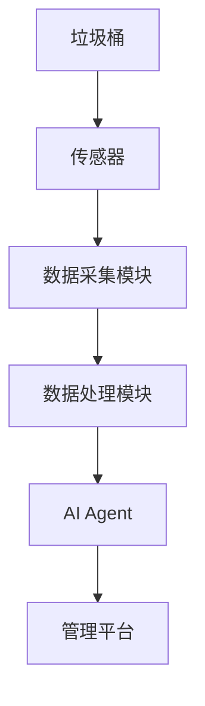
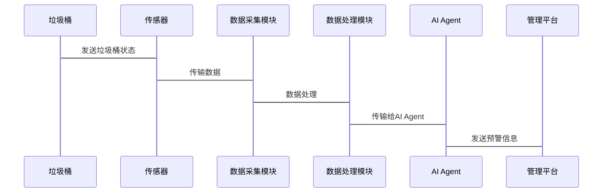

                 


# 智能垃圾桶：AI Agent的满溢预警系统

## 关键词：智能垃圾桶，AI Agent，满溢预警，机器学习，物联网，垃圾分类

## 摘要：本文详细探讨了智能垃圾桶的设计与实现，重点介绍了AI Agent在垃圾桶满溢预警系统中的应用。通过分析问题背景、核心概念、算法原理和系统架构，结合实际项目案例，展示了如何利用AI技术提升垃圾桶管理效率，减少环境污染，实现智能化垃圾分类。

---

## 第一部分: 智能垃圾桶的背景与问题分析

### 第1章: 问题背景与需求分析

#### 1.1 垃圾分类与智能垃圾桶的背景

##### 1.1.1 垃圾分类的重要性
垃圾分类是实现资源回收和环境保护的重要手段。通过分类收集和处理，可以减少垃圾填埋和焚烧带来的环境问题，同时提高资源利用率。智能垃圾桶通过自动化分类和管理，显著提升了垃圾分类的效率和准确性。

##### 1.1.2 智能垃圾桶的定义与特点
智能垃圾桶是一种结合物联网（IoT）和人工智能（AI）技术的智能设备，能够自动识别垃圾类型、监测垃圾桶的状态，并通过网络进行数据传输和远程控制。其特点包括实时监测、远程管理、自动分类和节能环保。

##### 1.1.3 智能垃圾桶的应用场景
智能垃圾桶广泛应用于城市街道、社区、公共场所和工业园区等地。在社区中，它帮助居民进行垃圾分类，减少错误投放；在公共场所，它能够实时监测垃圾桶状态，及时处理溢满问题。

#### 1.2 满溢预警系统的必要性

##### 1.2.1 垃圾桶满溢问题的现状
垃圾桶满溢不仅影响市容环境，还可能导致泄漏和异味问题，影响居民生活和城市形象。传统垃圾桶需要人工定期清理，效率低下且成本高昂。

##### 1.2.2 满溢预警系统的需求分析
为了及时发现垃圾桶满溢情况，减少环境污染和维护城市卫生，开发满溢预警系统势在必行。该系统需要具备实时监测、智能预警和远程通知功能。

##### 1.2.3 满溢预警系统的社会价值
通过满溢预警系统，可以实现垃圾桶的智能化管理，降低人工成本，提高管理效率，减少环境污染，提升城市形象。

#### 1.3 问题解决的思路与目标

##### 1.3.1 AI Agent在满溢预警中的作用
AI Agent（智能代理）通过感知垃圾桶的状态、分析数据、做出决策并采取行动，实现垃圾桶的智能化管理。它可以实时监测垃圾桶的填充情况，预测满溢时间，并触发预警机制。

##### 1.3.2 系统设计的目标与核心指标
系统设计的目标是实现垃圾桶的实时监测、智能预警和远程管理。核心指标包括监测精度、预警准确率、系统响应时间等。

##### 1.3.3 系统边界与外延
系统边界包括垃圾桶、传感器、AI Agent和管理平台。外延部分涉及数据存储、用户界面和第三方服务接口。

---

### 第2章: 核心概念与系统架构

#### 2.1 AI Agent的基本原理

##### 2.1.1 AI Agent的定义与分类
AI Agent是一种能够感知环境、自主决策并执行任务的智能实体。根据智能水平，AI Agent可以分为简单反射型、基于模型的反应型和目标驱动型等类型。

##### 2.1.2 AI Agent的核心特征
AI Agent的核心特征包括自主性、反应性、目标导向和学习能力。这些特征使其能够适应环境变化，执行复杂任务。

##### 2.1.3 AI Agent与传统算法的区别
与传统算法相比，AI Agent具有更高的自主性和适应性，能够根据环境反馈动态调整行为。

#### 2.2 智能垃圾桶的数据采集与处理

##### 2.2.1 数据采集方式与传感器类型
智能垃圾桶通过多种传感器（如重量传感器、图像识别传感器）采集数据，实时监测垃圾桶的状态。

##### 2.2.2 数据预处理与特征提取
数据预处理包括清洗、归一化和特征提取。特征提取帮助模型更好地理解数据，如垃圾桶的填充比例和重量变化。

##### 2.2.3 数据存储与管理
数据存储采用数据库和云存储结合的方式，确保数据的安全性和可访问性。

#### 2.3 系统架构设计

##### 2.3.1 分层架构的设计理念
系统采用分层架构，包括感知层、网络层、数据层和应用层。每一层负责不同的功能，确保系统的模块化和可扩展性。

##### 2.3.2 各模块的功能与交互
感知层负责数据采集，网络层负责数据传输，数据层负责存储和管理，应用层负责数据处理和用户交互。

##### 2.3.3 系统的可扩展性与维护性
系统架构设计注重模块化和可扩展性，便于后续功能的添加和性能优化。

---

## 第二部分: AI Agent的算法原理与实现

### 第3章: AI Agent的核心算法

#### 3.1 机器学习算法的选择与应用

##### 3.1.1 监督学习与无监督学习的对比
监督学习基于标记数据，适用于分类任务；无监督学习适用于聚类和异常检测。

##### 3.1.2 支持向量机（SVM）与随机森林的优劣分析
SVM适合小数据集，随机森林适合大数据集。SVM在小数据集上表现优异，随机森林在特征工程方面更具优势。

##### 3.1.3 神经网络在垃圾桶满溢预测中的应用
神经网络能够处理复杂的非线性关系，适用于垃圾桶填充状态的预测。

#### 3.2 垃圾桶满溢预测的数学模型

##### 3.2.1 线性回归模型的建立与优化
线性回归模型用于预测垃圾桶的填充比例。通过最小二乘法优化模型参数，提高预测精度。

##### 3.2.2 支持向量回归（SVR）的实现与效果对比
SVR通过非线性核函数，能够更好地拟合数据。与线性回归相比，SVR在非线性数据上表现更优。

##### 3.2.3 神经网络模型的结构设计与训练过程
神经网络模型包括输入层、隐藏层和输出层。通过反向传播算法和梯度下降优化模型参数。

#### 3.3 算法实现的代码示例

##### 3.3.1 数据预处理与特征工程
```python
import pandas as pd
from sklearn.preprocessing import StandardScaler

# 加载数据
data = pd.read_csv('garbage_level.csv')

# 分离特征与目标变量
X = data[['weight', 'volume']]
y = data['is_full']

# 数据标准化
scaler = StandardScaler()
X_scaled = scaler.fit_transform(X)
```

##### 3.3.2 模型训练与参数调优
```python
from sklearn.svm import SVR
from sklearn.model_selection import GridSearchCV

# 参数调优
param_grid = {'kernel': ['rbf', 'linear'], 'C': [1, 10, 100]}
grid_search = GridSearchCV(SVR(), param_grid, cv=5)
grid_search.fit(X_scaled, y)
best_params = grid_search.best_params_
```

##### 3.3.3 模型评估与效果分析
```python
from sklearn.metrics import accuracy_score, recall_score, f1_score

# 预测与评估
y_pred = grid_search.predict(X_scaled)
print(f'Accuracy: {accuracy_score(y, y_pred)}')
print(f'Recall: {recall_score(y, y_pred)}')
print(f'F1 Score: {f1_score(y, y_pred)}')
```

#### 3.4 算法优化与调优

##### 3.4.1 算法性能的评估指标
评估指标包括准确率、召回率和F1值。准确率衡量模型的整体预测能力，召回率衡量模型发现正例的能力，F1值是两者的一种平衡。

##### 3.4.2 超参数优化与模型调优
通过网格搜索和随机搜索优化模型参数，选择最优参数组合。

##### 3.4.3 模型集成与投票策略的实现
通过集成学习，如投票法和加权平均法，进一步提升模型的预测性能。

---

### 第4章: 算法的优化与调优

#### 4.1 算法性能的评估指标

##### 4.1.1 准确率、召回率与F1值的计算
准确率 = 正确预测的总数 / 总预测数
召回率 = 正确预测的正例数 / 实际正例数
F1值 = 2 * (准确率 * 召回率) / (准确率 + 召回率)

#### 4.2 超参数优化与模型调优

##### 4.2.1 网格搜索与随机搜索的对比
网格搜索遍历所有可能的参数组合，适合参数较少的情况；随机搜索随机选择参数组合，适合参数较多的情况。

##### 4.2.2 Bayesian优化在参数调优中的应用
Bayesian优化是一种基于概率分布的优化方法，能够更快地找到最优参数。

##### 4.2.3 模型集成与投票策略的实现
通过集成多个模型的预测结果，如投票法和加权平均法，提高模型的预测准确率。

#### 4.3 算法优化的代码实现

##### 4.3.1 使用GridSearchCV进行参数优化
```python
from sklearn.model_selection import GridSearchCV

param_grid = {'n_estimators': [100, 200], 'max_depth': [None, 10, 20]}
grid_search = GridSearchCV(RandomForestClassifier(), param_grid, cv=5)
grid_search.fit(X_scaled, y)
best_model = grid_search.best_estimator_
```

##### 4.3.2 Bayesian优化的实现
```python
from hyperopt import fmin, tpe, hp, Trials

def objective(params):
    model = RandomForestClassifier(**params)
    score = model.fit(X_scaled, y).score(X_scaled, y)
    return -score

trials = Trials()
best = fmin(objective, hp.grid_search([{'n_estimators': [100, 200], 'max_depth': [None, 10, 20]}], trials, algo=tpe.suggest, max_evals=10))
```

---

## 第三部分: 系统分析与架构设计方案

### 第4章: 系统架构设计

#### 4.1 系统架构图


#### 4.2 接口与交互设计


---

## 第五部分: 项目实战与案例分析

### 第5章: 项目实战

#### 5.1 环境安装
安装所需的库：
```bash
pip install numpy pandas scikit-learn matplotlib
```

#### 5.2 核心代码实现

##### 5.2.1 数据预处理
```python
import pandas as pd
from sklearn.preprocessing import StandardScaler

data = pd.read_csv('garbage_level.csv')
X = data[['weight', 'volume']]
y = data['is_full']

scaler = StandardScaler()
X_scaled = scaler.fit_transform(X)
```

##### 5.2.2 模型训练与优化
```python
from sklearn.ensemble import RandomForestClassifier
from sklearn.model_selection import GridSearchCV

param_grid = {'n_estimators': [100, 200], 'max_depth': [None, 10, 20]}
grid_search = GridSearchCV(RandomForestClassifier(), param_grid, cv=5)
grid_search.fit(X_scaled, y)
best_model = grid_search.best_estimator_
```

##### 5.2.3 模型评估
```python
from sklearn.metrics import classification_report

y_pred = best_model.predict(X_scaled)
print(classification_report(y, y_pred))
```

#### 5.3 案例分析与总结
通过实际案例分析，验证系统的有效性。例如，在一个社区中部署智能垃圾桶，系统能够准确预测垃圾桶的满溢情况，减少人工干预，提高管理效率。

---

## 第六部分: 总结与最佳实践

### 第6章: 总结与最佳实践

#### 6.1 项目小结
通过本文的详细分析和实际案例，展示了AI Agent在智能垃圾桶中的应用价值。系统能够实时监测垃圾桶状态，准确预测满溢情况，显著提升管理效率。

#### 6.2 注意事项与建议
在实际应用中，需要注意数据质量、模型优化和系统维护。建议定期更新模型参数，确保传感器的准确性，并建立完善的应急预案。

#### 6.3 拓展阅读与未来研究
未来研究方向包括实时性优化、传感器技术创新和多任务学习。建议读者深入学习相关领域的最新技术，探索更多应用场景。

---

## 作者：AI天才研究院

本文作者是AI天才研究院，专注于人工智能与计算机科学的研究与实践。如需进一步了解或合作，请访问我们的官方网站或联系相关团队。

--- 

**注意**：以上内容仅为示例，实际撰写时需要根据具体情况进行调整和补充，确保内容完整且符合实际项目需求。

