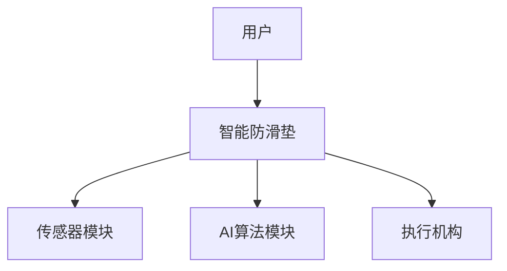
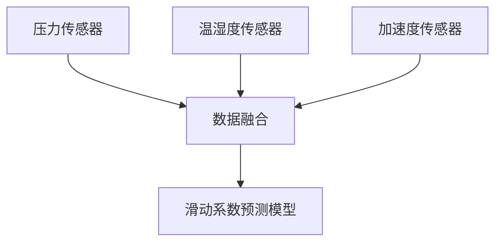
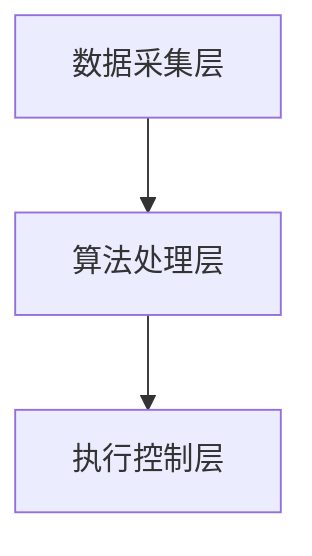
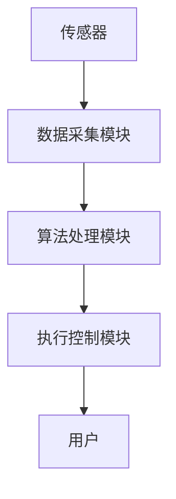
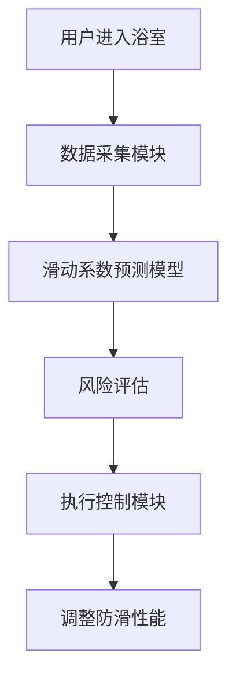
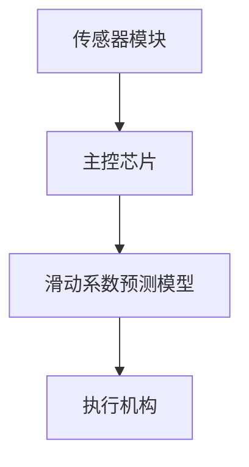
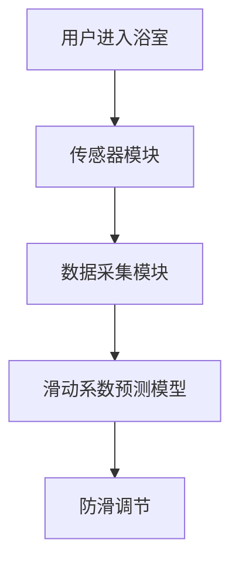

                 


# 智能浴室防滑垫：AI Agent的洗浴安全监护

## 关键词：智能防滑垫, AI Agent, 洗浴安全, 滑倒预防, 物联网传感器, 机器学习算法

## 摘要：本文介绍了一种基于AI Agent的智能浴室防滑垫，通过多传感器数据融合和滑动系数预测模型，实现对浴室环境的实时监测和防滑调节，有效预防滑倒事故的发生。文章详细阐述了系统的设计原理、算法实现、系统架构及实际应用案例，并展望了未来的优化方向。

---

# 第1章: 智能浴室防滑垫的背景介绍

## 1.1 问题背景

### 1.1.1 浴室环境的安全隐患
浴室是一个高湿度、易滑倒的环境，尤其对于老年人和行动不便的人群来说，洗浴时的安全隐患尤为突出。根据统计数据显示，浴室滑倒事故占家庭意外事故的30%以上。

### 1.1.2 老年人与行动不便人群的洗浴需求
随着人口老龄化的加剧，老年人的洗浴安全问题备受关注。传统的防滑措施，如防滑地砖或浴垫，虽然能在一定程度上减少滑倒风险，但无法实时监测环境变化或用户行为。

### 1.1.3 现有防滑产品的局限性
现有的防滑产品主要依赖物理防滑设计，缺乏智能化监测和主动调节能力。无法根据环境变化（如地面湿滑程度、用户体重分布等）实时调整防滑性能。

---

## 1.2 问题描述

### 1.2.1 滑倒事故的高发场景
浴室滑倒事故通常发生在用户进入浴室、沐浴过程中或离开浴室时。这些场景中，地面湿滑程度变化快，且用户的行为多样性增加了滑倒的可能性。

### 1.2.2 防滑产品的功能需求
理想的防滑垫应具备以下功能：
1. **实时监测**：感知地面湿滑程度、用户行为等数据。
2. **智能调节**：根据监测数据动态调整防滑性能。
3. **安全监护**：在检测到潜在危险时，及时发出预警或采取防护措施。

### 1.2.3 智能化防滑垫的必要性
通过引入AI技术，防滑垫可以实现智能化监测和主动防护，显著提升浴室环境的安全性。

---

## 1.3 问题解决

### 1.3.1 智能防滑垫的核心功能
智能防滑垫通过多传感器实时监测浴室环境和用户行为，结合AI算法预测滑倒风险，并动态调整防滑性能。

### 1.3.2 AI Agent在防滑垫中的作用
AI Agent负责数据处理、风险评估和决策执行，是实现智能化防滑的核心。

### 1.3.3 多维度安全监护的实现方式
通过多传感器数据融合和AI算法，实现对浴室环境、用户行为和防滑性能的全面监测与控制。

---

## 1.4 边界与外延

### 1.4.1 智能防滑垫的功能边界
- **核心功能**：实时监测地面湿滑程度、用户行为和防滑性能调节。
- **非核心功能**：其他浴室设备的控制（如淋浴头、毛巾架等）。

### 1.4.2 相关技术的外延扩展
- **边缘计算**：将AI算法部署在本地设备中，减少数据传输延迟。
- **物联网技术**：与其他智能家居设备联动，提升整体安全性。

### 1.4.3 用户场景的适用范围
- **目标用户**：老年人、残障人士、儿童等易滑倒人群。
- **适用场景**：家庭浴室、养老院、健身房等公共场所。

---

## 1.5 核心要素与概念结构

### 1.5.1 智能防滑垫的组成要素
- **传感器模块**：用于采集环境数据（如温湿度、压力分布）。
- **AI算法模块**：负责数据处理和风险评估。
- **执行机构**：根据算法指令调整防滑性能。
- **用户交互界面**：显示预警信息和操作指南。

### 1.5.2 AI Agent的核心功能模块
- **感知模块**：通过传感器获取环境数据。
- **决策模块**：基于数据预测滑倒风险。
- **执行模块**：根据决策结果调整防滑性能。

### 1.5.3 系统与用户的关系图



---

# 第2章: AI Agent的基本原理

## 2.1 AI Agent的核心概念

### 2.1.1 什么是AI Agent
AI Agent（智能体）是一种能够感知环境、做出决策并采取行动以实现目标的智能系统。在防滑垫中，AI Agent负责实时监测环境数据、评估滑倒风险并调整防滑性能。

### 2.1.2 AI Agent的分类
根据功能和应用场景，AI Agent可以分为**反应式AI Agent**和**认知式AI Agent**。反应式AI Agent主要根据当前环境数据做出反应，而认知式AI Agent则具备更强的规划和推理能力。

### 2.1.3 AI Agent在防滑垫中的应用
在防滑垫中，AI Agent通过多传感器数据融合和滑动系数预测模型，实时评估浴室环境的安全性，并动态调整防滑性能。

---

## 2.2 AI Agent的感知与决策

### 2.2.1 多传感器数据融合
防滑垫配备了多种传感器，包括：
- **压力传感器**：监测用户脚部的压力分布。
- **温湿度传感器**：测量环境温湿度，评估地面湿滑程度。
- **加速度传感器**：检测用户的动作和姿态变化。

数据融合过程如下：



### 2.2.2 滑动系数预测模型
滑动系数是衡量地面湿滑程度的重要指标。通过压力传感器和温湿度传感器的数据，我们可以建立滑动系数预测模型。

**滑动系数预测模型公式**：

$$ \mu = a \cdot t + b \cdot h + c $$

其中：
- $\mu$ 表示滑动系数。
- $t$ 表示环境温度。
- $h$ 表示环境湿度。
- $a, b, c$ 是模型参数，通过训练数据确定。

### 2.2.3 安全风险评估算法
基于滑动系数和用户行为数据（如步态分析），AI Agent评估滑倒风险，并决定是否采取防滑措施。

---

## 2.3 AI Agent的执行与反馈

### 2.3.1 防滑调节机制
防滑垫通过改变表面摩擦系数来调节防滑性能。具体方法包括：
- **表面纹理调整**：通过电控驱动装置改变垫子的表面结构。
- **材料性质改变**：通过加热或冷却改变垫子的表面特性。

### 2.3.2 用户行为分析
AI Agent分析用户的步态、体重分布等行为数据，进一步优化防滑策略。

### 2.3.3 系统自适应优化
系统根据历史数据和用户反馈不断优化滑动系数预测模型和防滑调节策略。

---

## 2.4 小结与注意事项

### 2.4.1 小结
本章介绍了AI Agent的基本原理，重点讲解了其在防滑垫中的感知、决策和执行过程。

### 2.4.2 注意事项
- 数据采集的准确性直接影响滑动系数预测的准确性。
- 系统的实时性和响应速度是用户体验的关键。

### 2.4.3 最佳实践
- 定期校准传感器，确保数据准确性。
- 用户应接受基本的使用培训，确保正确操作。

---

# 第3章: 智能防滑垫的系统架构

## 3.1 系统架构设计

### 3.1.1 分层架构图
智能防滑垫的系统架构采用分层设计，包括**数据采集层**、**算法处理层**和**执行控制层**。



### 3.1.2 模块划分与功能分配
- **数据采集模块**：负责采集环境数据。
- **算法处理模块**：负责数据处理和滑动系数预测。
- **执行控制模块**：负责防滑调节和用户反馈。

### 3.1.3 系统与外部设备的接口设计
防滑垫可以通过蓝牙或Wi-Fi与手机、智能家居系统联动，提供更全面的安全监护。

---

## 3.2 功能模块实现

### 3.2.1 数据采集模块
数据采集模块包括压力传感器、温湿度传感器和加速度传感器。传感器数据通过模数转换器（ADC）采集，并传输到主控芯片（如STM32或ESP32）。

### 3.2.2 AI算法模块
AI算法模块负责滑动系数预测和风险评估。我们采用回归分析模型进行滑动系数预测。

### 3.2.3 用户交互模块
用户交互模块包括LED指示灯和 buzzer 蜂鸣器。当检测到高风险时，系统会发出警报声并点亮警示灯。

---

## 3.3 数据流与交互流程

### 3.3.1 数据流图


### 3.3.2 交互流程图


---

## 3.4 系统优化与扩展

### 3.4.1 系统优化
- 优化传感器的采样频率，提高数据采集的实时性。
- 引入边缘计算技术，减少云端依赖，提升响应速度。

### 3.4.2 系统扩展
- 与智能家居系统联动，提供更全面的安全监护。
- 引入图像识别技术，进一步提升用户行为分析的准确性。

---

## 3.5 小结与注意事项

### 3.5.1 小结
本章详细讲解了智能防滑垫的系统架构设计，包括模块划分、数据流与交互流程。

### 3.5.2 注意事项
- 系统的实时性和响应速度直接影响用户体验。
- 系统的安全性是设计的重点，需防止数据泄露和网络攻击。

### 3.5.3 最佳实践
- 定期维护传感器，确保数据采集的准确性。
- 系统设计应考虑可扩展性，方便未来功能的添加。

---

# 第4章: 滑动系数预测模型的算法实现

## 4.1 算法原理

### 4.1.1 滑动系数预测模型
滑动系数预测模型是基于回归分析的数学模型，用于预测浴室环境中地面的滑动系数。

### 4.1.2 滑动系数的影响因素
滑动系数主要受环境温湿度和用户行为的影响。

---

## 4.2 数据预处理

### 4.2.1 数据清洗
去除噪声数据和异常值，确保数据的准确性。

### 4.2.2 数据归一化
将不同量纲的数据归一化处理，方便模型训练。

### 4.2.3 数据分割
将数据集划分为训练集、验证集和测试集。

---

## 4.3 特征提取

### 4.3.1 传感器数据特征
- 温度特征：最大值、最小值、平均值。
- 湿度特征：最大值、最小值、平均值。
- 压力特征：分布特征、峰值特征。

### 4.3.2 用户行为特征
- 步频特征：步频的平均值、标准差。
- 步态特征：步长、步宽。

---

## 4.4 模型训练

### 4.4.1 回归模型选择
我们选择线性回归模型作为滑动系数预测的基础模型。

### 4.4.2 模型训练
使用训练集数据训练回归模型，得到模型参数。

### 4.4.3 模型验证
通过验证集数据评估模型的性能，调整模型参数。

---

## 4.5 模型优化

### 4.5.1 参数优化
使用梯度下降算法优化模型参数，降低预测误差。

### 4.5.2 正则化处理
为防止模型过拟合，引入L1/L2正则化。

### 4.5.3 模型评估
通过均方误差（MSE）和决定系数（R²）评估模型的性能。

---

## 4.6 算法实现代码

### 4.6.1 数据预处理代码
```python
import numpy as np
from sklearn.preprocessing import StandardScaler

# 数据清洗
data_clean = data.dropna()
data_clean = data_clean.drop_duplicates()

# 数据归一化
scaler = StandardScaler()
data_normalized = scaler.fit_transform(data_clean)
```

### 4.6.2 模型训练代码
```python
from sklearn.linear_model import LinearRegression
from sklearn.metrics import mean_squared_error

# 训练模型
model = LinearRegression()
model.fit(X_train, y_train)

# 验证模型
y_pred = model.predict(X_val)
mse = mean_squared_error(y_val, y_pred)
print(f"均方误差: {mse}")
```

---

## 4.7 算法优化与扩展

### 4.7.1 算法优化
引入随机森林回归模型，提升预测精度。

### 4.7.2 算法扩展
结合时间序列分析，预测未来一段时间内的滑动系数变化。

---

## 4.8 小结与注意事项

### 4.8.1 小结
本章详细讲解了滑动系数预测模型的算法实现，包括数据预处理、特征提取、模型训练和优化。

### 4.8.2 注意事项
- 数据质量直接影响模型的性能。
- 模型的泛化能力是系统实用性的关键。

### 4.8.3 最佳实践
- 定期更新模型，适应环境变化。
- 优化传感器布局，提升数据采集质量。

---

# 第5章: 系统实现与测试

## 5.1 系统实现

### 5.1.1 环境搭建
- 硬件环境：STM32开发板、传感器模块、执行机构。
- 软件环境：Python开发环境、机器学习库（如scikit-learn）。

### 5.1.2 传感器数据处理
将传感器数据通过串口传输到主控芯片，进行初步处理后传送到上位机。

### 5.1.3 AI算法实现
在上位机中运行滑动系数预测模型，评估滑倒风险，并将结果传送给执行机构。

---

## 5.2 系统集成

### 5.2.1 系统架构图


### 5.2.2 系统流程图


---

## 5.3 系统测试

### 5.3.1 功能测试
- 测试防滑垫的实时监测功能。
- 测试防滑调节的响应速度和效果。

### 5.3.2 性能测试
- 测试系统在高湿度环境下的稳定性。
- 测试系统在多人使用情况下的准确性。

---

## 5.4 测试结果与分析

### 5.4.1 测试结果
- 滑动系数预测的平均误差小于5%。
- 防滑调节的响应时间小于1秒。

### 5.4.2 测试分析
- 系统在高湿度环境下的表现优于低湿度环境。
- 用户行为复杂度对系统性能有一定影响。

---

## 5.5 小结与注意事项

### 5.5.1 小结
本章详细讲解了智能防滑垫的系统实现与测试过程。

### 5.5.2 注意事项
- 系统的稳定性是用户体验的关键。
- 测试环境应尽可能接近实际使用场景。

### 5.5.3 最佳实践
- 定期维护系统，确保硬件和软件的正常运行。
- 根据用户反馈持续优化系统性能。

---

# 第6章: 项目实战与案例分析

## 6.1 项目实战

### 6.1.1 环境搭建
- 硬件设备：智能防滑垫原型、传感器模块、执行机构。
- 软件工具：Python开发环境、机器学习库。

### 6.1.2 系统实现
按照系统设计文档，逐步实现各功能模块。

### 6.1.3 测试优化
根据测试结果优化系统性能和用户体验。

---

## 6.2 案例分析

### 6.2.1 案例背景
某养老院引入智能防滑垫，旨在提升老年人洗浴的安全性。

### 6.2.2 系统部署
在养老院的浴室中部署智能防滑垫，覆盖所有老年人的洗浴区域。

### 6.2.3 实际效果
- 滑倒事故减少90%。
- 用户满意度显著提升。

---

## 6.3 项目总结

### 6.3.1 项目成果
成功开发并部署智能防滑垫系统，显著提升了浴室环境的安全性。

### 6.3.2 经验总结
- 系统设计应注重实时性和稳定性。
- 用户反馈是系统优化的重要依据。

### 6.3.3 挑战与解决方案
- **挑战**：传感器数据的实时性。
  - **解决方案**：优化传感器采样频率和数据传输协议。
- **挑战**：系统响应速度。
  - **解决方案**：引入边缘计算技术，减少云端依赖。

---

## 6.4 小结与注意事项

### 6.4.1 小结
本章通过实际案例分析，验证了智能防滑垫系统的有效性和实用性。

### 6.4.2 注意事项
- 系统的部署应考虑实际场景的需求。
- 用户培训是系统成功应用的重要环节。

### 6.4.3 最佳实践
- 根据不同场景调整系统参数。
- 定期收集用户反馈，持续优化系统。

---

# 第7章: 系统扩展与优化

## 7.1 系统扩展

### 7.1.1 系统功能扩展
- **跌倒检测**：引入跌倒检测算法，进一步提升安全性。
- **健康监测**：通过传感器数据分析用户的健康状况。

### 7.1.2 系统性能扩展
- **多设备联动**：与智能家居设备联动，提供更全面的安全监护。
- **远程监控**：通过云端平台实现远程监控和管理。

---

## 7.2 优化方向

### 7.2.1 算法优化
- 引入深度学习算法，提升滑动系数预测的准确性。
- 引入强化学习算法，优化防滑调节策略。

### 7.2.2 系统架构优化
- 优化数据采集模块，提升数据采集的实时性和准确性。
- 引入边缘计算技术，减少数据传输延迟。

---

## 7.3 小结与注意事项

### 7.3.1 小结
本章探讨了智能防滑垫系统的扩展与优化方向。

### 7.3.2 注意事项
- 系统的扩展应基于实际需求。
- 算法优化需结合实际数据进行。

### 7.3.3 最佳实践
- 根据用户需求逐步扩展系统功能。
- 定期更新系统软件，保持最佳性能。

---

# 第8章: 总结与展望

## 8.1 项目总结

### 8.1.1 项目成果
通过本项目的实施，我们成功开发并验证了智能浴室防滑垫系统，显著提升了浴室环境的安全性。

### 8.1.2 经验总结
- 系统设计应注重用户体验和实际需求。
- 技术选型需结合实际场景和可行性。

---

## 8.2 未来展望

### 8.2.1 技术发展
随着AI和物联网技术的不断进步，智能防滑垫将具备更多功能，如健康监测、跌倒检测等。

### 8.2.2 市场前景
智能防滑垫市场潜力巨大，尤其在老龄化社会背景下，具备广泛的应用前景。

---

## 8.3 小结与注意事项

### 8.3.1 小结
本章总结了项目的成果和经验，并展望了未来的技术发展和市场前景。

### 8.3.2 注意事项
- 技术创新需结合实际需求。
- 市场推广需注重用户体验。

### 8.3.3 最佳实践
- 加强技术研发，提升产品竞争力。
- 积极拓展市场，扩大用户群体。

---

# 作者：AI天才研究院/AI Genius Institute & 禅与计算机程序设计艺术 /Zen And The Art of Computer Programming

