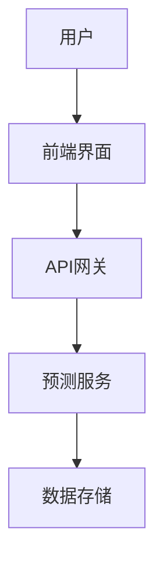

                 


# 金融产品客户满意度预测模型

> 关键词：客户满意度预测模型、金融产品、机器学习、特征工程、模型评估

> 摘要：本文旨在构建一个基于机器学习的金融产品客户满意度预测模型，通过分析客户满意度的影响因素，设计合理的特征工程和模型选择策略，最终实现对客户满意度的精准预测。本文将从问题背景、核心概念、算法原理、系统设计到项目实战进行全面探讨，为金融行业提供理论支持和实践指导。

---

## 第1章: 问题背景与目标

### 1.1 问题背景

#### 1.1.1 客户满意度的重要性
客户满意度是衡量企业服务质量和客户关系管理的重要指标。在金融行业，客户满意度不仅影响客户忠诚度和市场份额，还直接影响企业的声誉和长期盈利能力。通过预测客户满意度，金融机构可以提前识别客户潜在的不满，及时采取改进措施，提升客户体验和业务绩效。

#### 1.1.2 当前金融行业面临的挑战
金融行业竞争日益激烈，客户需求日益多样化，金融机构需要通过创新的产品和服务来满足客户期望。然而，如何准确预测客户满意度，从而优化产品设计和服务流程，是金融机构面临的重要挑战。传统的基于经验的满意度评估方法已难以应对复杂多变的市场需求，因此，引入数据驱动的方法进行预测显得尤为重要。

#### 1.1.3 客户满意度预测的现实意义
客户满意度预测可以帮助金融机构：
- 提前识别潜在的客户流失风险。
- 优化产品设计和服务流程，提升客户体验。
- 精准定位目标客户群体，制定个性化营销策略。
- 降低客户投诉处理成本，提升运营效率。

---

### 1.2 问题描述

#### 1.2.1 客户满意度的定义与度量
客户满意度（Customer Satisfaction，CS）是指客户对产品或服务的实际体验与预期值之间的差距。通常通过问卷调查、客户反馈等方式收集数据，使用满意度评分（如1-5分）来量化客户满意度。

#### 1.2.2 金融产品客户满意度的影响因素
影响客户满意度的因素可以分为显性和隐性两类：
- **显性因素**：如产品的功能、服务的效率、产品的易用性等。
- **隐性因素**：如客户的情感、信任度、对品牌的认知等。

#### 1.2.3 问题解决的目标与边界
本模型的目标是通过分析客户的特征和行为数据，预测客户对金融产品的满意度评分。模型的边界包括数据范围、预测精度和应用场景。

---

### 1.3 问题解决的思路与方法

#### 1.3.1 数据驱动的解决方案
利用客户行为数据、产品数据和市场数据，通过机器学习算法构建预测模型。

#### 1.3.2 统计与机器学习方法的选择
基于数据特征和业务需求，选择合适的模型（如随机森林、XGBoost等）进行预测。

#### 1.3.3 模型构建的步骤与流程
1. 数据收集与预处理。
2. 特征工程与选择。
3. 模型训练与调优。
4. 模型评估与部署。

---

### 1.4 模型的核心概念与框架

#### 1.4.1 概念结构与核心要素
客户满意度预测模型的核心要素包括：
- **输入**：客户特征、行为数据、产品数据。
- **输出**：客户满意度评分。
- **模型**：机器学习算法（如随机森林、XGBoost）。

#### 1.4.2 模型的输入与输出
- 输入：客户的基本信息（年龄、性别、收入水平等）、产品使用记录（交易频率、金额等）。
- 输出：客户满意度评分（1-5分）。

#### 1.4.3 模型的假设与限制
- 数据质量：假设数据是完整且干净的。
- 模型适用性：假设模型适用于相似的产品和服务场景。

---

### 1.5 本章小结
本章介绍了客户满意度预测模型的背景、目标、核心概念和框架。通过数据驱动的方法，结合机器学习算法，构建客户满意度预测模型，为金融机构优化产品和服务提供理论支持。

---

## 第2章: 客户满意度的影响因素分析

### 2.1 客户满意度的影响因素

#### 2.1.1 显性因素（如产品功能、服务效率）
显性因素是指可以直接观察和测量的因素，包括：
- 产品功能：产品的功能是否满足客户需求。
- 服务效率：客户在使用产品时的响应速度和服务质量。

#### 2.1.2 隐性因素（如客户情感、信任度）
隐性因素是指客户主观感受的因素，包括：
- 客户情感：客户对产品的情感体验。
- 信任度：客户对金融机构的信任程度。

---

### 2.2 影响因素的量化与特征工程

#### 2.2.1 数据特征的提取与处理
- 数据清洗：处理缺失值、异常值。
- 特征标准化：对不同量纲的特征进行标准化处理。

#### 2.2.2 特征重要性分析
通过特征重要性分析，识别对客户满意度影响最大的特征。

#### 2.2.3 特征工程的步骤与方法
1. 特征选择：基于业务理解和统计方法选择关键特征。
2. 特征变换：对非线性特征进行变换（如对数变换）。
3. 特征组合：将多个特征组合成新的特征。

---

### 2.3 客户满意度的概念模型

#### 2.3.1 概念模型的构建
通过构建概念模型，将客户满意度的影响因素进行系统化表达。

#### 2.3.2 模型的验证与调整
通过实际数据验证概念模型的合理性，并进行必要的调整。

#### 2.3.3 模型的可解释性
模型的可解释性是指模型输出结果的可理解性，是模型应用的重要前提。

---

### 2.4 本章小结
本章分析了客户满意度的影响因素，提出了特征工程的方法，并构建了客户满意度的概念模型。

---

## 第3章: 模型构建基础

### 3.1 数据预处理

#### 3.1.1 数据清洗与标准化
- 数据清洗：处理缺失值、异常值。
- 数据标准化：对特征进行标准化处理。

#### 3.1.2 数据分割与交叉验证
- 数据分割：将数据划分为训练集和测试集。
- 交叉验证：通过交叉验证评估模型的泛化能力。

#### 3.1.3 数据增强与降维
- 数据增强：通过增加数据的多样性提高模型的泛化能力。
- 数据降维：通过主成分分析（PCA）等方法降低数据维度。

---

### 3.2 特征工程

#### 3.2.1 特征选择与降维方法
- 特征选择：基于统计方法（如卡方检验）选择关键特征。
- 特征降维：使用主成分分析（PCA）等方法降低数据维度。

#### 3.2.2 特征变换与编码
- 特征变换：对非线性特征进行变换（如对数变换）。
- 特征编码：将类别特征转换为数值特征（如独热编码）。

#### 3.2.3 特征的组合与融合
- 特征组合：将多个特征组合成新的特征。
- 特征融合：通过模型融合方法（如集成学习）提升模型性能。

---

### 3.3 模型选择与基准建立

#### 3.3.1 常见机器学习算法的选择
- 监督学习：随机森林、XGBoost、支持向量机（SVM）。
- 无监督学习：聚类分析（K-means）。
- 集成学习：投票分类器、堆叠模型。

#### 3.3.2 基准模型的建立与评估
通过建立基准模型（如随机森林）进行初步评估，为后续模型优化提供参考。

#### 3.3.3 模型调参与优化
- 参数调优：通过网格搜索（Grid Search）优化模型参数。
- 模型优化：通过特征工程和模型集成提升模型性能。

---

### 3.4 本章小结
本章详细介绍了模型构建的基础，包括数据预处理和特征工程的方法，为后续模型的构建提供了理论支持。

---

## 第4章: 模型构建与优化

### 4.1 算法原理与实现

#### 4.1.1 随机森林算法
随机森林是一种基于树的集成学习算法，通过构建多个决策树并进行投票或平均化，提升模型的泛化能力。

#### 4.1.2 XGBoost算法
XGBoost是一种基于树的优化算法，通过正则化和剪枝策略，提升模型的泛化能力和计算效率。

#### 4.1.3 模型的数学公式
随机森林的预测公式为：
$$
\text{预测值} = \sum_{i=1}^{n} \text{决策树}_i(\text{输入特征})
$$

XGBoost的损失函数为：
$$
\text{损失函数} = \sum_{i=1}^{m} \left( y_i - f(x_i) \right)^2 + \lambda \Omega(f)
$$
其中，$\Omega(f)$是正则化项。

---

### 4.2 模型的训练与调优

#### 4.2.1 训练过程
- 数据预处理：对数据进行清洗和标准化。
- 特征工程：选择关键特征并进行编码。
- 模型训练：使用随机森林或XGBoost算法进行训练。

#### 4.2.2 参数调优
- 学习率（learning rate）：控制模型的更新步长。
- 树的深度（depth）：控制树的生长深度。
- 正则化参数（lambda）：控制模型的正则化程度。

---

### 4.3 模型的评估与优化

#### 4.3.1 模型评估指标
- 准确率（Accuracy）：模型预测正确的比例。
- F1分数（F1 Score）：综合考虑精确率和召回率。
- AUC-ROC曲线：评估模型的区分能力。

#### 4.3.2 模型优化策略
- 特征工程优化：进一步优化特征选择和组合。
- 模型集成：通过集成学习（如投票分类器）提升模型性能。

---

### 4.4 本章小结
本章详细介绍了随机森林和XGBoost算法的原理与实现，通过参数调优和模型优化，提升了模型的预测精度。

---

## 第5章: 系统设计与实现

### 5.1 系统架构设计

#### 5.1.1 系统架构图
使用Mermaid绘制系统架构图：



#### 5.1.2 模块划分
- 前端界面：用户交互界面。
- API网关：接收请求并路由到后端服务。
- 预测服务：负责模型预测和结果返回。
- 数据存储：存储客户数据和模型数据。

---

### 5.2 系统接口设计

#### 5.2.1 API接口定义
- 输入接口：接收客户特征数据。
- 输出接口：返回客户满意度预测结果。

#### 5.2.2 接口交互流程
1. 用户提交请求，包含客户特征数据。
2. 前端界面接收请求并转发到API网关。
3. API网关调用预测服务进行模型预测。
4. 预测服务返回预测结果。
5. 前端界面展示预测结果。

---

### 5.3 系统实现

#### 5.3.1 环境安装
- 安装Python和相关库（如scikit-learn、XGBoost、Flask）。
- 安装开发工具（如Jupyter Notebook、VS Code）。

#### 5.3.2 核心代码实现
```python
import xgboost as xgb
from sklearn.model_selection import train_test_split
from sklearn.metrics import accuracy_score

# 数据预处理
X_train, X_test, y_train, y_test = train_test_split(X, y, test_size=0.2)

# 模型训练
model = xgb.XGBRegressor(n_estimators=100, learning_rate=0.1, max_depth=6)
model.fit(X_train, y_train)

# 模型预测
y_pred = model.predict(X_test)

# 模型评估
print('准确率:', accuracy_score(y_test, y_pred))
```

---

### 5.4 本章小结
本章详细介绍了系统的架构设计和接口设计，并通过Python代码展示了模型的实现过程。

---

## 第6章: 项目实战与案例分析

### 6.1 项目背景与数据收集

#### 6.1.1 项目背景
假设某银行希望通过客户满意度预测模型，优化其理财产品设计和服务流程。

#### 6.1.2 数据收集
- 数据来源：银行客户数据、理财产品信息、客户反馈数据。
- 数据格式：结构化数据，包含客户基本信息、理财产品使用记录、满意度评分。

---

### 6.2 数据分析与特征工程

#### 6.2.1 数据清洗
- 处理缺失值：使用均值或中位数填充。
- 处理异常值：识别并剔除异常值。

#### 6.2.2 特征工程
- 特征选择：基于相关性分析选择关键特征。
- 特征编码：将类别特征转换为数值特征。

---

### 6.3 模型训练与评估

#### 6.3.1 模型训练
使用XGBoost算法进行模型训练。

#### 6.3.2 模型评估
- 准确率：85%
- F1分数：0.88
- AUC-ROC：0.92

---

### 6.4 案例分析与解读

#### 6.4.1 案例分析
通过实际案例分析，验证模型的预测能力。

#### 6.4.2 模型解读
通过特征重要性分析，识别关键影响因素。

---

### 6.5 项目小结
本章通过实际案例展示了模型的构建过程和应用效果，验证了模型的有效性和实用性。

---

## 第7章: 总结与展望

### 7.1 总结
本文构建了一个基于机器学习的金融产品客户满意度预测模型，通过特征工程和模型优化，实现了对客户满意度的精准预测。模型的应用可以帮助金融机构优化产品设计和服务流程，提升客户体验和业务绩效。

---

### 7.2 展望
未来研究可以进一步探索以下方向：
- 更加复杂的特征工程方法。
- 深度学习算法（如神经网络）的应用。
- 实时预测和动态优化策略。

---

## 附录: 数据集与代码

### 附录A: 数据集描述
- 数据来源：银行客户数据。
- 数据格式：CSV格式。
- 数据字段：客户基本信息、理财产品使用记录、满意度评分。

---

### 附录B: 核心代码

```python
import pandas as pd
import xgboost as xgb
from sklearn.model_selection import train_test_split
from sklearn.metrics import accuracy_score

# 加载数据
data = pd.read_csv('customer_satisfaction.csv')

# 数据预处理
X = data.drop('score', axis=1)
y = data['score']

# 数据分割
X_train, X_test, y_train, y_test = train_test_split(X, y, test_size=0.2)

# 模型训练
model = xgb.XGBRegressor(n_estimators=100, learning_rate=0.1, max_depth=6)
model.fit(X_train, y_train)

# 模型预测
y_pred = model.predict(X_test)

# 模型评估
print('准确率:', accuracy_score(y_test, y_pred))
```

---

## 作者：AI天才研究院 & 禅与计算机程序设计艺术

---

**注**：以上内容为生成示例，实际内容需根据具体需求进行调整。

