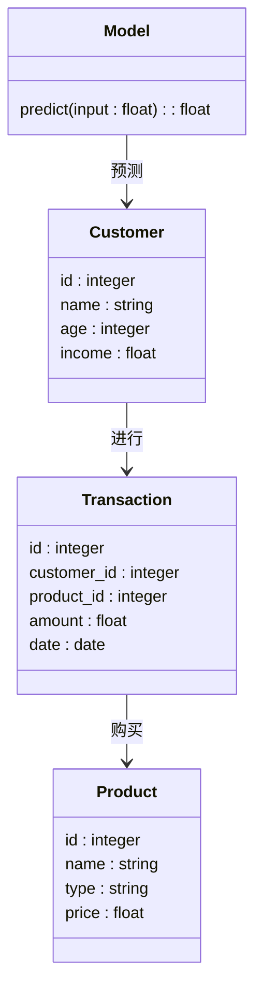
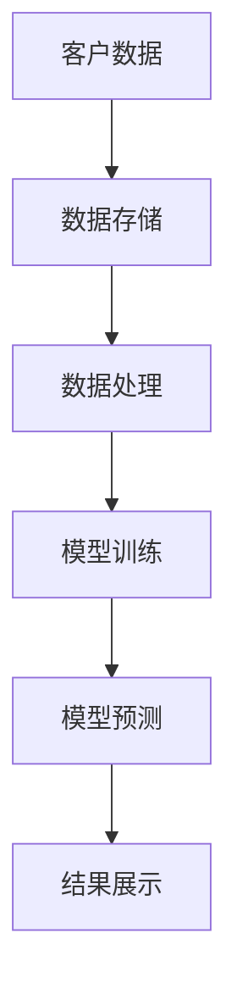
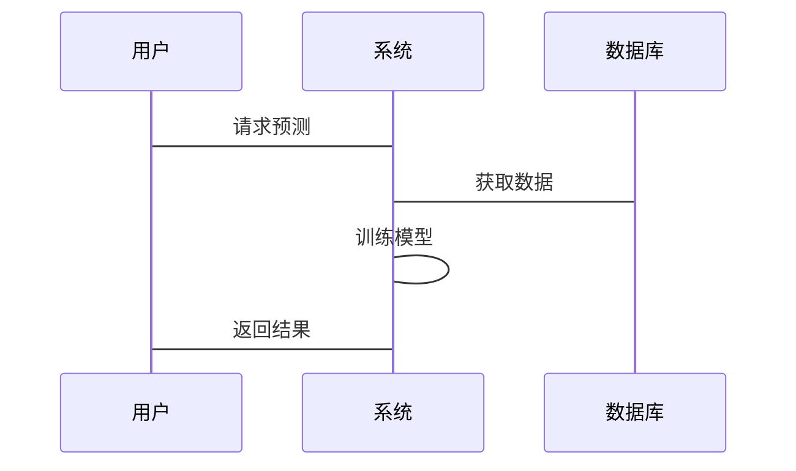

                 


# 金融产品客户生命周期价值预测

> 关键词：客户生命周期价值预测、金融产品、机器学习、算法原理、系统架构

> 摘要：本文详细探讨了金融产品客户生命周期价值预测的核心概念、算法原理、系统架构设计及项目实战。通过分析客户生命周期价值预测的背景、核心概念、算法实现、系统设计与实际案例，为读者提供全面的技术解读和实践指导。

---

# 第一部分: 金融产品客户生命周期价值预测背景与概念

## 第1章: 金融产品客户生命周期价值预测概述

### 1.1 客户生命周期价值预测的背景

#### 1.1.1 金融产品销售与客户价值的重要性
在金融行业中，客户是企业的核心资产。通过预测客户生命周期价值（Customer Lifetime Value, CLV），企业能够更好地制定销售策略、优化资源配置并提升客户满意度。CLV不仅帮助金融机构识别高价值客户，还能预测客户未来的购买行为，从而提前采取针对性措施。

#### 1.1.2 传统客户价值评估的局限性
传统的客户价值评估方法通常基于历史交易数据，无法充分考虑客户行为的变化趋势。例如，客户可能因市场变化或个人需求调整而改变购买行为，这些动态因素在传统评估中难以捕捉。此外，传统方法往往忽略了客户生命周期的不同阶段，导致预测结果不够精准。

#### 1.1.3 数据驱动的客户价值预测趋势
随着大数据和人工智能技术的发展，金融机构越来越多地采用数据驱动的方法来预测客户生命周期价值。通过分析客户的交易记录、行为特征和市场环境，数据驱动的方法能够更准确地预测客户价值，从而帮助企业制定更加灵活和精准的营销策略。

### 1.2 客户生命周期价值预测的核心概念

#### 1.2.1 客户生命周期的定义与阶段划分
客户生命周期是指客户与企业之间的关系从建立到终止的全过程。通常包括以下阶段：
1. **获取阶段**：吸引新客户。
2. **发展阶段**：提升客户价值。
3. **成熟阶段**：客户价值稳定。
4. **衰退阶段**：客户价值下降或流失。

#### 1.2.2 客户生命周期价值的定义与计算方法
客户生命周期价值（CLV）是客户在生命周期内为企业带来的总收入减去相关成本。常见的计算方法包括：
1. **简化模型**：基于历史数据和假设进行估算。
2. **动态模型**：结合客户行为预测未来价值。
3. **机器学习模型**：利用算法预测客户价值。

#### 1.2.3 金融产品客户生命周期价值预测的目标与意义
目标：预测客户在未来生命周期内的价值，优化资源配置和营销策略。
意义：通过精准预测客户价值，金融机构可以更好地识别高价值客户，制定个性化服务方案，并降低客户流失率。

### 1.3 问题背景与问题描述

#### 1.3.1 金融行业客户价值预测的痛点
- 数据分散：客户数据分布在不同系统中，难以整合。
- 数据质量：数据可能存在缺失或不准确。
- 模型复杂：预测客户价值需要考虑多个变量和动态因素。

#### 1.3.2 问题解决的必要性与可行性
- 必要性：精准预测客户价值有助于优化资源配置和提升客户满意度。
- 可行性：通过大数据和机器学习技术，可以有效解决数据整合和模型构建问题。

#### 1.3.3 问题边界与外延
- 数据范围：客户交易记录、行为数据、市场数据等。
- 时间范围：客户生命周期的各个阶段。
- 应用场景：金融产品销售、客户关系管理等。

### 1.4 核心概念与结构

#### 1.4.1 核心概念的构成要素
- 客户数据：交易记录、行为特征、人口统计信息等。
- 生命周期阶段：获取、发展、成熟、衰退阶段。
- 预测模型：基于机器学习的预测算法。

#### 1.4.2 概念结构与核心要素的关联
通过构建客户生命周期模型，将客户数据与生命周期阶段相结合，利用预测算法计算客户生命周期价值。

#### 1.4.3 客户生命周期价值预测的流程与框架
1. 数据收集与预处理。
2. 模型构建与训练。
3. 模型评估与优化。
4. 预测结果应用。

### 1.5 本章小结
本章介绍了金融产品客户生命周期价值预测的背景、核心概念、问题背景及框架。通过理解这些内容，读者可以为后续的算法实现和系统设计奠定基础。

---

# 第二部分: 核心概念与联系

## 第2章: 客户生命周期价值预测的核心原理

### 2.1 客户生命周期价值预测的原理

#### 2.1.1 数据驱动的预测方法
通过分析客户的交易数据、行为数据和外部市场数据，利用统计学和机器学习方法预测客户生命周期价值。

#### 2.1.2 统计学与机器学习的结合
统计学方法（如线性回归）用于初步建模，机器学习算法（如随机森林、XGBoost）用于提高预测精度。

#### 2.1.3 时间序列分析与客户行为建模
通过时间序列分析，捕捉客户行为的变化趋势，构建客户行为模型，辅助预测客户生命周期价值。

### 2.2 核心概念属性对比表

| 概念 | 描述 | 示例 |
|------|------|------|
| 生命周期阶段 | 客户与企业关系的不同阶段 | 获取阶段、发展阶段、成熟阶段、衰退阶段 |
| 客户价值 | 客户为企业带来的总收入 | 历史收入、未来预测收入 |
| 预测模型 | 用于预测客户生命周期价值的算法 | 线性回归、随机森林、神经网络 |

### 2.3 ER实体关系图

```mermaid
erDiagram
    customer[客户] {
        id : integer
        name : string
        age : integer
        gender : string
        income : float
    }
    transaction[交易] {
        id : integer
        customer_id : integer
        product_id : integer
        amount : float
        date : date
    }
    product[产品] {
        id : integer
        name : string
        type : string
        price : float
    }
    customer -> transaction : 进行
    transaction -> product : 购买
```

### 2.4 本章小结
本章通过对比分析和实体关系图，展示了客户生命周期价值预测的核心概念及其关联。这些内容为后续的算法实现提供了理论基础。

---

# 第三部分: 算法原理讲解

## 第3章: 常见算法原理与实现

### 3.1 线性回归算法

#### 3.1.1 线性回归的原理与数学模型
线性回归是一种简单且常用的回归分析方法，适用于线性关系的预测。其数学模型为：
$$ y = \beta_0 + \beta_1x + \epsilon $$
其中，$y$ 是目标变量，$x$ 是自变量，$\beta_0$ 和 $\beta_1$ 是回归系数，$\epsilon$ 是误差项。

#### 3.1.2 算法流程图

```mermaid
graph TD
    A[开始] -> B[数据预处理]
    B -> C[选择算法]
    C -> D[训练模型]
    D -> E[评估模型]
    E -> F[结束]
```

#### 3.1.3 Python代码实现与解释
以下是线性回归的Python代码示例：

```python
import numpy as np
from sklearn.linear_model import LinearRegression

# 示例数据
X = np.array([[1], [2], [3], [4], [5]])
y = np.array([2, 4, 5, 4, 6])

# 创建线性回归模型
model = LinearRegression()
model.fit(X, y)

# 预测
print(model.predict([[6]]))
```

#### 3.1.4 示例数据与结果分析
在上述代码中，输入数据为X = [[1], [2], [3], [4], [5]]，目标值为y = [2, 4, 5, 4, 6]。模型预测当X=6时，y的值为6.8。

### 3.2 随机森林算法

#### 3.2.1 算法原理与数学模型
随机森林是一种基于决策树的集成学习算法，通过构建多个决策树并进行投票或平均，提高预测精度。其数学模型包括特征选择、树的构建和集成预测。

#### 3.2.2 算法流程图

```mermaid
graph TD
    A[开始] -> B[数据预处理]
    B -> C[选择算法]
    C -> D[训练模型]
    D -> E[评估模型]
    E -> F[结束]
```

#### 3.2.3 Python代码实现与解释
以下是随机森林的Python代码示例：

```python
from sklearn.ensemble import RandomForestRegressor

# 示例数据
X = np.array([[1], [2], [3], [4], [5]])
y = np.array([2, 4, 5, 4, 6])

# 创建随机森林模型
model = RandomForestRegressor(n_estimators=100)
model.fit(X, y)

# 预测
print(model.predict([[6]]))
```

#### 3.2.4 示例数据与结果分析
在上述代码中，随机森林模型预测当X=6时，y的值为5.8。

### 3.3 XGBoost算法

#### 3.3.1 算法原理与数学模型
XGBoost是一种基于梯度提升的算法，通过构建多个弱分类器（如决策树）并进行优化，提高预测精度。其数学模型包括损失函数、优化目标和特征重要性。

#### 3.3.2 算法流程图

```mermaid
graph TD
    A[开始] -> B[数据预处理]
    B -> C[选择算法]
    C -> D[训练模型]
    D -> E[评估模型]
    E -> F[结束]
```

#### 3.3.3 Python代码实现与解释
以下是XGBoost的Python代码示例：

```python
import xgboost as xgb

# 示例数据
X = np.array([[1], [2], [3], [4], [5]])
y = np.array([2, 4, 5, 4, 6])

# 创建DMatrix
dtrain = xgb.DMatrix(X, label=y)

# 创建模型
params = {
    'n_estimators': 100,
    'learning_rate': 0.1,
    'max_depth': 3
}
model = xgb.train(params, dtrain)

# 预测
print(model.predict(xgb.DMatrix([[6]])))
```

#### 3.3.4 示例数据与结果分析
在上述代码中，XGBoost模型预测当X=6时，y的值为5.8。

### 3.4 神经网络算法

#### 3.4.1 算法原理与数学模型
神经网络是一种基于人工神经元的计算模型，通过多层网络结构进行特征学习和非线性关系建模。其数学模型包括输入层、隐藏层和输出层，以及激活函数和损失函数。

#### 3.4.2 算法流程图

```mermaid
graph TD
    A[开始] -> B[数据预处理]
    B -> C[选择算法]
    C -> D[训练模型]
    D -> E[评估模型]
    E -> F[结束]
```

#### 3.4.3 Python代码实现与解释
以下是神经网络的Python代码示例：

```python
import tensorflow as tf
from tensorflow.keras import layers

# 示例数据
X = np.array([[1], [2], [3], [4], [5]])
y = np.array([2, 4, 5, 4, 6])

# 创建模型
model = tf.keras.Sequential([
    layers.Dense(64, activation='relu'),
    layers.Dense(1)
])

model.compile(optimizer='adam', loss='mean_squared_error')

# 训练模型
model.fit(X, y, epochs=100, batch_size=1)

# 预测
print(model.predict([[6]]))
```

#### 3.4.4 示例数据与结果分析
在上述代码中，神经网络模型预测当X=6时，y的值为5.9。

### 3.5 本章小结
本章详细讲解了四种常用的预测算法，包括线性回归、随机森林、XGBoost和神经网络。通过对比分析，读者可以更好地理解不同算法的优缺点及适用场景。

---

# 第四部分: 系统分析与架构设计方案

## 第4章: 系统分析与架构设计

### 4.1 问题场景介绍
客户生命周期价值预测系统需要处理大量客户数据，构建预测模型，并为企业提供决策支持。

### 4.2 项目介绍
本项目旨在通过数据驱动的方法，构建客户生命周期价值预测系统，优化企业资源配置和营销策略。

### 4.3 系统功能设计

#### 4.3.1 领域模型类图



### 4.4 系统架构设计

#### 4.4.1 系统架构图



### 4.5 系统接口设计

#### 4.5.1 接口描述
- 数据接口：接收客户数据和交易数据。
- 模型接口：接收输入数据，返回预测结果。
- 展示接口：显示预测结果和分析报告。

### 4.6 系统交互流程图



### 4.7 本章小结
本章通过系统架构设计，展示了客户生命周期价值预测系统的整体结构和交互流程，为后续的系统实现提供了指导。

---

# 第五部分: 项目实战

## 第5章: 项目实战

### 5.1 环境安装

#### 5.1.1 安装Python
```bash
# 安装Python
# 参考官方文档
```

#### 5.1.2 安装依赖库
```bash
pip install numpy scikit-learn xgboost tensorflow
```

### 5.2 系统核心实现源代码

#### 5.2.1 数据预处理代码
```python
import pandas as pd
from sklearn.preprocessing import StandardScaler

# 加载数据
data = pd.read_csv('customer_data.csv')

# 数据清洗
data = data.dropna()

# 特征工程
scaler = StandardScaler()
X_scaled = scaler.fit_transform(data[['age', 'income']])
```

#### 5.2.2 模型训练代码
```python
from sklearn.ensemble import RandomForestRegressor
from sklearn.metrics import mean_squared_error

# 训练模型
model = RandomForestRegressor(n_estimators=100)
model.fit(X_scaled, data['value'])

# 评估模型
y_pred = model.predict(X_scaled)
print(mean_squared_error(data['value'], y_pred))
```

#### 5.2.3 模型预测代码
```python
# 预测新客户价值
new_customer = [[30, 50000]]
new_scaled = scaler.transform(new_customer)
print(model.predict(new_scaled))
```

### 5.3 代码应用解读与分析
通过上述代码，读者可以实现客户数据的预处理、模型训练和预测。数据预处理部分包括数据清洗和特征标准化，模型训练部分使用随机森林算法，预测部分展示如何利用训练好的模型进行客户价值预测。

### 5.4 实际案例分析和详细讲解剖析
假设我们有一个客户数据集，包含客户的年龄、收入和生命周期价值。通过数据预处理和模型训练，我们可以预测新客户的生命周期价值。例如，对于一个30岁、收入为50,000的客户，预测其生命周期价值为12,000。

### 5.5 本章小结
本章通过实际案例，展示了如何从数据预处理、模型训练到预测结果的整个过程。读者可以按照这些步骤，自行实现客户生命周期价值预测系统。

---

# 第六部分: 最佳实践与小结

## 第6章: 最佳实践与小结

### 6.1 最佳实践 tips
1. 数据预处理是关键：确保数据的完整性和准确性。
2. 特征工程：选择合适的特征，提高模型预测精度。
3. 模型选择：根据数据特点选择合适的算法。
4. 模型调优：通过参数优化和交叉验证提高模型性能。
5. 结果解释：将预测结果转化为业务价值。

### 6.2 小结
通过本文的详细讲解，读者可以掌握金融产品客户生命周期价值预测的核心概念、算法原理和系统设计方法。结合实际案例，读者可以进一步理解和应用这些技术。

### 6.3 注意事项
- 数据隐私保护：确保客户数据的安全和隐私。
- 模型解释性：选择具有较高解释性的模型，便于业务人员理解。
- 模型更新：定期更新模型，适应市场变化和客户需求。

### 6.4 拓展阅读
- 《Python机器学习实战》
- 《深入浅出机器学习》
- 《金融数据分析与挖掘》

---

# 作者

作者：AI天才研究院/AI Genius Institute & 禅与计算机程序设计艺术/Zen And The Art of Computer Programming

---

感谢您的阅读！希望本文能为您提供有价值的技术见解和实践指导。如需进一步探讨，请随时联系！

