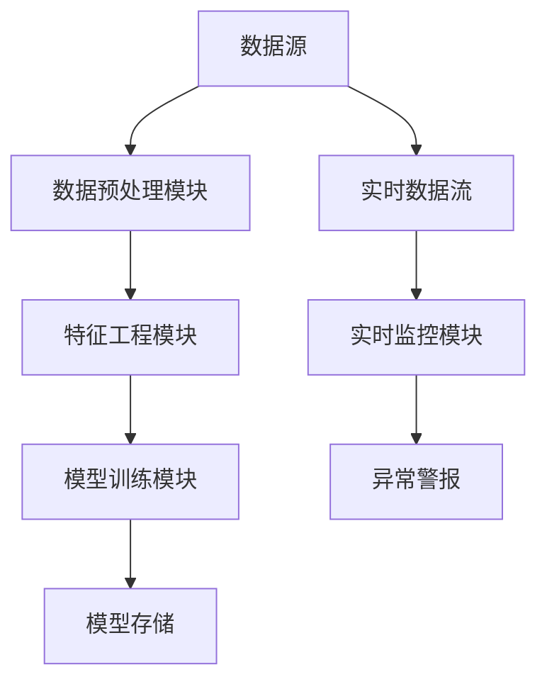
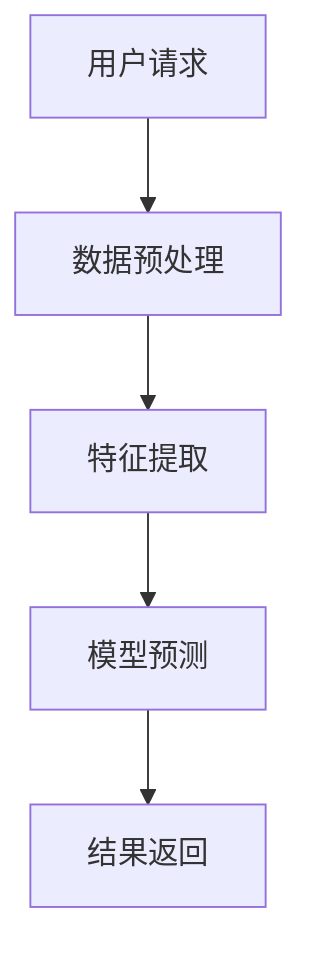
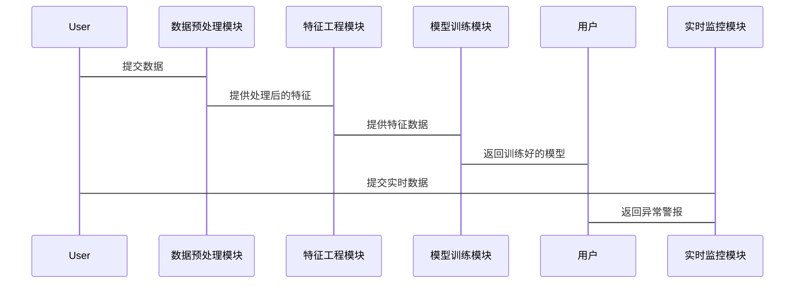

                 


# 《金融时序数据异常检测的AI方法》

> 关键词：金融时序数据，异常检测，人工智能，机器学习，深度学习

> 摘要：本文系统地探讨了金融时序数据异常检测的AI方法，从统计学方法到机器学习、深度学习，全面分析了各类算法的原理、实现及优缺点，并结合实际案例进行详细讲解。文章最后总结了当前研究的成果与未来的研究方向。

---

# 第一部分: 金融时序数据异常检测的背景与基础

## 第1章: 金融时序数据异常检测概述

### 1.1 金融时序数据的定义与特点

#### 1.1.1 金融时序数据的定义
金融时序数据是指在金融领域中，按照时间顺序记录的各类金融资产的价格、交易量、收益率等数据。这些数据通常具有连续性、周期性、波动性等特征。

#### 1.1.2 金融时序数据的核心特点
1. **连续性**：金融数据通常是按时间顺序连续记录的，例如分钟、小时、日、周等。
2. **波动性**：金融市场的价格波动较大，受多种因素影响，如经济指标、政策变化、市场情绪等。
3. **相关性**：金融资产之间往往存在较强的相关性，例如股票价格与市场指数密切相关。
4. **异常性**：金融市场中常常出现异常事件，如市场操纵、突发事件等，这些异常事件会对市场产生显著影响。

#### 1.1.3 异常检测在金融领域的意义
1. **风险管理**：通过检测异常数据，可以及时发现潜在的市场风险，例如欺诈交易、市场操纵等。
2. **投资机会**：异常数据可能预示着市场拐点或投资机会，例如价格突变可能意味着买点或卖点。
3. **监管合规**：金融监管机构需要检测市场中的异常行为，确保市场的公平性和合规性。

### 1.2 金融时序数据异常检测的背景与挑战

#### 1.2.1 金融市场的复杂性
金融市场是一个高度复杂的系统，涉及多种因素的相互作用，例如经济指标、政策变化、市场情绪等。这些因素使得金融数据的异常检测更加复杂。

#### 1.2.2 异常检测的常见挑战
1. **数据稀疏性**：金融数据中异常事件往往较少，导致模型难以学习到足够的异常模式。
2. **数据噪声**：金融市场中的噪声较多，例如高频交易中的微小波动可能被误认为异常。
3. **模型鲁棒性**：异常检测模型需要具有较强的鲁棒性，能够适应市场的快速变化和数据分布的偏移。

#### 1.2.3 AI技术在异常检测中的优势
1. **数据处理能力**：AI技术能够处理海量的金融数据，并从中提取有用的信息。
2. **模式识别能力**：AI技术能够发现复杂的模式和异常，尤其是在非线性关系和高维空间中表现突出。
3. **实时性**：AI技术可以实现实时监控和异常检测，满足金融市场的实时性要求。

### 1.3 本书的核心目标与内容框架

#### 1.3.1 本书的核心目标
本书旨在系统地介绍金融时序数据异常检测的AI方法，从理论到实践，全面分析各类算法的原理、实现及优缺点，并结合实际案例进行详细讲解。

#### 1.3.2 内容框架概述
1. 第一部分：介绍金融时序数据异常检测的背景与基础。
2. 第二部分：讲解金融时序数据异常检测的核心概念与方法。
3. 第三部分：深入探讨深度学习方法在金融时序数据异常检测中的应用。
4. 第四部分：系统分析与架构设计，结合实际案例进行详细讲解。
5. 第五部分：总结与展望，探讨未来的研究方向。

#### 1.3.3 学习本书的必要性
通过学习本书，读者可以掌握金融时序数据异常检测的核心方法和技巧，能够将AI技术应用于实际的金融数据分析中，提升风险管理、投资决策和监管合规的能力。

---

## 第2章: 金融时序数据异常检测的核心概念

### 2.1 异常检测的基本概念与分类

#### 2.1.1 异常检测的定义
异常检测是指通过分析数据，识别出与正常数据显著不同的数据点或模式。在金融领域，异常检测可以帮助发现市场操纵、欺诈交易等行为。

#### 2.1.2 异常检测的分类
1. **基于统计的方法**：如Z-score、LOF（局部异常因子）等。
2. **基于机器学习的方法**：如支持向量机（SVM）、随机森林等。
3. **基于深度学习的方法**：如RNN、LSTM、Transformer等。

#### 2.1.3 异常检测的评价指标
1. **准确率（Accuracy）**：正确识别的正常样本和异常样本的比例。
2. **召回率（Recall）**：正确识别的异常样本比例。
3. **F1分数**：综合准确率和召回率的指标。

### 2.2 金融时序数据的特征与异常类型

#### 2.2.1 金融时序数据的特征
1. **连续性**：金融数据通常是连续的，按时间顺序记录。
2. **波动性**：金融市场的价格波动较大，受多种因素影响。
3. **相关性**：金融资产之间往往存在较强的相关性。

#### 2.2.2 异常类型及其影响
1. **孤立异常**：单个异常点，如某只股票的价格突然暴跌。
2. **群体异常**：多个相关样本的异常，如市场操纵导致多只股票价格异常。
3. **趋势异常**：价格趋势的突然变化，如从上涨趋势突然变为下跌趋势。

#### 2.2.3 异常检测的边界与外延
1. **边界**：异常检测的范围和阈值需要明确，避免误报和漏报。
2. **外延**：异常检测的结果需要结合具体业务场景进行解释和应用。

### 2.3 异常检测的核心要素与组成

#### 2.3.1 数据预处理的重要性
1. **数据清洗**：处理缺失值、异常值等。
2. **数据变换**：如归一化、标准化等，以便模型更好地处理数据。

#### 2.3.2 模型选择与优化
1. **模型选择**：根据数据特点选择合适的模型，如时间序列模型、深度学习模型等。
2. **模型优化**：通过调整超参数、数据增强等方法提升模型性能。

#### 2.3.3 结果解释与反馈机制
1. **结果解释**：将模型的输出转化为业务可理解的解释，如“某只股票在某时间点出现异常”。
2. **反馈机制**：根据异常检测结果调整模型参数或业务策略。

---

## 第3章: 金融时序数据异常检测的统计学方法

### 3.1 统计学方法的基本原理

#### 3.1.1 统计学方法的定义
统计学方法是基于统计理论，通过分析数据的分布特性来识别异常点。

#### 3.1.2 统计学方法的核心原理
统计学方法通常假设数据服从某种分布，如正态分布、t分布等。通过计算数据点的概率密度或距离均值的距离，判断是否为异常点。

#### 3.1.3 统计学方法的优缺点
1. **优点**：简单易懂，计算效率高。
2. **缺点**：假设数据分布，可能不适用于复杂场景。

### 3.2 常见统计学方法的实现

#### 3.2.1 Z-score方法
Z-score方法通过计算数据点与均值的距离标准化值来判断是否为异常点。公式如下：

$$ Z = \frac{X - \mu}{\sigma} $$

其中，$X$ 是数据点，$\mu$ 是均值，$\sigma$ 是标准差。

#### 3.2.2 LOF（局部异常因子）算法
LOF算法通过计算局部密度比来判断异常点。公式如下：

$$ LOF(x) = \frac{reach(x)}{k(x)} $$

其中，$reach(x)$ 是点 $x$ 的可到达密度，$k(x)$ 是点 $x$ 的局部密度。

#### 3.2.3 Isolation Forest算法
Isolation Forest算法通过构建随机树来隔离异常点。其核心思想是，异常点更容易被单独隔离。

### 3.3 统计学方法的优缺点分析

#### 3.3.1 统计学方法的优点
1. 实现简单，计算效率高。
2. 对正常数据分布的假设简单，易于解释。

#### 3.3.2 统计学方法的缺点
1. 无法处理复杂的数据分布。
2. 对异常点的检测能力有限，尤其在数据分布复杂的情况下。

#### 3.3.3 统计学方法的适用场景
1. 数据分布简单，如正态分布。
2. 异常点较少，且较为明显。

---

## 第4章: 金融时序数据异常检测的机器学习方法

### 4.1 机器学习方法的基本原理

#### 4.1.1 机器学习的定义
机器学习是一种通过数据学习模型，从而实现对新数据进行预测或分类的技术。

#### 4.1.2 机器学习的核心原理
机器学习通过训练数据，学习数据的特征和模式，从而能够对新数据进行分类或预测。

#### 4.1.3 机器学习方法的优缺点
1. **优点**：能够处理复杂的数据分布，学习能力强。
2. **缺点**：计算资源需求较高，模型解释性较差。

### 4.2 常见机器学习方法的实现

#### 4.2.1 支持向量机（SVM）
支持向量机通过构建超平面，将数据分为正常和异常两类。其核心思想是最大化类别之间的间隔。

#### 4.2.2 随机森林
随机森林通过构建多个决策树，集成模型的预测结果，从而提高模型的准确性和鲁棒性。

#### 4.2.3 K-近邻算法（KNN）
K近邻算法通过计算数据点与最近邻居的距离，判断是否为异常点。

### 4.3 机器学习方法的优缺点分析

#### 4.3.1 机器学习方法的优点
1. 能够处理复杂的数据分布。
2. 模型具有较高的鲁棒性和准确性。

#### 4.3.2 机器学习方法的缺点
1. 计算资源需求较高。
2. 模型解释性较差。

#### 4.3.3 机器学习方法的适用场景
1. 数据分布复杂，难以用简单的统计方法描述。
2. 异常点较多，需要较高的检测精度。

---

## 第5章: 金融时序数据异常检测的深度学习方法

### 5.1 深度学习方法的基本原理

#### 5.1.1 深度学习的定义
深度学习是一种基于人工神经网络的机器学习方法，通过多层非线性变换，学习数据的高层次特征。

#### 5.1.2 深度学习的核心原理
深度学习通过构建深层网络，学习数据的高层次特征，从而能够捕捉到复杂的模式和异常。

#### 5.1.3 深度学习方法的优缺点
1. **优点**：能够捕捉到复杂的模式，模型表达能力强。
2. **缺点**：计算资源需求高，模型训练时间长。

### 5.2 常见深度学习方法的实现

#### 5.2.1 RNN（循环神经网络）
RNN通过循环结构，处理序列数据，能够捕捉时序数据的依赖关系。

#### 5.2.2 LSTM（长短期记忆网络）
LSTM通过引入记忆单元，能够捕捉长序列中的异常。

#### 5.2.3 Transformer
Transformer通过自注意力机制，能够捕捉全局依赖关系，适用于长序列数据。

### 5.3 深度学习方法的优缺点分析

#### 5.3.1 深度学习方法的优点
1. 能够捕捉到复杂的模式和异常。
2. 模型表达能力强，适用于复杂的金融时序数据。

#### 5.3.2 深度学习方法的缺点
1. 计算资源需求高。
2. 模型训练时间长，难以实时应用。

#### 5.3.3 深度学习方法的适用场景
1. 数据分布复杂，需要捕捉高层次特征。
2. 需要处理长序列数据，捕捉全局依赖关系。

---

## 第6章: 系统分析与架构设计

### 6.1 系统功能设计

#### 6.1.1 数据预处理模块
数据预处理模块负责清洗和转换原始数据，包括缺失值处理、归一化等。

#### 6.1.2 特征工程模块
特征工程模块负责从数据中提取特征，例如技术指标、市场情绪指标等。

#### 6.1.3 模型训练模块
模型训练模块负责训练异常检测模型，包括选择模型类型、调整超参数等。

#### 6.1.4 实时监控模块
实时监控模块负责对实时数据进行异常检测，输出异常警报。

### 6.2 系统架构设计

#### 6.2.1 系统架构图


#### 6.2.2 数据流图


### 6.3 系统接口设计

#### 6.3.1 数据接口
1. 数据输入接口：接收原始数据或实时数据流。
2. 数据输出接口：输出处理后的特征或模型预测结果。

#### 6.3.2 模型接口
1. 模型训练接口：接收训练数据，输出训练好的模型。
2. 模型预测接口：接收实时数据，输出异常检测结果。

### 6.4 系统交互设计

#### 6.4.1 交互流程图


---

## 第7章: 项目实战

### 7.1 环境安装

#### 7.1.1 环境配置
1. 安装Python
2. 安装相关库：numpy、pandas、scikit-learn、keras、tensorflow等。

#### 7.1.2 数据集获取
1. 数据来源：例如Yahoo Finance、Google Finance等。
2. 数据格式：CSV格式，包含股票价格、交易量等信息。

### 7.2 核心实现

#### 7.2.1 数据预处理
```python
import pandas as pd
import numpy as np

# 读取数据
data = pd.read_csv('stock_price.csv')

# 处理缺失值
data = data.dropna()

# 归一化
from sklearn.preprocessing import MinMaxScaler
scaler = MinMaxScaler()
data_scaled = scaler.fit_transform(data)
```

#### 7.2.2 模型实现
```python
from keras.models import Sequential
from keras.layers import LSTM, Dense

# 构建LSTM模型
model = Sequential()
model.add(LSTM(64, input_shape=(timesteps, features)))
model.add(Dense(1, activation='sigmoid'))
model.compile(loss='binary_crossentropy', optimizer='adam', metrics=['accuracy'])
```

#### 7.2.3 模型训练
```python
model.fit(X_train, y_train, epochs=10, batch_size=32, validation_split=0.2)
```

#### 7.2.4 实时监控
```python
def detect_anomaly(real_time_data):
    # 数据预处理
    processed_data = preprocess(real_time_data)
    # 模型预测
    prediction = model.predict(processed_data)
    # 判断异常
    if prediction > 0.5:
        return True
    else:
        return False
```

### 7.3 案例分析

#### 7.3.1 股票价格异常检测
通过构建LSTM模型，实时监控股票价格变化，及时发现异常波动。

#### 7.3.2 市场操纵检测
通过分析交易量和价格的异常变化，识别可能的市场操纵行为。

### 7.4 项目小结
通过实际案例分析，展示了如何将AI技术应用于金融时序数据异常检测。从数据预处理到模型训练，再到实时监控，整个流程需要精心设计和优化。

---

## 第8章: 总结与展望

### 8.1 总结
本文系统地介绍了金融时序数据异常检测的AI方法，从统计学方法到机器学习、深度学习，全面分析了各类算法的原理、实现及优缺点，并结合实际案例进行详细讲解。

### 8.2 未来研究方向
1. **多模态数据融合**：结合文本、图像等多种数据源，提升异常检测的准确性和鲁棒性。
2. **强化学习应用**：探索强化学习在异常检测中的应用，如动态策略调整。
3. **实时性优化**：研究如何在保证准确性的同时，提升模型的实时性，满足金融市场的实时监控需求。

---

## 作者信息
作者：AI天才研究院/AI Genius Institute  
联系邮箱：contact@ai-genius.com  
官方网站：https://www.ai-genius.com

