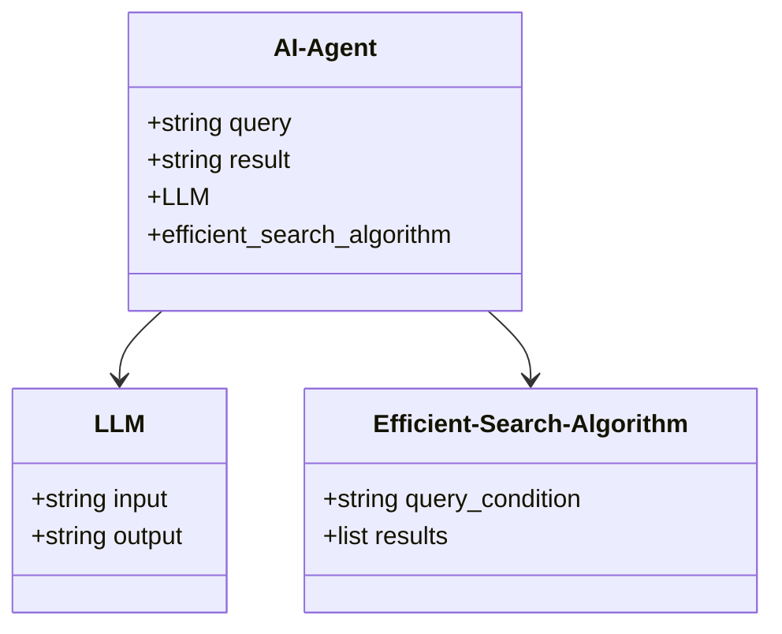
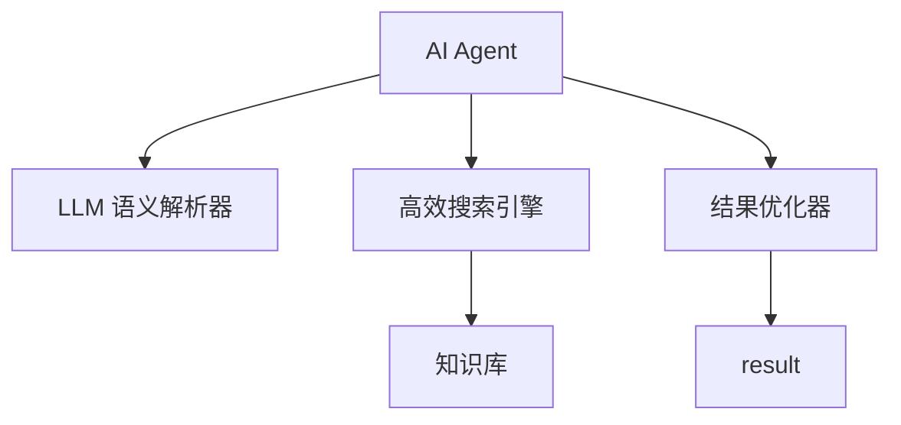
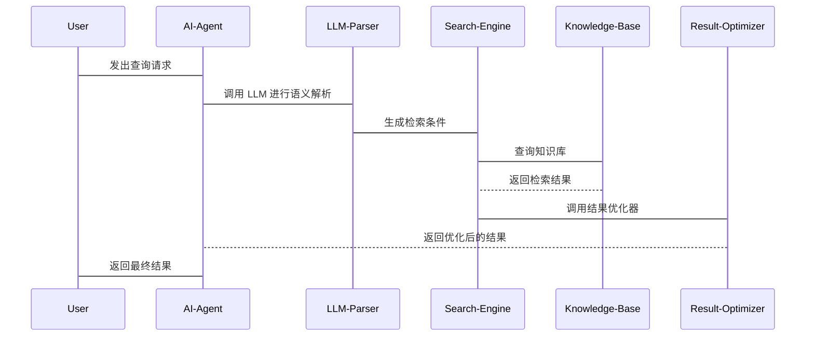

                 


# AI Agent 的知识检索增强：结合 LLM 与高效搜索算法

> 关键词：AI Agent, 知识检索, 大语言模型（LLM), 高效搜索算法, 知识图谱

> 摘要：本文探讨了如何通过结合大语言模型（LLM）与高效搜索算法来增强AI Agent的知识检索能力。文章从问题背景出发，分析了知识检索增强的目标和实现路径，详细讲解了AI Agent、LLM和高效搜索算法的核心原理及其相互关系，深入分析了算法的数学模型和实现细节，并通过一个实际案例展示了如何设计和实现一个结合LLM与高效搜索算法的知识检索增强系统。最后，本文总结了最佳实践和注意事项，为读者提供了实用的指导。

---

# 第1章: AI Agent 的知识检索增强概述

## 1.1 问题背景与描述

### 1.1.1 知识检索的基本概念
知识检索是指从大规模知识库中快速、准确地获取所需信息的过程。传统的知识检索方法依赖于关键字匹配和基于向量的相似度计算，但在面对复杂语义和上下文理解时，往往显得力不从心。

### 1.1.2 AI Agent 在知识检索中的角色
AI Agent（人工智能代理）是一种能够感知环境、理解用户需求并执行任务的智能实体。在知识检索中，AI Agent 负责接收用户查询，解析需求，调用知识库中的信息，并通过LLM（大语言模型）进行语义理解和生成，从而为用户提供更智能、更准确的结果。

### 1.1.3 当前知识检索的主要挑战
- **语义理解不足**：传统检索方法难以理解查询的深层语义。
- **知识库的规模和复杂性**：随着知识库的扩大，检索效率成为瓶颈。
- **动态更新与实时性**：知识库的动态变化要求检索系统具备实时更新能力。
- **多模态数据处理**：现代知识检索需要处理文本、图像等多种数据类型。

## 1.2 问题解决与边界

### 1.2.1 知识检索增强的目标
通过结合LLM和高效搜索算法，提升知识检索的语义理解能力、检索效率和结果准确性，使AI Agent能够更智能地理解和回答用户查询。

### 1.2.2 AI Agent 的能力边界
AI Agent 的知识检索增强能力受限于以下几个方面：
- **知识库的质量**：知识库的覆盖范围和准确性直接影响检索结果。
- **LLM 的性能**：LLM 的参数规模和训练数据影响语义理解和生成能力。
- **搜索算法的效率**：算法的复杂度和优化程度决定检索速度和成本。

### 1.2.3 知识检索增强的实现路径
1. **语义解析**：通过LLM对用户查询进行语义解析，生成更精确的检索条件。
2. **高效检索**：利用高效搜索算法从知识库中快速获取相关数据。
3. **结果优化**：结合LLM对检索结果进行语义优化，生成更符合用户需求的回答。

## 1.3 概念结构与核心要素

### 1.3.1 核心概念的定义
- **AI Agent**：一种能够感知环境、理解用户需求并执行任务的智能实体。
- **LLM（Large Language Model）**：基于大规模数据训练的深度学习模型，能够理解并生成人类语言。
- **高效搜索算法**：用于快速从大规模数据中检索相关信息的算法，如BM25、DPR等。

### 1.3.2 核心要素的特征对比
| 概念       | 输入           | 输出           | 特征描述                     |
|------------|----------------|----------------|------------------------------|
| AI Agent   | 用户查询       | 检索结果       | 智能化、语义理解能力强       |
| LLM        | 文本上下文     | 文本生成       | 大规模训练、语义能力强       |
| 高效搜索算法 | 查询条件       | 结构化数据     | 高效、精准的检索能力         |

### 1.3.3 概念结构的ER实体关系图

```mermaid
er
actor(Agent, "知识检索增强")
```

---

## 1.4 本章小结
本章从背景出发，介绍了AI Agent的知识检索增强的目标、挑战和实现路径，为后续内容奠定了基础。

---

# 第2章: 核心概念与联系

## 2.1 AI Agent 的核心原理

### 2.1.1 AI Agent 的定义与属性
AI Agent 是一种能够感知环境、理解用户需求并执行任务的智能实体。其核心属性包括：
- **感知能力**：通过多种传感器或接口获取环境信息。
- **决策能力**：基于获取的信息做出决策。
- **执行能力**：根据决策执行任务并返回结果。

### 2.1.2 LLM 的工作原理
LLM（Large Language Model）是一种基于深度学习的自然语言处理模型，通过大量数据的训练，能够理解并生成人类语言。其工作原理主要包括：
1. **输入处理**：接收用户输入的文本。
2. **内部处理**：通过模型的神经网络层进行语义分析和生成。
3. **输出结果**：生成与输入相关的文本输出。

### 2.1.3 高效搜索算法的实现机制
高效搜索算法通过优化索引结构和搜索策略，实现快速、精准的检索。常见的高效搜索算法包括：
- **BM25**：基于概率的检索算法，常用于文本检索。
- **DPR（Dense Passage Retrieval）**：基于向量的检索算法，适用于大规模知识库。

## 2.2 核心概念的联系

### 2.2.1 AI Agent 与 LLM 的关系
AI Agent 通过调用LLM来实现语义理解和生成，LLM为AI Agent 提供强大的语义处理能力。

### 2.2.2 LLM 与高效搜索算法的结合
LLM 用于语义解析和结果优化，高效搜索算法用于快速检索知识库中的相关信息，两者结合能够提升知识检索的效率和准确性。

### 2.2.3 知识检索增强的整体架构
整体架构包括以下几个部分：
1. **用户查询**：用户向AI Agent 提出查询请求。
2. **语义解析**：AI Agent 使用LLM对查询进行语义解析，生成检索条件。
3. **高效检索**：AI Agent 调用高效搜索算法从知识库中检索相关信息。
4. **结果优化**：AI Agent 使用LLM对检索结果进行优化，生成最终的回答。

## 2.3 核心概念对比表

| 概念       | 输入           | 输出           | 特征描述                     |
|------------|----------------|----------------|------------------------------|
| AI Agent   | 用户查询       | 检索结果       | 智能化、语义理解能力强       |
| LLM        | 文本上下文     | 文本生成       | 大规模训练、语义能力强       |
| 高效搜索算法 | 查询条件       | 结构化数据     | 高效、精准的检索能力         |

---

## 2.4 本章小结
本章详细讲解了AI Agent、LLM和高效搜索算法的核心原理及其相互关系，为后续的算法实现和系统设计奠定了基础。

---

# 第3章: 算法原理与实现

## 3.1 算法原理讲解

### 3.1.1 基于LLM的知识检索流程
1. **用户查询**：用户向AI Agent 提出查询请求。
2. **语义解析**：AI Agent 使用LLM对查询进行语义解析，生成检索条件。
3. **高效检索**：AI Agent 调用高效搜索算法从知识库中检索相关信息。
4. **结果优化**：AI Agent 使用LLM对检索结果进行优化，生成最终的回答。

### 3.1.2 高效搜索算法的优化策略
- **索引优化**：通过构建高效的索引结构（如倒排索引）提升检索速度。
- **向量检索**：利用向量表示法（如BM25、DPR）提升检索精度。
- **分治策略**：将大规模数据划分为多个子集，分别检索后再合并结果。

### 3.1.3 知识检索增强的数学模型

#### 3.1.3.1 检索模型
$$
\text{score}(q, d) = \text{BM25}(q, d)
$$

其中，$q$ 是查询，$d$ 是文档，BM25 是基于概率的检索算法。

#### 3.1.3.2 优化模型
$$
\text{score}(q, d) = \text{DPR}(q, d)
$$

其中，DPR 是基于向量的检索算法，通过计算查询向量和文档向量的相似度来确定检索结果。

---

### 3.1.4 详细实现步骤
1. **输入处理**：接收用户查询。
2. **语义解析**：生成检索条件。
3. **高效检索**：从知识库中检索相关信息。
4. **结果优化**：对检索结果进行语义优化。

## 3.2 算法实现的数学模型

### 3.2.1 LLM 的概率分布模型
$$
P(w_i | w_{i-1}, ..., w_1) = \text{模型生成的概率分布}
$$

### 3.2.2 高效搜索算法的相似度计算
$$
\text{similarity}(q, d) = \frac{\sum_{i=1}^n q_i \cdot d_i}{\sqrt{\sum_{i=1}^n q_i^2} \cdot \sqrt{\sum_{i=1}^n d_i^2}}
$$

其中，$q$ 是查询向量，$d$ 是文档向量，$\cdot$ 表示点积。

---

## 3.3 本章小结
本章详细讲解了知识检索增强的算法原理和实现步骤，通过数学模型和流程图的形式，展示了如何结合LLM和高效搜索算法来实现更智能的知识检索。

---

# 第4章: 系统分析与架构设计

## 4.1 系统功能设计

### 4.1.1 系统功能模块
- **用户查询模块**：接收用户查询。
- **语义解析模块**：生成检索条件。
- **高效检索模块**：从知识库中检索相关信息。
- **结果优化模块**：对检索结果进行语义优化。

### 4.1.2 领域模型类图



---

## 4.2 系统架构设计

### 4.2.1 系统架构图



---

## 4.3 接口设计

### 4.3.1 API 接口定义
- **输入接口**：接收用户查询。
- **输出接口**：返回优化后的检索结果。

### 4.3.2 交互流程



---

## 4.4 本章小结
本章通过系统功能设计、架构设计和接口设计，展示了如何结合LLM和高效搜索算法实现知识检索增强系统。

---

# 第5章: 项目实战

## 5.1 环境安装

### 5.1.1 安装依赖
- **Python 3.x**
- **Hugging Face Transformers库**：用于调用LLM。
- **FAISS**：用于高效的向量检索。
- **其他依赖**：根据具体需求选择。

### 5.1.2 安装命令
```bash
pip install transformers faiss-cpu
```

---

## 5.2 核心代码实现

### 5.2.1 AI Agent 类

```python
from transformers import LlamaForCausalInference, LlamaTokenizer
import faiss

class AI-Agent:
    def __init__(self):
        self.llm = LlamaForCausalInference.from_pretrained('your-model')
        self.tokenizer = LlamaTokenizer.from_pretrained('your-model')
        self.index = faiss.IndexFlatL2(100)  # 假设向量维度为100
        self.index.add(all_vectors)
    
    def semantic_parsing(self, query):
        inputs = self.tokenizer(query, return_tensors='np')
        outputs = self.llm.generate(**inputs)
        return outputs
```

### 5.2.2 高效检索模块

```python
def efficient_search(query_condition, index):
    query_vector = get_query_vector(query_condition)
    D, I = index.search(query_vector, k=5)
    return retrieve_results(I)
```

---

## 5.3 案例分析

### 5.3.1 案例场景
用户查询：“查找关于量子计算的最新研究进展。”

### 5.3.2 实现步骤
1. **语义解析**：生成检索条件。
2. **高效检索**：从知识库中检索相关信息。
3. **结果优化**：对检索结果进行语义优化。

---

## 5.4 项目总结
通过本章的实战，读者可以了解如何在实际项目中结合LLM和高效搜索算法实现知识检索增强系统。

---

# 第6章: 最佳实践与注意事项

## 6.1 关键点总结
- **模型选择**：选择合适的LLM和高效搜索算法。
- **数据准备**：确保知识库的质量和准确性。
- **系统优化**：通过索引优化和向量检索提升效率。

## 6.2 注意事项
- **性能优化**：在大规模数据下，需要优化索引和检索效率。
- **模型调优**：根据具体需求对LLM进行微调和优化。
- **结果验证**：通过人工审核和自动化测试确保检索结果的准确性。

## 6.3 拓展阅读
- **相关论文**：阅读最新的研究成果，了解前沿技术。
- **工具与库**：学习使用Hugging Face Transformers和FAISS等工具。

---

# 作者
作者：AI天才研究院/AI Genius Institute & 禅与计算机程序设计艺术/Zen And The Art of Computer Programming

