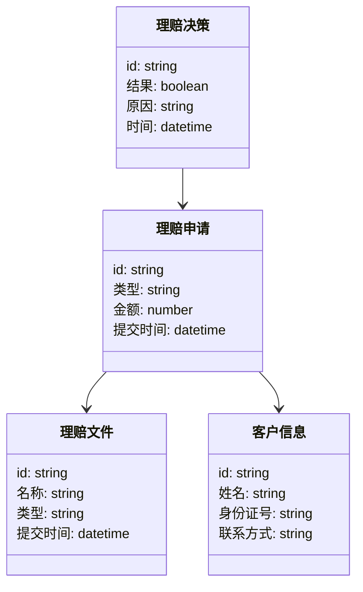
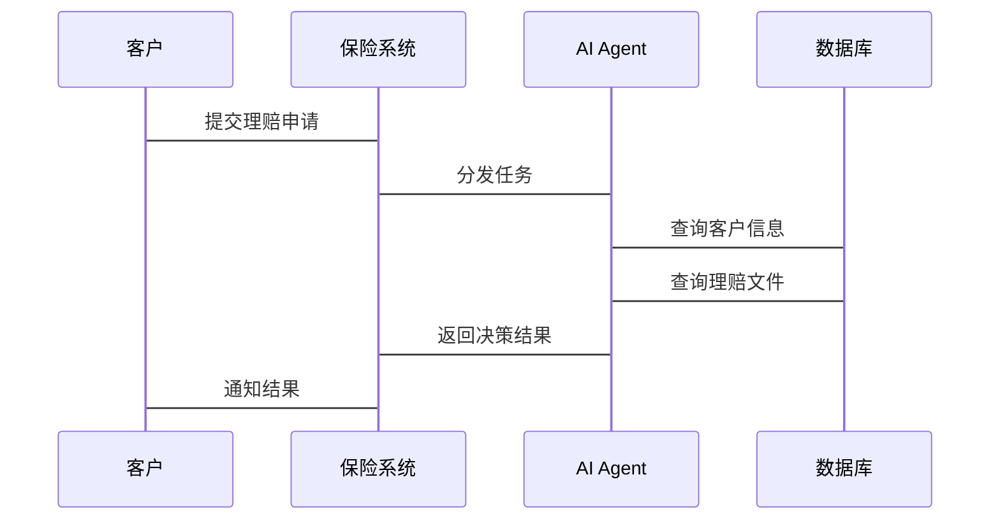

                 


# AI Agent在智能保险理赔审核中的应用

> 关键词：AI Agent, 保险理赔审核, 人工智能, 保险科技, 智能审核系统, 机器学习, 强化学习

> 摘要：本文详细探讨了AI Agent在智能保险理赔审核中的应用，从背景介绍、核心概念、算法原理到系统设计和项目实战，全面解析了AI Agent如何提升保险理赔审核的效率和准确性。文章结合实际案例，展示了AI Agent在保险行业中的巨大潜力和实际价值。

---

# 第一部分: AI Agent与保险理赔审核的背景与概念

## 第1章: AI Agent与保险理赔审核的背景介绍

### 1.1 AI Agent的基本概念

#### 1.1.1 AI Agent的定义与特点
AI Agent（智能代理）是一种能够感知环境并采取行动以实现特定目标的智能系统。其特点包括自主性（无需外部干预）、反应性（实时感知并响应环境变化）、目标导向（基于目标采取行动）以及学习能力（通过经验优化行为）。

#### 1.1.2 AI Agent的核心功能与应用场景
AI Agent的核心功能包括数据处理、决策制定和自动执行。在保险行业，AI Agent可以应用于客户服务、风险管理、流程自动化等多个场景，帮助保险公司提高效率和客户满意度。

#### 1.1.3 AI Agent在保险行业的潜在价值
AI Agent能够通过自动化处理减少人工干预，提高审核效率和准确性。同时，AI Agent可以通过学习客户行为和历史数据，提供个性化服务，增强客户体验。

### 1.2 保险理赔审核的流程与挑战

#### 1.2.1 保险理赔审核的基本流程
保险理赔审核通常包括以下步骤：理赔申请提交、文件审核、风险评估、理赔决定和支付理赔。每个环节都需要仔细处理和判断，以确保理赔的准确性和合法性。

#### 1.2.2 传统保险理赔审核的痛点与难点
传统保险理赔审核存在效率低、易错性和处理时间长等问题。人工审核不仅耗时，还容易受到主观因素影响，导致审核结果不一致。此外，高昂的人力成本也是传统审核模式的一大挑战。

#### 1.2.3 智能化审核的必要性与目标
智能化审核通过引入AI技术，能够显著提高审核效率和准确性。其核心目标是实现自动化审核，减少人为错误，提升客户满意度。

### 1.3 AI Agent在保险理赔审核中的应用前景

#### 1.3.1 智能保险理赔审核的核心目标
智能保险理赔审核旨在通过自动化处理和智能决策，提高审核效率和准确性，同时降低成本和时间。

#### 1.3.2 AI Agent在保险理赔审核中的优势
AI Agent能够24/7工作，不受时间和地点限制。通过机器学习模型，AI Agent能够快速处理大量数据，识别潜在风险，并提供精准的决策支持。

#### 1.3.3 未来发展趋势与潜在挑战
未来，AI Agent在保险行业中的应用将更加广泛，技术也将更加成熟。然而，数据隐私、模型解释性和技术落地等问题仍需要进一步解决。

---

## 第2章: AI Agent的核心概念与原理

### 2.1 AI Agent的原理与架构

#### 2.1.1 AI Agent的基本架构
AI Agent通常包括感知层、处理层、决策层和执行层。感知层负责收集环境信息，处理层对信息进行分析和处理，决策层基于分析结果做出决策，执行层将决策转化为具体行动。

#### 2.1.2 AI Agent的核心算法与技术
AI Agent的核心算法包括监督学习、无监督学习和强化学习。此外，自然语言处理和数据挖掘技术也是AI Agent的重要组成部分。

#### 2.1.3 AI Agent的决策机制与优化策略
AI Agent的决策机制通常基于规则或模型。通过强化学习等优化策略，AI Agent能够不断优化其决策能力，提高审核效率和准确性。

### 2.2 AI Agent与保险理赔审核的结合

#### 2.2.1 保险理赔审核中的信息处理流程
保险理赔审核中的信息处理流程包括数据收集、清洗、分析和决策制定。AI Agent在这一过程中发挥着关键作用，能够快速处理和分析大量数据。

#### 2.2.2 AI Agent在信息处理中的角色与功能
AI Agent在保险理赔审核中的角色包括数据处理、风险评估和决策支持。通过机器学习模型，AI Agent能够识别潜在风险，提高审核的准确性。

#### 2.2.3 AI Agent如何提升审核效率与准确性
AI Agent通过自动化处理和智能决策，显著提高了审核效率和准确性。与传统审核方式相比，AI Agent能够更快地处理数据，并减少人为错误。

### 2.3 AI Agent的核心概念对比分析

#### 2.3.1 AI Agent与传统保险审核流程的对比
与传统审核流程相比，AI Agent能够显著提高效率和准确性。传统审核流程依赖人工处理，效率较低且易出错，而AI Agent通过自动化处理和智能决策，能够更快、更准确地完成审核。

#### 2.3.2 AI Agent与规则引擎的对比
AI Agent与规则引擎的对比在于灵活性和适应性。规则引擎基于预设规则进行判断，灵活性较差，而AI Agent能够通过学习不断优化其决策能力，适应性更强。

#### 2.3.3 AI Agent与机器学习模型的对比
AI Agent不仅能够进行预测和分类，还具有自主性和目标导向性。机器学习模型主要用于预测和分类，缺乏自主决策能力。

### 2.4 AI Agent在保险理赔审核中的实体关系图

#### 2.4.1 实体关系图的定义与作用
实体关系图（ER图）用于描述系统中各实体之间的关系，帮助理解系统结构和潜在问题。

#### 2.4.2 保险理赔审核中的主要实体
主要实体包括理赔申请、理赔文件、理赔决策和客户信息。这些实体之间通过关联关系，构成了完整的审核流程。

#### 2.4.3 实体之间的关系与依赖
理赔申请关联理赔文件和客户信息，理赔决策基于理赔申请和相关文件的分析。实体之间的关系和依赖通过ER图清晰展示。

---

## 第3章: AI Agent的算法原理与数学模型

### 3.1 AI Agent的核心算法

#### 3.1.1 基于强化学习的AI Agent算法
强化学习是一种通过与环境交互，学习策略以最大化累计奖励的算法。在保险理赔审核中，AI Agent可以通过强化学习不断优化其审核策略，提高审核效率和准确性。

#### 3.1.2 基于监督学习的AI Agent算法
监督学习是一种基于标记好的数据进行训练，预测新的数据的算法。在保险理赔审核中，监督学习可以用于分类理赔文件，识别潜在风险。

#### 3.1.3 基于无监督学习的AI Agent算法
无监督学习是从无标记数据中发现模式和结构的算法。在保险理赔审核中，无监督学习可以用于聚类分析，识别异常情况。

### 3.2 AI Agent的算法实现流程

#### 3.2.1 数据收集与预处理
数据收集与预处理是AI Agent算法实现的基础。数据清洗和转换是确保数据质量的重要步骤。

#### 3.2.2 模型训练与优化
模型训练是通过大量数据训练机器学习模型，优化算法参数，提高模型性能。验证和测试是确保模型准确性和稳定性的关键步骤。

#### 3.2.3 模型部署与应用
模型部署是将训练好的模型应用到实际场景中，实时监控模型性能，及时发现和解决问题。

### 3.3 AI Agent的数学模型与公式

#### 3.3.1 强化学习的基本公式
状态值函数：
$$ V(s) = \max_a Q(s,a) $$

行为值函数：
$$ Q(s,a) = r + \gamma \max_a Q(s',a') $$

#### 3.3.2 监督学习的损失函数
均方误差：
$$ \text{Loss} = \frac{1}{2} \sum (y_i - \hat{y}_i)^2 $$

#### 3.3.3 无监督学习的聚类算法
K-means算法：
$$ \arg \min_{\textbf{v}_k} \sum_{i=1}^{n} \sum_{k=1}^{K} w_{ik} \cdot d(\textbf{x}_i, \textbf{v}_k) $$

---

## 第4章: 系统分析与架构设计

### 4.1 问题场景介绍
保险理赔审核中存在的问题包括效率低、易错性和处理时间长。通过引入AI Agent，可以实现自动化审核，提高效率和准确性。

### 4.2 系统功能设计

#### 4.2.1 领域模型（Mermaid类图）


#### 4.2.2 系统架构设计（Mermaid架构图）
```mermaid
contextDiagram
    participant 客户
    participant 保险系统
    participant AI Agent
    participant 数据库
    客户 --> 保险系统: 提交理赔申请
    保险系统 --> AI Agent: 分发任务
    AI Agent --> 数据库: 查询客户信息
    AI Agent --> 数据库: 查询理赔文件
    AI Agent --> 保险系统: 返回决策结果
    保险系统 --> 客户: 通知结果
```

#### 4.2.3 系统接口设计
系统接口设计包括理赔申请接口、理赔文件接口和理赔决策接口。这些接口通过REST API实现数据的交互和通信。

#### 4.2.4 系统交互流程（Mermaid序列图）


---

## 第5章: 项目实战

### 5.1 环境安装
安装Python和必要的库，如TensorFlow、Keras、Scikit-learn、Pandas和NumPy。

### 5.2 系统核心实现源代码

#### 5.2.1 数据预处理代码
```python
import pandas as pd
import numpy as np

# 读取数据
df = pd.read_csv('insurance_claims.csv')

# 数据清洗
df.dropna(inplace=True)
df.drop_duplicates(inplace=True)

# 数据转换
df['claim_amount'] = df['claim_amount'].astype(int)
```

#### 5.2.2 模型训练代码
```python
from sklearn.model_selection import train_test_split
from sklearn.linear_model import LogisticRegression

# 划分数据集
X = df.drop('fraudulent', axis=1)
y = df['fraudulent']
X_train, X_test, y_train, y_test = train_test_split(X, y, test_size=0.2, random_state=42)

# 训练模型
model = LogisticRegression()
model.fit(X_train, y_train)
```

#### 5.2.3 模型应用代码
```python
# 预测结果
predictions = model.predict(X_test)
print("预测结果:", predictions)
```

### 5.3 代码应用解读与分析
通过数据预处理代码，确保数据质量；模型训练代码利用监督学习算法训练分类器，识别欺诈性理赔；模型应用代码将训练好的模型应用到新数据，进行预测和分类。

### 5.4 实际案例分析
通过实际案例分析，展示AI Agent在保险理赔审核中的应用效果，如提高审核效率和准确性，降低成本和时间。

### 5.5 项目小结
总结项目实施的效果和经验，指出未来优化的方向和潜在的应用场景。

---

## 第6章: 总结与展望

### 6.1 总结
通过AI Agent实现智能保险理赔审核，显著提高了审核效率和准确性。文章展示了AI Agent在保险行业中的巨大潜力和实际应用价值。

### 6.2 未来展望
未来，AI Agent技术将进一步优化和扩展，应用于更多保险业务场景，如实时监控和智能客服。

---

## 第7章: 最佳实践与注意事项

### 7.1 最佳实践
确保数据质量，定期优化模型，重视数据安全和隐私保护。

### 7.2 注意事项
关注技术落地的可行性，注意伦理问题，重视用户体验。

---

## 第8章: 拓展阅读

### 8.1 推荐书籍
《机器学习实战》、《深度学习》、《强化学习（deep RL）》。

### 8.2 推荐博客和文章
关注AI领域的知名博主和技术博客，获取最新技术和动态。

### 8.3 推荐视频课程
在线平台上的机器学习和AI课程。

---

## 第9章: 附录

### 9.1 附录A: 术语解释
解释AI Agent、强化学习和深度学习等术语的定义和作用。

### 9.2 附录B: 数据格式与接口规范
说明数据处理中使用的格式和接口规范，如CSV、JSON、REST API等。

### 9.3 附录C: 工具与库
列出项目中使用的工具和库，如Pandas、NumPy、TensorFlow等。

---

作者：AI天才研究院/AI Genius Institute & 禅与计算机程序设计艺术 /Zen And The Art of Computer Programming

