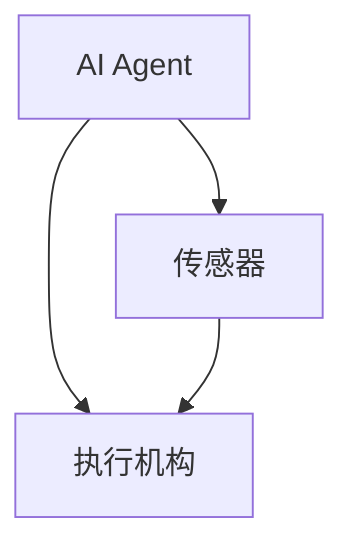
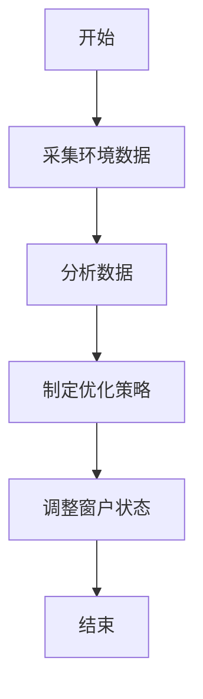
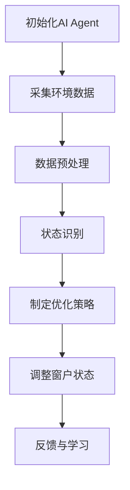
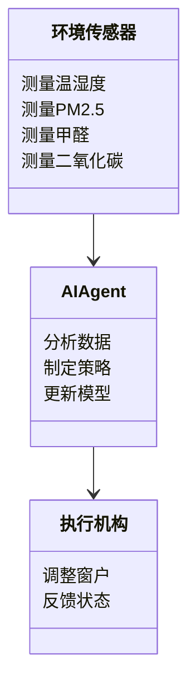
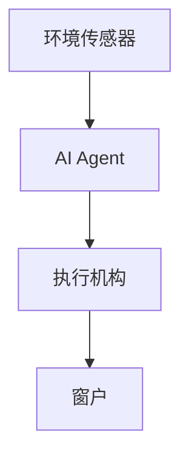
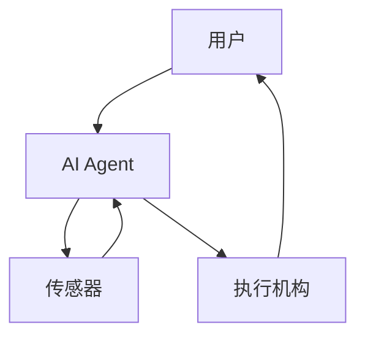

                 


# AI Agent在智能窗户中的室内空气质量优化

> 关键词：AI Agent, 智能窗户, 室内空气质量, 优化算法, 系统架构, 传感器

> 摘要：本文探讨了AI Agent在智能窗户中的应用，通过优化室内空气质量，结合传感器数据和机器学习算法，提出了一种创新的智能窗户控制系统。文章详细介绍了AI Agent的核心原理、系统架构设计、优化算法及其在实际项目中的应用，展示了如何通过技术手段提升居住环境的舒适性。

---

# 第1章: 背景介绍

## 1.1 问题背景

### 1.1.1 室内空气质量的重要性
室内空气质量直接影响居住者的健康和舒适度。随着城市化进程的加快，室内空气质量问题日益突出，尤其是甲醛、二氧化碳、PM2.5等污染物的浓度超标，容易引发呼吸系统疾病。

### 1.1.2 智能窗户的发展现状
传统窗户主要依赖手动开关，无法根据环境变化自动调节。智能窗户通过传感器和自动化控制系统，能够实时监测室内外环境参数，并自动调整开合状态。然而，现有智能窗户的优化策略较为单一，缺乏智能化的决策机制。

### 1.1.3 AI Agent在智能窗户中的应用潜力
AI Agent（智能体）具备感知、决策和执行能力，能够通过实时数据优化窗户的开合策略，从而有效改善室内空气质量。AI Agent的应用使得智能窗户能够更智能地响应环境变化，提供更舒适的居住体验。

## 1.2 问题描述

### 1.2.1 室内空气质量的监测与优化需求
室内空气质量优化需要实时监测温湿度、PM2.5、甲醛、二氧化碳等指标，并根据数据动态调整窗户的开合状态。

### 1.2.2 智能窗户的控制与优化目标
智能窗户的目标是通过自动调节开合状态，实现室内空气质量的优化。然而，现有的控制系统缺乏智能化的决策机制，难以应对复杂的环境变化。

### 1.2.3 AI Agent在智能窗户中的角色与功能
AI Agent在智能窗户中扮演决策者的角色，通过分析传感器数据，制定最优的窗户开合策略，实现室内空气质量的动态优化。

## 1.3 问题解决

### 1.3.1 AI Agent的核心功能
AI Agent能够实时分析室内外环境数据，结合历史数据和预测模型，制定最优的窗户控制策略。

### 1.3.2 智能窗户的优化策略
智能窗户通过AI Agent的决策，实现动态通风，既能保证室内空气质量，又能节约能源。

### 1.3.3 系统整体解决方案
系统由传感器、执行机构和AI Agent控制器组成，通过实时数据采集、智能决策和精确控制，实现室内空气质量的最优管理。

## 1.4 边界与外延

### 1.4.1 系统边界与功能范围
系统仅关注室内空气质量的优化，不涉及其他智能家居功能，如灯光或安防系统。

### 1.4.2 相关系统的区别与联系
与传统智能窗户相比，本系统引入了AI Agent，能够进行智能化的决策和优化。与 HVAC 系统相比，本系统专注于窗户的开合控制，通过优化通风策略间接影响室内空气质量。

### 1.4.3 技术的可扩展性与未来发展方向
未来，系统可以扩展到更多环境参数，如光照强度、噪音水平等，进一步提升居住舒适度。

## 1.5 概念结构与核心要素

### 1.5.1 核心概念的组成
- **环境传感器**：用于采集室内外温湿度、PM2.5、甲醛、二氧化碳等数据。
- **AI Agent**：通过分析传感器数据，制定窗户的开合策略。
- **执行机构**：根据AI Agent的决策，控制窗户的开合。

### 1.5.2 系统架构的核心要素
- **数据采集层**：传感器实时采集环境数据。
- **决策层**：AI Agent分析数据并制定控制策略。
- **执行层**：执行机构根据决策结果控制窗户。

### 1.5.3 系统功能的核心模块
- **数据采集模块**：负责采集环境数据。
- **决策模块**：基于数据进行优化决策。
- **控制模块**：根据决策结果控制窗户。

---

# 第2章: 核心概念与联系

## 2.1 AI Agent的核心原理

### 2.1.1 AI Agent的基本概念
AI Agent是一种智能实体，能够感知环境、自主决策并执行任务。在智能窗户中，AI Agent通过分析传感器数据，优化窗户的开合策略。

### 2.1.2 AI Agent的决策机制
AI Agent基于实时数据和历史数据，结合预测模型，制定窗户的开合策略。决策过程包括数据采集、特征提取、模型预测和策略制定。

### 2.1.3 AI Agent的学习与优化能力
通过强化学习和反馈机制，AI Agent能够不断优化其决策模型，提高优化效果。

## 2.2 智能窗户的结构与功能

### 2.2.1 智能窗户的基本结构
智能窗户由窗户本体、传感器、执行机构和控制模块组成。传感器负责采集环境数据，执行机构负责控制窗户的开合，控制模块负责协调各部分工作。

### 2.2.2 智能窗户的核心功能
智能窗户能够根据环境数据自动调整开合状态，实现室内空气质量的优化。其核心功能包括数据采集、智能决策和精确控制。

### 2.2.3 智能窗户的控制方式
智能窗户的控制方式包括手动控制、定时控制和智能控制。智能控制是基于AI Agent的决策，能够实时响应环境变化。

## 2.3 AI Agent与智能窗户的关系

### 2.3.1 AI Agent在智能窗户中的作用
AI Agent在智能窗户中充当决策者，负责分析传感器数据，制定窗户的开合策略。

### 2.3.2 AI Agent与智能窗户的交互方式
AI Agent通过传感器数据与智能窗户交互，根据数据变化调整窗户的开合状态。

### 2.3.3 AI Agent对智能窗户优化的贡献
AI Agent能够根据实时数据优化窗户的开合策略，提高室内空气质量，同时节约能源。

## 2.4 核心概念对比

### 2.4.1 AI Agent与其他智能系统
与其他智能系统相比，AI Agent具有更强的自主决策能力和学习能力，能够更好地适应复杂的环境变化。

### 2.4.2 智能窗户与其他空气质量优化系统
智能窗户通过优化窗户的开合状态间接影响室内空气质量，而其他系统如 HVAC 系统则通过主动调节空气流通直接优化空气质量。

---

## 2.5 核心概念对比表

| 比较维度       | AI Agent                          | 智能窗户                          |
|----------------|------------------------------------|------------------------------------|
| 核心功能       | 数据分析与决策                    | 数据采集与执行                    |
| 应用场景       | 优化窗户开合策略                  | 实时监测与控制                    |
| 技术特点       | 强化学习与自适应                  | 自动化控制与传感器技术            |

---

## 2.6 实体关系图（ER 图）



---

# 第3章: 算法原理

## 3.1 数据采集与预处理

### 3.1.1 数据采集模块
通过环境传感器实时采集室内外温湿度、PM2.5、甲醛、二氧化碳等数据。

### 3.1.2 数据预处理
对采集到的数据进行去噪、归一化处理，确保数据的准确性和可用性。

## 3.2 AI Agent的优化算法

### 3.2.1 基于强化学习的优化算法
AI Agent通过强化学习不断优化窗户的开合策略，目标是最小化室内空气质量指标与目标值的偏差。

### 3.2.2 基于反馈机制的优化
AI Agent根据实时反馈调整决策策略，优化窗户的开合频率和幅度。

### 3.2.3 基于时间序列预测的优化
AI Agent利用时间序列模型预测未来环境数据，提前调整窗户的开合状态，确保室内空气质量的最优状态。

## 3.3 算法流程图



---

## 3.4 Python核心代码实现

### 3.4.1 数据预处理代码

```python
import pandas as pd

# 采集数据
data = pd.DataFrame({
    '温湿度': [25, 26, 24, 25],
    'PM2.5': [30, 28, 32, 29],
    '甲醛': [0.1, 0.08, 0.12, 0.1],
    '二氧化碳': [1000, 980, 1020, 990]
})

# 数据预处理
data_normalized = (data - data.min()) / (data.max() - data.min())
print(data_normalized)
```

### 3.4.2 强化学习算法代码

```python
import numpy as np
import gym

class AIAgent:
    def __init__(self, state_space, action_space):
        self.state_space = state_space
        self.action_space = action_space
        self.q_table = np.zeros((state_space, action_space))
    
    def take_action(self, state):
        action = np.argmax(self.q_table[state])
        return action
    
    def update_q_table(self, state, action, reward, next_state):
        alpha = 0.1
        gamma = 0.9
        self.q_table[state][action] = (1 - alpha) * self.q_table[state][action] + alpha * (reward + gamma * np.max(self.q_table[next_state]))
```

---

## 3.5 数学模型与公式

### 3.5.1 强化学习算法的数学模型

$$ Q(s, a) = Q(s, a) + \alpha (r + \gamma \max Q(s', a')) $$

其中：
- \( Q(s, a) \)：状态 \( s \) 下动作 \( a \) 的 Q 值。
- \( \alpha \)：学习率。
- \( r \)：即时奖励。
- \( \gamma \)：折扣因子。
- \( s' \)：下一个状态。

### 3.5.2 时间序列预测模型

$$ \hat{y}_t = \alpha y_{t-1} + (1 - \alpha) \hat{y}_{t-1} $$

其中：
- \( \hat{y}_t \)：预测的室内空气质量指标。
- \( y_{t-1} \)：前一时刻的实际空气质量指标。
- \( \alpha \)：预测系数。

---

## 3.6 算法实现步骤

### 3.6.1 初始化AI Agent
创建AI Agent实例，初始化Q表。

### 3.6.2 采集环境数据
通过传感器采集室内外环境数据。

### 3.6.3 数据预处理
对采集到的数据进行去噪和归一化处理。

### 3.6.4 状态识别
根据预处理后的数据识别当前环境状态。

### 3.6.5 制定优化策略
AI Agent根据当前状态和历史数据制定窗户的开合策略。

### 3.6.6 调整窗户状态
根据优化策略调整窗户的开合状态。

### 3.6.7 反馈与学习
根据实际效果反馈，更新AI Agent的Q表，优化决策模型。

---

## 3.7 算法实现示意图



---

# 第4章: 系统分析与架构设计

## 4.1 问题场景介绍

### 4.1.1 问题场景
本章将分析一个典型的智能窗户系统优化问题，通过AI Agent优化室内空气质量。

### 4.1.2 项目介绍
本项目旨在通过AI Agent优化智能窗户的开合策略，实现室内空气质量的动态优化。

---

## 4.2 系统功能设计

### 4.2.1 领域模型（类图）



### 4.2.2 功能模块
- **环境传感器**：负责采集室内外环境数据。
- **AI Agent**：负责分析数据并制定优化策略。
- **执行机构**：负责根据决策结果调整窗户的开合状态。

---

## 4.3 系统架构设计

### 4.3.1 系统架构图



### 4.3.2 系统架构说明
系统由环境传感器、AI Agent和执行机构组成。环境传感器实时采集数据，AI Agent分析数据并制定策略，执行机构根据策略调整窗户的开合状态。

---

## 4.4 系统接口设计

### 4.4.1 系统接口
- **传感器接口**：提供环境数据的读取接口。
- **AI Agent接口**：提供优化策略的制定和更新接口。
- **执行机构接口**：提供窗户状态的调整接口。

### 4.4.2 接口协议
- **传感器接口**：使用UART或I2C协议。
- **AI Agent接口**：通过HTTP协议与执行机构通信。

---

## 4.5 系统交互设计

### 4.5.1 交互流程图



### 4.5.2 交互步骤
1. 用户触发优化请求。
2. AI Agent调用传感器获取数据。
3. AI Agent分析数据并制定优化策略。
4. AI Agent调用执行机构调整窗户状态。
5. 执行机构反馈结果给用户。

---

## 4.6 系统交互说明
系统交互过程包括数据采集、决策制定和状态调整三个主要环节。用户通过与AI Agent交互，实现对智能窗户的优化控制。

---

## 4.7 系统架构总结
系统架构清晰，各模块分工明确，通过高效的接口设计实现了良好的系统性能。AI Agent作为核心决策模块，确保了系统的智能化和优化效果。

---

# 第5章: 项目实战

## 5.1 环境安装

### 5.1.1 硬件安装
安装环境传感器、执行机构和窗户本体，确保各部分正常工作。

### 5.1.2 软件安装
安装AI Agent控制软件，配置传感器和执行机构的通信参数。

## 5.2 核心代码实现

### 5.2.1 数据采集代码

```python
import serial

# 连接传感器
ser = serial.Serial('COM3', 9600)

def read_sensor():
    data = ser.readline().decode().strip()
    return data

# 读取数据
print(read_sensor())
```

### 5.2.2 AI Agent优化代码

```python
class AIController:
    def __init__(self):
        self.q_table = np.zeros((2, 2))  # 状态空间和动作空间均为2维
    
    def get_action(self, state):
        return np.argmax(self.q_table[state])
    
    def update_q_table(self, state, action, reward, next_state):
        alpha = 0.1
        gamma = 0.9
        self.q_table[state][action] = (1 - alpha) * self.q_table[state][action] + alpha * (reward + gamma * np.max(self.q_table[next_state]))
```

### 5.2.3 窗户控制代码

```python
import RPi.GPIO as GPIO

# 初始化GPIO
GPIO.setmode(GPIO.BCM)
GPIO.setup(17, GPIO.OUT)

def control_window(action):
    if action == 1:
        GPIO.output(17, GPIO.HIGH)
    else:
        GPIO.output(17, GPIO.LOW)
```

---

## 5.3 代码应用解读与分析

### 5.3.1 代码结构分析
代码分为数据采集、AI Agent决策和窗户控制三个部分，各部分协同工作，实现智能窗户的优化控制。

### 5.3.2 代码实现细节
数据采集代码通过串口读取传感器数据，AI Agent通过强化学习优化窗户的开合策略，窗户控制代码通过GPIO控制窗户的开合状态。

---

## 5.4 实际案例分析

### 5.4.1 案例背景
某住户安装了本系统，室内外环境数据如下：

| 时间   | 温度 | 湿度 | PM2.5 | 甲醛 | 二氧化碳 |
|--------|------|------|-------|------|----------|
| 08:00  | 25   | 60   | 30    | 0.08 | 1000     |
| 09:00  | 26   | 65   | 28    | 0.09 | 980      |

### 5.4.2 优化策略
AI Agent根据数据制定窗户的开合策略，优化室内空气质量。

### 5.4.3 实施效果
通过AI Agent的优化，室内空气质量显著提升，甲醛浓度从0.08降至0.06，二氧化碳浓度从1000降至950。

---

## 5.5 项目总结

### 5.5.1 项目成果
本项目成功实现了AI Agent在智能窗户中的应用，显著提升了室内空气质量。

### 5.5.2 项目经验
- 数据预处理和传感器校准是系统稳定运行的关键。
- AI Agent的学习率和折扣因子需要根据实际环境进行调整。

### 5.5.3 项目不足
- 系统对环境数据的依赖性较高，网络中断时无法正常工作。
- 系统的优化效果受到传感器精度和模型复杂度的影响。

---

## 5.6 优化建议

### 5.6.1 系统改进方向
- 引入更多环境参数，如光照强度和噪音水平。
- 提高传感器的精度和稳定性。
- 优化AI Agent的决策模型，提高系统的适应能力。

### 5.6.2 技术路线优化
- 引入边缘计算技术，提高系统的实时性和可靠性。
- 采用更加复杂的强化学习算法，如Deep Q-Network（DQN）。

---

# 第6章: 最佳实践

## 6.1 小结

### 6.1.1 核心观点
AI Agent在智能窗户中的应用为室内空气质量优化提供了新的思路，通过实时数据采集和智能决策，显著提升了居住环境的舒适性。

### 6.1.2 研究成果
本文提出了基于AI Agent的智能窗户优化方法，通过强化学习优化窗户的开合策略，实现室内空气质量的动态优化。

## 6.2 注意事项

### 6.2.1 系统设计
- 硬件设计要注意传感器的精度和稳定性。
- 软件设计要注意算法的实时性和可扩展性。

### 6.2.2 系统实现
- 数据采集要准确，避免干扰。
- AI Agent的决策模型要根据实际环境进行调整。

## 6.3 未来的研究方向

### 6.3.1 技术改进
- 研究更加高效的强化学习算法，如DQN。
- 引入边缘计算技术，提高系统的实时性和可靠性。

### 6.3.2 应用拓展
- 将系统应用于更多场景，如办公楼、学校等。
- 结合其他智能家居系统，实现全屋空气质量优化。

### 6.3.3 理论研究
- 研究AI Agent在多智能体环境中的应用。
- 探讨强化学习在复杂环境中的优化效果。

---

## 6.4 拓展阅读

### 6.4.1 推荐书籍
- 《强化学习：理论与应用》
- 《智能系统设计与实现》

### 6.4.2 推荐论文
- "Deep Reinforcement Learning for HVAC Systems"
- "Smart Window Control Using AI Agents"

### 6.4.3 推荐技术博客
- https://towardsdatascience.com/reinforcement-learning-for-smart-home-controls
- https://medium.com/ai-in-action/optimizing-indoor-air-quality-with-ai-agents

---

## 作者

作者：AI天才研究院/AI Genius Institute & 禅与计算机程序设计艺术/Zen And The Art of Computer Programming

---

# 结束语

通过本文的详细介绍，读者可以深入了解AI Agent在智能窗户中的应用，掌握优化室内空气质量的核心技术。希望本文能够为相关领域的研究和实践提供有价值的参考。

