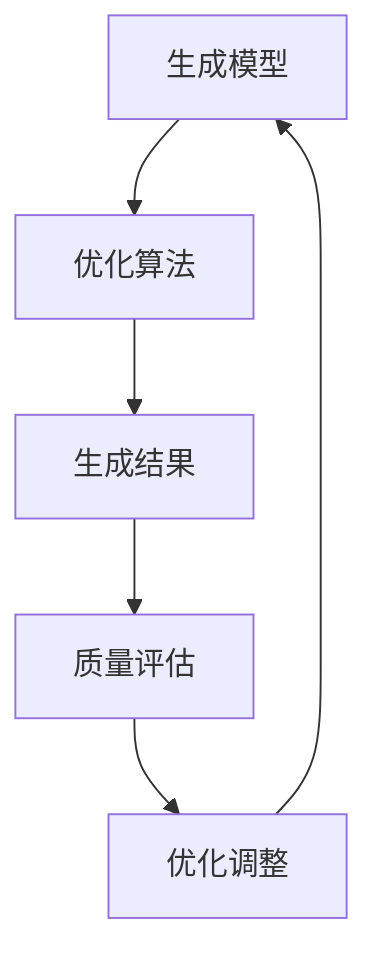
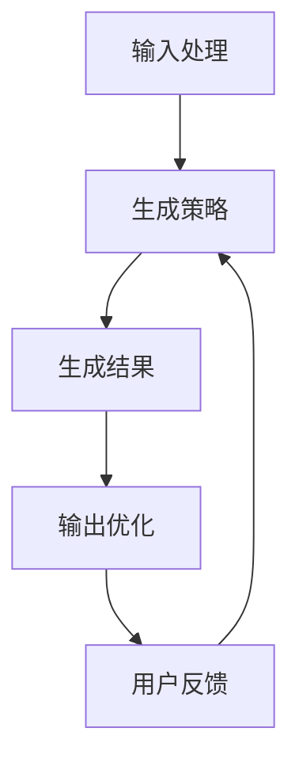

                 


# AI Agent的自然语言生成质量优化

## 关键词：AI Agent，自然语言生成，生成质量优化，深度学习，生成模型，优化算法

## 摘要：  
随着人工智能技术的快速发展，AI Agent在自然语言生成领域的应用越来越广泛。然而，生成质量的优化是当前技术面临的重要挑战。本文从AI Agent的基本概念出发，深入探讨自然语言生成的核心原理，分析当前生成质量的评估指标与优化方法，结合实际案例，提出系统的优化策略与实现方案。通过详细的技术分析与代码实现，为读者提供一套完整的优化思路，助力提升AI Agent的自然语言生成能力。

---

# 第1章：AI Agent与自然语言生成概述

## 1.1 AI Agent的基本概念  
### 1.1.1 AI Agent的定义与特点  
- AI Agent的定义：AI Agent是具有感知环境、自主决策和执行任务能力的智能体。  
- 特点：智能性、自主性、反应性、社会性、学习能力。  

### 1.1.2 自然语言生成的基本概念  
- 自然语言生成（Natural Language Generation, NLG）：将结构化数据或信息转换为自然语言文本的过程。  
- 主要任务：文本摘要、对话生成、机器翻译、内容生成等。  

### 1.1.3 AI Agent在自然语言生成中的作用  
- AI Agent通过自然语言生成技术实现与用户的高效交互。  
- 自然语言生成是AI Agent智能化的核心能力之一。  

---

## 1.2 自然语言生成的挑战  
### 1.2.1 生成质量的定义与评估标准  
- 生成质量的定义：生成文本的准确性、流畅性、相关性和可读性。  
- 评估标准：基于文本相似度（如BLEU、ROUGE）、基于人类评价（如主观评分）。  

### 1.2.2 当前技术的局限性  
- 数据依赖性：生成内容受限于训练数据的质量和多样性。  
- 上下文理解不足：难以处理复杂语境和多轮对话中的深度关联。  
- 生成结果的可解释性差：用户难以理解生成内容的逻辑依据。  

### 1.2.3 用户需求与生成质量的矛盾  
- 用户需求多样化：不同场景下对生成内容的要求不同。  
- 高质量生成的计算成本高：复杂的优化过程需要更多资源。  

---

## 1.3 自然语言生成质量优化的重要性  
### 1.3.1 提升生成质量的意义  
- 提升用户体验：生成内容更贴近人类语言习惯，增强交互的自然性。  
- 增强AI Agent的实用性：高质量生成是实现复杂任务的基础。  
- 降低误解风险：减少生成内容的歧义性和不准确性。  

### 1.3.2 优化质量对用户体验的影响  
- 提高用户满意度：生成内容更符合用户期望。  
- 增强用户信任：高质量生成让用户更愿意依赖AI Agent。  

### 1.3.3 质量优化对AI Agent性能的提升  
- 提升任务完成效率：生成内容更精准，减少人工干预。  
- 降低错误率：优化生成质量可减少错误决策的发生。  

---

## 1.4 当前研究进展与未来趋势  
### 1.4.1 学术界的研究现状  
- 大语言模型（如GPT系列）的广泛应用。  
- 基于因果推理的生成模型研究逐渐兴起。  

### 1.4.2 工业界的应用案例  
- 客服机器人：提升对话质量，提高客户满意度。  
- 内容生成：自动化新闻稿、营销文案的生成。  

### 1.4.3 未来可能的发展方向  
- 多模态生成：结合视觉、听觉信息，提升生成内容的丰富性。  
- 可解释性生成：生成过程更透明，便于用户理解和信任。  
- 自适应优化：根据实时反馈动态调整生成策略。  

---

## 1.5 本章小结  
本章从AI Agent的基本概念出发，分析了自然语言生成的挑战与重要性，探讨了当前技术的局限性与未来发展方向。接下来的章节将深入探讨生成质量优化的核心概念与实现方法。

---

# 第2章：自然语言生成质量优化的核心概念  

## 2.1 自然语言生成质量的评估指标  
### 2.1.1 基于文本相似度的评估  
- 常见指标：BLEU、ROUGE、METEOR。  
- 示例：使用BLEU评估生成文本与参考文本的相似度。  

### 2.1.2 基于人类评价的评估  
- 主观评分：通过人工评价生成内容的流畅性、相关性。  
- 优缺点：主观性较强，但更贴近实际需求。  

### 2.1.3 综合评估指标的设计  
- 综合指标：结合文本相似度与人类评价，制定多维度评估标准。  

---

## 2.2 生成模型与优化算法的关系  
### 2.2.1 生成模型的分类  
- 生成式模型：基于概率分布生成文本（如GPT）。  
- 检索式模型：基于预定义规则或检索数据库生成文本。  

### 2.2.2 优化算法的作用  
- 参数优化：通过梯度下降等方法优化生成模型的参数。  
- 解码优化：改进生成过程中的解码策略，提升生成质量。  

### 2.2.3 模型与算法的协同优化  
- 模型优化：改进生成模型的结构，提升生成能力。  
- 算法优化：优化训练过程，提升生成效率与质量。  

---

## 2.3 核心概念对比分析  
### 2.3.1 生成式模型与检索式模型的对比  
| 对比维度 | 生成式模型 | 检索式模型 |  
|----------|------------|------------|  
| 生成方式 | 基于概率分布生成 | 基于规则或检索生成 |  
| 灵活性 | 高 | 低 |  
| 计算成本 | 高 | 较低 |  

### 2.3.2 基于规则的生成与基于数据的生成对比  
- 基于规则的生成：依赖预定义的语法规则，生成结果可控但缺乏灵活性。  
- 基于数据的生成：利用大量数据训练，生成结果更自然但可能缺乏可解释性。  

### 2.3.3 不同优化策略的优缺点分析  
- 局部优化：速度快，但可能陷入局部最优。  
- 全局优化：结果更优，但计算成本高。  

---

## 2.4 实体关系图与流程图分析  


---

## 2.5 本章小结  
本章通过对比分析和流程图，详细阐述了生成模型与优化算法的关系，以及不同生成策略的优缺点。接下来的章节将从算法原理和系统设计的角度，深入探讨生成质量优化的具体实现方法。

---

# 第3章：自然语言生成的算法原理与优化策略  

## 3.1 基于Transformer的生成模型原理  
### 3.1.1 Transformer模型的结构  
- 编码器与解码器：通过自注意力机制捕捉文本中的语义关联。  

### 3.1.2 解码器的生成策略  
- 基于贪心搜索：逐词生成，选择概率最高的词。  
- 基于束搜索：生成多个候选结果，选择最优解。  

### 3.1.3 模型优化技巧  
- 参数初始化：采用Layer Normalization和Positional Encoding提升模型性能。  
- 训练技巧：使用学习率衰减和梯度截断防止梯度爆炸。  

---

## 3.2 基于扩散模型的生成优化  
### 3.2.1 扩散模型的基本原理  
- 通过逐步添加噪声并学习去噪过程生成高质量文本。  

### 3.2.2 扩散模型的优势  
- 生成质量高，文本更流畅。  
- 支持长文本生成。  

### 3.2.3 扩散模型的实现步骤  
1. 定义噪声调度策略。  
2. 训练去噪模型。  
3. 生成过程：从噪声逐步生成文本。  

---

## 3.3 基于强化学习的生成优化  
### 3.3.1 强化学习的基本原理  
- 通过奖励机制优化生成策略。  

### 3.3.2 奖励函数的设计  
- 基于生成质量的奖励：BLEU、ROUGE等指标。  
- 基于人类评价的奖励：通过人工评分指导模型优化。  

### 3.3.3 实现步骤  
1. 定义奖励函数。  
2. 使用策略梯度法优化生成策略。  
3. 循环训练，逐步提升生成质量。  

---

## 3.4 生成模型的数学公式与代码实现  
### 3.4.1 Transformer模型的数学公式  
$$ \text{Attention}(Q, K, V) = \text{softmax}\left(\frac{QK^T}{\sqrt{d_k}}\right)V $$  

### 3.4.2 Python代码实现（简化版）  
```python
import torch
import torch.nn as nn

class Transformer(nn.Module):
    def __init__(self, d_model, nhead, dropout=0.1):
        super(Transformer, self).__init__()
        self.encoder = nn.TransformerEncoder(
            nn.MultiheadAttention(nhead, d_model),
            dropout=dropout,
            num_layers=2
        )
    
    def forward(self, x, mask=None):
        return self.encoder(x, mask)
```

---

## 3.5 本章小结  
本章详细讲解了基于Transformer和扩散模型的生成原理，并结合强化学习优化生成质量。代码实现部分帮助读者理解模型的具体结构与实现方法。

---

# 第4章：AI Agent的系统架构与生成质量优化  

## 4.1 系统架构设计  
### 4.1.1 系统功能模块  
- 输入处理模块：接收用户输入并解析需求。  
- 生成策略模块：根据需求选择合适的生成模型。  
- 输出优化模块：优化生成结果的质量。  

### 4.1.2 系统架构图  


---

## 4.2 系统实现与接口设计  
### 4.2.1 系统实现流程  
1. 接收用户输入，解析需求。  
2. 调用生成模型生成文本。  
3. 优化生成结果，输出最终文本。  

### 4.2.2 接口设计  
- 输入接口：接收用户输入的文本或结构化数据。  
- 输出接口：返回优化后的生成文本。  

---

## 4.3 生成质量优化的系统实现  
### 4.3.1 输入处理模块实现  
```python
def process_input(input_text):
    # 解析输入文本，提取关键信息
    return parsed_info
```

### 4.3.2 生成策略模块实现  
```python
def generate_text(parsed_info, model):
    # 调用生成模型，生成初步文本
    return generated_text
```

### 4.3.3 输出优化模块实现  
```python
def optimize_text(generated_text, parsed_info):
    # 对生成文本进行质量优化
    return optimized_text
```

---

## 4.4 系统优化与性能提升  
### 4.4.1 并行计算优化  
- 使用GPU加速模型训练与推理。  

### 4.4.2 模型压缩与轻量化  
- 通过剪枝、量化等技术减少模型体积，提升运行效率。  

---

## 4.5 本章小结  
本章从系统架构的角度，详细讲解了AI Agent的生成质量优化实现方法，包括模块设计、接口设计和系统优化策略。

---

# 第5章：生成质量优化的项目实战  

## 5.1 项目背景与目标  
### 5.1.1 项目背景  
- 优化一个客服机器人的自然语言生成能力。  

### 5.1.2 项目目标  
- 提升生成文本的准确性和流畅性。  

---

## 5.2 项目环境与工具安装  
### 5.2.1 环境要求  
- Python 3.8及以上版本  
- PyTorch、Hugging Face Transformers库  

### 5.2.2 安装依赖  
```bash
pip install torch transformers
```

---

## 5.3 项目核心实现  
### 5.3.1 输入处理模块实现  
```python
def process_customer_query(query):
    # 解析用户查询，提取关键信息
    return parsed_info
```

### 5.3.2 生成策略模块实现  
```python
from transformers import GPT2LMHeadModel, GPT2Tokenizer

def generate_response(parsed_info):
    model = GPT2LMHeadModel.from_pretrained('gpt2')
    tokenizer = GPT2Tokenizer.from_pretrained('gpt2')
    inputs = tokenizer(parsed_info, return_tensors='np')
    outputs = model.generate(inputs.input_ids, max_length=100)
    return tokenizer.decode(outputs[0])
```

### 5.3.3 输出优化模块实现  
```python
def optimize_response(generated_response, parsed_info):
    # 使用基于规则的优化策略，例如调整语气和措辞
    return optimized_response
```

---

## 5.4 项目案例分析与代码解读  
### 5.4.1 案例分析  
- 原始生成文本：`"您的订单已处理，请耐心等待。"`  
- 优化后生成文本：`"感谢您的咨询，您的订单已经成功处理，请耐心等待。"`  

### 5.4.2 代码解读  
- 输入处理：解析用户查询，提取关键信息。  
- 生成策略：调用预训练模型生成初步文本。  
- 输出优化：基于规则或模型优化生成结果。  

---

## 5.5 项目小结  
本章通过一个客服机器人的案例，详细讲解了生成质量优化的实现过程，包括环境搭建、模块实现和案例分析。

---

# 第6章：生成质量优化的最佳实践与小结  

## 6.1 最佳实践总结  
### 6.1.1 选择合适的生成模型  
- 根据任务需求选择生成式或检索式模型。  

### 6.1.2 数据预处理与增强  
- 数据清洗：去除噪声数据。  
- 数据增强：通过数据扩展提升模型的泛化能力。  

### 6.1.3 持续优化策略  
- 定期收集用户反馈，优化生成模型。  
- 使用A/B测试评估优化效果。  

---

## 6.2 小结与展望  
- 小结：本文从理论到实践，全面探讨了AI Agent的自然语言生成质量优化方法。  
- 展望：未来的研究方向包括多模态生成、可解释性优化和自适应生成策略。  

---

## 作者：AI天才研究院/AI Genius Institute & 禅与计算机程序设计艺术 /Zen And The Art of Computer Programming  

---

**注**：由于篇幅限制，上述目录仅为部分示例，具体内容可根据实际需求进一步扩展与完善。

