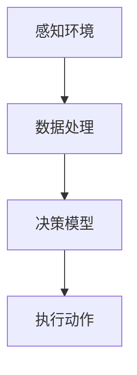
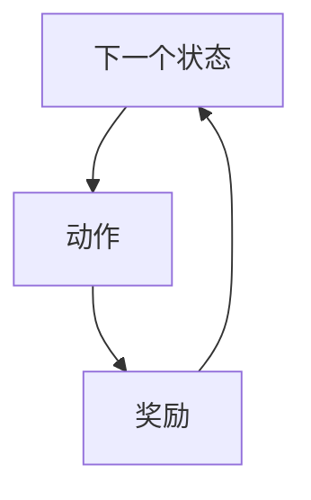
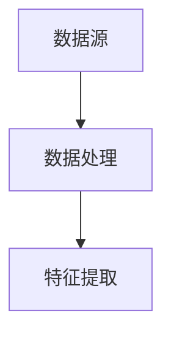
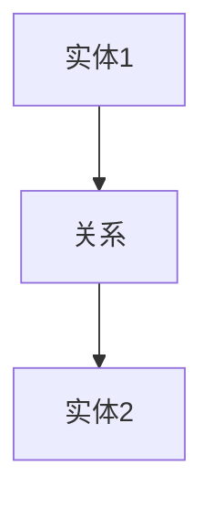
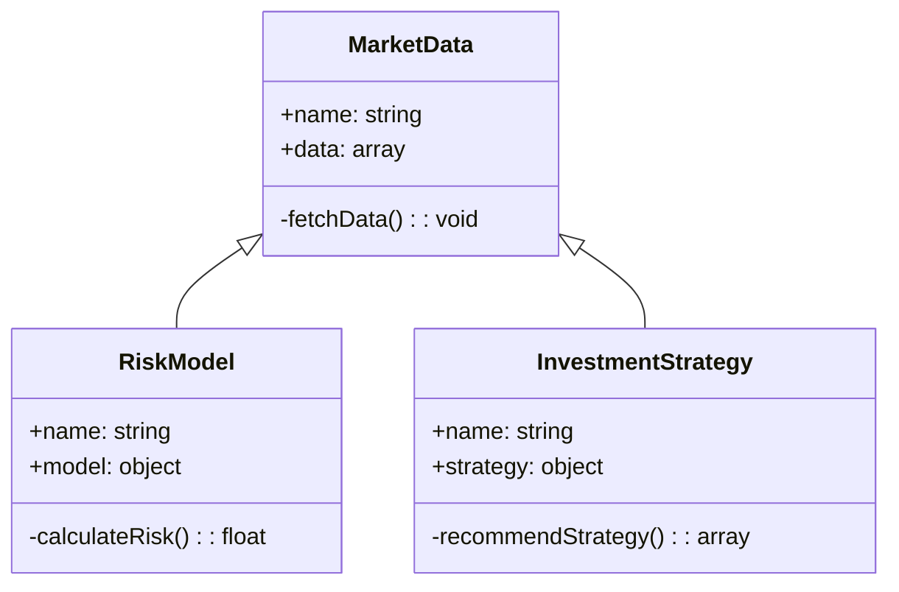
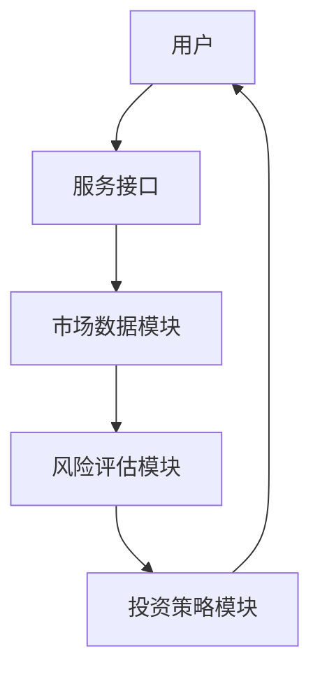

                 


# AI智能体在识别新兴市场价值机会中的作用

## 关键词：AI智能体，新兴市场，价值机会，算法原理，系统设计

## 摘要：
本文深入探讨了AI智能体在识别新兴市场价值机会中的关键作用。通过分析AI智能体的核心原理、算法模型、系统设计和实际应用案例，揭示了AI技术在新兴市场中的潜力和挑战。文章从概述、算法原理、系统设计到项目实战，逐步解析AI智能体如何通过数据驱动的方法，帮助投资者和企业发现市场中的潜在机会，优化决策过程，并在复杂多变的市场环境中实现价值最大化。

---

# 第1章: AI智能体与新兴市场的概述

## 1.1 AI智能体的基本概念

### 1.1.1 什么是AI智能体
AI智能体（Artificial Intelligence Agent）是指具备感知环境、做出决策并执行动作的智能系统。它能够通过传感器获取信息，利用算法进行分析，并根据结果采取行动以实现特定目标。



AI智能体的关键特征包括：
- **自主性**：无需外部干预即可运行。
- **反应性**：能够实时感知环境变化并调整行为。
- **目标导向性**：所有行动都以实现特定目标为导向。

### 1.1.2 AI智能体的核心特征
AI智能体可以通过以下方式实现目标：
- **基于强化学习的决策模型**：通过奖励机制优化决策策略。
- **基于深度学习的特征提取**：利用神经网络从复杂数据中提取关键特征。
- **多智能体协同决策**：多个智能体通过协作完成复杂任务。

### 1.1.3 AI智能体与传统算法的区别
AI智能体与传统算法的区别主要体现在以下几个方面：
| 属性 | AI智能体 | 传统算法 |
|------|----------|----------|
| 决策方式 | 基于环境反馈动态调整 | 预设规则 |
| 适应性 | 高度适应环境变化 | 较低 |
| 应用场景 | 复杂动态环境 | 简单静态环境 |

## 1.2 新兴市场的定义与特征

### 1.2.1 新兴市场的定义
新兴市场是指那些经济增长迅速、但尚未完全工业化的国家或地区。这些市场通常具有较大的发展潜力，但也伴随着较高的风险。

### 1.2.2 新兴市场的核心特征
新兴市场具有以下核心特征：
- **高增长率**：新兴市场的GDP增长通常高于发达市场。
- **多样化产业结构**：新兴市场通常涵盖制造业、服务业等多个领域。
- **政策不确定性**：新兴市场的政策法规可能不够成熟，存在较大的不确定性。

### 1.2.3 新兴市场与传统市场的对比
新兴市场与传统市场的对比如下：
| 特性 | 新兴市场 | 传统市场 |
|------|----------|----------|
| 经济增长率 | 高 | 低 |
| 市场结构 | 多样化 | 单一化 |
| 政策环境 | 不稳定 | 稳定 |

## 1.3 AI智能体在新兴市场中的作用

### 1.3.1 AI智能体在市场分析中的优势
AI智能体在市场分析中具有以下优势：
- **数据处理能力**：AI智能体能够快速处理大量非结构化数据，发现隐藏的模式。
- **实时反馈机制**：AI智能体能够实时调整分析策略，适应市场变化。

### 1.3.2 AI智能体在价值发现中的应用
AI智能体可以通过以下方式帮助发现新兴市场的价值机会：
- **行业趋势预测**：通过分析历史数据，预测行业的未来发展趋势。
- **竞争格局分析**：识别市场中的主要竞争对手及其策略。

### 1.3.3 AI智能体在风险控制中的作用
AI智能体在风险控制中的作用包括：
- **风险识别**：通过分析市场数据，识别潜在的市场风险。
- **风险评估**：利用数学模型评估风险的影响程度。

## 1.4 本章小结
本章介绍了AI智能体的基本概念和新兴市场的核心特征，并分析了AI智能体在新兴市场中的作用。AI智能体通过其强大的数据处理能力和动态调整能力，能够在新兴市场中发现价值机会并优化决策过程。

---

# 第2章: AI智能体的核心原理

## 2.1 AI智能体的决策机制

### 2.1.1 基于强化学习的决策模型
强化学习是一种通过试错机制来优化决策策略的方法。智能体通过与环境交互，逐步学习最优策略。



数学模型：
- 状态空间：S
- 动作空间：A
- 奖励函数：R(s, a)

### 2.1.2 基于深度学习的决策模型
深度学习通过神经网络从大量数据中学习特征，从而做出决策。

```python
import tensorflow as tf
model = tf.keras.Sequential([
    tf.keras.layers.Dense(64, activation='relu'),
    tf.keras.layers.Dense(10, activation='softmax')
])
```

### 2.1.3 多智能体协同决策的原理
多智能体协同决策通过分布式计算，实现多个智能体之间的协作。

数学模型：
- 群体行为：B(t) = f(B(t-1), S(t))
- 个体行为：a_i(t) = f_i(S(t), B(t-1))

## 2.2 AI智能体的感知与学习

### 2.2.1 数据采集与处理
AI智能体通过传感器或API获取市场数据，并进行预处理。



### 2.2.2 智能体的特征提取
特征提取是将原始数据转换为更有意义的特征表示。

数学模型：
- 特征向量：x ∈ ℝ^n
- 神经网络：y = f(x; θ)

### 2.2.3 知识图谱构建与应用
知识图谱通过构建语义网络，帮助智能体理解复杂关系。



## 2.3 AI智能体的推理与规划

### 2.3.1 基于逻辑推理的决策
逻辑推理通过形式化逻辑系统进行推理。

数学模型：
- 命题逻辑：P ⇒ Q
- 推理规则：P → Q

### 2.3.2 基于概率推理的决策
概率推理通过贝叶斯网络进行概率计算。

数学模型：
- 贝叶斯网络：P(A|B) = P(B|A)P(A)/P(B)

### 2.3.3 动态规划与路径规划
动态规划通过分阶段决策，找到最优路径。

数学模型：
- 状态转移：s_{t+1} = f(s_t, a_t)
- 最优价值：V(s) = max_a Q(s, a)

## 2.4 本章小结
本章详细介绍了AI智能体的核心原理，包括决策机制、感知与学习、推理与规划等方面。通过数学模型和实际案例，展示了AI智能体如何在复杂环境中做出优化决策。

---

# 第3章: 新兴市场的价值识别框架

## 3.1 新兴市场的经济特征

### 3.1.1 经济增长的驱动因素
经济增长的主要驱动因素包括：
- **劳动力**：人口增长和技能提升
- **资本**：投资和基础设施建设
- **技术**：技术创新和产业升级

### 3.1.2 市场规模与结构分析
市场规模分析包括：
- **市场规模**：GDP总量
- **市场结构**：垄断、寡头、竞争

### 3.1.3 市场风险与机会评估
市场风险包括：
- **政治风险**：政策变化和政治稳定性
- **经济风险**：经济波动和通货膨胀

## 3.2 新兴市场的行业分析

### 3.2.1 主要行业的增长潜力
增长潜力分析包括：
- **技术行业**：人工智能、大数据
- **消费行业**：食品、零售
- **制造业**：汽车、电子产品

### 3.2.2 行业竞争格局分析
竞争格局分析包括：
- **市场集中度**：CR4、CR8
- **主要竞争对手**：市场份额分析

### 3.2.3 行业政策与法规影响
政策法规影响包括：
- **政府政策**：税收、补贴
- **法规限制**：环保、劳工法

## 3.3 新兴市场的消费者行为分析

### 3.3.1 消费者需求分析
消费者需求分析包括：
- **需求弹性**：价格敏感性
- **消费习惯**：购买渠道、品牌偏好

### 3.3.2 消费者心理分析
消费者心理分析包括：
- **信任度**：品牌信任
- **风险偏好**：风险承受能力

## 3.4 本章小结
本章分析了新兴市场的经济特征、行业结构和消费者行为，为AI智能体在新兴市场的应用提供了理论基础。

---

# 第4章: AI智能体在新兴市场中的应用

## 4.1 市场机会识别

### 4.1.1 数据采集与清洗
数据采集步骤：
1. 收集多源数据
2. 数据清洗
3. 数据预处理

### 4.1.2 市场潜力评估
市场潜力评估模型：
- **市场规模预测**：基于历史数据的回归分析
- **增长率预测**：基于时间序列的ARIMA模型

### 4.1.3 竞争对手分析
竞争对手分析方法：
- **市场份额分析**：利用市场份额数据进行竞争分析
- **SWOT分析**：优势、劣势、机会、威胁

## 4.2 风险评估与规避

### 4.2.1 风险识别
风险识别方法：
- **风险清单法**：列出可能的风险
- **风险矩阵法**：评估风险的概率和影响

### 4.2.2 风险量化
风险量化方法：
- **蒙特卡罗模拟**：模拟不同情景下的风险
- **VaR模型**：计算风险价值

### 4.2.3 风险规避策略
风险规避策略包括：
- **分散投资**：降低单一市场的风险
- **保险机制**：利用保险产品转移风险

## 4.3 投资决策支持

### 4.3.1 投资组合优化
投资组合优化模型：
- **马科维茨均值-方差模型**：优化投资组合的风险和收益
- **动态资产分配**：根据市场变化调整投资组合

### 4.3.2 投资策略推荐
投资策略推荐方法：
- **基于市场的动量策略**：投资表现持续向好的资产
- **基于价值的策略**：投资被低估的资产

## 4.4 本章小结
本章通过具体案例展示了AI智能体在新兴市场中的应用，包括市场机会识别、风险评估与规避以及投资决策支持。

---

# 第5章: 系统分析与架构设计

## 5.1 系统应用场景

### 5.1.1 问题场景介绍
系统应用于新兴市场价值机会识别，解决以下问题：
- 数据分散，难以获取
- 市场动态变化快，难以预测
- 风险评估复杂，难以量化

### 5.1.2 项目介绍
项目目标：构建一个AI智能体系统，帮助投资者识别新兴市场的价值机会。

## 5.2 系统功能设计

### 5.2.1 领域模型类图


### 5.2.2 系统架构设计


### 5.2.3 系统接口设计
系统接口包括：
- 数据接口：获取市场数据
- 计算接口：计算风险和收益
- 推荐接口：推荐投资策略

### 5.2.4 系统交互流程
```mermaid
sequenceDiagram
    participant U as 用户
    participant S as 服务接口
    participant M as 市场数据模块
    participant R as 风险评估模块
    participant I as 投资策略模块
    U->S: 请求数据
    S->M: 获取市场数据
    M->S: 返回数据
    U->S: 请求风险评估
    S->R: 计算风险
    R->S: 返回风险
    U->S: 请求投资策略
    S->I: 获取策略
    I->S: 返回策略
    U<-S: 返回结果
```

## 5.3 本章小结
本章详细设计了AI智能体系统的架构，包括功能模块、接口设计和交互流程，为后续的系统实现提供了理论基础。

---

# 第6章: 项目实战

## 6.1 环境安装

### 6.1.1 安装Python
```bash
# 安装Python
sudo apt-get install python3 python3-pip
```

### 6.1.2 安装依赖库
```bash
pip install numpy pandas scikit-learn tensorflow
```

## 6.2 核心代码实现

### 6.2.1 数据预处理
```python
import pandas as pd
data = pd.read_csv('market_data.csv')
data = data.dropna()
```

### 6.2.2 模型训练
```python
from sklearn.model import LinearRegression
model = LinearRegression()
model.fit(X_train, y_train)
```

### 6.2.3 投资策略推荐
```python
def recommend_strategy(risk_level):
    if risk_level < 0.2:
        return '保守型投资'
    elif risk_level < 0.5:
        return '稳健型投资'
    else:
        return '进取型投资'
```

## 6.3 案例分析

### 6.3.1 数据来源与处理
数据来源：新兴市场的历史数据

### 6.3.2 模型评估
模型评估指标：
- 均方误差（MSE）
- R平方值（R²）

### 6.3.3 结果分析
通过模型预测，发现新兴市场的投资机会主要集中在以下几个领域：
- **科技行业**：高增长潜力
- **消费行业**：稳定需求
- **金融行业**：高风险高回报

## 6.4 本章小结
本章通过实际案例展示了AI智能体在新兴市场中的应用，从环境安装到代码实现，再到结果分析，详细讲解了整个过程。

---

# 第7章: 总结与展望

## 7.1 本章总结
本文详细探讨了AI智能体在新兴市场价值机会识别中的作用，从理论分析到系统设计，再到项目实战，全面展示了AI技术的应用潜力。

## 7.2 未来展望
未来的研究方向包括：
- **更复杂算法的研究**：如强化学习与深度学习的结合
- **多智能体协同优化**：提升系统的协同效率
- **跨市场分析**：扩展到多个市场的协同分析

---

# 作者：AI天才研究院 & 禅与计算机程序设计艺术

---

通过以上内容，希望本文能够为读者提供一个全面的视角，理解AI智能体在新兴市场中的潜力和应用。

