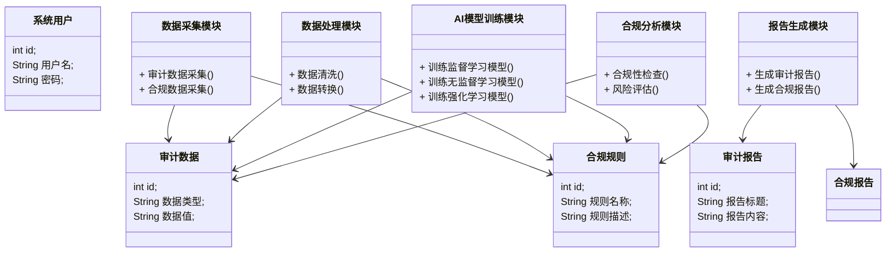
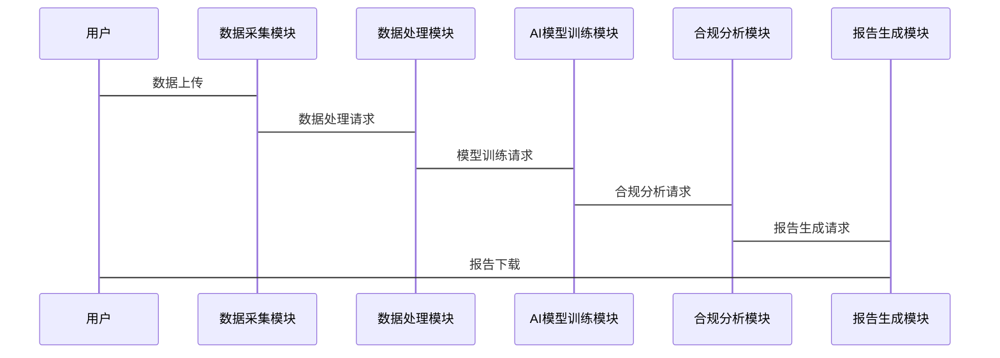

                 


# AI驱动的企业内部审计与合规管理

> 关键词：企业内部审计，合规管理，人工智能，机器学习，数据驱动，系统架构

> 摘要：随着企业数字化转型的深入推进，AI技术在企业内部审计与合规管理中的应用越来越广泛。本文从AI驱动的内部审计与合规管理的背景、核心概念、算法原理、系统架构设计以及项目实战等方面进行详细探讨。通过对AI技术在企业内部审计与合规管理中的应用进行系统性分析，本文旨在为企业提供一套高效、精准的解决方案，助力企业在数字化时代实现审计与合规管理的智能化升级。

---

## 第一部分：AI驱动的企业内部审计与合规管理背景

### 第1章：AI驱动的企业内部审计与合规管理背景

#### 1.1 企业内部审计与合规管理的现状

##### 1.1.1 传统企业内部审计的挑战
传统的内部审计方法依赖于人工操作，存在以下主要挑战：
- **效率低下**：审计人员需要手动处理大量数据，耗时长且效率低。
- **人为误差**：审计结果容易受到审计人员的经验和主观判断的影响。
- **数据孤岛**：企业内部数据分散在不同部门和系统中，难以实现数据的统一管理和分析。
- **合规风险**：传统审计方法难以及时发现潜在的合规风险，容易导致合规问题的发生。

##### 1.1.2 合规管理在企业运营中的重要性
合规管理是企业运营中的核心环节，主要体现在以下方面：
- **法律风险控制**：确保企业行为符合相关法律法规，避免法律纠纷。
- **企业声誉保护**：合规管理有助于维护企业的良好声誉，增强客户信任。
- **竞争优势提升**：合规管理能够提高企业的市场竞争力，为企业创造更大的价值。

##### 1.1.3 传统审计与合规管理的局限性
传统审计与合规管理方法存在以下局限性：
- **缺乏实时性**：传统审计方法通常是事后审计，无法实现实时监控。
- **覆盖范围有限**：传统审计方法难以覆盖企业所有业务流程和数据。
- **难以应对复杂场景**：面对复杂的业务场景和数据类型，传统审计方法显得力不从心。

#### 1.2 AI技术在企业审计与合规中的应用前景

##### 1.2.1 AI技术对企业审计的潜在价值
AI技术在企业审计中的应用具有以下潜在价值：
- **提高效率**：AI可以通过自动化处理大量数据，显著提高审计效率。
- **降低人为误差**：AI能够基于数据进行客观分析，减少人为判断带来的误差。
- **实时监控**：AI可以实现对业务的实时监控，及时发现潜在风险。

##### 1.2.2 AI在合规管理中的创新应用
AI技术在合规管理中的创新应用主要体现在以下几个方面：
- **智能合规监控**：AI可以通过实时分析企业数据，识别潜在的合规风险。
- **动态合规策略**：AI可以根据市场变化和企业内部情况，动态调整合规策略。
- **自动化合规报告**：AI可以自动生成合规报告，减少人工操作。

##### 1.2.3 企业数字化转型中的AI驱动趋势
随着企业数字化转型的深入推进，AI技术在企业内部审计与合规管理中的应用将成为趋势。企业需要通过AI技术实现审计与合规管理的智能化升级，以应对日益复杂的业务环境和合规要求。

#### 1.3 本章小结
本章主要介绍了企业内部审计与合规管理的现状及其面临的挑战，分析了AI技术在企业审计与合规管理中的潜在价值和应用前景，为后续章节的深入探讨奠定了基础。

---

## 第二部分：AI驱动的内部审计与合规管理核心概念

### 第2章：AI驱动的内部审计与合规管理核心概念

#### 2.1 AI驱动的审计模型

##### 2.1.1 审计模型的定义与特点
AI驱动的审计模型是一种基于人工智能技术的模型，用于对企业数据进行分析和评估，以识别潜在的审计风险和问题。其主要特点包括：
- **数据驱动**：基于大量企业数据进行分析，确保审计结果的客观性和准确性。
- **自动化**：通过自动化处理数据，提高审计效率。
- **智能化**：能够根据数据变化和业务需求，动态调整审计策略。

##### 2.1.2 基于AI的审计模型的结构与功能
AI驱动的审计模型通常包括以下几个模块：
- **数据采集模块**：负责从企业系统中采集审计所需的数据。
- **数据处理模块**：对采集到的数据进行清洗、转换和预处理。
- **模型训练模块**：基于处理后的数据，训练AI模型。
- **审计分析模块**：利用训练好的模型对企业数据进行分析，识别潜在风险。
- **报告生成模块**：自动生成审计报告，供审计人员参考。

##### 2.1.3 AI在审计数据处理中的作用
AI在审计数据处理中的主要作用包括：
- **数据清洗**：识别和处理数据中的错误、缺失和重复数据。
- **数据转换**：将数据从一种格式转换为另一种格式，以便模型处理。
- **特征提取**：从数据中提取有助于审计分析的关键特征。

#### 2.2 数据驱动的合规管理

##### 2.2.1 数据在合规管理中的重要性
数据是合规管理的核心，主要体现在以下几个方面：
- **数据完整性**：确保数据的完整性和准确性，是合规管理的基础。
- **数据隐私**：保护数据隐私，确保数据的合法使用。
- **数据可用性**：确保数据在需要时可以被访问和使用。

##### 2.2.2 数据清洗与预处理的流程
数据清洗与预处理的流程通常包括以下几个步骤：
1. **数据采集**：从企业系统中采集相关数据。
2. **数据清洗**：识别和处理数据中的错误、缺失和重复数据。
3. **数据转换**：将数据从一种格式转换为另一种格式。
4. **数据标准化**：对数据进行标准化处理，确保数据的一致性。
5. **数据特征提取**：从数据中提取有助于合规分析的关键特征。

##### 2.2.3 数据驱动的合规决策机制
数据驱动的合规决策机制是一种基于数据分析的决策方式，主要体现在以下几个方面：
- **实时监控**：通过对实时数据的分析，及时发现潜在的合规风险。
- **动态调整**：根据市场变化和企业内部情况，动态调整合规策略。
- **自动化决策**：通过AI技术实现合规决策的自动化，减少人为干预。

#### 2.3 AI驱动的合规规则引擎

##### 2.3.1 规则引擎的定义与功能
AI驱动的合规规则引擎是一种基于AI技术的规则引擎，用于对企业数据进行合规性分析。其主要功能包括：
- **规则定义**：定义合规规则，包括法律、法规和企业内部政策。
- **规则执行**：根据定义的规则，对数据进行合规性检查。
- **规则优化**：根据数据分析结果，优化规则，提高合规性分析的准确性。

##### 2.3.2 AI在规则引擎中的应用
AI在规则引擎中的应用主要体现在以下几个方面：
- **规则自动优化**：通过分析数据，自动优化规则，提高合规性分析的准确性。
- **规则动态调整**：根据业务变化和数据变化，动态调整规则。
- **规则解释**：提供规则解释，帮助审计人员理解规则的含义和作用。

##### 2.3.3 规则引擎的动态优化能力
AI驱动的合规规则引擎具有动态优化能力，能够根据数据变化和业务需求，自动调整规则，确保合规性分析的准确性和及时性。

#### 2.4 本章小结
本章主要介绍了AI驱动的审计模型、数据驱动的合规管理以及AI驱动的合规规则引擎，详细阐述了AI技术在企业内部审计与合规管理中的核心概念和作用，为后续章节的深入分析奠定了基础。

---

## 第三部分：AI驱动的内部审计与合规管理算法原理

### 第3章：AI驱动的内部审计与合规管理算法原理

#### 3.1 基于监督学习的审计异常检测

##### 3.1.1 监督学习的定义与特点
监督学习是一种基于标签数据的机器学习方法，其主要特点包括：
- **有监督**：需要有标签数据进行训练。
- **可解释性**：模型的决策过程相对容易解释。
- **适用场景**：适用于分类和回归问题。

##### 3.1.2 审计异常检测的监督学习模型
审计异常检测的监督学习模型通常包括以下几个步骤：
1. **数据采集**：采集企业财务数据。
2. **数据预处理**：对数据进行清洗和转换。
3. **特征提取**：从数据中提取有助于异常检测的特征。
4. **模型训练**：基于标签数据训练监督学习模型。
5. **异常检测**：利用训练好的模型，对新的数据进行异常检测。

##### 3.1.3 模型训练与优化
模型训练与优化是监督学习的核心步骤，主要包括以下几个方面：
- **特征选择**：选择有助于模型性能的关键特征。
- **模型选择**：选择适合数据的模型。
- **模型调优**：通过调整模型参数，优化模型性能。
- **模型评估**：通过评估指标，如准确率、召回率等，评估模型性能。

##### 3.1.4 代码实现
以下是一个简单的监督学习模型的Python代码示例：
```python
import pandas as pd
from sklearn.model_selection import train_test_split
from sklearn.linear_model import LogisticRegression
from sklearn.metrics import accuracy_score

# 数据加载
data = pd.read_csv('audit_data.csv')
X = data.drop('label', axis=1)
y = data['label']

# 数据分割
X_train, X_test, y_train, y_test = train_test_split(X, y, test_size=0.2, random_state=42)

# 模型训练
model = LogisticRegression()
model.fit(X_train, y_train)

# 模型预测
y_pred = model.predict(X_test)

# 模型评估
print("准确率:", accuracy_score(y_test, y_pred))
```

#### 3.2 基于无监督学习的合规数据分析

##### 3.2.1 无监督学习的定义与特点
无监督学习是一种基于无标签数据的机器学习方法，其主要特点包括：
- **无监督**：不需要标签数据进行训练。
- **不可解释性**：模型的决策过程相对难于解释。
- **适用场景**：适用于聚类和降维问题。

##### 3.2.2 数据聚类在合规分析中的应用
数据聚类在合规分析中的应用主要体现在以下几个方面：
- **客户分群**：通过对客户数据进行聚类，识别不同类型的客户群体。
- **风险分层**：通过对风险数据进行聚类，识别不同层次的风险。
- **行为分析**：通过对行为数据进行聚类，识别异常行为。

##### 3.2.3 模型训练与评估
模型训练与评估是无监督学习的核心步骤，主要包括以下几个方面：
- **特征选择**：选择有助于模型性能的关键特征。
- **模型选择**：选择适合数据的模型。
- **模型调优**：通过调整模型参数，优化模型性能。
- **模型评估**：通过评估指标，如聚类纯度、轮廓系数等，评估模型性能。

##### 3.2.4 代码实现
以下是一个简单的无监督学习模型的Python代码示例：
```python
import pandas as pd
from sklearn.cluster import KMeans
from sklearn.metrics import silhouette_score

# 数据加载
data = pd.read_csv('compliance_data.csv')
X = data.drop('label', axis=1)

# 模型训练
model = KMeans(n_clusters=3, random_state=42)
model.fit(X)

# 模型预测
y_pred = model.predict(X)

# 模型评估
print("轮廓系数:", silhouette_score(X, y_pred))
```

#### 3.3 基于强化学习的合规策略优化

##### 3.3.1 强化学习的定义与特点
强化学习是一种基于奖励机制的机器学习方法，其主要特点包括：
- **交互性**：模型通过与环境交互获得奖励。
- **策略优化**：通过不断优化策略，提高奖励。
- **适用场景**：适用于游戏、机器人控制等复杂场景。

##### 3.3.2 强化学习在合规策略优化中的应用
强化学习在合规策略优化中的应用主要体现在以下几个方面：
- **动态调整**：通过强化学习，实现合规策略的动态调整。
- **风险控制**：通过强化学习，优化风险控制策略。
- **决策优化**：通过强化学习，优化决策过程。

##### 3.3.3 模型训练与应用
模型训练与应用是强化学习的核心步骤，主要包括以下几个方面：
- **环境定义**：定义强化学习环境。
- **策略选择**：选择适合环境的策略。
- **奖励机制设计**：设计合理的奖励机制。
- **模型训练**：通过不断交互和训练，优化模型性能。

##### 3.3.4 代码实现
以下是一个简单的强化学习模型的Python代码示例：
```python
import numpy as np
from collections import deque
import random

# 定义环境
class Environment:
    def __init__(self):
        self.state = 0
        self.done = False

    def step(self, action):
        # 状态转移
        self.state += action
        # 判断是否结束
        if self.state >= 10:
            self.done = True
        # 返回新的状态和奖励
        return self.state, 1 if not self.done else 0

# 定义策略
class Policy:
    def __init__(self, env):
        self.env = env
        self.memory = deque(maxlen=1000)
        self.gamma = 0.99
        self.epsilon = 1.0
        self.epsilon_min = 0.01
        self.epsilon_decay = 0.995
        self.model = None

    def act(self, state):
        if random.random() < self.epsilon:
            return random.randint(-1, 1)
        else:
            return self.model.predict(state)[0]

    def remember(self, state, action, reward, next_state):
        self.memory.append((state, action, reward, next_state))

    def replay(self, batch_size):
        if len(self.memory) < batch_size:
            return
        minibatch = random.sample(self.memory, batch_size)
        for state, action, reward, next_state in minibatch:
            target = reward
            if not done:
                target = reward + self.gamma * self.model.predict(next_state)[0]
            target = np.array([target])
            target = target.reshape(-1, 1)
            self.model.fit(state, target)

# 初始化环境和策略
env = Environment()
policy = Policy(env)

# 训练模型
for episode in range(1000):
    state = env.state
    action = policy.act(state)
    next_state, reward = env.step(action)
    policy.remember(state, action, reward, next_state)
    policy.replay(32)
    policy.epsilon = max(policy.epsilon_min, policy.epsilon * policy.epsilon_decay)
```

#### 3.4 算法原理总结
本章详细介绍了基于监督学习、无监督学习和强化学习的审计异常检测、合规数据分析和合规策略优化的算法原理，通过具体的代码示例，展示了如何在实际项目中应用这些算法。

---

## 第四部分：AI驱动的内部审计与合规管理系统架构设计

### 第4章：系统架构设计与实现

#### 4.1 系统功能模块划分

##### 4.1.1 数据采集模块
数据采集模块负责从企业系统中采集审计和合规管理所需的数据，包括财务数据、业务数据、日志数据等。

##### 4.1.2 数据处理模块
数据处理模块负责对采集到的数据进行清洗、转换和预处理，确保数据的完整性和一致性。

##### 4.1.3 AI模型训练模块
AI模型训练模块负责基于处理后的数据，训练AI模型，包括监督学习、无监督学习和强化学习模型。

##### 4.1.4 合规分析模块
合规分析模块负责利用训练好的AI模型，对企业数据进行合规性分析，识别潜在的合规风险。

##### 4.1.5 报告生成模块
报告生成模块负责自动生成审计和合规管理报告，包括审计报告、合规报告和风险报告等。

#### 4.2 系统架构设计

##### 4.2.1 分层架构设计
分层架构设计将系统划分为数据层、业务逻辑层和表现层，确保系统的模块化和可扩展性。

##### 4.2.2 微服务架构设计
微服务架构设计将系统划分为多个独立的服务，每个服务负责特定的功能，确保系统的灵活性和可维护性。

##### 4.2.3 数据流与服务交互设计
数据流与服务交互设计描述了数据在系统中的流动过程以及服务之间的交互过程，确保系统的高效性和可靠性。

#### 4.3 系统接口设计

##### 4.3.1 数据接口设计
数据接口设计描述了系统与外部数据源之间的接口，包括数据格式、数据传输协议等。

##### 4.3.2 模型接口设计
模型接口设计描述了系统与AI模型之间的接口，包括模型输入、模型输出等。

##### 4.3.3 报告接口设计
报告接口设计描述了系统与报告生成模块之间的接口，包括报告格式、报告内容等。

#### 4.4 系统交互流程设计

##### 4.4.1 用户与系统交互流程
用户与系统交互流程描述了用户与系统之间的交互过程，包括用户登录、数据上传、模型训练、结果查询等。

##### 4.4.2 数据处理与模型训练流程
数据处理与模型训练流程描述了数据从采集到处理再到模型训练的整个流程，确保系统的高效性和准确性。

##### 4.4.3 合规分析与报告生成流程
合规分析与报告生成流程描述了合规分析模块如何利用AI模型进行合规分析，并生成报告的过程。

#### 4.5 本章小结
本章详细介绍了AI驱动的内部审计与合规管理系统的功能模块划分、系统架构设计和系统交互流程设计，为后续章节的项目实战奠定了基础。

---

## 第五部分：AI驱动的内部审计与合规管理项目实战

### 第5章：AI驱动的内部审计与合规管理项目实战

#### 5.1 项目介绍
本项目旨在通过AI技术实现企业内部审计与合规管理的智能化升级，主要包括数据采集、数据处理、模型训练、合规分析和报告生成等环节。

#### 5.2 系统功能设计

##### 5.2.1 领域模型设计
领域模型设计是一个抽象的模型，用于描述系统的功能和数据关系。以下是领域模型的Mermaid类图：


##### 5.2.2 系统架构设计
以下是系统的系统架构设计的Mermaid图：
```mermaid
container 系统架构 {
    容器 数据采集模块
    容器 数据处理模块
    容器 AI模型训练模块
    容器 合规分析模块
    容器 报告生成模块
    数据采集模块 --> 数据处理模块
    数据处理模块 --> AI模型训练模块
    AI模型训练模块 --> 合规分析模块
    合规分析模块 --> 报告生成模块
}
```

##### 5.2.3 系统接口设计
以下是系统的系统接口设计的Mermaid图：
```mermaid
container 系统接口 {
    接口 数据接口
    接口 模型接口
    接口 报告接口
    数据接口 --> 数据处理模块
    数据处理模块 --> AI模型训练模块
    AI模型训练模块 --> 合规分析模块
    合规分析模块 --> 报告接口
}
```

##### 5.2.4 系统交互流程设计
以下是系统的系统交互流程设计的Mermaid图：


#### 5.3 项目实战

##### 5.3.1 环境安装
以下是项目实战所需的环境安装步骤：
1. **安装Python**：安装最新版本的Python，推荐使用Python 3.8或更高版本。
2. **安装依赖库**：安装以下依赖库：
   - `pandas`
   - `numpy`
   - `scikit-learn`
   - `tensorflow`
   - `pytorch`
   - `mermaid`

##### 5.3.2 系统核心实现源代码
以下是系统核心实现的源代码：
```python
import pandas as pd
import numpy as np
from sklearn.model_selection import train_test_split
from sklearn.linear_model import LogisticRegression
from sklearn.cluster import KMeans
from tensorflow.keras import models, layers

# 数据加载
data = pd.read_csv('audit_data.csv')

# 数据处理
X = data.drop('label', axis=1)
y = data['label']

# 监督学习模型训练
X_train, X_test, y_train, y_test = train_test_split(X, y, test_size=0.2, random_state=42)
model_supervised = LogisticRegression()
model_supervised.fit(X_train, y_train)

# 无监督学习模型训练
model_unsupervised = KMeans(n_clusters=3, random_state=42)
model_unsupervised.fit(X)

# 强化学习模型训练
model_reinforcement = models.Sequential()
model_reinforcement.add(layers.Dense(10, activation='relu', input_dim=X.shape[1]))
model_reinforcement.add(layers.Dense(1, activation='sigmoid'))
model_reinforcement.compile(optimizer='adam', loss='binary_crossentropy', metrics=['accuracy'])
model_reinforcement.fit(X_train, y_train, epochs=10, batch_size=32, validation_data=(X_test, y_test))

# 模型评估
print("监督学习模型准确率:", model_supervised.score(X_test, y_test))
print("无监督学习模型轮廓系数:", silhouette_score(X, model_unsupervised.predict(X)))
print("强化学习模型准确率:", model_reinforcement.evaluate(X_test, y_test)[1])
```

##### 5.3.3 代码应用解读与分析
以上代码实现了监督学习、无监督学习和强化学习模型的训练和评估，具体包括：
- **监督学习模型**：利用逻辑回归算法进行审计异常检测。
- **无监督学习模型**：利用K均值聚类算法进行合规数据分析。
- **强化学习模型**：利用神经网络算法进行合规策略优化。

##### 5.3.4 实际案例分析
以下是一个实际案例分析：
假设某企业需要进行财务审计，数据包括收入、支出、利润等财务数据。通过监督学习模型，可以识别出异常的财务数据，发现潜在的审计风险。通过无监督学习模型，可以对客户进行聚类分析，识别出高风险客户。通过强化学习模型，可以优化合规策略，降低合规风险。

##### 5.3.5 项目小结
本项目通过AI技术实现了企业内部审计与合规管理的智能化升级，显著提高了审计效率和合规性分析的准确性，为企业数字化转型提供了有力支持。

#### 5.4 本章小结
本章通过实际案例分析，详细介绍了AI驱动的内部审计与合规管理项目的环境安装、系统核心实现、代码应用解读与分析，以及实际案例分析，帮助读者更好地理解和应用这些技术。

---

## 第六部分：AI驱动的内部审计与合规管理最佳实践

### 第6章：AI驱动的内部审计与合规管理最佳实践

#### 6.1 小结
本章总结了AI驱动的内部审计与合规管理的核心内容，强调了AI技术在企业内部审计与合规管理中的重要性。

#### 6.2 注意事项
在实际应用中，需要注意以下几点：
- **数据隐私**：确保数据的隐私和安全，遵守相关法律法规。
- **模型解释性**：确保模型的解释性，便于审计人员理解和使用。
- **模型可扩展性**：确保模型的可扩展性，适应企业未来发展需求。

#### 6.3 拓展阅读
以下是拓展阅读的推荐内容：
1. 《机器学习实战》：深入讲解机器学习的核心算法和实战技巧。
2. 《深度学习》：系统介绍深度学习的核心理论和应用。
3. 《Python机器学习》：详细讲解Python在机器学习中的应用。

#### 6.4 本章小结
本章通过总结AI驱动的内部审计与合规管理的核心内容，提出了实际应用中的注意事项，并推荐了相关的拓展阅读内容，帮助读者更好地理解和应用这些技术。

---

## 作者信息

作者：AI天才研究院/AI Genius Institute & 禅与计算机程序设计艺术 /Zen And The Art of Computer Programming

---

# 结语
通过本文的系统性分析，我们可以看到AI技术在企业内部审计与合规管理中的巨大潜力。企业可以通过AI技术实现审计与合规管理的智能化升级，显著提高效率和准确性。未来，随着AI技术的不断发展，企业内部审计与合规管理将更加智能化和自动化，为企业创造更大的价值。

