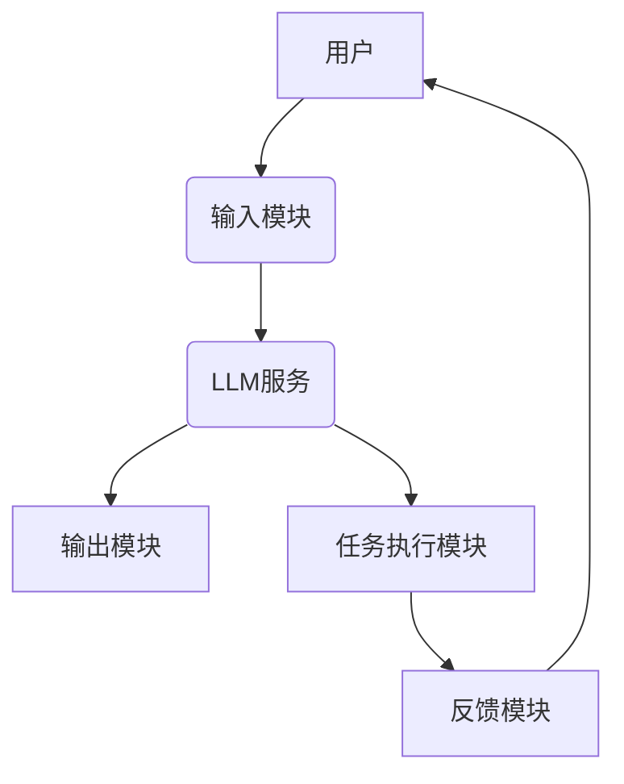
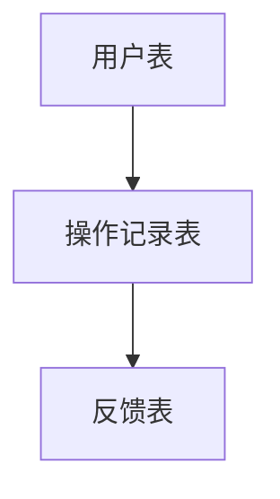

                 


# 从零构建 AI Agent：LLM 大模型应用开发实践

## 关键词：AI Agent，大语言模型，LLM，人工智能，LLM应用开发

## 摘要：本文详细讲解了从零开始构建基于大语言模型（LLM）的AI Agent的完整过程，涵盖核心概念、算法原理、系统架构设计、项目实战以及最佳实践。通过本文，读者可以系统地掌握AI Agent的构建方法，从理论到实践，全面了解LLM在AI Agent中的应用。

---

# 第1章: AI Agent与大模型概述

## 1.1 AI Agent的基本概念

### 1.1.1 AI Agent的定义与特点
AI Agent（人工智能代理）是指能够感知环境、自主决策并执行任务的智能体。与传统软件不同，AI Agent具备以下特点：
- **自主性**：能够独立决策，无需人工干预。
- **反应性**：能够实时感知环境并做出反应。
- **主动性**：主动执行任务，而非被动响应。
- **学习能力**：通过数据和经验不断优化自身性能。

### 1.1.2 AI Agent的核心要素与功能
AI Agent的核心要素包括：
- **感知模块**：负责接收外部输入，如用户指令或环境数据。
- **决策模块**：基于感知的信息，通过算法生成决策。
- **执行模块**：将决策转化为具体行动，如生成文本或调用API。
- **学习模块**：通过反馈优化决策和执行策略。

### 1.1.3 AI Agent的分类与应用场景
AI Agent可以分为以下几类：
- **简单规则型**：基于预定义规则执行任务。
- **基于模型型**：利用机器学习模型进行决策。
- **人机协作型**：结合人类反馈优化决策。

应用场景包括：
- **智能对话系统**：如智能客服、虚拟助手。
- **自动化任务处理**：如自动回复邮件、安排日程。
- **复杂决策支持**：如金融投资、医疗诊断。

## 1.2 大语言模型（LLM）的基本概念

### 1.2.1 大语言模型的定义与特点
大语言模型（Large Language Model，LLM）是指经过大量数据训练的深度学习模型，能够理解和生成人类语言。其特点包括：
- **大规模训练**：通常使用数十亿甚至更多的数据进行训练。
- **多任务能力**：能够处理多种语言任务，如翻译、问答、文本生成。
- **上下文理解**：能够理解上下文关系，生成连贯的文本。

### 1.2.2 LLM的核心技术与实现原理
LLM的核心技术包括：
- **Transformer架构**：通过自注意力机制捕捉文本中的长距离依赖关系。
- **预训练与微调**：首先在通用任务上进行预训练，然后针对具体任务进行微调。

### 1.2.3 LLM与AI Agent的关系
LLM作为AI Agent的核心驱动力，负责处理自然语言输入并生成自然语言输出。AI Agent通过调用LLM API实现对话能力、内容生成等功能。

## 1.3 AI Agent与LLM的结合

### 1.3.1 AI Agent中LLM的作用
在AI Agent中，LLM主要负责以下任务：
- **自然语言理解**：理解用户的输入，提取意图和实体。
- **对话生成**：生成自然流畅的回复。
- **内容创作**：根据需求生成文本，如邮件、文章。

### 1.3.2 LLM驱动的对话式AI Agent
基于LLM的对话式AI Agent能够实现以下功能：
- **上下文对话**：保持对话的连贯性。
- **多轮对话**：支持多轮交互，逐步理解用户需求。
- **动态调整**：根据用户反馈优化回复内容。

### 1.3.3 LLM在AI Agent中的应用案例
- **智能客服**：通过LLM处理用户的咨询，提供准确的解答。
- **虚拟助手**：如Siri、Alexa等，通过LLM实现自然语言交互。
- **内容创作工具**：如AI写作助手，帮助用户生成文章、广告文案。

## 1.4 本章小结
本章介绍了AI Agent和LLM的基本概念，分析了LLM在AI Agent中的作用，并通过实际案例展示了AI Agent的应用场景。接下来将深入探讨LLM与AI Agent的核心原理。

---

# 第2章: LLM与AI Agent的核心原理

## 2.1 LLM的训练与推理原理

### 2.1.1 LLM的训练过程
LLM的训练过程包括以下步骤：
1. **数据准备**：收集和整理大规模多语言文本数据。
2. **模型初始化**：定义模型架构，初始化模型参数。
3. **损失函数计算**：通过交叉熵损失函数衡量模型预测与真实值的差异。
4. **反向传播**：通过梯度下降优化模型参数。
5. **模型微调**：针对具体任务进行微调，优化模型性能。

### 2.1.2 LLM的推理机制
LLM的推理机制包括：
- **自注意力机制**：计算输入序列中每个词与其他词的相关性。
- **前馈网络**：将自注意力结果通过多层感知机生成最终的词向量。

### 2.1.3 LLM的数学模型与公式
LLM的核心数学模型基于Transformer架构，其自注意力机制的公式如下：

$$
\text{Attention}(Q, K, V) = \text{softmax}\left(\frac{QK^T}{\sqrt{d_k}}\right)V
$$

其中，$Q$、$K$、$V$分别为查询、键、值向量，$d_k$为键的维度。

## 2.2 AI Agent的决策机制

### 2.2.1 基于LLM的决策模型
AI Agent的决策模型通常包括以下步骤：
1. **输入处理**：接收用户的输入并解析需求。
2. **意图识别**：通过LLM生成初步的意图解析结果。
3. **决策生成**：基于意图和环境信息生成决策。
4. **决策优化**：通过反馈优化决策策略。

### 2.2.2 决策树与概率推理
决策树是一种基于树状结构的决策方法，适用于复杂场景下的决策。概率推理则基于概率论，计算每种决策的概率，选择概率最高的决策。

### 2.2.3 基于状态的决策过程
基于状态的决策过程包括以下步骤：
1. **状态感知**：感知当前环境的状态。
2. **状态转移**：根据状态转移规则生成新的状态。
3. **决策生成**：基于当前状态生成决策。

## 2.3 LLM与AI Agent的交互流程

### 2.3.1 用户输入的处理
用户输入的处理流程包括：
1. **输入解析**：解析用户的自然语言输入，提取意图和实体。
2. **输入转换**：将自然语言输入转换为模型可理解的格式。
3. **模型调用**：调用LLM生成回复内容。

### 2.3.2 LLM的响应生成
响应生成的流程包括：
1. **生成候选回复**：通过LLM生成多个候选回复。
2. **候选筛选**：根据预设的筛选规则选择最优回复。
3. **回复优化**：对选中的回复进行优化，确保连贯性和准确性。

### 2.3.3 响应的验证与优化
响应验证与优化包括：
1. **内容验证**：检查生成的回复是否符合用户需求。
2. **反馈收集**：收集用户的反馈信息，用于优化模型。
3. **模型优化**：根据反馈优化LLM的参数或微调模型。

## 2.4 核心概念对比分析

### 2.4.1 LLM与传统NLP模型的对比
| 对比维度 | LLM | 传统NLP模型 |
|----------|------|-------------|
| 训练数据 | 大规模 | 小规模       |
| 模型复杂度 | 高     | 低           |
| 多任务能力 | 强     | 弱           |

### 2.4.2 AI Agent与传统软件的对比
| 对比维度 | AI Agent | 传统软件       |
|----------|-----------|---------------|
| 自主性   | 高         | 低             |
| 反应性   | 高         | 低             |
| 学习能力 | 高         | 无             |

## 2.5 本章小结
本章详细讲解了LLM的训练与推理原理，分析了AI Agent的决策机制，并通过对比分析展示了LLM与传统NLP模型、AI Agent与传统软件的区别。接下来将探讨AI Agent的系统架构设计。

---

# 第3章: AI Agent的系统架构设计

## 3.1 系统概述

### 3.1.1 系统目标
本系统的目标是构建一个基于LLM的AI Agent，实现自然语言交互、任务执行等功能。

### 3.1.2 系统功能需求
系统功能需求包括：
- **自然语言理解**：理解用户的输入，提取意图和实体。
- **对话生成**：生成自然流畅的回复。
- **任务执行**：根据用户需求执行任务，如调用API、发送邮件。

## 3.2 系统架构设计

### 3.2.1 系统架构图


### 3.2.2 模块设计
- **输入模块**：接收用户的输入，解析意图和实体。
- **LLM服务**：调用LLM API生成回复内容。
- **输出模块**：将生成的内容返回给用户。
- **任务执行模块**：根据用户的指令执行任务，如调用API、发送邮件。
- **反馈模块**：收集用户的反馈，优化系统性能。

### 3.2.3 数据流设计
数据流设计包括：
1. 用户输入 -> 输入模块 -> LLM服务 -> 输出模块。
2. 用户指令 -> 任务执行模块 -> 反馈模块 -> 用户反馈 -> LLM服务优化。

## 3.3 数据库设计

### 3.3.1 数据表设计
| 表名       | 字段         | 描述                   |
|------------|--------------|------------------------|
| 用户表     | 用户ID, 用户名, 密码 | 用户基本信息             |
| 操作记录表 | 记录ID, 用户ID, 操作时间, 操作内容 | 用户操作记录           |
| 反馈表     | 反馈ID, 用户ID, 反馈内容, 反馈时间 | 用户反馈信息           |

### 3.3.2 数据库关系图


## 3.4 本章小结
本章详细设计了AI Agent的系统架构，包括模块设计、数据流设计和数据库设计。接下来将通过项目实战进一步展示系统的实现过程。

---

# 第4章: 项目实战

## 4.1 环境搭建

### 4.1.1 安装Python
```bash
# 安装Python
sudo apt-get install python3 python3-dev
```

### 4.1.2 安装依赖库
```bash
pip install transformers requests
```

## 4.2 核心代码实现

### 4.2.1 输入模块
```python
def parse_input(user_input):
    # 解析用户输入，提取意图和实体
    return {"intent": "help", "entities": {"name": "user1"}}
```

### 4.2.2 LLM服务调用
```python
from transformers import pipeline

model = pipeline("text-generation", model="gpt2")
response = model("Please help me with ")[0]['generated_text']
```

### 4.2.3 输出模块
```python
def output_response(response):
    print("AI Agent:", response)
```

### 4.2.4 任务执行模块
```python
def execute_task(task):
    if task == "send_email":
        send_email()
    elif task == "search_web":
        search_web()
```

## 4.3 代码解读与分析
- **输入模块**：解析用户的输入，提取意图和实体，为后续处理提供基础数据。
- **LLM服务调用**：通过调用预训练好的LLM生成回复内容，确保生成文本的自然流畅。
- **输出模块**：将生成的回复内容输出给用户，完成交互过程。
- **任务执行模块**：根据用户的指令执行具体任务，如发送邮件、搜索信息。

## 4.4 案例分析

### 4.4.1 案例1：智能对话系统
用户输入：“帮我写一封邮件。”
系统响应：
1. 输入模块解析用户输入，提取意图“写邮件”。
2. LLM服务生成邮件草稿。
3. 输出模块将邮件草稿输出给用户。
4. 用户确认后，任务执行模块调用邮件发送功能。

### 4.4.2 案例2：任务执行
用户输入：“搜索明天的天气。”
系统响应：
1. 输入模块解析用户输入，提取意图“搜索天气”。
2. LLM服务生成搜索请求。
3. 任务执行模块调用天气查询API，获取天气信息。
4. 输出模块将天气信息输出给用户。

## 4.5 本章小结
本章通过项目实战展示了AI Agent的实现过程，包括环境搭建、核心代码实现和案例分析。通过实际操作，读者可以更好地理解AI Agent的构建方法。

---

# 第5章: 高级主题与未来展望

## 5.1 多模态AI Agent

### 5.1.1 多模态模型的基本概念
多模态模型能够处理多种类型的数据，如文本、图像、语音等。

### 5.1.2 多模态AI Agent的优势
多模态AI Agent能够提供更丰富的交互方式，提升用户体验。

## 5.2 伦理与安全

### 5.2.1 AI Agent的伦理问题
- **隐私泄露**：用户数据可能被滥用。
- **决策偏差**：模型可能存在偏见，导致决策错误。

### 5.2.2 安全问题
- **数据泄露**：用户数据可能被恶意攻击者窃取。
- **模型滥用**：AI Agent可能被用于非法用途。

## 5.3 未来展望

### 5.3.1 技术趋势
- **更强大的模型**：如GPT-4、PaLM等。
- **多模态融合**：结合文本、图像、语音等多种模态信息。

### 5.3.2 应用场景扩展
- **教育领域**：个性化学习助手。
- **医疗领域**：辅助诊断、患者咨询。

## 5.4 本章小结
本章探讨了AI Agent的高级主题，包括多模态模型、伦理与安全问题，并展望了未来的发展趋势。通过不断的技术进步和应用创新，AI Agent将为人类社会带来更大的价值。

---

# 作者：AI天才研究院 & 禅与计算机程序设计艺术

