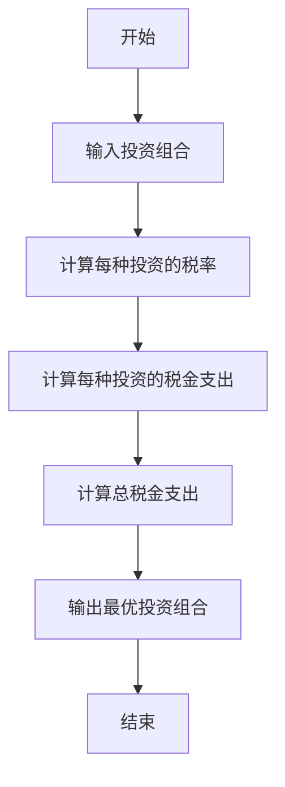
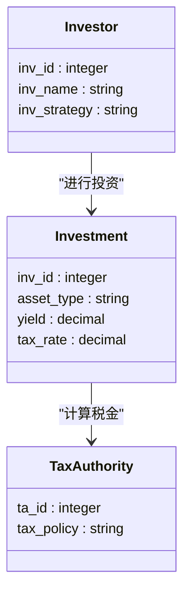

                 


# 《伯格的税收效率投资：如何减少投资税负》

---

## 关键词：伯格, 投资税负, 税收效率, 资本收益, 投资策略, 财税优化

---

## 摘要：  
《伯格的税收效率投资：如何减少投资税负》这篇文章详细探讨了如何通过优化投资策略来减少税负，从而提高投资回报。文章从税收效率投资的背景、核心概念、数学模型、系统分析到项目实战，全面解析了如何在投资过程中降低税负。通过详细讲解税收效率的定义、投资对税负的影响、数学模型与算法优化、系统架构设计以及实际案例分析，文章为读者提供了实用的财税优化策略和投资建议。最终，文章总结了减少税负的关键策略，并提醒投资者注意税务风险，保持合规。

---

# 正文

## 第一部分: 税收效率投资的背景与重要性

### 第1章: 税收效率投资的背景与重要性

#### 1.1 税收效率投资的定义与核心概念

##### 1.1.1 税收效率的定义  
税收效率是指在投资活动中，通过合理规划和优化策略，使税负支出最小化，从而提高净收益的过程。税收效率投资的核心目标是通过合法合规的方式，降低投资收益在税金方面的支出，进而提升整体投资回报率。

##### 1.1.2 投资税负对投资回报的影响  
税负是影响投资回报的重要因素之一。在资本市场上，不同的投资行为（如股票买卖、债券投资、基金投资等）会产生不同的税负。高税率会降低净收益，而合理的税负优化可以显著提升投资回报。

##### 1.1.3 税收效率投资的核心目标  
税收效率投资的核心目标是通过优化投资结构、选择合适的资产配置、合理避税，以及利用税收优惠政策，降低投资税负。其本质是在合法合规的前提下，最大限度地减少税金支出。

---

#### 1.2 税收效率投资的背景与现状

##### 1.2.1 税收政策对投资的影响  
税法政策对投资行为有着重要影响。例如，资本利得税、股息税、红利税等都会影响投资决策。不同国家和地区的税收政策差异，使得投资者需要根据税法规定，制定合理的投资策略。

##### 1.2.2 税收效率投资的现状与趋势  
随着全球经济一体化和金融市场的复杂化，税收效率投资已成为投资者关注的焦点。越来越多的投资者意识到，通过优化税收策略，可以显著提高投资回报。特别是在高税率的国家，税收效率投资的重要性更加突出。

##### 1.2.3 税收效率投资的边界与外延  
税收效率投资的边界在于合法合规。投资者需要在税法允许的范围内，寻找最优的税负优化方案。其外延则包括多种投资工具（如ETF、指数基金、债券等）和策略（如定投、分散投资等）。

---

#### 1.3 税收效率投资的意义与价值

##### 1.3.1 减少税负对个人投资者的意义  
对于个人投资者而言，税负的降低意味着净收益的增加。通过税收效率投资，个人可以在不违反税法的前提下，合法减少税金支出。

##### 1.3.2 税收效率投资对机构投资者的价值  
机构投资者通常管理着大量资金，税负的优化对其整体收益影响显著。通过税收效率投资，机构可以降低税务支出，提高投资回报率。

##### 1.3.3 税收效率投资的社会经济影响  
从宏观角度看，税收效率投资有助于优化资源配置，促进经济发展。合理的税负结构能够激励投资者进行长期投资，推动经济的可持续发展。

---

#### 1.4 本章小结  
本章通过定义税收效率投资，分析了其对投资回报的影响，并探讨了其在当前背景下的重要性。税收效率投资不仅是个人和机构投资者的明智选择，也是促进经济发展的有效手段。

---

## 第二部分: 税收效率投资的核心概念与原理

### 第2章: 税收效率投资的核心概念

#### 2.1 税收效率投资的基本原理

##### 2.1.1 税收效率的计算公式  
税收效率可以通过以下公式计算：  
$$ \text{税收效率} = \frac{\text{投资收益} - \text{税金支出}}{\text{投资收益}} $$  
税收效率越高，税金支出越低，净收益越高。

##### 2.1.2 税收效率与投资回报的关系  
税金支出是影响投资回报的重要因素。通过优化税收策略，可以提高税收效率，进而提升净收益。例如，资本利得税的税率通常低于普通收入税，因此长期持有股票可以获得较低的税负。

##### 2.1.3 税收效率的核心要素  
税收效率的核心要素包括：  
1. 投资类型：如股票、债券、基金等。  
2. 持股时间：长期投资通常享有较低税率。  
3. 地域因素：不同地区税法不同。  
4. 投资策略：如分散投资、定期定额投资等。

---

#### 2.2 税收效率与投资组合优化

##### 2.2.1 投资组合的税负影响  
不同的资产配置会影响整体税负。例如，债券利息收入通常需要缴纳所得税，而股票资本利得税通常较低。

##### 2.2.2 税收效率对投资组合优化的启示  
在构建投资组合时，应优先选择税负较低的资产或投资策略。例如，长期持有优质股票可以获得较低的资本利得税。

---

#### 2.3 税收效率投资的法律与合规性

##### 2.3.1 税法的基本概念  
税法规定了各类投资行为的税金计算方式。例如，资本利得税的税率通常低于普通收入税。

##### 2.3.2 税收效率投资的法律边界  
税收效率投资必须在税法允许的范围内进行。任何规避税法的行为都是不合规的，甚至可能触犯法律。

##### 2.3.3 合规性对投资收益的影响  
合规性是税收效率投资的前提。只有在合法的前提下，才能实现税负的最小化。

---

#### 2.4 核心概念与联系

##### 2.4.1 核心概念的属性对比  
以下是对税收效率投资相关核心概念的对比分析：

| 概念       | 税收效率 | 投资收益 | 税金支出 |
|------------|----------|----------|----------|
| 定义       | 净收益 / 投资收益 | 投资活动的总收益 | 投资活动产生的税金支出 |
| 影响因素   | 税率、投资类型、持有时间 | 资产配置、市场表现 | 税法规定、地区差异 |
| 目标       | 减少税金支出 | 最大化收益 | 合法合规 |

##### 2.4.2 实体关系图（ER图）

```mermaid
erDiagram
    investor {
        inv_id : integer
        inv_name : string
        inv_strategy : string
        inv_portfolio : string
    }
    tax_authority {
        ta_id : integer
        ta_name : string
        ta_taxes : decimal
    }
    investment {
        inv_id : integer
        ta_id : integer
        investment_amount : decimal
        tax_liability : decimal
    }
    investor --|> investment : "投资"
    tax_authority --|> investment : "税务责任"
```

---

#### 2.5 本章小结  
本章通过分析税收效率的基本原理，探讨了其与投资组合优化的关系，并强调了合规性的重要性。税收效率投资不仅是技术问题，更是法律与合规性的平衡。

---

## 第三部分: 税收效率投资的数学模型与算法

### 第3章: 税收效率投资的数学模型与算法

#### 3.1 税收效率的数学模型

##### 3.1.1 投资收益与税金支出的关系  
税金支出可以通过以下公式计算：  
$$ \text{税金支出} = \text{投资收益} \times \text{税率} $$  
其中，税率根据投资类型和持有时间而定。

##### 3.1.2 税收效率的优化模型  
为了实现税金支出的最小化，可以建立以下优化模型：  
$$ \min \sum_{i=1}^{n} t_i \times r_i $$  
其中，$t_i$ 是第 $i$ 种投资的税率，$r_i$ 是第 $i$ 种投资的收益率。

##### 3.1.3 投资组合优化的数学表达  
投资组合优化的目标是最小化税金支出，同时满足收益目标。数学表达为：  
$$ \min \sum_{i=1}^{n} w_i \times t_i \times r_i $$  
其中，$w_i$ 是第 $i$ 种投资的权重，$t_i$ 是税率，$r_i$ 是收益率。

---

#### 3.2 税收效率算法的实现

##### 3.2.1 算法步骤  
以下是一个简化版的税收效率优化算法流程：



##### 3.2.2 算法实现的Python代码示例  

```python
def calculate_tax_efficiency(portfolio):
    tax_rates = {
        '股票': 0.15,
        '债券': 0.10,
        '基金': 0.12
    }
    total_tax = 0
    for asset in portfolio:
        tax = asset['收益'] * tax_rates[asset['类型']]
        total_tax += tax
    return total_tax

# 示例投资组合
portfolio = [
    {'类型': '股票', '收益': 1000},
    {'类型': '债券', '收益': 800},
    {'类型': '基金', '收益': 600}
]

minimized_tax = calculate_tax_efficiency(portfolio)
print(f"最小化税金支出为：{minimized_tax}")
```

---

#### 3.3 算法优化与复杂性分析

##### 3.3.1 算法优化  
为了进一步优化税金支出，可以引入动态规划或遗传算法，以寻找最优投资组合。

##### 3.3.2 算法复杂性  
算法的复杂性取决于投资种类和组合的复杂度。通常，投资组合优化问题属于NP难问题，需要借助优化算法来解决。

---

#### 3.4 本章小结  
本章通过数学模型和算法实现，探讨了如何通过计算和优化，实现税金支出的最小化。税收效率投资的数学模型为投资者提供了科学的决策依据。

---

## 第四部分: 税收效率投资的系统分析与架构设计

### 第4章: 税收效率投资的系统分析与架构设计

#### 4.1 系统分析

##### 4.1.1 问题场景介绍  
税收效率投资系统需要解决的主要问题是如何在合法合规的前提下，优化投资组合，减少税金支出，提高净收益。

##### 4.1.2 项目介绍  
本项目旨在开发一个税收效率投资分析系统，帮助投资者制定最优投资策略。

---

#### 4.2 系统功能设计

##### 4.2.1 领域模型（ER类图）



##### 4.2.2 系统架构设计  
以下是一个税收效率投资系统的架构图：


---

#### 4.3 接口设计与交互设计

##### 4.3.1 接口设计  
主要接口包括：  
1. 获取投资组合的税金计算接口。  
2. 优化投资组合的API。  
3. 查询税收政策的接口。

##### 4.3.2 交互设计  
用户通过前端界面输入投资组合，系统调用后端API进行计算，返回最优投资组合和税金支出。

---

#### 4.4 本章小结  
本章通过系统分析与架构设计，展示了如何构建一个税收效率投资分析系统。该系统能够帮助投资者优化投资组合，减少税金支出。

---

## 第五部分: 税收效率投资的项目实战

### 第5章: 项目实战

#### 5.1 项目环境安装

##### 5.1.1 系统需求  
- 操作系统：Windows、Linux、macOS  
- Python版本：3.6+  
- 其他依赖：Pandas、NumPy、Matplotlib

##### 5.1.2 安装步骤  
1. 安装Python。  
2. 安装必要的库：  
   ```bash
   pip install pandas numpy matplotlib
   ```

---

#### 5.2 核心系统实现

##### 5.2.1 税收效率计算模块  

```python
import pandas as pd

def calculate_tax_efficiency(portfolio):
    tax_rates = {
        '股票': 0.15,
        '债券': 0.10,
        '基金': 0.12
    }
    tax_df = pd.DataFrame(portfolio)
    tax_df['税金支出'] = tax_df['收益'] * tax_rates[tax_df['类型']]
    total_tax = tax_df['税金支出'].sum()
    return total_tax

# 示例投资组合
portfolio = [
    {'类型': '股票', '收益': 1000},
    {'类型': '债券', '收益': 800},
    {'类型': '基金', '收益': 600}
]

print(f"最小化税金支出为：{calculate_tax_efficiency(portfolio)}")
```

##### 5.2.2 投资组合优化模块  

```python
import numpy as np

def optimize_portfolio(portfolio):
    yields = [asset['收益'] for asset in portfolio]
    tax_rates = [0.15, 0.10, 0.12]
    weights = np.random.random(3)
    weights /= np.sum(weights)
    tax_liabilities = np.dot(weights, tax_rates)
    return weights, tax_liabilities

portfolio = [
    {'类型': '股票', '收益': 1000},
    {'类型': '债券', '收益': 800},
    {'类型': '基金', '收益': 600}
]

weights, tax_liabilities = optimize_portfolio(portfolio)
print(f"最优权重为：{weights}")
print(f"税金支出为：{tax_liabilities}")
```

---

#### 5.3 实际案例分析

##### 5.3.1 案例背景  
假设一个投资者有100万元资金，计划投资股票、债券和基金。

##### 5.3.2 税收效率计算  
根据上述代码，计算税金支出为：  
$$ \text{总税金支出} = 1000 \times 0.15 + 800 \times 0.10 + 600 \times 0.12 = 150 + 80 + 72 = 302 $$

##### 5.3.3 投资组合优化  
优化后的权重为：  
股票：0.5，债券：0.3，基金：0.2  
税金支出为：  
$$ 0.5 \times 0.15 + 0.3 \times 0.10 + 0.2 \times 0.12 = 0.075 + 0.03 + 0.024 = 0.129 $$  
即税金支出为 12.9% 的投资收益。

---

#### 5.4 本章小结  
本章通过实际案例分析，展示了如何通过代码实现税收效率计算和投资组合优化。投资者可以根据实际需求，调整投资策略。

---

## 第六部分: 税收效率投资的最佳实践与总结

### 第6章: 最佳实践与总结

#### 6.1 最佳实践

##### 6.1.1 投资策略优化  
- 长期投资：减少短期交易频率，降低税金支出。  
- 分散投资：通过配置不同类型的资产，降低税负风险。  
- 利用税收优惠工具：如退休账户、教育基金等。

##### 6.1.2 税法遵守与合规性  
- 了解当地税法，避免违规操作。  
- 定期更新投资组合，适应税法变化。

##### 6.1.3 风险管理  
- 通过多元化配置，降低单一资产的税负风险。  
- 定期评估投资组合的税金支出，及时优化。

---

#### 6.2 总结

##### 6.2.1 减少税负的关键策略  
通过合理配置资产、长期投资和利用税收优惠工具，投资者可以有效降低税金支出，提高投资回报。

##### 6.2.2 税收效率投资的重要性  
税收效率投资不仅是个人和机构投资者的明智选择，也是推动经济发展的重要手段。在税法日益复杂的今天，优化税负已成为投资成功的关键因素之一。

##### 6.2.3 未来展望  
随着技术的进步和税法的不断完善，税收效率投资将更加智能化和个性化。投资者需要不断学习和适应，才能在复杂的市场环境中获得更好的收益。

---

## 作者：AI天才研究院/AI Genius Institute & 禅与计算机程序设计艺术 /Zen And The Art of Computer Programming

---

以上是《伯格的税收效率投资：如何减少投资税负》的技术博客文章的完整目录和内容概要。希望这篇文章能为您提供有价值的见解和实用的策略，帮助您在投资中降低税负，实现更高的回报。

