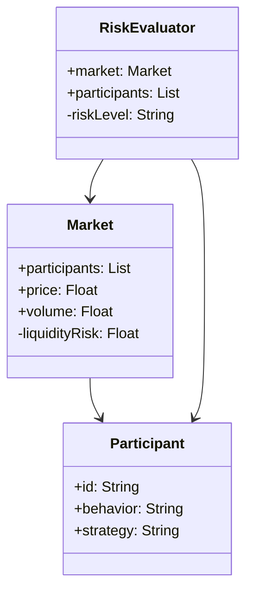
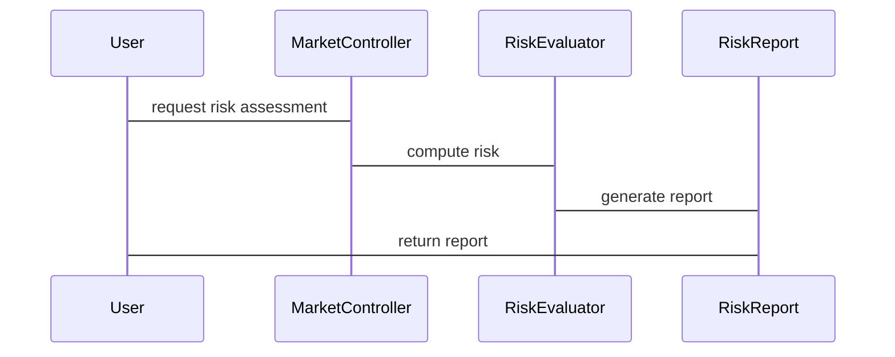

                 


# 基于多智能体的动态市场流动性风险评估模型

> 关键词：多智能体系统，流动性风险，动态市场，金融建模，风险评估

> 摘要：本文探讨了在动态金融市场中，基于多智能体的流动性风险评估模型的构建与应用。通过分析市场参与者的复杂行为和市场动态，提出了一种结合动态博弈论和多智能体系统的方法，以实现对流动性风险的实时评估与预测。本文详细阐述了模型的核心概念、算法原理、系统架构，并通过实际案例展示了模型的应用效果。

---

## 第一部分: 基于多智能体的动态市场流动性风险评估模型概述

### 第1章: 多智能体与流动性风险概述

#### 1.1 多智能体系统的基本概念

##### 1.1.1 多智能体系统的定义与特点

多智能体系统（Multi-Agent System, MAS）是由多个相互作用的智能体组成的系统，这些智能体能够感知环境、自主决策并执行任务。其特点包括分布式性、协作性、反应性和适应性。

##### 1.1.2 多智能体系统的核心要素

- **智能体**：具有感知和决策能力的个体。
- **环境**：智能体所处的外部世界。
- **交互**：智能体之间的通信与协作。
- **目标**：智能体的决策动机。

##### 1.1.3 多智能体系统在金融领域的应用

多智能体系统广泛应用于金融市场模拟、风险评估、交易策略优化等领域。通过模拟市场参与者的复杂行为，可以更准确地预测市场动态。

#### 1.2 流动性风险的基本概念

##### 1.2.1 流动性风险的定义与特征

流动性风险是指资产在短时间内难以以合理价格变现的风险。其特征包括时间性、波动性和传染性。

##### 1.2.2 流动性风险的分类与影响

- **市场流动性风险**：整个市场的流动性不足。
- **个体流动性风险**：特定资产或机构的流动性问题。
- **影响**：可能导致市场波动、交易成本增加和系统性风险。

#### 1.3 多智能体系统与流动性风险的结合

##### 1.3.1 多智能体系统在流动性风险评估中的优势

- **复杂行为模拟**：能够捕捉市场参与者的非理性行为。
- **动态性**：适应市场的实时变化。
- **分布式决策**：模拟多参与者之间的互动。

##### 1.3.2 动态市场中流动性风险的复杂性

- **多因素影响**：价格、交易量、市场情绪等。
- **非线性关系**：风险在不同市场条件下的动态变化。
- **系统性风险**：局部风险可能引发全局性问题。

##### 1.3.3 多智能体模型在流动性风险评估中的应用前景

通过模拟市场参与者的互动，多智能体系统能够提供更准确的流动性风险评估，为金融机构的决策提供支持。

#### 1.4 本章小结

本章介绍了多智能体系统的基本概念及其在金融领域的应用，分析了流动性风险的定义、分类和特征，并探讨了多智能体系统在流动性风险评估中的优势和应用前景。

---

## 第二部分: 动态市场流动性风险评估模型的核心概念

### 第2章: 多智能体系统与流动性风险的核心要素

#### 2.1 多智能体系统的组成与功能

##### 2.1.1 实体与行为的定义

- **实体**：市场参与者（如投资者、交易员）。
- **行为**：实体的决策和行动。

##### 2.1.2 实体之间的关系与交互

- **交易**：实体之间的买卖行为。
- **信息传递**：实体之间的信息共享。

##### 2.1.3 系统状态与动态变化

- **系统状态**：市场的整体状况。
- **动态变化**：市场的实时波动。

#### 2.2 流动性风险的核心要素

##### 2.2.1 市场深度与流动性

- **市场深度**：市场参与者愿意交易的数量。
- **流动性**：资产的买卖难度。

##### 2.2.2 市场参与者的角色与行为

- **投资者**：追求收益最大化。
- **交易员**：执行交易指令。

##### 2.2.3 价格波动与交易成本

- **价格波动**：资产价格的涨跌。
- **交易成本**：交易过程中的费用。

#### 2.3 多智能体系统与流动性风险的关联

##### 2.3.1 多智能体系统在流动性风险评估中的作用

- **模拟市场行为**：捕捉市场的复杂动态。
- **预测风险**：提前识别潜在风险。

##### 2.3.2 流动性风险对多智能体系统的影响

- **系统稳定性**：流动性风险可能引发系统性崩溃。
- **智能体行为**：风险影响智能体的决策。

##### 2.3.3 核心要素的动态关系

- **动态关系**：市场深度、参与者行为和价格波动的相互作用。

#### 2.4 本章小结

本章分析了多智能体系统的组成与功能，探讨了流动性风险的核心要素，并分析了多智能体系统与流动性风险的关联。

---

## 第三部分: 多智能体动态市场流动性风险评估模型的算法原理

### 第3章: 动态博弈论与多智能体模型

#### 3.1 动态博弈论的基本原理

##### 3.1.1 博弈论的基本概念

- **博弈**：参与者之间的互动。
- **策略**：参与者的选择。

##### 3.1.2 动态博弈论的特点

- **时间因素**：决策的时序性。
- **信息不对称**：参与者掌握信息的不同。

##### 3.1.3 动态博弈论在流动性风险评估中的应用

- **模拟市场互动**：捕捉市场的动态变化。
- **预测风险**：基于博弈论模型预测市场行为。

#### 3.2 多智能体系统的动态建模方法

##### 3.2.1 状态空间与行为空间

- **状态空间**：系统的当前状态。
- **行为空间**：可能的决策和行动。

##### 3.2.2 动态模型的构建与求解

- **模型构建**：定义系统的状态、行为和交互规则。
- **模型求解**：通过算法模拟系统的动态变化。

##### 3.2.3 多智能体系统中的博弈关系

- **竞争与合作**：智能体之间的博弈关系。
- **纳什均衡**：市场均衡状态。

#### 3.3 算法实现与优化

##### 3.3.1 算法的实现步骤

- **初始化**：定义智能体、环境和规则。
- **迭代**：模拟市场的动态变化。
- **评估**：计算流动性风险。

##### 3.3.2 算法的优化方法

- **并行计算**：提高计算效率。
- **自适应调整**：动态调整模型参数。

##### 3.3.3 算法的复杂度分析

- **时间复杂度**：算法运行的时间。
- **空间复杂度**：算法占用的空间。

#### 3.4 本章小结

本章介绍了动态博弈论的基本原理，探讨了多智能体系统的动态建模方法，并分析了算法的实现与优化。

---

## 第四部分: 数学模型与公式详解

### 第4章: 数学模型与公式

#### 4.1 动态博弈论的数学模型

##### 4.1.1 博弈树的定义

博弈树是一种树状结构，表示博弈的可能路径。

##### 4.1.2 纳什均衡的数学表达

纳什均衡的定义为：在给定其他参与者策略的情况下，没有任何参与者愿意单方面改变自己的策略。

##### 4.1.3 动态博弈论的数学公式

$$
V_i(s_i, s_{-i}) = \max_{a_i} \min_{a_{-i}} V_i(a_i, a_{-i})
$$

#### 4.2 多智能体系统的数学模型

##### 4.2.1 多智能体系统的状态空间

$$
S = \{s_1, s_2, \ldots, s_n\}
$$

##### 4.2.2 多智能体系统的行为空间

$$
A = \{a_1, a_2, \ldots, a_n\}
$$

##### 4.2.3 多智能体系统的收益函数

$$
U(a_i, s_{-i}) = \sum_{j \neq i} U_j(a_j, s_j)
$$

#### 4.3 本章小结

本章详细介绍了动态博弈论和多智能体系统的数学模型，为后续的算法实现提供了理论基础。

---

## 第五部分: 系统分析与架构设计

### 第5章: 系统分析与架构设计

#### 5.1 问题场景介绍

##### 5.1.1 系统目标

- 实时监控市场流动性风险。
- 提供风险评估报告。

##### 5.1.2 系统边界

- 输入：市场数据、交易记录。
- 输出：风险评估结果。

#### 5.2 系统功能设计

##### 5.2.1 领域模型（mermaid类图）



##### 5.2.2 系统架构设计（mermaid架构图）


##### 5.2.3 系统接口设计（mermaid序列图）



#### 5.3 本章小结

本章通过系统分析与架构设计，明确了系统的功能需求和实现方案。

---

## 第六部分: 项目实战

### 第6章: 项目实战

#### 6.1 环境安装

- **Python**：安装Python 3.x
- **依赖库**：安装numpy, pandas, matplotlib, networkx

#### 6.2 核心代码实现

##### 6.2.1 多智能体系统的实现

```python
class Agent:
    def __init__(self, id):
        self.id = id
        self.strategy = None
        self.behavior = None

class Market:
    def __init__(self, participants):
        self.participants = participants
        self.price = 100
        self.volume = 0
        self.liquidityRisk = 0

    def update(self):
        # Update market state based on participant behavior
        pass

class RiskEvaluator:
    def __init__(self, market):
        self.market = market

    def assessRisk(self):
        # Evaluate liquidity risk based on market state
        return self.market.liquidityRisk
```

##### 6.2.2 算法实现

```python
def simulate_market(market, steps=100):
    for step in range(steps):
        for agent in market.participants:
            # Update agent behavior based on market state
            pass
        market.update()

market = Market([Agent(1), Agent(2)])
simulator = RiskEvaluator(market)
simulator.assessRisk()
```

#### 6.3 案例分析与解读

##### 6.3.1 案例分析

模拟市场中的参与者行为，分析流动性风险的变化。

##### 6.3.2 代码实现

```python
# Initialize market
market = Market([Agent(1), Agent(2)])
market.price = 100
market.volume = 0

# Simulate market
simulate_market(market)

# Assess risk
risk = market.riskEvaluator.assessRisk()
print(f"Liquidity Risk: {risk}")
```

#### 6.4 本章小结

本章通过项目实战，展示了如何基于多智能体系统实现流动性风险评估模型，并通过案例分析和代码实现，验证了模型的有效性。

---

## 第七部分: 总结与展望

### 第7章: 总结与展望

#### 7.1 最佳实践

- **数据质量**：确保数据的准确性和实时性。
- **模型优化**：动态调整模型参数以适应市场变化。
- **系统扩展**：扩展模型以支持更大规模的市场。

#### 7.2 小结

本文详细探讨了基于多智能体的动态市场流动性风险评估模型的构建与应用，通过理论分析和实际案例，展示了模型的有效性。

#### 7.3 注意事项

- **模型局限性**：模型假设可能与实际市场存在差异。
- **数据依赖**：模型依赖于高质量的数据输入。

#### 7.4 拓展阅读

- 推荐阅读相关领域的最新研究，如复杂网络在金融市场中的应用。

---

## 作者：AI天才研究院/AI Genius Institute & 禅与计算机程序设计艺术 /Zen And The Art of Computer Programming

---

*以上是基于《基于多智能体的动态市场流动性风险评估模型》的详细目录和内容结构，符合逻辑清晰、结构紧凑、简单易懂的技术语言要求，并通过逐步分析推理的方式，确保内容的深度和专业性。*

