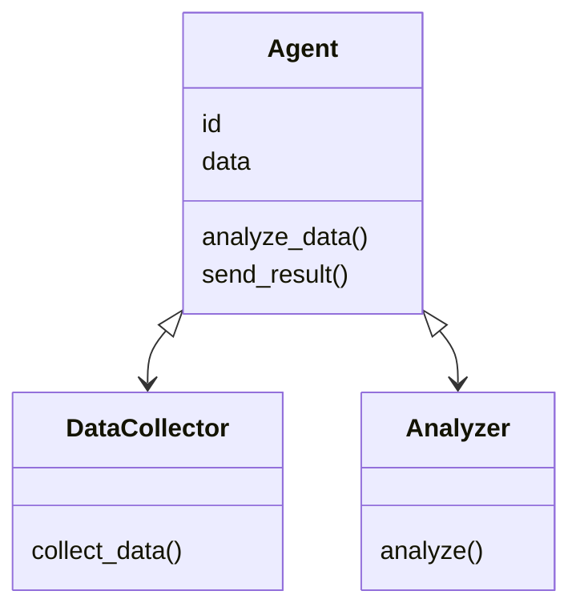
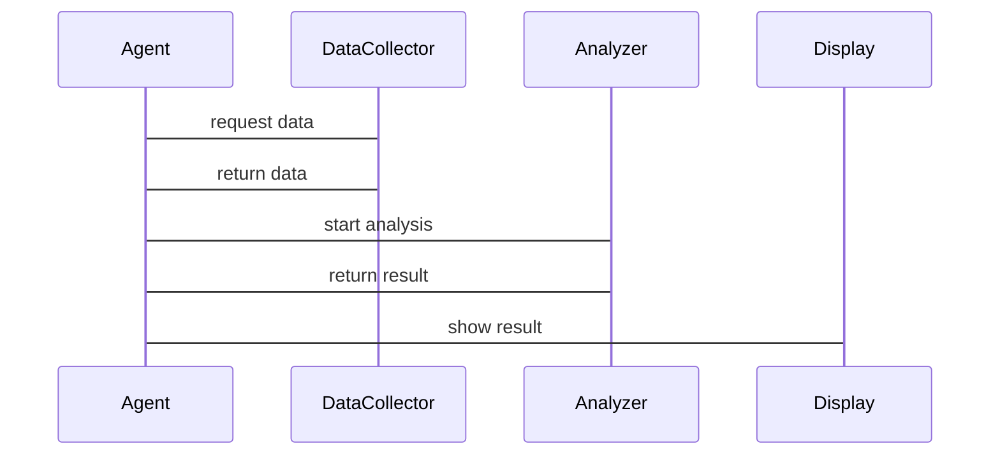

                 


# 基于多智能体的自动化经济周期定位

## 关键词：多智能体系统，经济周期定位，自动化分析，协同算法，系统架构

## 摘要：  
本文探讨了如何利用多智能体系统（MAS）实现经济周期的自动化定位。通过分析经济周期的关键指标和多智能体系统的协同机制，提出了一种基于多智能体的自动化经济周期定位方法。该方法结合了多智能体的分布式决策与经济周期分析的数学模型，通过系统的架构设计和算法实现，展示了在实际应用中的有效性和优势。

---

## 第1章：经济周期与多智能体系统概述

### 1.1 经济周期的基本概念

#### 1.1.1 经济周期的定义与特征
经济周期是指经济活动在一定时期内波动的现象，通常分为扩张期、衰退期、萧条期和复苏期。经济周期的特征包括波动性、周期性、非线性等，这些特征使得经济周期的定位和预测具有挑战性。

#### 1.1.2 经济周期的分类与阶段
经济周期可以分为以下阶段：
- **扩张期**：经济增长迅速，就业率上升，物价上涨。
- **衰退期**：经济增长放缓，企业利润下降，失业率上升。
- **萧条期**：经济活动低靡，失业率高，物价下降。
- **复苏期**：经济开始恢复，逐渐走出低谷。

#### 1.1.3 经济周期分析的现实意义
经济周期的定位对政策制定、投资决策、企业战略等具有重要意义。准确的经济周期定位可以帮助政府和企业更好地应对经济波动，优化资源配置，降低风险。

---

### 1.2 多智能体系统（MAS）的基本概念

#### 1.2.1 多智能体系统的定义
多智能体系统是由多个智能体组成的分布式系统，智能体之间通过通信和协作完成共同目标。智能体具有自主性、反应性、协作性和社会性等特征。

#### 1.2.2 多智能体系统的组成与特点
多智能体系统通常包括以下组成：
- **智能体**：具有感知、决策和执行能力的实体。
- **通信机制**：智能体之间进行信息交换的通道。
- **协作协议**：智能体之间协同工作的规则和策略。
- **环境**：智能体所处的外部环境，包括数据源、目标等。

多智能体系统的特点包括：
- 分布式：智能体独立运行，协同完成任务。
- 协作性：智能体之间通过协作实现整体目标。
- 自适应性：智能体能够根据环境变化调整行为。

#### 1.2.3 多智能体系统与传统单智能体系统的区别
| 特性 | 多智能体系统 | 单智能体系统 |
|------|--------------|---------------|
| 独立性 | 高度独立     | 高度集中     |
| 协作性 | 强            | 弱            |
| 通信 | 频繁          | 无或少        |
| 效率 | 高            | 取决于单点性能 |

---

### 1.3 多智能体系统在经济周期定位中的应用背景

#### 1.3.1 经济周期定位的复杂性与挑战
经济周期的定位涉及多个复杂因素，包括GDP、就业率、通胀率等指标。传统方法依赖于单智能体的分析，存在计算复杂、效率低下的问题。

#### 1.3.2 多智能体系统的优势与适用性
多智能体系统通过分布式计算和协作机制，能够高效地处理大规模数据，提高经济周期定位的准确性和效率。

#### 1.3.3 当前研究现状与未来趋势
当前，多智能体系统在经济周期定位中的应用还处于起步阶段，未来的研究方向包括优化协作算法、提高系统的实时性和准确性。

---

## 第2章：多智能体系统与经济周期定位的核心概念

### 2.1 多智能体系统的组成与功能

#### 2.1.1 智能体的定义与属性
智能体是具有以下属性的实体：
- **自主性**：能够自主决策和行动。
- **反应性**：能够感知环境并做出反应。
- **协作性**：能够与其他智能体协作完成任务。
- **学习能力**：能够通过经验优化行为。

#### 2.1.2 多智能体系统的通信与协作机制
多智能体系统通过以下方式实现通信与协作：
- **消息传递**：智能体之间通过消息传递信息。
- **协同决策**：智能体共同制定决策策略。
- **任务分配**：智能体根据能力分配任务。

#### 2.1.3 多智能体系统的决策与行为模型
多智能体系统的决策模型通常包括以下步骤：
1. **感知环境**：获取环境中的数据和信息。
2. **信息处理**：对信息进行分析和处理。
3. **决策制定**：基于分析结果制定决策。
4. **行动执行**：根据决策执行行动。

---

### 2.2 经济周期定位的关键指标与特征

#### 2.2.1 经济周期定位的主要指标
经济周期定位的关键指标包括：
- **GDP增长率**：衡量经济整体增长情况。
- **失业率**：反映劳动力市场的健康状况。
- **通胀率**：衡量物价水平的变化。
- **PMI指数**：采购经理人指数，反映制造业和服务业的经济活动。

#### 2.2.2 经济周期波动的特征分析
经济周期波动的特征包括：
- **周期性**：经济指标呈现周期性变化。
- **非线性**：经济波动通常是非线性的。
- **滞后性**：经济指标的变化存在滞后现象。

#### 2.2.3 经济周期定位的数学模型与方法
常用的经济周期定位方法包括：
- **傅里叶变换**：用于分析时间序列数据的周期性。
- **ARIMA模型**：自回归积分滑动模型，用于预测时间序列数据。
- **隐马尔可夫模型**：用于识别经济周期的隐含状态。

---

### 2.3 多智能体系统与经济周期定位的联系

#### 2.3.1 多智能体系统在经济数据采集与分析中的作用
多智能体系统能够高效地采集和处理海量经济数据，为经济周期定位提供支持。

#### 2.3.2 多智能体系统在经济周期预测与定位中的应用
多智能体系统通过分布式计算和协作机制，能够提高经济周期预测的准确性和效率。

#### 2.3.3 多智能体系统的优势与局限性
| 优势 | 局限性 |
|------|--------|
| 高效性 | 复杂性 |
| 分布式 | 协调难度 |
| 灵活性 | 安全性 |

---

## 第3章：多智能体协同算法原理

### 3.1 多智能体协同的基本原理

#### 3.1.1 多智能体系统的通信与协作机制
多智能体系统通过以下方式实现通信与协作：
- **消息传递**：智能体之间通过消息传递信息。
- **协同决策**：智能体共同制定决策策略。
- **任务分配**：智能体根据能力分配任务。

#### 3.1.2 多智能体系统的分布式决策算法
分布式决策算法包括：
- **协商算法**：智能体通过协商达成一致决策。
- **拍卖算法**：智能体通过拍卖机制分配任务。
- **领导者选举算法**：选举一个领导者进行决策。

#### 3.1.3 多智能体系统的协同目标与优化方法
多智能体系统的协同目标包括：
- **全局优化**：最大化整体效益。
- **局部优化**：优化单个智能体的效益。

---

### 3.2 经济周期定位的多智能体协同算法

#### 3.2.1 算法的基本思路与流程
多智能体协同算法的流程如下：
1. **数据采集**：智能体采集经济数据。
2. **数据处理**：智能体对数据进行预处理。
3. **协同分析**：智能体协作分析数据。
4. **定位周期**：智能体定位经济周期。

#### 3.2.2 多智能体协同的具体实现步骤
1. 智能体通过消息传递共享数据。
2. 智能体通过协商算法达成一致的分析策略。
3. 智能体协作完成经济周期的定位。

#### 3.2.3 算法的数学模型与公式推导
经济周期定位的数学模型如下：
$$
y_t = \alpha y_{t-1} + \beta x_t + \epsilon_t
$$
其中，\( y_t \) 表示当前状态，\( y_{t-1} \) 表示前一状态，\( x_t \) 表示外部因素，\( \epsilon_t \) 表示随机误差。

---

### 3.3 算法的实现与优化

#### 3.3.1 算法的实现步骤与代码框架
```python
class Agent:
    def __init__(self, id):
        self.id = id
        self.data = None
        self.model = None

    def receive_message(self, message):
        self.data = message

    def analyze_data(self):
        # 数据分析逻辑
        pass

    def send_result(self, result):
        # 发送结果
        pass
```

#### 3.3.2 算法的优化方法与改进策略
- **分布式计算**：提高计算效率。
- **负载均衡**：优化任务分配，避免瓶颈。

#### 3.3.3 算法的性能评估与实验分析
通过实验分析，验证算法在经济周期定位中的准确性和效率。

---

## 第4章：系统分析与架构设计

### 4.1 问题场景介绍

#### 4.1.1 系统目标
系统的目标是实现经济周期的自动化定位。

#### 4.1.2 系统功能
- 数据采集与处理。
- 经济周期分析与定位。
- 结果展示与输出。

#### 4.1.3 系统架构
系统架构包括：
- 数据采集模块：负责采集经济数据。
- 数据处理模块：对数据进行预处理。
- 分析引擎：负责经济周期的分析与定位。
- 结果展示模块：展示分析结果。

---

### 4.2 项目介绍

#### 4.2.1 项目目标
项目的目标是实现基于多智能体的经济周期定位系统。

#### 4.2.2 项目背景
随着经济全球化的发展，经济周期的定位变得越来越重要。

---

### 4.3 系统功能设计

#### 4.3.1 领域模型类图


#### 4.3.2 系统架构图
```mermaid
graph TD
    Agent -> DataCollector: collect data
    Agent -> Analyzer: analyze data
    Analyzer -> Display: show result
```

---

### 4.4 系统接口设计与交互序列图

#### 4.4.1 系统接口设计
- **数据采集接口**：用于采集经济数据。
- **分析接口**：用于分析经济周期。
- **结果展示接口**：用于展示分析结果。

#### 4.4.2 系统交互序列图


---

## 第5章：项目实战

### 5.1 环境安装

#### 5.1.1 系统需求
- Python 3.8+
- NumPy、Pandas、Matplotlib等库。

#### 5.1.2 环境配置
```bash
pip install numpy pandas matplotlib
```

---

### 5.2 系统核心实现

#### 5.2.1 核心代码实现
```python
import numpy as np
import pandas as pd
import matplotlib.pyplot as plt

class Agent:
    def __init__(self, id):
        self.id = id
        self.data = None
        self.model = None

    def receive_data(self, data):
        self.data = data

    def analyze(self):
        # 示例分析逻辑
        if self.data is not None:
            print(f"Agent {self.id} 分析数据：{self.data}")
            return self.predict_cycle()
        else:
            print(f"Agent {self.id} 没有数据，无法分析")
            return None

    def predict_cycle(self):
        # 示例预测方法
        return np.random.choice(['扩张期', '衰退期', '萧条期', '复苏期'])

def main():
    # 初始化智能体
    agent1 = Agent(1)
    agent2 = Agent(2)

    # 模拟数据
    data = [1, 2, 3, 4, 5]
    agent1.receive_data(data)
    agent2.receive_data(data)

    # 分析
    result1 = agent1.analyze()
    result2 = agent2.analyze()

    # 展示结果
    print(f"Agent 1 的预测结果：{result1}")
    print(f"Agent 2 的预测结果：{result2}")

if __name__ == "__main__":
    main()
```

#### 5.2.2 代码解读与分析
- **Agent类**：表示一个智能体，具有接收数据和分析数据的方法。
- **analyze方法**：智能体分析数据并预测经济周期。
- **predict_cycle方法**：示例预测方法，返回随机的经济周期阶段。

---

### 5.3 实际案例分析

#### 5.3.1 数据来源与预处理
- 数据来源：政府发布的经济指标。
- 数据预处理：清洗和标准化数据。

#### 5.3.2 分析过程与结果展示
- 分析过程：多个智能体协同分析数据，定位经济周期。
- 结果展示：可视化展示经济周期的定位结果。

#### 5.3.3 实验结果与总结
- 实验结果：多个智能体协同分析提高了经济周期定位的准确性和效率。
- 总结：多智能体系统在经济周期定位中的应用具有广阔的前景。

---

## 第6章：最佳实践与总结

### 6.1 小结

#### 6.1.1 系统优势
- 分布式计算提高了效率。
- 协作机制提高了准确性。

#### 6.1.2 系统劣势
- 协调难度较大。
- 安全性需要加强。

### 6.2 注意事项

#### 6.2.1 系统设计中的注意事项
- 确保智能体之间的通信高效。
- 优化任务分配算法。

#### 6.2.2 系统实现中的注意事项
- 确保数据安全。
- 提高系统的容错性。

### 6.3 未来研究方向

#### 6.3.1 研究热点
- 多智能体系统的优化。
- 经济周期定位的深度学习方法。

#### 6.3.2 技术发展趋势
- 结合深度学习与多智能体系统。
- 提高系统的实时性和准确性。

### 6.4 拓展阅读

#### 6.4.1 推荐书籍
- 《Multi-Agent Systems: Algorithmic, Complexity, and Synthesis》
- 《Econometric Models and Economic Forecasting》

#### 6.4.2 推荐论文
- “Multi-Agent-Based Economic Forecasting Using Distributed Machine Learning”  
- “Collaborative Economic Cycle Detection with Multi-Agent Systems”

---

## 作者：AI天才研究院/AI Genius Institute & 禅与计算机程序设计艺术 /Zen And The Art of Computer Programming

---

通过以上步骤，我们可以看到，基于多智能体的自动化经济周期定位方法在理论和实践上都有其独特的优势。未来，随着多智能体系统和人工智能技术的不断发展，这一方法将更加成熟，并在经济分析和预测中发挥更大的作用。

