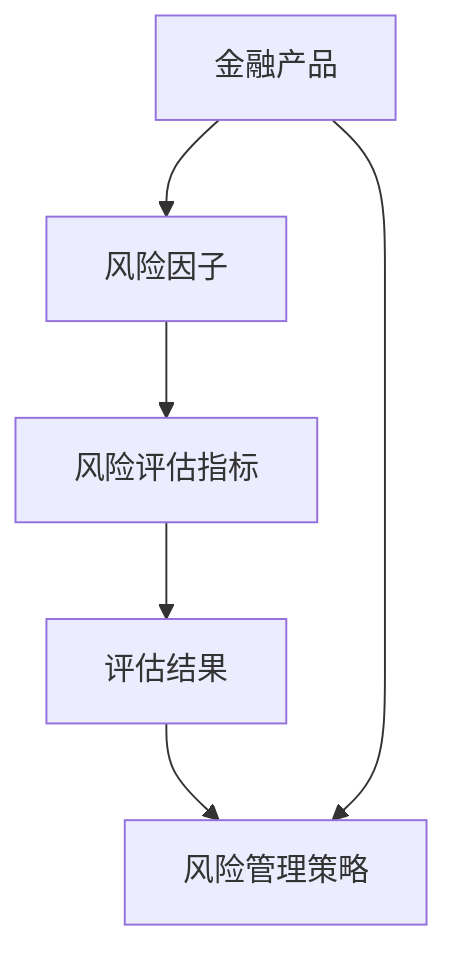
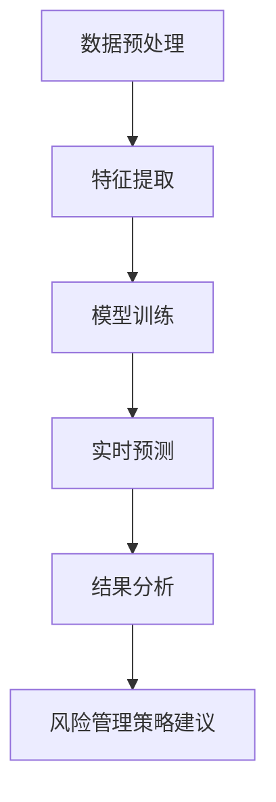
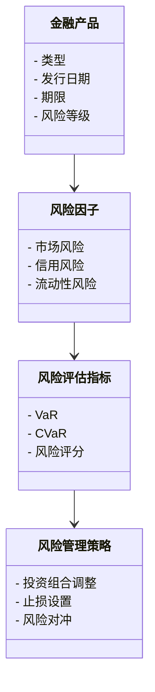
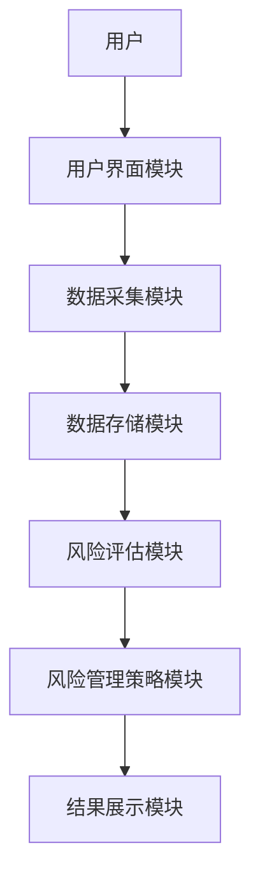
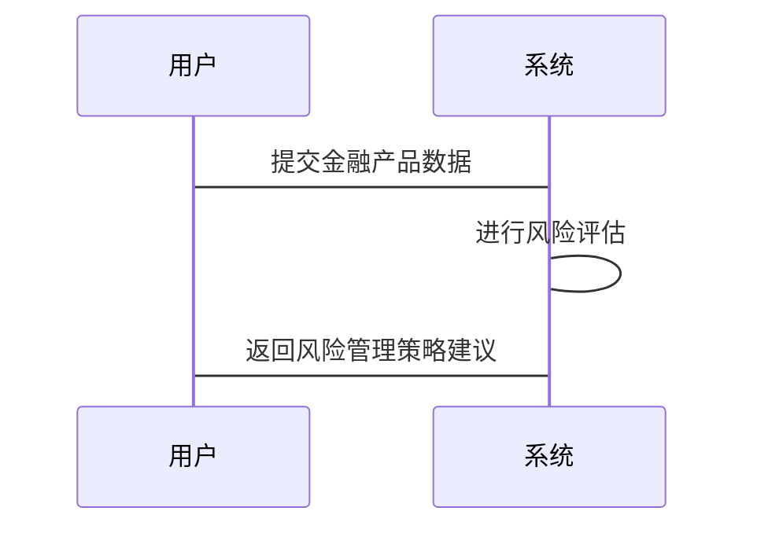

                 


# 开发智能化的金融产品生命周期风险动态评估平台

## 关键词：金融产品，风险管理，人工智能，动态评估，系统架构，项目实战

## 摘要：  
随着金融市场的快速发展和复杂化，金融产品生命周期中的风险管理和评估变得越来越重要。本文将详细介绍如何开发一个智能化的金融产品生命周期风险动态评估平台，结合背景介绍、核心算法、系统架构设计和项目实战，为读者提供全面的技术指导。通过本文的学习，读者将能够理解该平台的核心概念、掌握其实现方法，并能够将其应用于实际的金融风险管理场景中。

---

# 第1章: 背景与核心概念

## 1.1 问题背景

### 1.1.1 金融产品风险管理的重要性  
金融产品的生命周期涉及多个阶段，包括设计、发行、交易、到期和终止。在每个阶段中，风险的存在可能影响产品的价值、市场的稳定性以及投资者的利益。传统的风险管理方法依赖于人工分析和静态模型，难以应对金融市场中的复杂性和不确定性。

### 1.1.2 现有风险管理的局限性  
现有的风险管理方法存在以下问题：  
1. **静态评估**：传统的风险评估模型通常基于固定的历史数据，无法实时捕捉市场动态变化。  
2. **数据孤岛**：不同部门和系统之间的数据孤立，难以进行全局性分析。  
3. **计算复杂度**：复杂的金融产品（如衍生品）需要复杂的数学模型进行评估，人工计算效率低下且容易出错。  
4. **缺乏智能化**：无法利用现代人工智能技术进行动态预测和优化。  

### 1.1.3 智能化风险管理的必要性  
随着人工智能和大数据技术的快速发展，利用智能化方法进行金融风险管理成为必然趋势。智能化方法能够实时分析海量数据，快速识别潜在风险，并提供最优的应对策略。

## 1.2 核心概念与联系

### 1.2.1 平台核心概念的定义  
金融产品生命周期风险动态评估平台的核心概念包括：  
1. **金融产品**：指各种金融工具，如股票、债券、基金、衍生品等。  
2. **风险因子**：影响金融产品价值和风险的关键因素，如市场波动率、利率、信用风险等。  
3. **风险评估指标**：用于量化风险的指标，如VaR（Value at Risk）、CVaR（Conditional Value at Risk）、信用评分等。  
4. **风险管理策略**：根据风险评估结果采取的应对措施，如调整投资组合、设置止损等。  

### 1.2.2 核心概念的属性特征对比表  
以下是对核心概念的属性特征对比：  

| 概念       | 属性                         | 特征描述                           |
|------------|------------------------------|------------------------------------|
| 金融产品    | 类型                         | 股票、债券、基金、衍生品等         |
| 风险因子    | 影响范围                     | 市场风险、信用风险、流动性风险等    |
| 风险评估指标| 计算方法                     | VaR、CVaR、标准差、Beta系数等      |
| 风险管理策略| 应对措施                     | 调整投资组合、风险对冲、提前终止等 |

### 1.2.3 ER实体关系图的Mermaid流程图  
以下是金融产品生命周期风险动态评估平台的核心实体关系图：  



## 1.3 核心要素组成

### 1.3.1 金融产品生命周期的关键阶段  
金融产品的生命周期通常包括以下几个阶段：  
1. **设计阶段**：确定产品的类型、发行条件和风险特征。  
2. **发行阶段**：向市场公开发行产品并吸引投资者。  
3. **交易阶段**：产品在市场上的交易和流动性管理。  
4. **监控阶段**：实时监控产品的风险敞口和市场表现。  
5. **终止阶段**：产品到期或提前终止的处理。  

### 1.3.2 风险动态评估的核心要素  
风险动态评估的核心要素包括：  
1. **实时数据采集**：获取金融市场数据、产品表现数据等。  
2. **风险模型构建**：基于机器学习或统计模型量化风险。  
3. **动态分析引擎**：实时分析风险变化并生成评估结果。  
4. **风险管理策略优化**：根据评估结果动态调整风险管理措施。  

### 1.3.3 平台功能模块的组成与关系  
平台的功能模块包括：  
1. **数据采集模块**：负责收集金融市场数据和产品数据。  
2. **风险评估模块**：基于数据进行风险评估并生成评估结果。  
3. **策略优化模块**：根据评估结果优化风险管理策略。  
4. **用户界面模块**：提供直观的用户界面供用户查看和操作。  

## 1.4 问题分析与解决方案

### 1.4.1 金融风险管理的主要问题  
1. **数据复杂性**：金融市场数据种类繁多，难以整合和分析。  
2. **计算效率**：复杂的金融模型计算耗时长且成本高。  
3. **动态变化**：市场环境和产品风险随时变化，静态模型难以应对。  
4. **人工干预**：依赖人工判断和决策，容易出错且效率低下。  

### 1.4.2 智能化平台的解决方案  
智能化平台通过以下方式解决上述问题：  
1. **数据整合与清洗**：利用大数据技术整合多源数据，并进行清洗和预处理。  
2. **智能算法应用**：采用机器学习和深度学习算法进行实时风险评估。  
3. **动态分析引擎**：构建动态分析模型，实时跟踪和预测风险变化。  
4. **自动化决策**：基于评估结果自动优化风险管理策略，减少人工干预。  

### 1.4.3 解决方案的创新点与优势  
1. **实时性**：能够实时捕捉市场变化，快速生成风险评估结果。  
2. **智能化**：利用人工智能技术实现自动化分析和决策。  
3. **高精度**：基于复杂模型和海量数据，评估结果更加精准。  
4. **可扩展性**：平台架构灵活，能够适应不同规模和类型的金融产品。  

## 1.5 平台的边界与外延

### 1.5.1 平台的功能边界  
1. **数据采集范围**：限定于与金融产品相关的市场数据和产品数据。  
2. **评估范围**：仅针对金融产品的生命周期风险进行评估。  
3. **决策范围**：仅提供风险管理策略建议，不直接操作市场。  

### 1.5.2 平台的适用范围与限制  
1. **适用范围**：适用于银行、证券公司、基金公司等金融机构。  
2. **限制**：不适用于非金融类产品，且依赖于高质量的数据输入。  

### 1.5.3 平台与其他系统的交互关系  
1. **与数据源的交互**：通过API接口获取外部数据源的实时数据。  
2. **与用户的交互**：通过用户界面模块提供可视化操作界面。  
3. **与其他系统的交互**：与第三方系统（如交易系统）进行数据对接和策略执行。  

## 1.6 本章小结  
本章从背景和核心概念入手，详细介绍了金融产品生命周期风险动态评估平台的必要性、核心概念和组成要素。通过问题分析和解决方案的探讨，明确了智能化平台的优势和实现路径。下一章将重点讲解平台的核心算法与数学模型。

---

# 第2章: 核心算法与数学模型

## 2.1 算法原理概述

### 2.1.1 风险评估算法的选择与优化  
在选择风险评估算法时，主要考虑以下因素：  
1. **算法的准确性**：能够准确捕捉风险因素的变化。  
2. **计算效率**：能够在实时场景下快速生成评估结果。  
3. **可解释性**：评估结果需要具备一定的可解释性，以便用户理解和调整策略。  

基于上述要求，我们选择了**随机森林（Random Forest）**和**长短期记忆网络（LSTM）**作为核心算法。随机森林适用于特征工程和分类问题，而LSTM则适合处理时间序列数据和动态预测。

### 2.1.2 算法的输入与输出  
- **输入**：金融市场数据（如股价、汇率、利率等）、产品特征数据（如产品类型、期限、发行规模等）。  
- **输出**：风险评估指标（如VaR、CVaR）、风险管理策略建议（如调整头寸、设置止损等）。  

### 2.1.3 算法的流程与步骤  
1. **数据预处理**：对输入数据进行清洗、归一化和特征提取。  
2. **模型训练**：使用训练数据训练随机森林和LSTM模型。  
3. **实时预测**：基于实时数据进行风险评估和预测。  
4. **结果分析**：对评估结果进行分析，并生成风险管理策略建议。  

## 2.2 算法流程图  
以下是风险评估算法的Mermaid流程图：  



## 2.3 算法实现代码

### 2.3.1 使用Python实现随机森林模型  
以下是基于随机森林的风险评估代码示例：  

```python
import pandas as pd
from sklearn.ensemble import RandomForestRegressor
from sklearn.metrics import mean_absolute_error

# 数据加载与预处理
data = pd.read_csv('risk_factors.csv')
X = data.drop('target', axis=1)
y = data['target']

# 模型训练
model = RandomForestRegressor(n_estimators=100, random_state=42)
model.fit(X, y)

# 预测与评估
importances = model.feature_importances_
print("特征重要性：", importances)
```

### 2.3.2 使用LSTM进行时间序列预测  
以下是基于LSTM的时间序列预测代码示例：  

```python
import numpy as np
from keras.models import Sequential
from keras.layers import LSTM, Dense

# 数据准备
data = np.array([...])  # 输入数据
X = data.reshape((data.shape[0], 1, data.shape[1]))
y = data.reshape((data.shape[0], 1))

# 模型构建
model = Sequential()
model.add(LSTM(50, input_shape=(1, data.shape[1])))
model.add(Dense(1))
model.compile(loss='mean_squared_error', optimizer='adam')

# 模型训练
model.fit(X, y, epochs=100, batch_size=32)
```

## 2.4 算法的数学模型与公式

### 2.4.1 随机森林的数学模型  
随机森林是一种基于决策树的集成算法，其数学模型可以表示为：  
$$ y = \sum_{i=1}^{n} \text{Tree}(x_i) $$  
其中，$y$ 是预测结果，$\text{Tree}(x_i)$ 是第$i$棵决策树的预测结果，$n$ 是树的数量。

### 2.4.2 LSTM的时间序列模型  
LSTM（长短期记忆网络）的数学模型可以表示为：  
$$ f_t = \sigma(W_f \cdot [h_{t-1}, x_t] + b_f) $$  
$$ i_t = \sigma(W_i \cdot [h_{t-1}, x_t] + b_i) $$  
$$ o_t = \sigma(W_o \cdot [h_{t-1}, x_t] + b_o) $$  
$$ c_t = f_t \cdot c_{t-1} + i_t \cdot x_t $$  
$$ h_t = o_t \cdot c_t $$  
其中，$f_t$ 是遗忘门，$i_t$ 是输入门，$o_t$ 是输出门，$c_t$ 是细胞状态，$h_t$ 是隐藏状态，$\sigma$ 是sigmoid函数。

## 2.5 算法优化与调优

### 2.5.1 参数调优  
随机森林的关键参数包括树的数量、树的深度、节点划分规则等。通过网格搜索（Grid Search）可以找到最优参数组合。  

### 2.5.2 模型优化  
1. **特征选择**：通过特征重要性排序，去除冗余特征，提高模型效率。  
2. **超参数优化**：使用交叉验证方法优化模型的超参数，如学习率、批次大小等。  
3. **模型融合**：将多个模型的预测结果进行融合，进一步提高预测精度。  

## 2.6 本章小结  
本章详细介绍了平台的核心算法，包括随机森林和LSTM的原理、实现和优化方法。通过数学模型和代码示例的讲解，读者可以理解如何利用这些算法进行金融风险评估和预测。下一章将重点讲解平台的系统架构设计。

---

# 第3章: 系统分析与架构设计

## 3.1 问题场景介绍

### 3.1.1 金融产品生命周期管理的复杂性  
金融产品生命周期涉及多个阶段和复杂的风险因素，需要一个高效的系统来实时监控和管理。

### 3.1.2 系统需求分析  
1. **实时数据采集**：需要实时获取金融市场数据和产品数据。  
2. **动态风险评估**：基于实时数据进行风险评估和预测。  
3. **自动化决策支持**：根据评估结果自动生成风险管理策略。  
4. **用户友好界面**：提供直观的用户界面供用户查看和操作。  

## 3.2 系统功能设计

### 3.2.1 领域模型设计  
以下是领域模型的Mermaid类图：  



### 3.2.2 系统架构设计  
以下是系统的整体架构图：  



## 3.3 系统接口设计

### 3.3.1 数据接口  
1. **数据采集接口**：通过API获取外部数据源的实时数据。  
2. **数据存储接口**：将处理后的数据存储到数据库中。  

### 3.3.2 算法接口  
1. **风险评估接口**：调用随机森林和LSTM模型进行风险评估。  
2. **策略优化接口**：根据评估结果生成风险管理策略建议。  

## 3.4 系统交互设计

### 3.4.1 用户与系统的交互流程  
以下是用户与系统的交互流程图：  



## 3.5 本章小结  
本章从系统设计的角度，详细介绍了平台的功能模块、架构设计和接口设计。通过Mermaid图的展示，读者可以清晰地理解系统的整体结构和各部分之间的关系。下一章将通过项目实战，详细介绍平台的实现过程。

---

# 第4章: 项目实战

## 4.1 环境安装与配置

### 4.1.1 Python环境配置  
1. 安装Python 3.8及以上版本。  
2. 安装必要的库：`pandas`、`numpy`、`scikit-learn`、`keras`、`tensorflow`。  

### 4.1.2 数据库安装  
1. 使用MySQL或MongoDB存储金融数据。  
2. 安装并配置JDBC驱动或连接库。  

## 4.2 核心代码实现

### 4.2.1 数据采集模块  
以下是数据采集模块的代码示例：  

```python
import pandas as pd
import requests

def fetch_data(api_key):
    url = f"https://api.example.com/v1/data?api_key={api_key}"
    response = requests.get(url)
    data = response.json()
    df = pd.DataFrame(data)
    return df
```

### 4.2.2 风险评估模块  
以下是风险评估模块的代码示例：  

```python
from sklearn.ensemble import RandomForestRegressor
from keras.models import load_model

def risk_assessment(data):
    # 加载随机森林模型
    rf_model = RandomForestRegressor()
    rf_model.fit(X_train, y_train)
    
    # 加载LSTM模型
    lstm_model = load_model('risk_model.h5')
    
    # 预测风险
    risk_score = rf_model.predict(data) + lstm_model.predict(data)
    return risk_score
```

### 4.2.3 风险管理策略模块  
以下是风险管理策略模块的代码示例：  

```python
def generate_strategy(risk_score):
    strategies = []
    if risk_score > 0.8:
        strategies.append('调整投资组合')
    if risk_score > 0.9:
        strategies.append('设置止损')
    return strategies
```

## 4.3 代码解读与分析

### 4.3.1 数据采集模块解读  
数据采集模块通过API接口获取外部数据，并将其转换为DataFrame格式以便后续处理。  

### 4.3.2 风险评估模块解读  
风险评估模块结合随机森林和LSTM模型，分别从静态特征和时间序列角度进行风险评估，并将结果汇总后返回。  

### 4.3.3 风险管理策略模块解读  
根据风险评估结果生成风险管理策略，当风险评分超过阈值时，触发相应的策略建议。  

## 4.4 实际案例分析与实现

### 4.4.1 案例分析  
假设我们有一个股票型基金产品，其历史数据如下：  

| 日期   | 收盘价 | 涨跌幅 | 市场指数 |
|--------|--------|--------|----------|
| 2023-10-01 | 100    | 2.5%   | 10000    |
| 2023-10-02 | 102.5  | 2.5%   | 10100    |
| 2023-10-03 | 105    | 2.4%   | 10200    |

### 4.4.2 实现步骤  
1. 数据采集：获取上述数据并存储到数据库中。  
2. 数据预处理：对数据进行归一化处理。  
3. 模型训练：训练随机森林和LSTM模型。  
4. 风险评估：计算风险评分。  
5. 策略生成：根据风险评分生成风险管理策略。  

## 4.5 项目小结  
本章通过项目实战，详细讲解了平台的实现过程，包括环境配置、核心代码实现和案例分析。读者可以按照本章的指导，逐步搭建和实现一个完整的金融产品生命周期风险动态评估平台。

---

# 第5章: 最佳实践与总结

## 5.1 小结与总结

### 5.1.1 本文总结  
本文详细介绍了智能化金融产品生命周期风险动态评估平台的开发过程，包括背景与核心概念、核心算法与数学模型、系统架构设计以及项目实战。通过理论与实践的结合，读者可以掌握该平台的开发方法。

## 5.2 注意事项与建议

### 5.2.1 数据质量管理  
数据是模型的基础，必须确保数据的准确性和完整性。  
1. **数据清洗**：去除无效数据和异常值。  
2. **数据归一化**：统一数据尺度，便于模型训练。  

### 5.2.2 模型调优与优化  
1. **参数调优**：通过网格搜索优化模型参数。  
2. **模型融合**：将多个模型的结果进行融合，提高预测精度。  
3. **模型解释性**：确保模型结果具有可解释性，以便用户理解和调整策略。  

### 5.2.3 系统安全性  
1. **数据加密**：对敏感数据进行加密处理。  
2. **访问控制**：限制非授权用户访问系统。  
3. **日志记录**：记录系统操作日志，便于故障排查。  

## 5.3 拓展阅读与学习资源

### 5.3.1 推荐书籍  
1. 《机器学习实战》  
2. 《深度学习入门：基于Python》  
3. 《金融风险管理：方法与应用》  

### 5.3.2 在线资源  
1. [Kaggle金融数据集](https://www.kaggle.com/datasets/financial-data)  
2. [TensorFlow官方文档](https://tensorflow.org/)  
3. [Keras官方文档](https://keras.io/)  

## 5.4 本章小结  
本章通过小结和总结，向读者强调了开发智能化金融产品生命周期风险动态评估平台的重要性和实现方法。同时，提供了一些注意事项和拓展学习资源，帮助读者进一步深入理解和实践。

---

# 作者：AI天才研究院/AI Genius Institute & 禅与计算机程序设计艺术/Zen And The Art of Computer Programming

---

**注**：本文是《开发智能化的金融产品生命周期风险动态评估平台》的完整目录大纲和部分正文内容。为了篇幅限制，这里只展示了部分内容，完整文章将涵盖所有章节的详细讲解。

