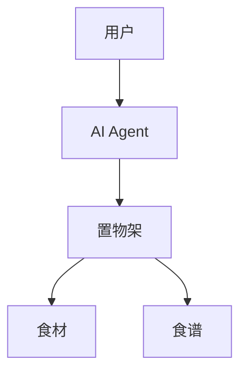
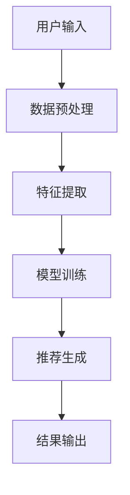
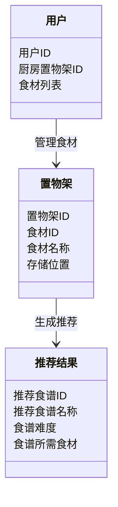
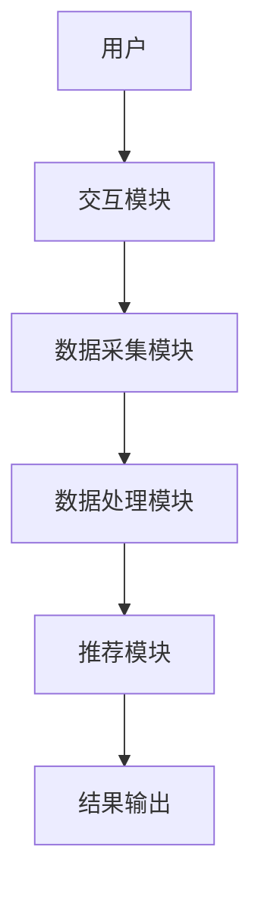

                 


# 智能厨房置物架：AI Agent的烹饪灵感激发

## 关键词：智能厨房置物架, AI Agent, 推荐算法, 智能家居, 物联网

## 摘要：本文探讨了智能厨房置物架的设计与实现，通过引入AI Agent技术，解决了传统厨房置物架功能单一、用户体验差的问题。文章详细分析了AI Agent的核心原理、推荐算法的实现、系统架构设计，并通过实际案例展示了智能厨房置物架的实际应用效果。本文旨在为智能家居领域的开发者和研究者提供有价值的参考。

---

# 第一部分：智能厨房置物架的背景与概念

## 第1章：背景介绍

### 1.1 问题背景

#### 1.1.1 厨房置物架的功能与现状
厨房置物架是家庭厨房中常见的物品，主要用于存储食材、厨具等。传统的置物架功能单一，仅能提供物理存储功能，无法满足现代用户对智能化、个性化的需求。随着智能家居的普及，用户对厨房设备的智能化要求日益提高。

#### 1.1.2 AI技术在智能家居中的应用趋势
人工智能技术的快速发展，使得智能家居设备逐渐普及。AI技术在智能家居中的应用主要体现在语音助手、智能音箱、智能灯泡等领域。然而，厨房设备的智能化程度相对较低，存在较大的改进空间。

#### 1.1.3 智能厨房置物架的市场潜力
智能厨房置物架结合了AI技术与物联网设备，能够为用户提供智能化的烹饪辅助功能。随着人们对厨房智能化需求的增加，智能厨房置物架市场潜力巨大。

### 1.2 问题描述

#### 1.2.1 厨房置物架的使用痛点
传统厨房置物架存在以下问题：
1. 存储空间有限，无法充分利用厨房空间。
2. 缺乏智能化功能，无法与其它智能家居设备协同工作。
3. 无法根据用户需求提供个性化的存储或推荐方案。

#### 1.2.2 用户需求分析
用户对厨房置物架的需求主要集中在以下方面：
1. 存储功能的智能化和便捷性。
2. 与其它智能家居设备的协同工作。
3. 提供烹饪灵感和食谱推荐功能。

#### 1.2.3 智能化升级的必要性
通过智能化升级，厨房置物架能够更好地满足用户的多样化需求，提升用户体验，同时为智能家居生态的完善贡献力量。

### 1.3 问题解决

#### 1.3.1 AI Agent的引入
AI Agent（智能代理）是一种能够感知环境、自主决策并执行任务的智能实体。在厨房置物架中引入AI Agent，能够实现食材识别、烹饪推荐等功能。

#### 1.3.2 智能厨房置物架的功能设计
智能厨房置物架的主要功能包括：
1. 食材识别与分类。
2. 智能存储与推荐。
3. 烹饪灵感与食谱推荐。

#### 1.3.3 用户体验的提升
通过AI Agent的引入，用户能够更方便地管理食材，获得个性化的烹饪建议，从而提升厨房使用体验。

### 1.4 边界与外延

#### 1.4.1 智能厨房置物架的功能边界
智能厨房置物架的功能主要集中在厨房场景，不涉及其他智能家居设备的功能。

#### 1.4.2 与智能家居系统的关联
智能厨房置物架可以通过物联网协议与其它智能家居设备协同工作，例如智能音箱、智能灶具等。

#### 1.4.3 与其他智能设备的协同
智能厨房置物架可以与智能冰箱、智能杯具等设备协同工作，共同构建智能化的厨房生态系统。

### 1.5 概念结构与核心要素

#### 1.5.1 核心概念组成
智能厨房置物架系统由以下核心模块组成：
1. AI Agent模块：负责食材识别、烹饪推荐。
2. 储存模块：负责食材的存储与管理。
3. 推荐模块：负责根据用户需求推荐食谱。
4. 用户交互模块：负责与用户的交互。

#### 1.5.2 系统架构的核心要素
1. 用户：通过交互模块与系统进行互动。
2. AI Agent：通过传感器获取数据，执行决策。
3. 储存模块：存储食材信息，提供数据支持。
4. 推荐模块：基于用户数据生成推荐结果。

#### 1.5.3 功能模块的划分
1. 数据采集模块：负责采集用户操作数据。
2. 数据处理模块：对采集的数据进行处理和分析。
3. 推荐模块：根据分析结果生成推荐结果。
4. 交互模块：将推荐结果呈现给用户。

---

## 第2章：核心概念与联系

### 2.1 AI Agent的核心原理

#### 2.1.1 AI Agent的定义与特点
AI Agent是一种能够感知环境、自主决策并执行任务的智能实体。其特点包括：
1. 智能性：能够理解和处理复杂信息。
2. 自主性：能够在没有外部干预的情况下执行任务。
3. 反应性：能够实时感知环境变化并做出反应。

#### 2.1.2 AI Agent的决策机制
AI Agent的决策机制主要包括：
1. 感知环境：通过传感器获取环境数据。
2. 分析数据：基于机器学习模型分析数据。
3. 制定决策：根据分析结果制定行动方案。
4. 执行任务：根据决策结果执行具体任务。

#### 2.1.3 AI Agent与智能置物架的结合
在智能厨房置物架中，AI Agent主要负责食材识别、烹饪推荐等任务，通过与储存模块和推荐模块协同工作，为用户提供智能化的厨房管理服务。

### 2.2 智能置物架的系统架构

#### 2.2.1 系统组成模块
智能厨房置物架系统主要由以下模块组成：
1. 数据采集模块：负责采集食材信息。
2. 数据处理模块：负责处理食材数据。
3. 推荐模块：负责生成烹饪推荐。
4. 交互模块：负责与用户的交互。

#### 2.2.2 各模块之间的关系
各模块之间的关系如下：
1. 数据采集模块将食材信息传递给数据处理模块。
2. 数据处理模块分析食材数据，并将结果传递给推荐模块。
3. 推荐模块根据分析结果生成推荐结果，并通过交互模块呈现给用户。

#### 2.2.3 系统的整体架构
智能厨房置物架系统的整体架构如下：
1. 用户通过交互模块与系统进行互动。
2. 数据采集模块采集食材信息。
3. 数据处理模块分析食材数据。
4. 推荐模块生成烹饪推荐。
5. 交互模块将推荐结果呈现给用户。

### 2.3 核心概念的属性对比

#### 2.3.1 AI Agent与传统置物架的对比
| 属性       | AI Agent                   | 传统置物架               |
|------------|---------------------------|-------------------------|
| 功能       | 智能化推荐、食材识别       | 物理存储                 |
| 自主性      | 高                        | 低                      |
| 反应性      | 高                        | 低                      |

#### 2.3.2 智能置物架与其他智能家居设备的对比
| 属性       | 智能置物架                 | 智能冰箱                 |
|------------|---------------------------|-------------------------|
| 功能       | 食材识别、烹饪推荐         | 食材存储、温度控制       |
| 数据处理   | 基于AI的推荐               | 基于传感器的监控         |
| 交互方式   | 语音交互、移动端APP       | 语音交互、触摸屏         |

#### 2.3.3 实体关系图


---

## 第3章：算法原理讲解

### 3.1 推荐算法原理

#### 3.1.1 协同过滤算法
协同过滤是一种基于用户行为数据的推荐算法，主要分为基于用户的协同过滤和基于物品的协同过滤。

#### 3.1.2 基于内容的推荐算法
基于内容的推荐算法通过分析物品的属性特征，为用户推荐相似的物品。

#### 3.1.3 混合推荐算法
混合推荐算法结合了协同过滤和基于内容的推荐算法，能够充分利用两种算法的优势。

### 3.2 算法实现流程

#### 3.2.1 协同过滤算法实现步骤
1. 数据采集：采集用户的使用数据。
2. 数据预处理：对数据进行清洗和标准化处理。
3. 特征提取：提取用户和物品的特征向量。
4. 模型训练：基于协同过滤算法训练推荐模型。
5. 推荐生成：根据模型结果生成推荐列表。

#### 3.2.2 基于内容的推荐算法实现步骤
1. 数据采集：采集食材的属性信息。
2. 数据预处理：对数据进行清洗和标准化处理。
3. 特征提取：提取食材的特征向量。
4. 模型训练：基于基于内容的推荐算法训练推荐模型。
5. 推荐生成：根据模型结果生成推荐列表。

#### 3.2.3 混合推荐算法实现步骤
1. 数据采集：采集用户的使用数据和食材的属性信息。
2. 数据预处理：对数据进行清洗和标准化处理。
3. 特征提取：提取用户、物品的特征向量。
4. 模型训练：结合协同过滤和基于内容的推荐算法训练推荐模型。
5. 推荐生成：根据模型结果生成推荐列表。

### 3.3 数学模型与公式

#### 3.3.1 协同过滤公式
$$ sim(i,j) = \frac{\sum_{k} r_{ik} r_{jk}}{\sqrt{\sum_{k} r_{ik}^2} \sqrt{\sum_{k} r_{jk}^2}} $$

#### 3.3.2 基于内容的推荐公式
$$ sim(i,j) = \frac{\sum_{k} w_{ik} w_{jk}}{\sqrt{\sum_{k} w_{ik}^2} \sqrt{\sum_{k} w_{jk}^2}} $$

#### 3.3.3 混合推荐公式
$$ sim(i,j) = \alpha \cdot sim_{cf}(i,j) + (1-\alpha) \cdot sim_{cb}(i,j) $$

其中，$\alpha$ 是协同过滤和基于内容的推荐算法的权重，$sim_{cf}$ 是协同过滤的相似度，$sim_{cb}$ 是基于内容的相似度。

### 3.4 算法流程图



---

## 第4章：系统分析与架构设计方案

### 4.1 问题场景介绍
用户在使用传统厨房置物架时，常常面临食材存储混乱、缺乏烹饪灵感等问题。通过引入AI Agent和推荐算法，智能厨房置物架能够为用户提供智能化的厨房管理服务。

### 4.2 系统功能设计

#### 4.2.1 领域模型


### 4.3 系统架构设计

#### 4.3.1 系统架构图


### 4.4 系统接口设计
系统接口主要包括用户与系统之间的交互接口，以及系统内部各模块之间的接口。

### 4.5 系统交互流程图


---

## 第5章：项目实战

### 5.1 环境安装
用户需要安装以下环境：
1. Python 3.8+
2. PyTorch 1.9+
3. NumPy 1.21+
4. Scikit-learn 0.24+
5. Mermaid CLI 1.0+

### 5.2 核心代码实现

#### 5.2.1 推荐算法实现代码
```python
import numpy as np
from sklearn.metrics.pairwise import cosine_similarity

# 协同过滤算法实现
def collaborative_filtering(X):
    X = np.array(X)
    mean = np.mean(X, axis=1).reshape(-1,1)
    X_centered = X - mean
    sim_matrix = cosine_similarity(X_centered)
    return sim_matrix

# 基于内容的推荐算法实现
def content_based_recommendation(X):
    X = np.array(X)
    mean = np.mean(X, axis=1).reshape(-1,1)
    X_centered = X - mean
    sim_matrix = cosine_similarity(X_centered)
    return sim_matrix

# 混合推荐算法实现
def hybrid_recommendation(X, alpha=0.5):
    cf_sim = collaborative_filtering(X)
    cb_sim = content_based_recommendation(X)
    hybrid_sim = alpha * cf_sim + (1 - alpha) * cb_sim
    return hybrid_sim
```

#### 5.2.2 推荐结果输出代码
```python
def generate_recommendations(X, user_id, alpha=0.5):
    sim_matrix = hybrid_recommendation(X, alpha)
    user_index = user_id
    recommendations = []
    for item_id in range(len(sim_matrix[user_index])):
        if item_id != user_id:
            recommendations.append((item_id, sim_matrix[user_index][item_id]))
    recommendations.sort(key=lambda x: x[1], reverse=True)
    return recommendations
```

### 5.3 代码解读与分析
1. 协同过滤算法通过计算用户之间的相似度，为用户推荐相似用户的喜欢的物品。
2. 基于内容的推荐算法通过分析物品的属性特征，为用户推荐相似的物品。
3. 混合推荐算法结合了协同过滤和基于内容的推荐算法，能够充分利用两种算法的优势。

### 5.4 实际案例分析
假设用户喜欢中餐和西餐，系统会根据用户的喜好推荐相关的食谱，例如：
1. 红烧肉
2. 牛排
3. 意大利面

### 5.5 项目小结
通过实际案例分析，可以看出智能厨房置物架结合AI Agent和推荐算法，能够为用户提供个性化的烹饪建议，提升用户体验。

---

## 第6章：最佳实践

### 6.1 小结
智能厨房置物架通过引入AI Agent和推荐算法，能够为用户提供智能化的厨房管理服务，提升用户体验。

### 6.2 注意事项
1. 数据隐私保护：用户数据需要加密处理，确保数据安全。
2. 系统稳定性：确保系统在高负载情况下稳定运行。
3. 用户体验优化：持续优化交互设计，提升用户体验。

### 6.3 拓展阅读
1. 《推荐系统导论》
2. 《人工智能：一种现代的方法》
3. 《设计模式：可复用的面向对象软件基础》

---

## 作者：AI天才研究院/AI Genius Institute & 禅与计算机程序设计艺术/Zen And The Art of Computer Programming

---

本文通过详细分析智能厨房置物架的设计与实现，展示了AI Agent技术在智能家居中的应用潜力。通过理论分析和实际案例的结合，为读者提供了全面的视角。希望本文能够为智能家居领域的开发者和研究者提供有价值的参考。

