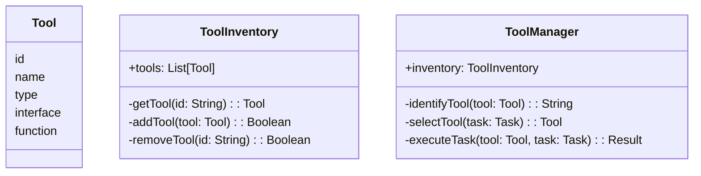
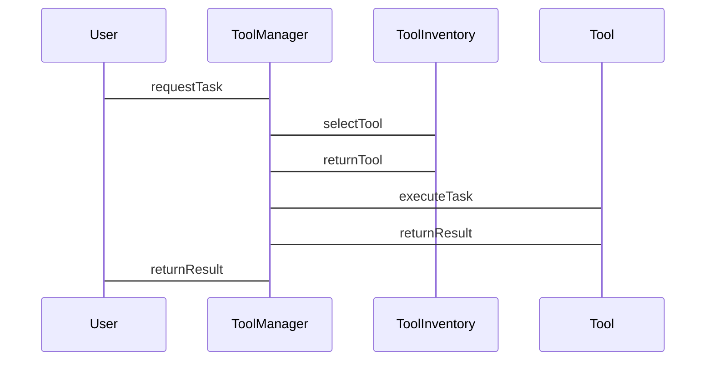

                 


# 智能工具箱：AI Agent的工具识别与管理

> 关键词：AI Agent，工具识别，工具管理，智能工具箱，工具链，多任务协作

> 摘要：本文详细探讨AI Agent的工具识别与管理，从核心概念、算法原理到系统设计与实战，系统性地分析与讲解如何构建高效智能工具箱，帮助AI Agent在复杂场景中实现高效运作。

---

# 第一部分: AI Agent与智能工具箱概述

## 第1章: AI Agent的基本概念与背景

### 1.1 AI Agent的定义与特点
#### 1.1.1 AI Agent的定义
AI Agent（人工智能代理）是指能够感知环境、自主决策并执行任务的智能体。AI Agent可以是软件程序、机器人或其他智能系统，其核心目标是通过感知和行动实现特定目标。

#### 1.1.2 AI Agent的核心特点
1. **自主性**：能够在没有外部干预的情况下自主运作。
2. **反应性**：能够根据环境反馈实时调整行为。
3. **目标导向**：所有行为都围绕实现特定目标展开。
4. **学习能力**：通过经验或数据优化自身的决策能力。
5. **协作性**：能够在多 Agent 环境中与其他 Agent 协作完成任务。

#### 1.1.3 AI Agent与传统AI的区别
- **传统AI**：主要依赖预设规则和数据处理，不具备自主性和目标导向性。
- **AI Agent**：具备自主决策能力，能够根据环境动态调整行为。

### 1.2 智能工具箱的概念与作用
#### 1.2.1 智能工具箱的定义
智能工具箱是指为AI Agent提供所需工具（如算法、数据源、API等）的集合，这些工具能够帮助AI Agent完成特定任务。

#### 1.2.2 智能工具箱的核心功能
1. **工具存储**：管理所有可用工具的库存。
2. **工具识别**：自动识别工具并分类。
3. **工具选择**：根据任务需求选择最合适的工具。
4. **工具执行**：调用工具执行任务。
5. **工具优化**：根据执行结果优化工具使用。

#### 1.2.3 智能工具箱在AI Agent中的作用
- 提供高效的工具管理能力，提升AI Agent的任务执行效率。
- 降低AI Agent对环境的依赖性，使其能够独立完成复杂任务。

### 1.3 AI Agent工具识别与管理的背景
#### 1.3.1 AI Agent工具识别的必要性
随着AI Agent应用场景的扩展，工具种类和数量急剧增加，手动管理工具已不现实，必须通过自动化手段进行工具识别。

#### 1.3.2 工具管理的重要性
- 提高工具利用率，减少资源浪费。
- 降低工具管理的复杂性，提升管理效率。
- 确保工具的安全性和可靠性，避免恶意工具的使用。

#### 1.3.3 当前工具识别与管理的挑战
- 工具种类繁多，识别难度大。
- 工具功能复杂，管理需求多样。
- 工具更新频繁，需要动态管理能力。

---

## 第2章: AI Agent的类型与应用场景

### 2.1 AI Agent的分类
#### 2.1.1 根据功能分类
1. **执行型AI Agent**：专注于执行特定任务（如自动化操作）。
2. **决策型AI Agent**：专注于制定决策（如推荐系统）。
3. **交互型AI Agent**：专注于与人类或其他系统进行交互（如智能客服）。

#### 2.1.2 根据智能水平分类
1. **反应式AI Agent**：仅根据当前感知做出反应。
2. **认知式AI Agent**：具备推理和规划能力。
3. **学习型AI Agent**：能够通过学习优化自身行为。

#### 2.1.3 根据应用场景分类
1. **企业级AI Agent**：应用于企业内部系统优化。
2. **消费者级AI Agent**：面向最终用户的智能助手。
3. **嵌入式AI Agent**：嵌入到硬件设备中的AI代理。

### 2.2 AI Agent的主要应用场景
#### 2.2.1 自然语言处理
- **文本生成**：AI Agent利用NLP工具生成自然语言文本。
- **对话系统**：通过NLP工具实现人机对话。

#### 2.2.2 问题解答与决策支持
- **知识库查询**：AI Agent利用知识库工具回答用户问题。
- **决策支持**：通过数据分析工具提供决策建议。

#### 2.2.3 自动化任务执行
- **流程自动化**：AI Agent利用自动化工具完成业务流程。
- **系统监控**：通过监控工具实时监控系统状态。

#### 2.2.4 多任务协作
- **任务分配**：AI Agent利用协作工具分配任务。
- **资源分配**：通过资源管理工具优化资源分配。

### 2.3 工具识别与管理在不同场景中的重要性
#### 2.3.1 自然语言处理中的工具识别
- 需要识别文本生成工具、语义理解工具等。
- 工具识别的准确性直接影响文本处理的效果。

#### 2.3.2 决策支持中的工具管理
- 需要管理数据分析工具、预测模型等。
- 工具管理的效率直接影响决策支持的速度和质量。

#### 2.3.3 自动化任务中的工具链管理
- 需要管理自动化工具链中的各个工具。
- 工具链的管理复杂性随任务复杂度增加而提升。

---

## 第3章: AI Agent工具识别的核心概念

### 3.1 工具识别的基本原理
#### 3.1.1 工具识别的定义
工具识别是指通过特定算法或规则，自动识别和分类工具的过程。

#### 3.1.2 工具识别的关键步骤
1. **特征提取**：提取工具的特征（如功能、类型、接口等）。
2. **分类模型训练**：基于特征训练分类模型。
3. **工具识别**：利用分类模型对工具进行识别和分类。

#### 3.1.3 工具识别的评价指标
1. **准确率**：识别正确的工具比例。
2. **召回率**：识别出的所有工具中，正确工具的比例。
3. **F1值**：准确率和召回率的调和平均值。

### 3.2 工具管理的体系结构
#### 3.2.1 工具管理的模块划分
1. **工具库存管理模块**：负责工具的存储和检索。
2. **工具优先级排序模块**：根据任务需求对工具进行排序。
3. **工具性能监控模块**：监控工具的性能并进行优化。

#### 3.2.2 工具管理的流程设计
1. **工具入库**：将工具添加到工具箱中。
2. **工具识别**：自动识别工具的类型和功能。
3. **工具选择**：根据任务需求选择最合适的工具。
4. **工具执行**：调用工具执行任务。
5. **工具优化**：根据执行结果优化工具的使用。

#### 3.2.3 工具管理的优化策略
1. **动态管理**：根据任务需求动态调整工具库存。
2. **智能推荐**：利用推荐算法推荐合适的工具。
3. **性能监控**：实时监控工具性能并进行优化。

### 3.3 工具识别与管理的边界与外延
#### 3.3.1 工具识别的边界
- 工具识别仅关注工具本身，不涉及工具的功能实现。
- 工具识别的边界由工具的特征决定。

#### 3.3.2 工具管理的外延
- 工具管理不仅包括工具的识别和选择，还包括工具的执行和优化。
- 工具管理的外延涉及工具的生命周期管理。

#### 3.3.3 工具识别与管理的相互关系
- 工具识别是工具管理的基础，工具管理是工具识别的应用。
- 工具识别与管理相互依存，共同实现AI Agent的高效运作。

---

## 第4章: 工具识别与管理的核心原理

### 4.1 工具识别的原理与方法
#### 4.1.1 基于规则的工具识别
- **规则定义**：根据工具的特征定义规则。
- **规则匹配**：将工具特征与规则进行匹配，确定工具的类型。

#### 4.1.2 基于模式匹配的工具识别
- **模式定义**：定义工具的模式特征。
- **模式匹配**：将工具特征与模式进行匹配，确定工具的类型。

#### 4.1.3 基于上下文理解的工具识别
- **上下文分析**：分析工具使用的上下文环境。
- **语义理解**：根据上下文理解工具的功能和用途。

### 4.2 工具管理的原理与方法
#### 4.2.1 工具库存管理
- **工具分类**：将工具按类型分类存储。
- **工具检索**：根据需求快速检索工具。

#### 4.2.2 工具优先级排序
- **优先级计算**：根据任务需求和工具性能计算工具优先级。
- **优先级调整**：动态调整工具优先级，适应任务需求变化。

#### 4.2.3 工具性能监控
- **性能指标定义**：定义工具的性能指标（如响应时间、准确率等）。
- **性能监控**：实时监控工具的性能，发现异常及时处理。

### 4.3 工具识别与管理的联系与区别
#### 4.3.1 工具识别与工具管理的联系
- 工具识别是工具管理的第一步，工具管理依赖于工具识别的结果。
- 工具识别与管理共同实现AI Agent的高效运作。

#### 4.3.2 工具识别与工具管理的区别
- 工具识别关注工具的分类和识别，工具管理关注工具的存储和使用。
- 工具识别是静态的，工具管理是动态的。

---

## 第5章: 工具识别与管理的算法实现

### 5.1 工具识别的算法实现
#### 5.1.1 特征提取
- **工具类型**：如文本处理工具、数据分析工具等。
- **工具接口**：如API接口、命令行接口等。
- **工具功能**：如文本生成、数据清洗等。

#### 5.1.2 分类器设计
- **分类算法选择**：如决策树、随机森林、支持向量机等。
- **训练数据准备**：收集和标注工具特征数据。
- **模型训练**：基于训练数据训练分类模型。

#### 5.1.3 算法优化
- **特征选择**：去除冗余特征，提高分类准确率。
- **参数调优**：优化分类算法的参数，提升模型性能。

### 5.2 工具管理的算法实现
#### 5.2.1 工具库存管理
- **数据结构选择**：如哈希表、树结构等。
- **存储优化**：如分片存储、压缩存储等。

#### 5.2.2 工具优先级排序
- **优先级计算公式**
  $$ priority = \alpha \times accuracy + \beta \times response\_time $$
  其中，$\alpha$ 和 $\beta$ 是权重系数，$accuracy$ 是工具的准确率，$response\_time$ 是工具的响应时间。

- **动态调整算法**：根据任务需求和工具性能动态调整优先级。

#### 5.2.3 工具性能监控
- **性能指标计算**
  $$ performance = \frac{correct\_execution}{total\_execution} $$
  其中，$correct\_execution$ 是工具正确执行的任务数，$total\_execution$ 是工具执行的总任务数。

- **异常检测**：利用统计方法或机器学习方法检测工具性能异常。

---

## 第6章: 系统分析与架构设计

### 6.1 项目背景
AI Agent需要在复杂场景中高效运作，工具识别与管理是其实现目标的关键环节。本项目旨在设计一个高效的工具识别与管理系统，提升AI Agent的任务执行效率。

### 6.2 系统功能设计
#### 6.2.1 领域模型设计


#### 6.2.2 系统架构设计
```mermaid
browser
    ----
    |---|
    | ToolManager |
    |---|
    | ToolInventory |
    |---|
    | Database |
    `----`
```

#### 6.2.3 系统接口设计
- **工具识别接口**：`identifyTool(tool: Tool) -> String`
- **工具选择接口**：`selectTool(task: Task) -> Tool`
- **工具执行接口**：`executeTask(tool: Tool, task: Task) -> Result`

#### 6.2.4 系统交互流程图


---

## 第7章: 项目实战

### 7.1 环境安装
- **Python环境**：安装Python 3.8及以上版本。
- **依赖库安装**：安装`scikit-learn`、`pandas`、`mermaid`等库。

### 7.2 核心代码实现
#### 7.2.1 工具识别代码
```python
from sklearn.tree import DecisionTreeClassifier
from sklearn.preprocessing import LabelEncoder

# 数据预处理
le = LabelEncoder()
tools_encoded = le.fit_transform(tools.target)

# 模型训练
model = DecisionTreeClassifier()
model.fit(tools.features, tools_encoded)

# 模型预测
predicted = model.predict(new_tool.features)
predicted_label = le.inverse_transform(predicted)
```

#### 7.2.2 工具管理代码
```python
class ToolManager:
    def __init__(self, inventory):
        self.inventory = inventory

    def identify_tool(self, tool):
        # 假设已经训练好分类模型
        return self.classifier.predict(tool.features)

    def select_tool(self, task):
        # 根据任务需求选择最优工具
        tools = self.inventory.get_all_tools()
        scores = [self.evaluate_tool(tool, task) for tool in tools]
        return tools[scores.index(max(scores))]

    def execute_task(self, tool, task):
        return tool.execute(task)
```

### 7.3 案例分析
假设我们有一个文本分类任务，AI Agent需要从多个文本分类工具中选择最合适的工具。通过工具识别与管理系统，AI Agent能够快速识别工具类型，选择最优工具，并执行任务。

### 7.4 项目小结
通过本项目，我们实现了AI Agent的工具识别与管理系统，能够高效地管理工具并提升任务执行效率。

---

## 第8章: 最佳实践与拓展阅读

### 8.1 最佳实践
1. **工具识别**：选择合适的分类算法，优化特征提取。
2. **工具管理**：动态调整工具优先级，实时监控工具性能。
3. **系统设计**：合理设计系统架构，确保系统的可扩展性和可维护性。

### 8.2 小结
AI Agent的工具识别与管理是其实现高效运作的关键环节。通过本文的系统性分析与讲解，读者可以掌握工具识别与管理的核心概念和实现方法。

### 8.3 注意事项
- 工具识别与管理的复杂性随工具种类和任务复杂度增加而提升。
- 工具管理需要动态调整，以适应不断变化的环境和任务需求。

### 8.4 拓展阅读
1. 《Machine Learning: A Probabilistic Perspective》
2. 《Design Patterns: Elements of Reusable Object-Oriented Software》
3. 《Deep Learning》

---

作者：AI天才研究院/AI Genius Institute & 禅与计算机程序设计艺术 /Zen And The Art of Computer Programming

