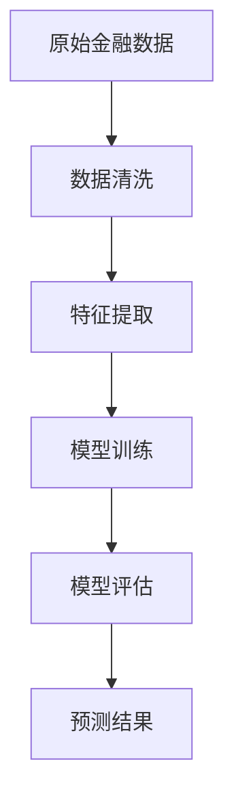
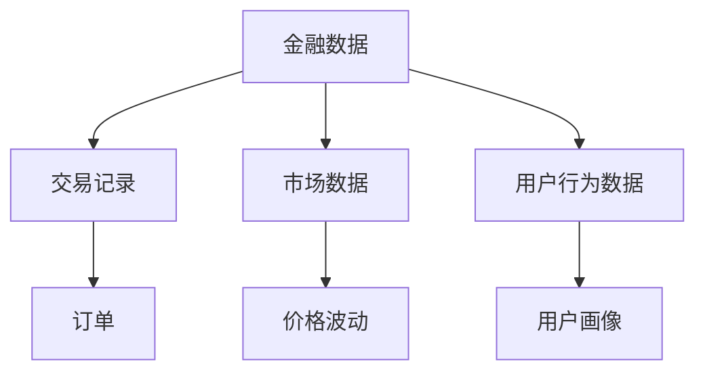
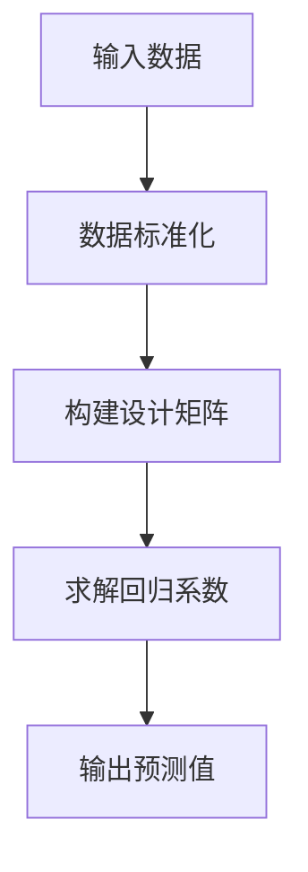
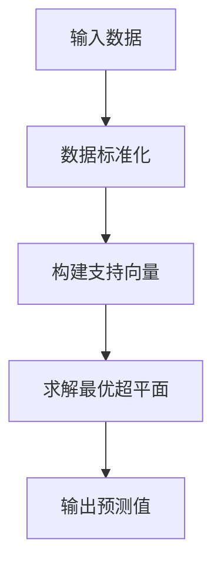
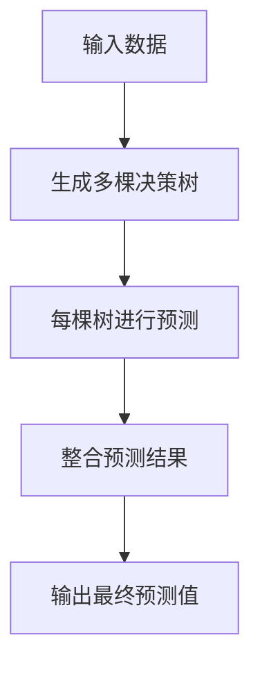
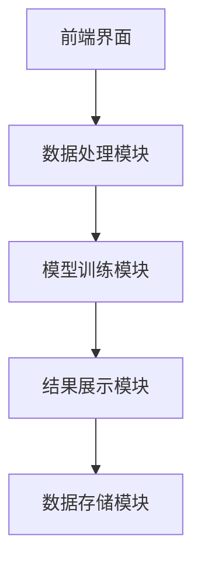
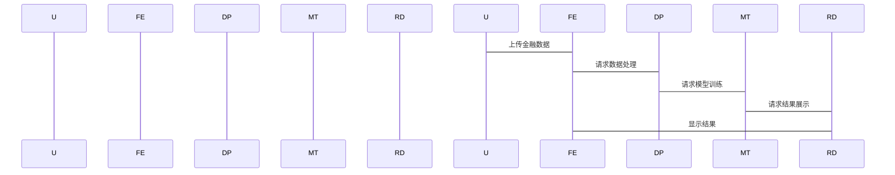

                 


# 模型训练与金融数据的结合

## 关键词
模型训练、金融数据、机器学习、特征工程、算法优化、系统架构

## 摘要
本文将详细探讨模型训练与金融数据结合的应用，涵盖背景介绍、核心概念、算法原理、系统架构、项目实战等部分内容。通过实际案例分析，帮助读者理解如何利用模型训练技术有效处理金融数据，并在金融领域中实现精准预测和决策支持。

---

## 第1章: 模型训练与金融数据的背景介绍

### 1.1 问题背景

#### 1.1.1 金融数据分析的挑战
金融数据具有以下特点：
- **高维度**：包括价格、成交量、市场情绪等多维度数据。
- **时间序列性**：数据具有严格的时序性，需要考虑历史信息。
- **噪声大**：市场波动受多种因素影响，数据中存在大量噪声。
- **数据稀疏性**：某些金融数据可能较为稀疏，难以直接建模。

#### 1.1.2 模型训练在金融领域的应用
- **股票价格预测**：利用历史价格数据预测未来走势。
- **风险管理**：通过模型识别潜在风险，评估投资组合的稳定性。
- **信用评估**：基于客户数据和行为，评估信用风险。

#### 1.1.3 金融数据与模型训练的结合意义
通过结合模型训练技术，可以提高金融数据的分析效率和准确性，为投资决策提供科学依据。

### 1.2 问题描述

#### 1.2.1 金融数据的特点
- **时间序列数据**：金融数据通常是按时间顺序排列的，需要考虑序列依赖性。
- **结构性数据**：包括市场指数、公司财报等结构化信息。
- **高维性**：涉及多个变量和特征。

#### 1.2.2 模型训练的核心问题
- **特征选择**：从高维数据中提取有效特征。
- **模型选择**：选择适合金融数据的算法。
- **过拟合问题**：避免模型在训练数据上表现良好，但在测试数据上效果不佳。

#### 1.2.3 金融数据分析的复杂性
- **数据噪声**：金融数据受市场情绪、政策变化等多种因素影响。
- **数据稀疏性**：某些金融数据可能较难获取。
- **模型解释性**：复杂的模型可能难以解释其预测结果。

### 1.3 问题解决

#### 1.3.1 数据预处理方法
- **数据清洗**：去除噪声数据，处理缺失值。
- **特征提取**：从原始数据中提取有效特征。
- **标准化/归一化**：对数据进行标准化或归一化处理，确保模型输入一致。

#### 1.3.2 模型选择与优化策略
- **模型选择**：根据数据特点选择合适的算法，如线性回归、支持向量机、随机森林等。
- **参数调优**：使用网格搜索或随机搜索优化模型参数。
- **交叉验证**：通过交叉验证评估模型的泛化能力。

#### 1.3.3 结果验证与评估指标
- **评估指标**：如均方误差（MSE）、平均绝对误差（MAE）、准确率、召回率等。
- **结果分析**：分析模型预测结果与实际值的差异，找出模型的不足之处。

### 1.4 边界与外延

#### 1.4.1 金融数据的边界条件
- **数据范围**：仅考虑特定时间段或特定市场的数据。
- **数据质量**：假设数据是干净的，无重大缺失或错误。

#### 1.4.2 模型训练的适用范围
- **适用场景**：适合有明确数据模式的金融问题。
- **不适用场景**：对于完全随机或无规律的数据，模型训练可能效果不佳。

#### 1.4.3 金融数据分析的外延领域
- **量化交易**：基于模型预测结果进行自动交易。
- **金融衍生品定价**：利用模型评估衍生品的价值。
- **客户画像**：基于模型分析客户行为，制定个性化服务策略。

### 1.5 概念结构与核心要素

#### 1.5.1 数据流与模型训练流程


#### 1.5.2 核心要素对比分析
| 特征 | 金融数据 | 模型训练 |
|------|----------|----------|
| 类型 | 时间序列、结构化数据 | 分类、回归、聚类 |
| 特性 | 高维度、噪声大 | 需要特征工程、调参 |
| 处理方式 | 数据清洗、特征提取 | 模型选择、优化 |

#### 1.5.3 模型训练与金融数据的关联关系
- **输入输出关系**：金融数据是模型训练的输入，模型输出是对金融数据的预测或分类结果。
- **反馈机制**：模型预测结果可以反馈到数据处理环节，进一步优化模型。

### 1.6 本章小结
本章从背景介绍、问题描述、问题解决、边界与外延等方面，详细探讨了模型训练与金融数据结合的必要性和重要性，为后续章节奠定了基础。

---

## 第2章: 核心概念与联系

### 2.1 核心概念原理

#### 2.1.1 金融数据的特征提取
- **时间序列特征**：如移动平均、波动率、趋势等。
- **市场情绪特征**：如新闻情感分析、社交媒体情绪指数。

#### 2.1.2 模型训练的数学基础
- **线性回归**：最小二乘法求解回归系数。
- **支持向量机**：通过最大化间隔寻找最优超平面。
- **随机森林**：基于决策树的集成学习方法。

#### 2.1.3 数据与模型的交互机制
- **数据输入**：模型接收结构化金融数据。
- **特征处理**：模型内部对特征进行处理，提取有用信息。
- **预测输出**：模型输出预测结果，如股票价格、风险评分等。

### 2.2 概念属性特征对比表格

| 特征 | 金融数据 | 模型训练 |
|------|----------|----------|
| 类型 | 时间序列、结构化数据 | 分类、回归、聚类 |
| 特性 | 高维度、噪声大 | 需要特征工程、调参 |
| 处理方式 | 数据清洗、特征提取 | 模型选择、优化 |

### 2.3 ER实体关系图



### 2.4 本章小结
本章通过对比分析和ER图，明确了金融数据与模型训练的核心概念及其联系，为后续算法原理和系统设计奠定了基础。

---

## 第3章: 算法原理讲解

### 3.1 算法原理

#### 3.1.1 线性回归模型

##### 3.1.1.1 线性回归的数学模型
$$ y = \beta_0 + \beta_1x_1 + \beta_2x_2 + \dots + \beta_nx_n + \epsilon $$
其中，$\beta$为回归系数，$\epsilon$为误差项。

##### 3.1.1.2 线性回归的实现步骤


#### 3.1.2 支持向量机

##### 3.1.2.1 支持向量机的数学模型
$$ \text{最大化} \ 1/\lambda \sum_{i=1}^n \xi_i $$
$$ \text{满足} \ y_i(\omega \cdot x_i + b) \geq 1 - \xi_i $$
$$ \xi_i \geq 0 $$

##### 3.1.2.2 支持向量机的实现步骤


#### 3.1.3 随机森林

##### 3.1.3.1 随机森林的数学模型
- 基于决策树的集成学习方法，通过投票或加权方式输出最终结果。

##### 3.1.3.2 随机森林的实现步骤


### 3.2 本章小结
本章详细讲解了线性回归、支持向量机和随机森林的算法原理及其在金融数据中的应用，为后续系统设计和项目实战奠定了基础。

---

## 第4章: 系统分析与架构设计方案

### 4.1 问题场景介绍

#### 4.1.1 系统目标
- 提供金融数据分析与模型训练的工具。
- 支持多种金融数据格式的输入与输出。
- 提供可视化界面展示分析结果。

#### 4.1.2 项目介绍
- 开发一个基于Python的金融数据分析平台。
- 集成数据清洗、特征提取、模型训练、结果评估等功能。

### 4.2 系统功能设计

#### 4.2.1 领域模型
```mermaid
classDiagram
    class 金融数据 {
        +股票价格：float
        +成交量：float
        +市场指数：float
        -交易日期：date
        +数据清洗() {
            // 数据清洗逻辑
        }
        +特征提取() {
            // 特征提取逻辑
        }
    }
    class 模型训练 {
        +训练数据：DataSet
        +模型参数：Parameters
        -训练过程() {
            // 训练逻辑
        }
        +预测() {
            // 预测逻辑
        }
    }
```

#### 4.2.2 系统架构设计


#### 4.2.3 系统接口设计
- **数据接口**：提供数据导入和导出接口。
- **模型接口**：提供模型训练和预测接口。
- **结果接口**：提供结果展示和导出接口。

#### 4.2.4 系统交互设计


### 4.3 本章小结
本章从系统目标、功能设计、架构设计等方面，详细探讨了金融数据模型训练系统的实现方案，为后续项目实战提供了指导。

---

## 第5章: 项目实战

### 5.1 项目介绍

#### 5.1.1 项目目标
- 实现一个股票价格预测系统。
- 使用Python和机器学习库（如scikit-learn、TensorFlow）。

#### 5.1.2 项目环境
- 操作系统：Windows/Mac/Linux
- Python版本：3.8以上
- 需要安装的库：pandas、numpy、scikit-learn、matplotlib

### 5.2 系统核心实现源代码

#### 5.2.1 数据导入与清洗
```python
import pandas as pd
import numpy as np

# 数据导入
df = pd.read_csv('stock_price.csv')

# 数据清洗
df = df.dropna()
df = df.drop_duplicates()
```

#### 5.2.2 特征提取
```python
# 特征提取
features = df[['open', 'high', 'low', 'volume']]
labels = df['close']
```

#### 5.2.3 模型训练
```python
from sklearn.model_selection import train_test_split
from sklearn.linear_model import LinearRegression
from sklearn.metrics import mean_squared_error

# 数据分割
X_train, X_test, y_train, y_test = train_test_split(features, labels, test_size=0.2, random_state=42)

# 模型训练
model = LinearRegression()
model.fit(X_train, y_train)

# 模型预测
y_pred = model.predict(X_test)
```

#### 5.2.4 结果评估
```python
# 评估指标
mse = mean_squared_error(y_test, y_pred)
print(f"均方误差：{mse}")
```

### 5.3 代码应用解读与分析

#### 5.3.1 代码解读
- 数据导入：使用pandas读取CSV文件。
- 数据清洗：去除缺失值和重复值。
- 特征提取：选择开盘价、最高价、最低价和成交量作为特征。
- 模型训练：使用线性回归模型进行训练。
- 模型预测：对测试数据进行预测。
- 结果评估：计算均方误差，评估模型性能。

#### 5.3.2 代码分析
- 代码结构清晰，分为数据导入、清洗、特征提取、模型训练和结果评估几个部分。
- 使用了scikit-learn库中的线性回归模型，适合金融数据的线性关系。

### 5.4 实际案例分析

#### 5.4.1 案例背景
假设我们有一个股票价格数据集，包含开盘价、收盘价、最高价、最低价和成交量等信息。

#### 5.4.2 数据分析
- 数据可视化：
  ```python
  import matplotlib.pyplot as plt

  plt.plot(df['date'], df['close'])
  plt.xlabel('日期')
  plt.ylabel('收盘价')
  plt.title('股票价格走势')
  plt.show()
  ```

#### 5.4.3 模型训练与预测
- 使用线性回归模型对股票价格进行预测。
- 预测结果与实际值进行对比。

### 5.5 详细讲解剖析
- 模型选择：选择线性回归模型的原因是其简单易懂，适合处理线性关系。
- 数据处理：数据清洗和特征提取是模型训练的前提条件。
- 模型评估：均方误差是常用的回归问题评估指标。

### 5.6 本章小结
本章通过一个实际案例，详细讲解了模型训练与金融数据结合的项目实战，从数据处理到模型训练，再到结果评估，全面展示了模型训练的整个流程。

---

## 第6章: 总结与展望

### 6.1 总结
- 本文详细探讨了模型训练与金融数据结合的应用，涵盖背景介绍、核心概念、算法原理、系统架构和项目实战等方面。
- 通过实际案例分析，展示了模型训练在金融数据分析中的重要作用。

### 6.2 展望
- **算法优化**：探索更高效的算法，如深度学习模型（LSTM、Transformer）。
- **数据多样性**：结合多源数据，如新闻、社交媒体数据，提高模型的预测能力。
- **实时分析**：实现金融数据的实时处理与预测，支持量化交易。
- **可解释性**：提高模型的可解释性，满足金融领域的监管要求。

### 6.3 本章小结
本文总结了模型训练与金融数据结合的应用，并展望了未来的发展方向，为读者提供了进一步研究的方向。

---

## 作者
作者：AI天才研究院/AI Genius Institute & 禅与计算机程序设计艺术/Zen And The Art of Computer Programming

