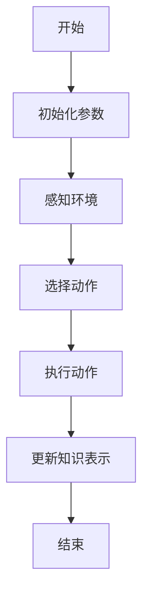
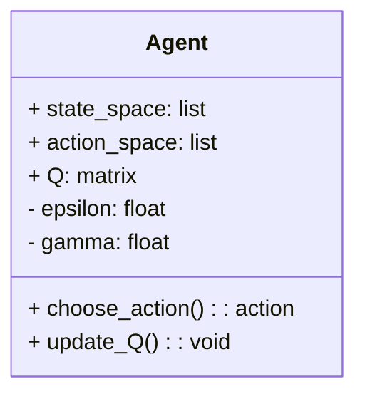
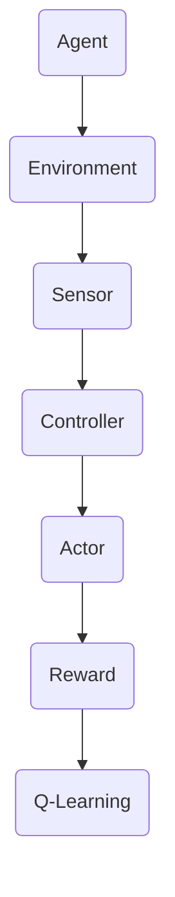
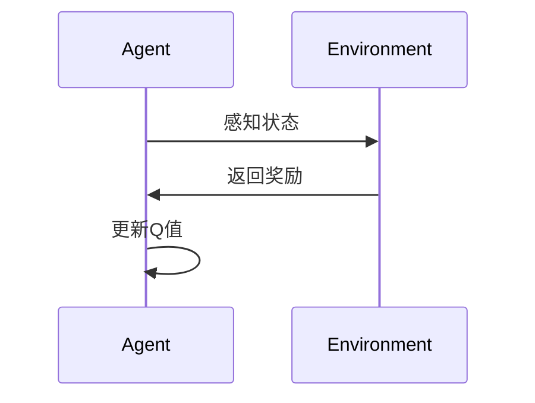

                 


# AI Agent的主动学习策略

## 关键词
- AI Agent
- 主动学习策略
- 知识表示
- 状态空间
- 动作空间
- 策略优化

## 摘要
本文详细探讨了AI Agent的主动学习策略，从核心概念到算法原理，再到系统架构设计，层层剖析。通过背景介绍、核心概念分析、数学模型建立以及实际项目案例，深入讲解了AI Agent如何通过主动学习策略优化自身行为。文章结构清晰，内容详实，结合理论与实践，为读者提供了全面的指导。

---

# 第1章: AI Agent与主动学习策略概述

## 1.1 问题背景与问题描述
### 1.1.1 AI Agent的基本概念
AI Agent（智能体）是指在环境中能够感知并自主行动以实现目标的实体。Agent可以是软件程序、机器人或其他智能系统，其核心能力在于通过感知环境、分析信息和执行动作来实现预定目标。

### 1.1.2 主动学习策略的定义
主动学习策略是指AI Agent在不确定或动态环境中，通过主动选择和获取信息来优化自身行为的策略。与被动学习不同，主动学习强调Agent的主动性，即Agent会根据当前状态和目标，主动探索和选择最优的动作。

### 1.1.3 问题解决的必要性
在复杂的动态环境中，AI Agent需要面对不确定性，传统被动学习策略难以适应快速变化的环境。因此，主动学习策略成为必要的解决方案。

### 1.1.4 理论意义与应用价值
主动学习策略不仅提高了AI Agent的适应性和智能性，还在实际应用中表现出显著优势，如智能推荐、自动驾驶等领域。

## 1.2 问题的边界与外延
### 1.2.1 主动学习的适用场景
适用于动态变化、不确定性高、信息不完全的环境，如动态市场、实时数据分析等。

### 1.2.2 与被动学习的主要区别
- **被动学习**：信息由外部提供，Agent无法主动选择。
- **主动学习**：Agent主动选择信息，具有更高的灵活性和适应性。

### 1.2.3 策略的可扩展性与局限性
主动学习策略具有较强的可扩展性，但可能会面临计算资源消耗大、策略选择复杂性高等问题。

## 1.3 核心概念结构与组成
### 1.3.1 知识表示的核心要素
知识表示是AI Agent进行推理和决策的基础，主要包括：
- **状态表示**：描述环境中的状态。
- **动作表示**：描述Agent可以执行的动作。
- **目标表示**：描述Agent的目标或奖励函数。

### 1.3.2 策略选择的关键因素
- **不确定性度量**：衡量当前状态下的不确定性。
- **目标函数**：定义Agent的目标。
- **策略评估**：评估策略的有效性。

### 1.3.3 优化目标的层次结构
- **短期目标**：实现局部最优。
- **长期目标**：实现全局最优。

## 1.4 本章小结
本章从AI Agent的基本概念出发，详细介绍了主动学习策略的定义、问题背景、核心概念以及与被动学习的区别，为后续章节奠定了基础。

---

# 第2章: 主动学习策略的核心原理

## 2.1 知识表示与状态空间
### 2.1.1 知识表示的数学模型
知识表示是AI Agent进行推理和决策的基础，常用向量或矩阵表示状态和动作。例如，状态空间可以表示为：
$$ s \in S, \quad a \in A $$
其中，\( S \) 是状态空间，\( A \) 是动作空间。

### 2.1.2 状态空间的构建方法
状态空间的构建需要考虑环境的动态特性，常用方法包括：
- **状态分解**：将复杂状态分解为多个子状态。
- **状态抽象**：对状态进行抽象，降低状态空间的复杂性。

### 2.1.3 状态转移的规则
状态转移规则描述了当前状态和动作如何导致下一个状态，通常表示为：
$$ P(s' | s, a) $$
其中，\( P \) 是状态转移概率。

## 2.2 策略选择与优化目标
### 2.2.1 策略选择的数学表达
策略选择是AI Agent在给定状态下选择动作的过程，通常表示为：
$$ \pi(a | s) $$
其中，\( \pi \) 是策略函数。

### 2.2.2 优化目标的函数形式
优化目标通常是一个奖励函数，表示为：
$$ R(s, a, s') $$
其中，\( R \) 是奖励函数，\( s' \) 是下一个状态。

### 2.2.3 策略评估的指标体系
策略评估的指标包括：
- **累积奖励**：衡量策略的长期收益。
- **收敛速度**：衡量策略的优化效率。
- **稳定性**：衡量策略在动态环境中的鲁棒性。

## 2.3 实例分析与对比
### 2.3.1 典型主动学习策略的对比
- **贪婪策略**：选择当前最优的动作。
- **随机策略**：随机选择动作，用于探索。

### 2.3.2 不同策略的优缺点分析
- **贪婪策略**：优点是高效，缺点是可能忽视长期利益。
- **随机策略**：优点是探索性强，缺点是效率低。

### 2.3.3 实际应用中的权衡策略
在实际应用中，通常采用贪心策略结合随机探索的方法，以平衡探索与利用。

## 2.4 核心概念属性特征对比表
| 特征 | 主动学习策略 | 被动学习策略 |
|------|--------------|--------------|
| 知识更新 | 动态更新 | 静态更新     |
| 策略优化 | 动态优化 | 静态优化     |
| 适应性 | 高 | 低         |

## 2.5 ER实体关系图
```mermaid
er
actor(Agent, "主动学习策略", "知识库", "目标函数")
```

## 2.6 本章小结
本章详细讲解了主动学习策略的核心原理，包括知识表示、状态空间、策略选择以及优化目标，并通过实例分析和对比，进一步明确了策略选择的优缺点。

---

# 第3章: 主动学习策略的数学模型与算法原理

## 3.1 知识表示的数学模型
### 3.1.1 状态空间的向量表示
状态空间通常用向量表示，例如：
$$ s = [s_1, s_2, \dots, s_n] $$
其中，\( s_i \) 是状态的第 \( i \) 个特征。

### 3.1.2 动作空间的矩阵表示
动作空间可以用矩阵表示，例如：
$$ a = \begin{bmatrix} a_1 & a_2 & \dots & a_m \end{bmatrix} $$
其中，\( a_i \) 是动作的第 \( i \) 个特征。

### 3.1.3 状态转移的概率模型
状态转移可以用马尔可夫链表示，例如：
$$ P(s' | s, a) = \text{概率从状态 } s \text{ 转移到状态 } s' \text{ 的概率} $$

## 3.2 策略选择的算法原理
### 3.2.1 贪婪策略的数学表达
贪婪策略选择当前状态下最优的动作，数学表达式为：
$$ a = \argmax_{a} Q(s,a) $$
其中，\( Q(s,a) \) 是Q值函数。

### 3.2.2 动态规划的更新公式
动态规划的更新公式为：
$$ Q(s,a) = r + \gamma \max Q(s',a') $$
其中，\( r \) 是奖励，\( \gamma \) 是折扣因子。

### 3.2.3 近似方法的优化策略
近似方法通常使用深度学习模型，例如：
$$ \theta = \theta + \alpha (Q_{\text{target}} - Q_{\text{current}}) \nabla Q $$

## 3.3 算法流程图


## 3.4 算法实现代码示例
```python
import numpy as np

class Agent:
    def __init__(self, state_space_size, action_space_size):
        self.state_space_size = state_space_size
        self.action_space_size = action_space_size
        self.Q = np.zeros((state_space_size, action_space_size))
    
    def choose_action(self, state, epsilon=0.1):
        if np.random.random() < epsilon:
            return np.random.randint(self.action_space_size)
        return np.argmax(self.Q[state, :])
    
    def update_Q(self, state, action, reward, next_state):
        self.Q[state, action] = reward + np.max(self.Q[next_state, :]) * gamma
```

## 3.5 本章小结
本章详细讲解了主动学习策略的数学模型和算法原理，包括状态空间的表示、Q值函数的更新以及策略选择的数学表达。

---

# 第4章: 系统分析与架构设计

## 4.1 问题场景介绍
### 4.1.1 系统目标
设计一个基于主动学习策略的AI Agent，能够在动态环境中自主学习和优化。

### 4.1.2 问题描述
AI Agent需要在动态环境中感知状态、选择动作，并通过奖励函数优化策略。

## 4.2 系统功能设计
### 4.2.1 领域模型


### 4.2.2 系统架构


### 4.2.3 系统接口
- **输入接口**：感知环境状态。
- **输出接口**：执行动作并获得奖励。

### 4.2.4 系统交互


## 4.3 本章小结
本章从系统分析的角度，详细设计了基于主动学习策略的AI Agent的系统架构，并通过类图和序列图进一步明确了系统的组成和交互过程。

---

# 第5章: 项目实战

## 5.1 环境安装
安装必要的Python库，例如：
- numpy
- matplotlib
- gym

## 5.2 系统核心实现源代码
```python
import gym
import numpy as np

env = gym.make('CartPole-v0')
env.seed(42)

class Agent:
    def __init__(self, state_space_size, action_space_size):
        self.state_space_size = state_space_size
        self.action_space_size = action_space_size
        self.Q = np.zeros((state_space_size, action_space_size))
        self.gamma = 0.99
        self.epsilon = 0.1
    
    def choose_action(self, state):
        if np.random.random() < self.epsilon:
            return np.random.randint(self.action_space_size)
        return np.argmax(self.Q[state, :])
    
    def update_Q(self, state, action, reward, next_state):
        self.Q[state, action] = reward + self.gamma * np.max(self.Q[next_state, :])
    
    def decay_epsilon(self):
        self.epsilon = self.epsilon * 0.99

agent = Agent(env.observation_space.shape[0], env.action_space.n)
for episode in range(1000):
    state = env.reset()
    total_reward = 0
    while True:
        action = agent.choose_action(state)
        next_state, reward, done, _ = env.step(action)
        agent.update_Q(state, action, reward, next_state)
        total_reward += reward
        if done:
            break
    agent.decay_epsilon()

print(f"Total Reward: {total_reward}")
env.close()
```

## 5.3 代码应用解读与分析
- **初始化**：初始化Q值矩阵和超参数。
- **选择动作**：根据epsilon-greedy策略选择动作。
- **更新Q值**：根据奖励和下一个状态更新Q值。
- **epsilon衰减**：逐渐减少探索性，增加利用性。

## 5.4 实际案例分析
以CartPole-v0环境为例，通过训练过程展示AI Agent如何通过主动学习策略优化自身行为。

## 5.5 本章小结
本章通过实际项目案例，详细讲解了主动学习策略的应用，从环境安装、代码实现到结果分析，为读者提供了实践指导。

---

# 第6章: 总结与展望

## 6.1 核心观点总结
- AI Agent的主动学习策略是实现智能体自主行为的关键。
- 通过知识表示、状态空间和策略选择的优化，AI Agent能够适应复杂环境。

## 6.2 实践中的注意事项
- 策略选择需要平衡探索与利用。
- 算法实现需要考虑计算效率和资源消耗。

## 6.3 未来研究方向
- 更高效的策略优化算法。
- 更智能的知识表示方法。
- 更广泛的实际应用场景。

---

# 作者：AI天才研究院/AI Genius Institute & 禅与计算机程序设计艺术 /Zen And The Art of Computer Programming

---

本文从理论到实践，详细探讨了AI Agent的主动学习策略，通过背景介绍、核心概念分析、算法原理讲解以及实际项目案例，为读者提供了全面的指导。希望本文能为AI领域的研究和应用提供有价值的参考。

