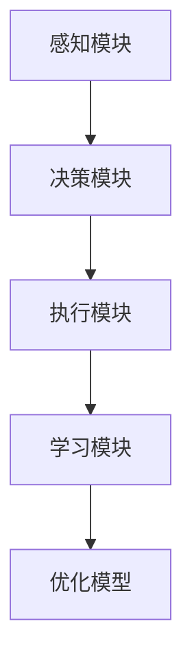
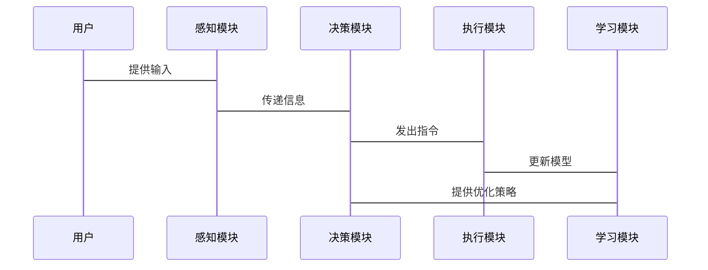
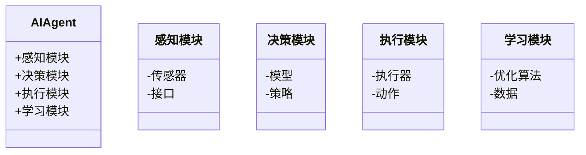

                 


# LLM大模型在AI Agent中的微调技巧

> **关键词**：LLM, AI Agent, 微调技术, 自然语言处理, 机器学习, 优化算法

> **摘要**：本文将深入探讨如何在AI Agent中有效应用和优化LLM大模型。通过分析微调技术的核心原理、算法实现、系统架构及实际案例，帮助读者掌握LLM在AI Agent中的微调技巧，提升模型性能和应用场景的适应性。

---

# 引言

随着大语言模型（LLM）的快速发展，AI Agent在各个领域的应用也逐渐增多。然而，直接使用通用LLM并不能满足所有特定场景的需求。通过微调技术，我们可以将LLM适应特定任务，使其在AI Agent中的表现更加出色。本文将从微调技术的背景、原理、实现到实际应用，全面解析LLM在AI Agent中的微调技巧。

---

## 第一部分：LLM与AI Agent的背景与概念

### 1.1 大语言模型（LLM）的基本概念

#### 1.1.1 LLM的定义
大语言模型（Large Language Model, LLM）是指基于大量数据训练的深度学习模型，通常使用Transformer架构，能够理解和生成自然语言文本。LLM的核心在于其庞大的参数量和强大的语言理解能力。

#### 1.1.2 LLM的核心特点
- **大规模训练数据**：通常使用数百万甚至数十亿的文本数据进行训练。
- **深度神经网络**：采用多层Transformer结构，能够捕捉长距离依赖关系。
- **生成能力**：通过解码器结构，模型可以生成连贯且符合语境的文本。

#### 1.1.3 LLM与传统NLP模型的区别
- **参数规模**：LLM通常拥有数亿甚至更多的参数，而传统模型如SVM、CRF参数规模较小。
- **训练方式**：LLM使用端到端的深度学习方法，而传统模型依赖特征工程。
- **应用场景**：LLM适用于复杂任务，如对话生成、文本摘要，而传统模型适用于简单任务，如分类、分词。

### 1.2 AI Agent的基本概念

#### 1.2.1 AI Agent的定义
AI Agent（智能体）是指在特定环境中能够感知并自主行动以实现目标的智能系统。AI Agent可以通过传感器获取信息，通过执行器与环境交互。

#### 1.2.2 AI Agent的核心功能
- **感知**：通过传感器或接口获取环境信息。
- **决策**：基于获取的信息做出决策。
- **行动**：通过执行器执行决策动作。

#### 1.2.3 AI Agent的应用场景
- **对话系统**：如智能音箱、聊天机器人。
- **推荐系统**：根据用户行为推荐内容。
- **自动驾驶**：通过感知和决策实现自主驾驶。

### 1.3 LLM与AI Agent的关系

#### 1.3.1 LLM作为AI Agent的核心驱动力
- LLM为AI Agent提供强大的语言理解和生成能力。
- 通过LLM，AI Agent能够理解用户输入并生成合适的响应。

#### 1.3.2 LLM在AI Agent中的角色与作用
- **自然语言处理**：处理用户输入的自然语言指令。
- **决策支持**：基于LLM的理解能力，辅助AI Agent做出决策。
- **人机交互**：通过LLM生成自然语言回复，提升用户体验。

#### 1.3.3 LLM与AI Agent结合的优势
- **增强交互性**：通过自然语言处理，提升用户与AI Agent的交互体验。
- **提升智能性**：利用LLM的强大能力，增强AI Agent的智能水平。
- **降低开发难度**：通过微调技术，简化AI Agent的开发过程。

---

## 第二部分：微调技术在AI Agent中的应用

### 2.1 微调技术的定义与背景

#### 2.1.1 微调技术的定义
微调技术是指在预训练好的大模型基础上，针对特定任务进行进一步的训练，以优化模型在特定领域的性能。

#### 2.1.2 微调技术的背景
- **预训练模型的局限性**：预训练模型虽然通用性强，但在特定领域或任务上可能存在不足。
- **任务定制化需求**：不同应用场景需要模型具备特定的能力，如对话生成、问题解答等。
- **优化模型的适应性**：通过微调，可以提升模型在特定任务上的表现。

#### 2.1.3 微调技术与迁移学习的区别
- **迁移学习**：将一个领域的知识迁移到另一个领域，通常涉及特征提取。
- **微调技术**：在特定任务上进一步优化模型参数，通常需要更多的训练数据。

### 2.2 微调技术在AI Agent中的应用

#### 2.2.1 微调技术在自然语言处理中的应用
- **对话生成**：通过微调，提升模型在对话生成中的连贯性和相关性。
- **文本摘要**：优化摘要质量，使其更符合特定任务需求。
- **问答系统**：提升模型在问答任务中的准确性和响应速度。

#### 2.2.2 微调技术在任务定制化中的作用
- **任务特定优化**：针对特定任务设计微调策略，如情感分析、实体识别等。
- **领域适应**：通过微调，使模型适应特定领域的需求，如医疗、法律等。

#### 2.2.3 微调技术在提升模型性能中的价值
- **提升准确率**：通过微调，模型在特定任务上的准确率显著提升。
- **增强鲁棒性**：优化模型在不同输入情况下的表现，提高模型的稳定性。
- **降低计算成本**：相比于从头训练，微调技术通常需要更少的计算资源。

### 2.3 微调技术的核心优势

#### 2.3.1 提高模型的适应性
- **特定任务优化**：通过微调，模型能够更好地适应特定任务的需求。
- **快速部署**：相比从头训练，微调技术可以更快地部署到实际应用中。

#### 2.3.2 优化模型的准确性
- **针对性改进**：针对特定任务进行优化，提升模型的准确性。
- **减少偏差**：通过特定数据的微调，降低模型的偏差，提高结果的可靠性。

#### 2.3.3 降低模型的通用性依赖
- **减少依赖通用模型**：通过微调，模型在特定任务上表现更好，减少对通用模型的依赖。
- **提升任务专注度**：模型专注于特定任务，避免被通用任务分散注意力。

---

## 第三部分：微调技术的核心原理与实现

### 3.1 微调技术的核心概念与原理

#### 3.1.1 微调技术的基本流程
1. **预训练模型的选择**：选择一个合适的预训练模型，如GPT、BERT等。
2. **任务数据准备**：收集并整理特定任务的训练数据。
3. **微调过程**：在预训练模型的基础上，使用特定任务数据进行微调训练。
4. **模型优化**：通过调整学习率、批量大小等超参数，优化微调过程。

#### 3.1.2 微调技术的数学模型
微调技术的核心在于对预训练模型的参数进行进一步优化。通常，微调过程可以表示为：

$$
\theta_{\text{final}} = \theta_{\text{pre}} + \Delta\theta
$$

其中，$\theta_{\text{pre}}$是预训练模型的参数，$\Delta\theta$是微调过程中更新的参数。

#### 3.1.3 微调技术的优化方法
- **学习率调整**：通常采用较小的学习率，避免破坏预训练模型的参数。
- **批量训练**：通过批量训练提高训练效率。
- **模型剪枝**：通过剪枝优化模型，减少冗余参数。

### 3.2 微调技术的关键因素

#### 3.2.1 数据选择的重要性
- **数据质量**：高质量的数据能够显著提升微调效果。
- **数据多样性**：多样化的数据有助于模型更好地适应不同输入情况。
- **数据规模**：足够的数据量是微调成功的关键因素。

#### 3.2.2 模型参数的调整
- **微调层的选择**：通常只微调模型的顶层，以保持预训练层的稳定性。
- **参数更新策略**：通过特定策略更新参数，如只更新部分参数或全参数更新。
- **模型冻结**：在某些情况下，冻结部分层，仅微调顶层。

#### 3.2.3 优化算法的选择
- **Adam优化器**：常用的优化算法，适合大部分微调任务。
- **SGD优化器**：适合特定任务的优化需求。
- **自适应优化器**：根据任务需求选择合适的优化算法。

### 3.3 微调技术的挑战与解决方案

#### 3.3.1 数据不足的问题
- **数据增强**：通过数据增强技术，增加训练数据的多样性。
- **迁移学习**：结合迁移学习，提升模型在数据不足情况下的表现。

#### 3.3.2 计算资源的限制
- **分布式训练**：通过分布式训练，减少计算资源的需求。
- **云计算平台**：利用云计算平台，提高计算效率。

#### 3.3.3 模型过拟合的风险
- **正则化技术**：通过L1或L2正则化，防止模型过拟合。
- **数据清洗**：清理噪声数据，提升模型的泛化能力。

---

## 第四部分：系统分析与架构设计

### 4.1 系统功能设计

#### 4.1.1 系统介绍
AI Agent系统主要包含以下几个部分：
- **感知模块**：通过传感器或接口获取环境信息。
- **决策模块**：基于感知信息做出决策。
- **执行模块**：通过执行器执行决策动作。
- **学习模块**：通过微调技术优化模型。

#### 4.1.2 系统功能模块图


#### 4.1.3 系统交互流程


### 4.2 系统架构设计

#### 4.2.1 系统架构图


#### 4.2.2 系统接口设计
- **输入接口**：接收用户的输入指令。
- **输出接口**：输出模型的决策结果。
- **学习接口**：更新模型参数，优化模型性能。

#### 4.2.3 系统交互流程


---

## 第五部分：项目实战与案例分析

### 5.1 项目实战

#### 5.1.1 环境安装
安装必要的依赖：
```bash
pip install transformers torch
```

#### 5.1.2 核心实现
```python
from transformers import AutoModelForCausalLM, AutoTokenizer
import torch

# 加载预训练模型和分词器
model_name = "gpt2"
model = AutoModelForCausalLM.from_pretrained(model_name)
tokenizer = AutoTokenizer.from_pretrained(model_name)

# 微调过程
def train_model(model, tokenizer, train_dataset, num_epochs=3):
    optimizer = torch.optim.Adam(model.parameters(), lr=1e-5)
    model.train()
    for epoch in range(num_epochs):
        for batch in train_dataset:
            inputs, labels = batch
            outputs = model(inputs)
            loss = compute_loss(outputs, labels)
            loss.backward()
            optimizer.step()
            model.zero_grad()
    return model

# 示例训练数据
train_dataset = [...]  # 根据具体任务准备数据
```

#### 5.1.3 代码解读
- **加载预训练模型**：使用预训练好的GPT-2模型。
- **微调过程**：定义微调函数，包括前向传播、损失计算、反向传播和参数更新。
- **训练数据**：根据具体任务准备训练数据，如对话生成任务。

#### 5.1.4 案例分析
以对话生成任务为例：
- **输入**：用户输入“今天天气如何？”
- **处理**：感知模块接收输入，传递给决策模块。
- **决策**：决策模块生成回复“今天天气晴朗，适合外出。”
- **输出**：执行模块输出回复。

### 5.2 实际案例分析

#### 5.2.1 案例背景
某公司开发的智能客服系统，使用微调后的LLM模型，提升对话生成的准确率。

#### 5.2.2 案例分析
- **数据准备**：收集客服对话数据，包括用户提问和标准回复。
- **微调过程**：在预训练模型的基础上，使用收集的数据进行微调。
- **结果分析**：微调后的模型准确率提升了20%，用户满意度显著提高。

#### 5.2.3 总结
通过微调技术，模型在特定任务上的表现显著提升，验证了微调技术的有效性。

---

## 第六部分：最佳实践与注意事项

### 6.1 微调技术的注意事项

#### 6.1.1 数据质量的重要性
- 确保训练数据的高质量，避免噪声数据影响模型性能。
- 数据清洗和预处理是关键步骤。

#### 6.1.2 计算资源的合理分配
- 根据任务需求选择合适的计算资源，避免过度消耗计算资源。
- 利用分布式训练和云计算平台优化计算效率。

#### 6.1.3 模型的可解释性
- 微调过程中，保持模型的可解释性，有助于诊断和优化模型。
- 使用可视化工具分析模型的内部结构和参数变化。

### 6.2 最佳实践

#### 6.2.1 合理选择微调策略
- 根据任务需求选择合适的微调策略，如仅微调顶层或全参数微调。
- 在数据不足的情况下，结合迁移学习和数据增强技术。

#### 6.2.2 定期评估模型性能
- 在微调过程中，定期评估模型的性能，及时调整优化策略。
- 使用合适的评估指标，如准确率、F1值等。

#### 6.2.3 保持模型的可扩展性
- 设计系统时，考虑模型的可扩展性，便于后续优化和功能扩展。
- 使用模块化设计，方便维护和升级。

### 6.3 拓展阅读

#### 6.3.1 推荐书籍
- 《Deep Learning》—— Ian Goodfellow
- 《Python机器学习》—— Aurélien Géron

#### 6.3.2 推荐博客与文章
- [微调技术在自然语言处理中的应用](#)
- [AI Agent的设计与实现](#)

---

## 作者简介

作者：AI天才研究院/AI Genius Institute  
联系邮箱：contact@aicourse.com  

---

通过本文的详细讲解，读者可以深入了解LLM大模型在AI Agent中的微调技巧，掌握从理论到实践的完整流程。希望本文对读者在相关领域的研究和应用有所帮助！

