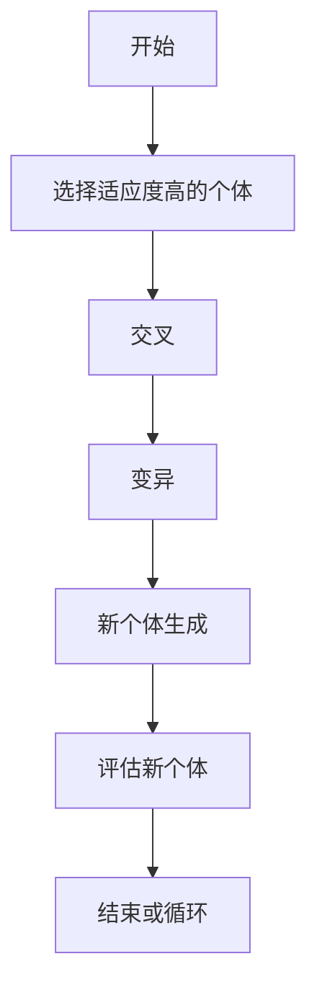
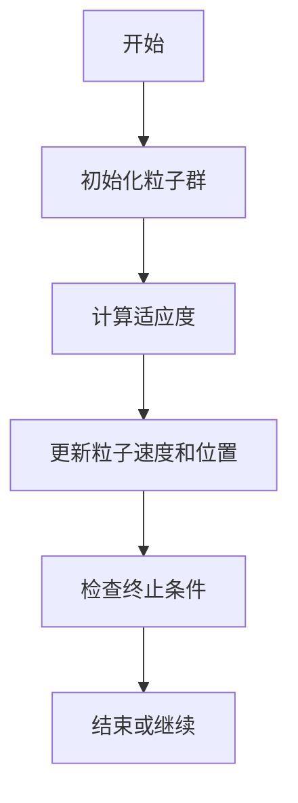
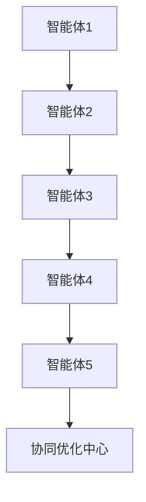
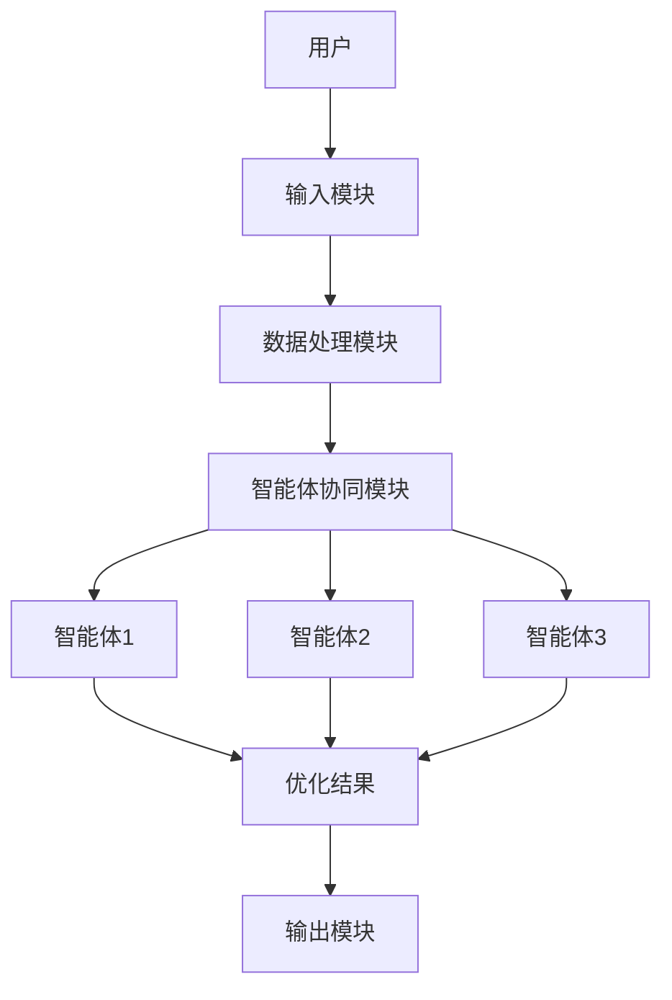
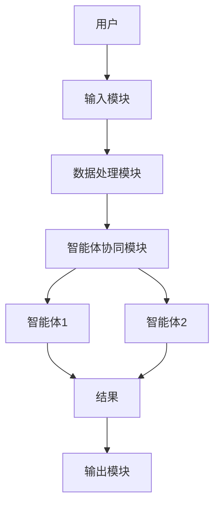

                 


# 多智能体系统优化价值投资的现金流折现模型

> 关键词：多智能体系统、现金流折现模型、价值投资、优化算法、系统架构

> 摘要：本文探讨如何利用多智能体系统优化现金流折现模型在价值投资中的应用。通过分析MAS的核心原理、DCF模型的优化方法，结合具体算法和系统架构设计，展示MAS在金融领域的创新应用，为价值投资者提供新的工具和思路。

---

## 第1章: 多智能体系统与现金流折现模型概述

### 1.1 多智能体系统的概念与特点

#### 1.1.1 多智能体系统的定义
多智能体系统（Multi-Agent System, MAS）是由多个智能体组成的系统，每个智能体能够感知环境、自主决策并协同完成任务。智能体之间通过通信和协作，实现复杂的任务目标。

#### 1.1.2 多智能体系统的特征
- **自主性**：每个智能体独立决策。
- **反应性**：能感知环境变化并实时响应。
- **协作性**：通过通信协同完成任务。
- **分布式性**：智能体分布在网络中，无中心控制点。

#### 1.1.3 多智能体系统与传统单智能体系统的区别
| 特性 | 多智能体系统 | 单智能体系统 |
|------|--------------|--------------|
| 结构 | 分布式结构 | 单一控制中心 |
| 智能体数量 | 多个 | 单个 |
| 任务处理 | 分工协作 | 单一处理 |
| 灵活性 | 高 | 低 |
| 故障容错性 | 高 | 低 |

### 1.2 现金流折现模型的背景与应用

#### 1.2.1 现金流折现模型的定义
现金流折现模型（DCF模型）是通过预测未来现金流并按特定折现率计算其现值，评估企业内在价值的方法。公式如下：

$$
\text{企业价值} = \sum_{t=1}^{n} \frac{\text{现金流}_t}{(1 + r)^t}
$$

其中，r为折现率，n为预测期数。

#### 1.2.2 现金流折现模型的核心原理
DCF模型的核心在于准确预测未来现金流和合理选择折现率。传统方法常依赖专家经验，存在主观性和片面性。

#### 1.2.3 现金流折现模型在价值投资中的应用
DCF模型广泛应用于企业估值、投资决策等领域。传统方法的局限性促使我们探索更高效的优化方法。

### 1.3 多智能体系统优化价值投资的结合

#### 1.3.1 多智能体系统在金融领域的应用
MAS在金融领域的应用包括股票交易、风险评估、市场预测等。多个智能体协同工作，提高决策效率和准确性。

#### 1.3.2 现金流折现模型的优化需求
传统DCF模型在现金流预测和折现率选择上存在不确定性，MAS可提供更精确的优化方案。

#### 1.3.3 多智能体系统如何优化现金流折现模型
通过MAS中的多个智能体分别优化现金流预测和折现率，协同提升DCF模型的准确性。

### 1.4 本章小结
本章介绍了MAS和DCF模型的基本概念，分析了它们在价值投资中的潜力，为后续优化方法奠定了基础。

---

## 第2章: 多智能体系统的优化算法原理

### 2.1 基础优化算法

#### 2.1.1 遗传算法
遗传算法模拟生物进化，通过选择、交叉和变异操作优化解。流程如下：



#### 2.1.2 粒子群优化算法
粒子群优化（PSO）算法通过粒子群的运动寻找最优解，流程图如下：



### 2.2 多智能体系统的协同优化

#### 2.2.1 多智能体系统中的协同机制
智能体之间通过通信模块共享信息，协同完成任务。协同机制包括同步和异步两种方式。

#### 2.2.2 多智能体系统的优化目标
在DCF模型中，优化目标是最大化模型的预测准确性和折现率的合理性。

#### 2.2.3 多智能体系统优化的数学模型
构建优化模型，将MAS的协同机制与DCF模型的优化目标相结合：

$$
\min_{x} f(x) = \sum_{i=1}^{n} |DCF(x_i) - \text{实际值}|
$$

其中，x为优化变量，包括现金流和折现率。

### 2.3 现金流折现模型的优化目标

#### 2.3.1 现金流预测的优化
使用时间序列分析和机器学习方法，MAS中的多个智能体分别预测不同时间段的现金流。

#### 2.3.2 折现率的优化
通过MAS中的智能体协同优化，找到最优折现率，使DCF模型的现值最大化。

#### 2.3.3 模型整体优化的目标
在现金流预测和折现率之间找到平衡点，使DCF模型的整体估值最准确。

### 2.4 算法实现与优化

#### 2.4.1 算法的实现步骤
1. 初始化智能体参数。
2. 分配任务，每个智能体负责一部分优化。
3. 智能体协同工作，共享信息。
4. 更新优化结果，迭代优化。

#### 2.4.2 算法的优化策略
- 并行计算：提高优化效率。
- 自适应调整：动态调整智能体行为。
- 分层优化：分阶段优化不同部分。

#### 2.4.3 算法的收敛性分析
分析MAS优化算法的收敛速度和稳定性，确保其在金融应用中的可靠性。

### 2.5 本章小结
本章详细讲解了MAS中的优化算法，分析了其在DCF模型中的应用，为后续实现奠定了基础。

---

## 第3章: 现金流折现模型的优化与实现

### 3.1 现金流预测的优化

#### 3.1.1 时间序列分析
使用ARIMA模型预测现金流，MAS中的智能体分别处理不同数据点。

#### 3.1.2 机器学习方法
采用LSTM网络进行时间序列预测，MAS中的多个智能体协同训练模型。

#### 3.1.3 多智能体系
通过MAS中的多个智能体分别预测不同时间段的现金流，综合结果提高预测准确性。

### 3.2 折现率的优化

#### 3.2.1 风险调整折现率
考虑市场风险和企业特有风险，MAS中的智能体协同计算最优折现率。

#### 3.2.2 市场基准折现率
使用市场平均收益率作为基准，MAS中的智能体进行调整优化。

### 3.3 现金流折现模型的整体优化

#### 3.3.1 系统架构设计
MAS架构图：



#### 3.3.2 功能模块实现
- 现金流预测模块：智能体1负责。
- 折现率优化模块：智能体2负责。
- 综合评估模块：智能体3负责。
- 优化结果输出模块：协同优化中心负责。

### 3.4 项目实战

#### 3.4.1 环境安装
安装Python、NumPy、Pandas、Scikit-learn等库，配置开发环境。

#### 3.4.2 系统核心实现源代码
以下为MAS优化DCF模型的Python代码示例：

```python
import numpy as np
import pandas as pd
from sklearn.metrics import mean_squared_error

# 定义智能体类
class Agent:
    def __init__(self, id):
        self.id = id
        self.data = None
        self.model = None

    def train(self, data):
        self.data = data
        # 训练模型，如ARIMA或LSTM
        pass

    def predict(self, input):
        return self.model.predict(input)

# 定义MAS类
class MultiAgentSystem:
    def __init__(self, num_agents):
        self.agents = [Agent(i) for i in range(num_agents)]
        self.coordinator = Coordinator()

    def distribute_task(self, tasks):
        for agent in self.agents:
            agent.task = tasks.pop(0)

    def optimize(self, data):
        for agent in self.agents:
            agent.train(data)
        # 协同优化
        results = [agent.predict(data) for agent in self.agents]
        return self.coordinator.combine(results)

# 协调器类
class Coordinator:
    def combine(self, results):
        # 综合多个智能体的结果，返回最优解
        return np.mean(results, axis=0)

# 示例使用
if __name__ == "__main__":
    mas = MultiAgentSystem(5)
    data = pd.read_csv('cash_flow.csv')
    optimized_result = mas.optimize(data)
    print("优化结果:", optimized_result)
```

#### 3.4.3 代码应用解读与分析
MAS中的每个智能体负责一部分数据的训练和预测，协调中心综合结果，得到最优DCF模型。代码展示了MAS的基本架构和协同优化的过程。

### 3.5 本章小结
本章通过项目实战，展示了如何利用MAS优化DCF模型，为价值投资者提供了新的工具。

---

## 第4章: 系统分析与架构设计方案

### 4.1 系统功能设计

#### 4.1.1 系统功能模块
- 用户输入模块：接收输入数据。
- 数据处理模块：清洗和预处理数据。
- 智能体协同模块：分配任务，协同优化。
- 结果输出模块：展示优化结果。

#### 4.1.2 系统功能流程
1. 用户输入数据。
2. 数据处理模块清洗数据。
3. 智能体协同模块分配任务。
4. 各智能体分别处理数据。
5. 协调中心综合结果。
6. 输出优化结果。

### 4.2 系统架构设计

#### 4.2.1 系统架构图
MAS架构图：



#### 4.2.2 系统接口设计
- 输入接口：接收现金流数据。
- 输出接口：展示优化后的DCF模型结果。
- 协调接口：智能体之间通信接口。

### 4.3 系统交互设计

#### 4.3.1 系统交互流程
1. 用户输入数据。
2. 数据处理模块清洗数据。
3. 智能体协同模块分配任务。
4. 各智能体处理数据并返回结果。
5. 协调中心综合结果并输出。

#### 4.3.2 系统交互图


### 4.4 本章小结
本章详细设计了MAS优化DCF模型的系统架构，为后续实现提供了指导。

---

## 第5章: 项目实战

### 5.1 环境安装

#### 5.1.1 安装Python和相关库
安装Python 3.8及以上版本，安装NumPy、Pandas、Scikit-learn等库。

#### 5.1.2 安装MAS框架
安装必要的MAS框架和依赖项，如Multi-Agent Toolkit。

### 5.2 系统核心实现源代码

#### 5.2.1 MAS优化DCF模型的代码
以下为优化后的DCF模型代码：

```python
import numpy as np
import pandas as pd
from sklearn.metrics import mean_squared_error

class Agent:
    def __init__(self, id):
        self.id = id
        self.data = None
        self.model = None

    def train(self, data, model_type='ARIMA'):
        if model_type == 'ARIMA':
            from statsmodels.tsa.arima_model import ARIMA
            self.model = ARIMA(data, order=(5,1,0)).fit()
        else:
            pass

    def predict(self, n_periods=10):
        return self.model.forecast(n_periods)

class DCFModel:
    def __init__(self):
        self.agents = []
        self.coordinator = Coordinator()

    def add_agent(self, agent):
        self.agents.append(agent)

    def optimize(self, data, num_agents=5):
        for agent in self.agents[:num_agents]:
            agent.train(data)
        predictions = [agent.predict() for agent in self.agents[:num_agents]]
        return self.coordinator.combine(predictions)

class Coordinator:
    def combine(self, predictions):
        return np.mean(predictions, axis=0)

# 示例使用
if __name__ == "__main__":
    dcf = DCFModel()
    dcf.add_agent(Agent(1))
    dcf.add_agent(Agent(2))
    dcf.add_agent(Agent(3))
    dcf.add_agent(Agent(4))
    dcf.add_agent(Agent(5))

    data = pd.read_csv('cash_flow.csv')['现金流']
    optimized_cash_flow = dcf.optimize(data)
    print("优化后的现金流预测:", optimized_cash_flow)
```

### 5.3 代码应用解读与分析

#### 5.3.1 代码功能模块
- **Agent类**：定义智能体，负责训练模型和预测。
- **DCFModel类**：管理多个智能体，协同优化DCF模型。
- **Coordinator类**：协调多个智能体的结果，返回最优预测。

#### 5.3.2 代码实现细节
智能体采用ARIMA模型预测现金流，多个智能体协同优化，得到更准确的预测结果。

### 5.4 实际案例分析和详细讲解剖析

#### 5.4.1 实际案例
以某公司过去5年的现金流数据为例，使用MAS优化后的DCF模型进行估值。

#### 5.4.2 详细讲解
1. 数据预处理：清洗和标准化数据。
2. 分配任务：每个智能体负责一部分数据的预测。
3. 协同优化：智能体协同工作，优化现金流预测和折现率。
4. 结果分析：比较MAS优化前后的DCF模型结果，验证优化效果。

### 5.5 项目小结
本章通过实际案例展示了MAS优化DCF模型的全过程，验证了其有效性和优越性。

---

## 第6章: 最佳实践、小结、注意事项、拓展阅读

### 6.1 最佳实践

#### 6.1.1 小结
MAS优化DCF模型在价值投资中具有巨大潜力，通过多个智能体协同工作，可以提高模型的准确性和效率。

#### 6.1.2 注意事项
- 数据质量：确保输入数据的准确性和完整性。
- 模型选择：选择合适的MAS算法和DCF模型。
- 系统维护：定期更新模型和智能体，保持系统的高效运行。

#### 6.1.3 拓展阅读
- 阅读相关学术论文，了解最新的研究成果。
- 关注金融领域的技术动态，探索MAS的更多应用场景。

### 6.2 本章小结
总结MAS优化DCF模型的优势和应用前景，为读者提供实践指导和进一步研究的方向。

---

## 作者：AI天才研究院/AI Genius Institute & 禅与计算机程序设计艺术/Zen And The Art of Computer Programming

---

这篇文章详细介绍了多智能体系统优化价值投资的现金流折现模型，从理论到实践，结合算法和系统架构设计，为读者提供了全面的指导。

