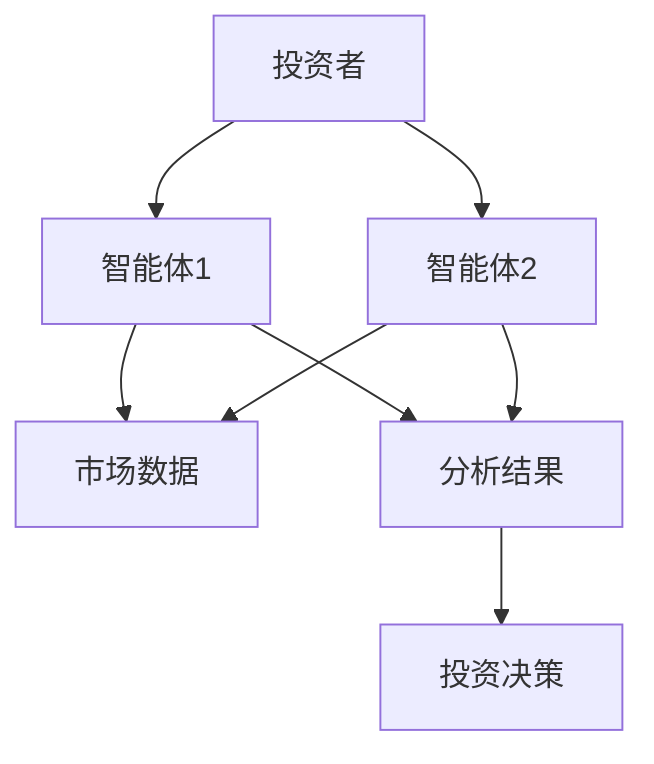
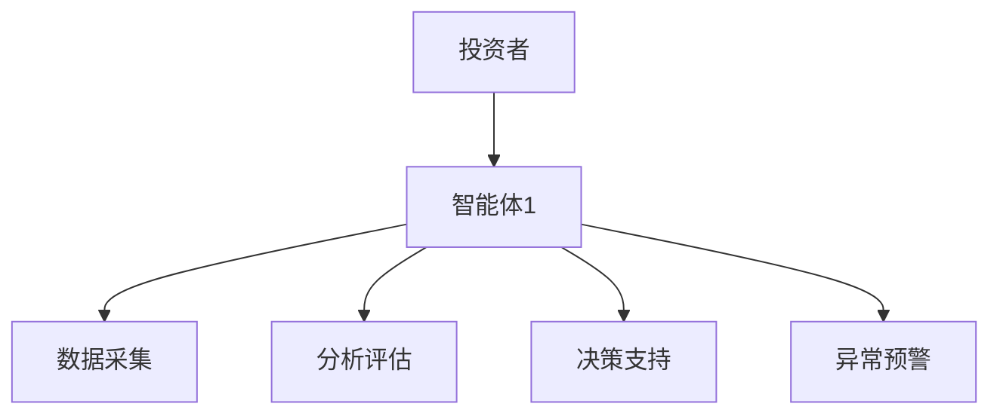
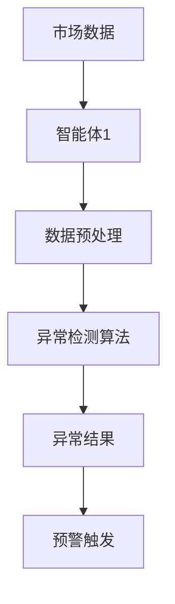
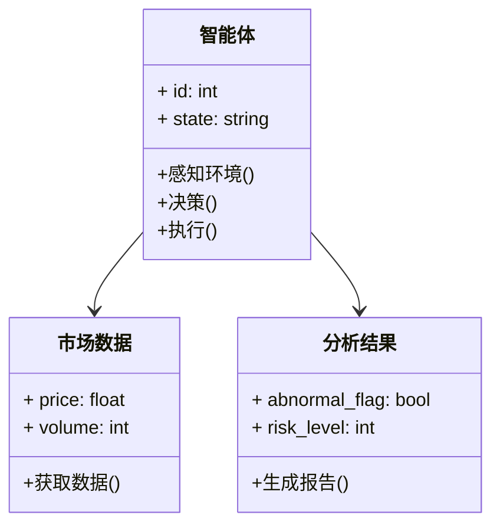
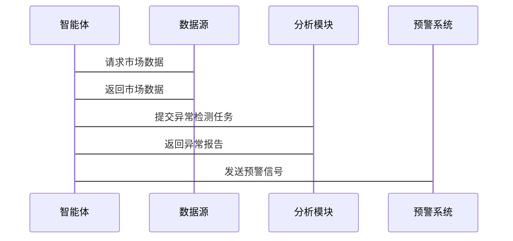

                 


# 多智能体系统增强价值投资的市场微观结构异常预警

> 关键词：多智能体系统, 价值投资, 市场微观结构, 异常预警, 分布式计算, 人工智能, 金融风险

> 摘要：本文探讨了多智能体系统在增强价值投资中的应用，特别是在市场微观结构异常预警方面。通过分析多智能体系统的原理、算法、数学模型，结合实际应用场景，提出了基于多智能体系统的异常检测方法，并通过案例分析验证了其有效性。文章还总结了多智能体系统在金融领域的优势与挑战，为未来的研究提供了方向。

---

## 第一部分: 多智能体系统与价值投资概述

### 第1章: 多智能体系统与价值投资的背景介绍

#### 1.1 多智能体系统的基本概念
##### 1.1.1 多智能体系统的定义
多智能体系统（Multi-Agent System, MAS）是由多个智能体组成的分布式系统，每个智能体都是具有感知、决策、执行能力的独立实体。智能体之间通过通信和协作完成复杂的任务。

##### 1.1.2 多智能体系统的特征
- **分布式性**：智能体分布在不同的节点，独立运行。
- **协作性**：智能体之间通过通信协作完成目标。
- **反应性**：智能体能够实时感知环境变化并做出反应。
- **自主性**：智能体具有自主决策能力。

##### 1.1.3 多智能体系统与传统单智能体系统的区别
| 特性       | 单智能体系统          | 多智能体系统          |
|------------|-----------------------|-----------------------|
| 结构       | 单一中心节点          | 分布式多节点          |
| 任务分配   | 单一任务处理          | 多任务协作完成         |
| 冗余性     | 低                   | 高                   |
| 可扩展性   | 低                   | 高                   |

#### 1.2 价值投资的核心理念
##### 1.2.1 价值投资的定义
价值投资是一种投资策略，通过分析企业的基本面（如财务状况、行业地位等）来判断其内在价值，寻找被市场低估的投资标的。

##### 1.2.2 价值投资的关键要素
- **企业分析**：分析企业的盈利能力、财务状况等。
- **市场情绪**：考虑市场参与者的心理和行为。
- **估值模型**：使用DCF模型等工具评估企业价值。

##### 1.2.3 价值投资在金融市场中的应用
- **选股策略**：通过基本面分析筛选出低估股票。
- **风险管理**：通过分散投资降低风险。
- **长期投资**：注重长期收益而非短期波动。

#### 1.3 问题背景与问题描述
##### 1.3.1 金融市场微观结构异常的表现
- **价格波动**：短时间内价格剧烈波动。
- **交易量突变**：交易量突然激增或骤减。
- **异常交易行为**：如高频交易、算法交易引发的市场混乱。

##### 1.3.2 传统价值投资的局限性
- **信息滞后**：传统分析依赖历史数据，难以实时捕捉市场变化。
- **人为因素**：投资者情绪和行为影响判断。
- **数据复杂性**：金融市场数据复杂，传统方法难以处理。

##### 1.3.3 多智能体系统在价值投资中的应用潜力
- **实时分析**：多智能体系统能够实时处理市场数据。
- **协作决策**：多个智能体协作分析，提升决策准确性。
- **异常检测**：通过多智能体协同，及时发现市场异常。

#### 1.4 问题解决与边界
##### 1.4.1 多智能体系统如何增强价值投资
- **分布式计算**：多智能体系统能够并行处理大量数据。
- **协作决策**：多个智能体协作分析，提供更全面的决策支持。
- **实时反馈**：智能体能够快速响应市场变化。

##### 1.4.2 问题的边界与外延
- **边界**：专注于市场微观结构的异常检测，不涉及宏观经济因素。
- **外延**：可以扩展到其他金融领域，如外汇交易、衍生品市场。

##### 1.4.3 核心概念与核心要素的组成
| 核心概念       | 描述                     |
|----------------|--------------------------|
| 多智能体系统     | 分布式协作的智能体系统   |
| 价值投资       | 基于基本面分析的投资策略 |
| 市场微观结构   | 金融市场的运行机制       |
| 异常预警       | 及时发现市场异常行为     |

---

## 第二部分: 多智能体系统与价值投资的核心概念与联系

### 第2章: 多智能体系统与价值投资的核心概念与联系

#### 2.1 多智能体系统的原理
##### 2.1.1 多智能体系统的组成
- **智能体**：独立的决策单元。
- **通信机制**：智能体之间的信息交换方式。
- **协作协议**：智能体协作的规则和流程。

##### 2.1.2 多智能体系统的核心算法
- **分布式协调算法**：如基于一致性算法的分布式决策。
- **联合决策算法**：通过协商达成一致的决策。
- **自适应优化算法**：根据环境变化动态调整策略。

##### 2.1.3 多智能体系统的通信机制
- **点对点通信**：智能体之间直接通信。
- **广播通信**：一个智能体向所有其他智能体发送信息。
- **发布-订阅模式**：通过消息中间件实现通信。

#### 2.2 价值投资与多智能体系统的联系
##### 2.2.1 价值投资的决策过程
- **数据收集**：收集企业的财务数据、行业信息等。
- **分析评估**：通过模型评估企业的内在价值。
- **决策制定**：根据评估结果制定投资策略。

##### 2.2.2 多智能体系统在价值投资中的角色
- **数据采集**：智能体实时采集市场数据。
- **分析评估**：多个智能体协作分析数据。
- **决策支持**：提供实时的决策支持。

##### 2.2.3 价值投资与多智能体系统的协同效应
- **高效协作**：多智能体系统能够快速处理大量数据。
- **实时反馈**：系统能够实时捕捉市场变化。
- **风险控制**：通过协作发现潜在风险。

#### 2.3 实体关系图与概念属性对比
##### 2.3.1 实体关系图（Mermaid流程图）


##### 2.3.2 核心概念属性对比表格
| 概念       | 属性                   |
|------------|------------------------|
| 多智能体系统 | 分布式、协作性、实时性 |
| 价值投资   | 基于基本面、长期性、分散性 |

---

## 第三部分: 多智能体系统增强价值投资的算法原理

### 第3章: 多智能体系统增强价值投资的算法原理

#### 3.1 多智能体协调与决策算法
##### 3.1.1 分布式协调算法
- **一致性算法**：如Paxos、Raft，用于分布式系统中的共识达成。
- **分布式协调算法**：通过消息传递实现智能体之间的协调。

##### 3.1.2 联合决策算法
- **协商算法**：智能体通过协商达成一致决策。
- **投票机制**：通过投票方式决定最终决策。

##### 3.1.3 自适应优化算法
- **遗传算法**：通过迭代优化决策方案。
- **模拟退火**：通过随机化方法找到全局最优解。

#### 3.2 异常检测与预警算法
##### 3.2.1 基于统计的异常检测
- **Z-score方法**：通过统计量检测异常值。
- **均值-方差方法**：基于均值和方差的变化检测异常。

##### 3.2.2 基于机器学习的异常检测
- **监督学习**：使用分类模型检测异常。
- **无监督学习**：使用聚类模型发现异常。

##### 3.2.3 基于多智能体的异常预警机制
- **多智能体协同检测**：多个智能体协作检测异常。
- **动态阈值调整**：根据市场环境动态调整异常检测阈值。

#### 3.3 算法流程图（Mermaid）
##### 3.3.1 多智能体协调流程图


##### 3.3.2 异常检测流程图


---

## 第四部分: 数学模型与公式

### 第4章: 数学模型与公式

#### 4.1 资产定价模型
##### 4.1.1 CAPM模型
$$ E(r_i) = r_f + \beta_i (E(r_m) - r_f) $$

其中：
- \( E(r_i) \) 是资产的预期回报率。
- \( r_f \) 是无风险利率。
- \( \beta_i \) 是资产的贝塔系数。
- \( E(r_m) \) 是市场预期回报率。

#### 4.2 异常检测模型
##### 4.2.1 马尔可夫链模型
$$ P(X_{t+1} | X_t) $$

##### 4.2.2 高斯混合模型
$$ p(x) = \sum_{i=1}^{K} \pi_i N(\mu_i, \sigma_i^2) $$

其中：
- \( \pi_i \) 是混合比例。
- \( N(\mu_i, \sigma_i^2) \) 是高斯分布。

##### 4.2.3 基于深度学习的异常检测模型
$$ f(x) = \text{softmax}(Wx + b) $$

---

## 第五部分: 系统分析与架构设计

### 第5章: 系统分析与架构设计

#### 5.1 问题场景介绍
- **场景描述**：金融市场中的价格波动、交易量突变等异常行为。
- **目标**：通过多智能体系统实现实时异常检测和预警。

#### 5.2 项目介绍
- **项目名称**：多智能体系统增强价值投资的市场微观结构异常预警。
- **项目目标**：构建一个多智能体系统，用于实时检测和预警金融市场中的异常行为。

#### 5.3 系统功能设计
##### 5.3.1 领域模型（Mermaid类图）


##### 5.3.2 系统架构设计（Mermaid架构图）


##### 5.3.3 接口设计
- **API接口**：
  - `GET /market-data`：获取市场数据。
  - `POST /analyze`：提交分析任务。
  - `GET /abnormal-report`：获取异常报告。

##### 5.3.4 交互流程图（Mermaid序列图）


---

## 第六部分: 项目实战

### 第6章: 项目实战

#### 6.1 环境安装
- **安装依赖**：
  - 安装Python环境：`pip install python3`
  - 安装多智能体框架：`pip install mesa`

#### 6.2 系统核心实现源代码
##### 6.2.1 智能体类实现
```python
class Agent:
    def __init__(self, id):
        self.id = id
        self.state = "normal"

    def perceive_environment(self, data):
        # 处理市场数据
        pass

    def decide(self):
        # 根据感知结果做出决策
        pass

    def act(self):
        # 执行决策
        pass
```

##### 6.2.2 异常检测模块实现
```python
def detect_anomaly(data):
    # 使用统计方法检测异常
    pass
```

#### 6.3 代码应用解读与分析
- **智能体类**：每个智能体负责感知环境、做出决策并执行动作。
- **异常检测模块**：基于统计或机器学习方法检测市场数据中的异常。

#### 6.4 实际案例分析
- **案例描述**：某股票价格突然大幅波动。
- **分析过程**：
  1. 智能体感知到价格波动。
  2. 异常检测模块识别出异常。
  3. 系统触发预警机制。

#### 6.5 项目小结
- **项目总结**：通过多智能体系统的协作，实现了对市场微观结构异常的实时检测和预警。
- **经验教训**：多智能体系统的协作和通信机制需要精心设计。

---

## 第七部分: 总结与扩展

### 第7章: 总结与扩展

#### 7.1 最佳实践 tips
- **数据质量**：确保数据的实时性和准确性。
- **系统安全性**：保障系统的安全性和稳定性。
- **模型优化**：定期优化异常检测模型。

#### 7.2 小结
本文通过分析多智能体系统在价值投资中的应用，提出了基于多智能体系统的市场微观结构异常预警方法，并通过案例分析验证了其有效性。

#### 7.3 注意事项
- **数据隐私**：注意保护投资者的隐私数据。
- **系统维护**：定期维护和更新系统。

#### 7.4 拓展阅读
- **推荐书籍**：《多智能体系统》、《金融风险管理》。
- **推荐论文**：相关领域的最新研究论文。

---

## 作者信息

作者：AI天才研究院/AI Genius Institute & 禅与计算机程序设计艺术 /Zen And The Art of Computer Programming

