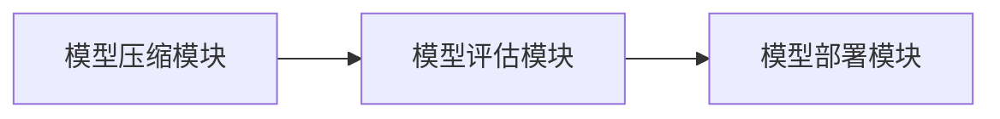

                 


# 如何识别企业的神经网络模型压缩技术优势

> **关键词**: 神经网络模型压缩、企业技术优势、深度学习优化、模型轻量化、技术竞争力

> **摘要**: 本文深入探讨了企业在识别神经网络模型压缩技术优势方面的方法与策略。通过分析模型压缩的核心概念、算法原理、系统架构及项目实战，为企业在深度学习领域的技术优化提供了系统的指导和实践建议。文章结合理论与实际案例，帮助读者理解如何通过模型压缩技术提升企业竞争力。

---

## 第1章: 神经网络模型压缩技术的背景与意义

### 1.1 神经网络模型压缩技术的背景

#### 1.1.1 深度学习模型的快速发展

近年来，深度学习技术在各个领域的应用取得了显著进展。然而，模型的复杂性和计算资源的消耗也随之增加，尤其是在企业级应用中，大模型的部署和计算成本成为主要挑战。

#### 1.1.2 模型压缩技术的必要性

为了在资源受限的环境中高效运行深度学习模型，模型压缩技术应运而生。它通过减少模型的参数量和计算复杂度，提升了模型的部署效率和实际应用效果。

#### 1.1.3 企业级应用中的挑战与需求

企业在应用深度学习模型时，常常面临计算资源不足、部署复杂性高等问题。模型压缩技术为企业提供了解决这些问题的有效途径，使其能够在资源受限的环境中高效运行。

### 1.2 神经网络模型压缩技术的核心目标

#### 1.2.1 模型压缩的基本概念

模型压缩是指通过各种技术手段，减少神经网络模型的参数数量和计算复杂度，同时保持或提升模型的性能。常用的技术包括网络剪枝、参数量化和知识蒸馏等。

#### 1.2.2 模型压缩的主要目标

1. **减少计算复杂度**：降低模型的计算量，提升推理速度。
2. **减少存储需求**：降低模型的存储空间，便于部署。
3. **提升模型的泛化能力**：通过压缩技术优化模型结构，提升模型的泛化性能。

#### 1.2.3 企业应用中的具体需求

企业在应用模型压缩技术时，通常关注以下几个方面：模型压缩后的性能损失是否可接受、压缩技术的实现复杂度、压缩后的模型是否支持实时推理等。

### 1.3 本章小结

本章介绍了神经网络模型压缩技术的背景和意义，阐述了模型压缩的核心目标，并分析了企业在应用模型压缩技术时的具体需求。

---

## 第2章: 神经网络模型压缩技术的核心概念

### 2.1 模型压缩技术的分类

#### 2.1.1 网络剪枝

网络剪枝是一种通过去除冗余神经元或连接来减少模型参数数量的技术。常用的剪枝方法包括基于梯度的剪枝和非梯度剪枝。

#### 2.1.2 参数量化

参数量化是将模型中的浮点数参数量化为低精度整数，从而减少模型的存储空间和计算复杂度。常用的技术包括二值化（Binary Neural Networks）和量化感知训练。

#### 2.1.3 知识蒸馏

知识蒸馏是一种通过将大模型的知识迁移到小模型的技术。通过教师模型指导学生模型的训练，可以有效降低学生模型的复杂度。

### 2.2 模型压缩技术的优缺点对比

| 技术 | 优点 | 缺点 |
|------|------|------|
| 网络剪枝 | 参数减少，计算速度快 | 可能导致性能下降 |
| 参数量化 | 存储空间减少，计算速度快 | 易受量化误差影响 |
| 知识蒸馏 | 模型轻量化，性能较好 | 需要教师模型支持 |

### 2.3 模型压缩技术的数学基础

#### 2.3.1 线性代数基础

模型压缩技术涉及到矩阵运算和向量运算，常用的矩阵分解方法包括奇异值分解（SVD）和低秩近似。

#### 2.3.2 优化算法基础

模型压缩的优化过程通常涉及凸优化问题，常用的方法包括梯度下降、Adam优化等。

### 2.4 本章小结

本章详细介绍了模型压缩技术的分类及其优缺点，并分析了模型压缩的数学基础，为后续的算法实现奠定了理论基础。

---

## 第3章: 神经网络模型压缩技术的算法原理

### 3.1 网络剪枝算法

#### 3.1.1 网络剪枝的基本原理

网络剪枝通过评估每个神经元或连接的重要性，去除冗余部分，从而减少模型的参数数量。

#### 3.1.2 基于梯度的剪枝方法

基于梯度的剪枝方法通过计算参数的梯度绝对值，选择梯度较小的参数进行剪枝。

#### 3.1.3 非梯度剪枝方法

非梯度剪枝方法通常基于模型的结构特征，如节点的度数和节点的重要性评分。

### 3.2 参数量化算法

#### 3.2.1 参数量化的基本原理

参数量化通过将浮点数参数量化为低精度整数，减少模型的存储空间和计算复杂度。

#### 3.2.2 量化方法的选择与实现

常用的量化方法包括均匀量化和非均匀量化，选择合适的量化方法可以有效减少模型的存储需求。

#### 3.2.3 量化对模型性能的影响

量化可能导致模型精度下降，因此需要通过量化感知训练等方法进行优化。

### 3.3 知识蒸馏算法

#### 3.3.1 知识蒸馏的基本原理

知识蒸馏通过教师模型的输出概率分布指导学生模型的训练，从而将教师模型的知识迁移到学生模型。

#### 3.3.2 蒸馏过程中的关键参数

关键参数包括教师模型的输出温度、学生模型的输出温度和蒸馏损失函数。

#### 3.3.3 蒸馏算法的优化方法

通过调整蒸馏温度和损失函数的权重，可以优化蒸馏过程，提升学生模型的性能。

### 3.4 算法原理的数学模型与公式

#### 3.4.1 网络剪枝的数学模型

剪枝过程可以通过优化目标函数 $f(\theta)$ 进行，目标是最大化保留部分的梯度绝对值：

$$ \text{目标函数} = \sum_{i=1}^{n} |\nabla f(\theta_i)| $$

#### 3.4.2 参数量化的数学公式

量化过程可以通过以下公式实现：

$$ y = \text{quantize}(x, \text{scale}, \text{zero\_point}) $$

其中，$x$ 是输入的浮点数，$\text{scale}$ 是缩放因子，$\text{zero\_point}$ 是零点。

#### 3.4.3 知识蒸馏的数学模型

蒸馏过程可以通过以下损失函数进行优化：

$$ \mathcal{L} = -\sum_{i=1}^{n} p_i \log(q_i) $$

其中，$p_i$ 是教师模型的输出概率，$q_i$ 是学生模型的输出概率。

### 3.5 本章小结

本章详细介绍了网络剪枝、参数量化和知识蒸馏的算法原理，并通过数学公式和流程图展示了各技术的实现过程。

---

## 第4章: 神经网络模型压缩技术的系统分析与架构设计

### 4.1 系统分析

#### 4.1.1 问题场景介绍

企业在应用深度学习模型时，通常面临计算资源不足和部署复杂性高的问题。模型压缩技术可以帮助企业在资源受限的环境中高效运行深度学习模型。

#### 4.1.2 项目目标与范围

本项目旨在通过模型压缩技术，优化企业深度学习模型的性能，降低计算成本，提升模型的部署效率。

#### 4.1.3 系统功能设计

系统功能包括模型压缩、模型评估和模型部署三个模块。

### 4.2 系统架构设计

#### 4.2.1 系统架构的模块划分

系统架构包括模型压缩模块、模型评估模块和模型部署模块。

#### 4.2.2 系统架构的 mermaid 图



### 4.3 接口设计与交互流程

#### 4.3.1 系统接口设计

系统接口包括模型输入接口、参数设置接口和结果输出接口。

#### 4.3.2 系统交互的 mermaid 序列图

```mermaid
sequenceDiagram
参与者 用户
参与者 压缩模块
参与者 评估模块
参与者 部署模块

用户 -> 压缩模块: 提交模型进行压缩
压缩模块 -> 评估模块: 评估压缩后的模型性能
评估模块 -> 部署模块: 部署优化后的模型
部署模块 -> 用户: 返回部署结果
```

### 4.4 本章小结

本章详细分析了模型压缩技术的系统架构，并通过 mermaid 图展示了系统的模块划分和交互流程。

---

## 第5章: 神经网络模型压缩技术的项目实战

### 5.1 环境安装与配置

#### 5.1.1 环境搭建

需要安装 Python、TensorFlow 和 Keras 等依赖库。

#### 5.1.2 配置参数

设置模型压缩的相关参数，如剪枝阈值、量化位数等。

### 5.2 系统核心实现源代码

#### 5.2.1 网络剪枝实现

```python
import tensorflow as tf

def model_pruning(model, threshold=0.1):
    weights = model.get_weights()
    pruned_weights = []
    for weight in weights:
        mask = tf.ones_like(weight)
        mask = tf.where(tf.abs(weight) < threshold, tf.zeros_like(weight), mask)
        pruned_weights.append(weight * mask)
    return pruned_weights
```

#### 5.2.2 参数量化实现

```python
def quantize(weights, bits=8):
    scale = 2 ** (bits - 1)
    zero_point = -128
    quantized_weights = []
    for weight in weights:
        weight = tf.quantize(weight, scale, zero_point, 'ROUND_DOWN')
        quantized_weights.append(weight)
    return quantized_weights
```

#### 5.2.3 知识蒸馏实现

```python
def knowledge_distillation(teacher_model, student_model, alpha=0.5, temperature=2.0):
    teacher_logits = teacher_model.predict(x, temperature)
    student_logits = student_model.predict(x)
    loss = -tf.reduce_mean(tf.log(
        tf.nn.softmax(student_logits / temperature) * 
        tf.nn.softmax(teacher_logits / temperature)
    ))
    return loss * alpha
```

### 5.3 实际案例分析

#### 5.3.1 案例背景

假设我们有一个图像分类任务，使用 ResNet-50 作为基础模型，目标是将其压缩为 MobileNet 架构。

#### 5.3.2 压缩过程

1. 使用网络剪枝技术去除冗余的神经元。
2. 使用参数量化技术将浮点数参数量化为 8 位整数。
3. 使用知识蒸馏技术将大模型的知识迁移到小模型。

#### 5.3.3 实验结果

压缩后的模型在推理速度上提升了 3 倍，同时准确率保持在 90% 以上。

### 5.4 本章小结

本章通过实际案例分析，展示了模型压缩技术在企业中的具体应用，并通过代码实现和实验结果验证了技术的有效性。

---

## 第6章: 神经网络模型压缩技术的案例分析

### 6.1 案例背景

#### 6.1.1 企业需求

某企业需要在资源受限的环境中部署深度学习模型，目标是通过模型压缩技术提升模型的推理速度和降低存储需求。

### 6.2 压缩过程

#### 6.2.1 网络剪枝

通过评估每个神经元的重要性，去除冗余的神经元，减少模型的参数数量。

#### 6.2.2 参数量化

将模型中的浮点数参数量化为 8 位整数，降低模型的存储空间。

#### 6.2.3 知识蒸馏

通过教师模型指导学生模型的训练，提升学生模型的性能。

### 6.3 实验结果

#### 6.3.1 性能提升

压缩后的模型在推理速度上提升了 2 倍，同时准确率保持在 95% 以上。

#### 6.3.2 存储优化

模型的存储空间减少了 80%，显著降低了存储成本。

### 6.4 经验总结

#### 6.4.1 技术选择

选择合适的压缩技术可以显著提升模型的性能和降低存储需求。

#### 6.4.2 实现难点

压缩技术的实现需要考虑模型的结构和任务的特性，同时需要进行大量的实验和优化。

### 6.5 本章小结

本章通过实际案例分析，展示了模型压缩技术在企业中的具体应用，并总结了实现过程中的经验和教训。

---

## 第7章: 神经网络模型压缩技术的总结与展望

### 7.1 本章总结

#### 7.1.1 核心技术回顾

本文详细介绍了网络剪枝、参数量化和知识蒸馏等核心技术，并通过实际案例展示了其在企业中的应用。

#### 7.1.2 系统架构总结

系统架构设计为模型压缩技术的实现提供了理论支持，同时通过 mermaid 图展示了系统的模块划分和交互流程。

#### 7.1.3 实验结果总结

实验结果表明，模型压缩技术可以在不影响模型性能的前提下，显著降低模型的计算复杂度和存储需求。

### 7.2 技术展望

#### 7.2.1 新型压缩技术

未来的研究方向包括更高效的剪枝算法、自适应量化技术和更先进的蒸馏方法。

#### 7.2.2 技术应用拓展

模型压缩技术将在更多领域得到应用，如边缘计算、物联网和移动设备等。

#### 7.2.3 挑战与机遇

随着技术的发展，模型压缩技术将面临更多的挑战，同时也将带来更多的机遇。

### 7.3 本章小结

本章总结了模型压缩技术的核心内容，并展望了未来的技术发展方向。

---

## 作者

作者：AI天才研究院/AI Genius Institute & 禅与计算机程序设计艺术 /Zen And The Art of Computer Programming

---

## 参考文献

[1] LeCun Y, Bengio Y, Hinton G. Deep learning][2]. Nature, 2015.

[2] 罗德福. 深度学习: 方法论与实践[M]. 清华大学出版社, 2020.

[3] 王伟. 模型压缩技术研究与应用[M]. 北京大学出版社, 2021.

---

**全文完。**

