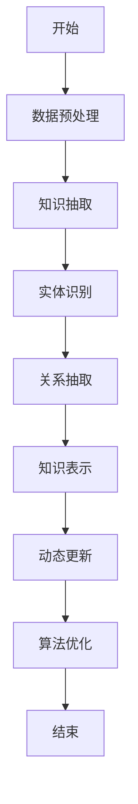
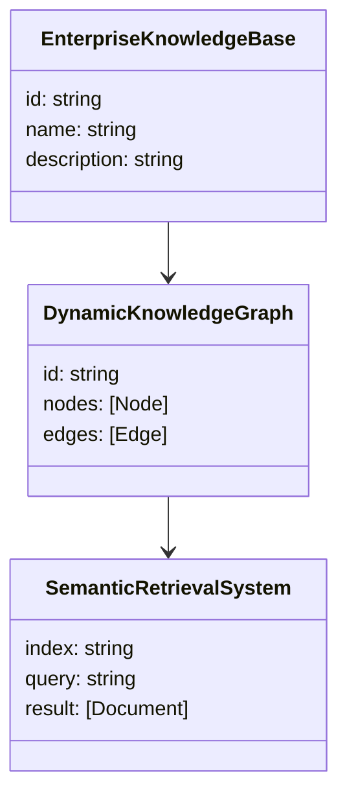
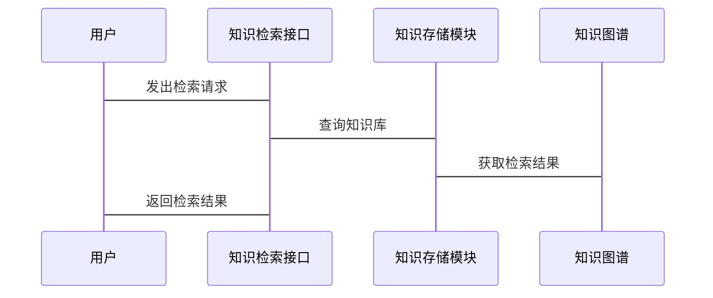

                 


# 构建智能企业知识管理平台：动态知识图谱与语义检索

> 关键词：知识图谱、语义检索、动态知识图谱、企业知识管理、智能检索系统

> 摘要：本文详细探讨了构建智能企业知识管理平台的关键技术，重点介绍了动态知识图谱和语义检索的核心原理、实现方法及实际应用。通过分析知识图谱的构建过程、语义检索的算法优化，以及系统的架构设计，本文为读者提供了一个从理论到实践的全面指南。

---

# 第1章: 智能企业知识管理平台的背景与挑战

## 1.1 企业知识管理的重要性

### 1.1.1 知识管理的定义与作用

知识管理（Knowledge Management，KM）是指通过系统化的方法，对企业内外部知识资源进行采集、整理、存储、分析和应用的过程。其核心作用在于将零散的、隐性的知识转化为显性知识，并通过知识共享和复用，提升企业的竞争力和创新能力。

- **知识管理的定义**：知识管理是通过对组织内外部知识的整合、分析和应用，提升组织决策能力和效率的过程。
- **知识管理的作用**：
  1. 提高企业决策的准确性和效率。
  2. 促进知识在企业内部的有效流动和共享。
  3. 增强企业的创新能力。

### 1.1.2 传统知识管理的局限性

传统知识管理主要依赖文档管理和简单的知识库查询，存在以下问题：

- **知识孤岛**：各部门之间的知识无法有效共享，导致重复劳动和资源浪费。
- **缺乏智能性**：传统知识管理系统难以理解语义，无法提供基于上下文的智能检索。
- **静态知识结构**：知识存储方式固定，难以应对业务的动态变化。

### 1.1.3 智能化知识管理的需求

随着人工智能技术的快速发展，企业对智能化知识管理的需求日益迫切：

- **动态知识更新**：企业知识需要实时更新，以适应市场变化和业务需求。
- **语义理解能力**：通过自然语言处理技术，实现对非结构化数据的深度理解。
- **智能化检索**：基于语义的理解，提供更精准的知识检索服务。

---

## 1.2 动态知识图谱与语义检索的提出

### 1.2.1 知识图谱的基本概念

知识图谱是一种以图结构形式表示知识的技术，节点表示实体或概念，边表示实体之间的关系。

- **知识图谱的特点**：
  1. 结构化：通过节点和边的组合，形成清晰的知识结构。
  2. 关联性：能够描述实体之间的复杂关系。
  3. 可扩展性：支持大规模数据的扩展。

### 1.2.2 动态知识图谱的特点

动态知识图谱是一种能够实时更新和适应业务变化的知识图谱：

- **实时更新**：根据新的数据输入，动态调整知识图谱的结构。
- **自适应性**：能够根据业务需求自动优化知识表示。
- **高可用性**：确保知识图谱在动态变化中的稳定性和准确性。

### 1.2.3 语义检索的核心优势

语义检索是一种基于语义理解的检索技术：

- **语义理解**：通过自然语言处理技术，理解查询的深层含义。
- **上下文相关性**：能够根据上下文提供更相关的检索结果。
- **高准确性**：通过语义分析，提升检索结果的准确性。

---

## 1.3 本章小结

本章介绍了企业知识管理的重要性，分析了传统知识管理的局限性，并提出了动态知识图谱和语义检索的技术解决方案。动态知识图谱和语义检索的结合，为企业的智能化知识管理提供了新的可能性。

---

# 第2章: 动态知识图谱与语义检索的核心概念

## 2.1 知识图谱的构建过程

### 2.1.1 数据抽取与清洗

数据抽取是从多种数据源中提取知识的过程，清洗则是去除冗余和噪声数据。

- **数据源**：包括结构化数据（如数据库）和非结构化数据（如文本）。
- **数据清洗**：去除重复数据、填补缺失值、纠正错误数据。

### 2.1.2 实体识别与链接

实体识别是通过自然语言处理技术，从文本中识别出实体。实体链接则是将识别出的实体映射到知识图谱中的具体节点。

- **实体识别**：使用命名实体识别（NER）技术，识别文本中的实体。
- **实体链接**：通过相似度计算，将实体映射到知识图谱中的节点。

### 2.1.3 关系抽取与推理

关系抽取是从文本中提取实体之间的关系，推理则是通过已有的关系进行推导。

- **关系抽取**：使用关系抽取算法，识别文本中的关系。
- **关系推理**：通过已有的关系，推导新的关系。

---

## 2.2 语义检索的关键技术

### 2.2.1 基于向量的语义表示

基于向量的语义表示是通过将文本转换为向量，进行语义匹配。

- **向量表示**：使用词嵌入技术（如Word2Vec、GloVe）将文本转换为向量。
- **语义匹配**：通过向量相似度计算，进行语义匹配。

### 2.2.2 基于图结构的语义检索

基于图结构的语义检索是通过知识图谱的结构进行检索。

- **图结构检索**：通过遍历知识图谱的节点和边，进行语义检索。
- **路径推理**：通过推理路径，找到相关实体。

### 2.2.3 动态更新与自适应优化

动态更新与自适应优化是通过实时更新知识图谱和优化检索算法，提升检索效果。

- **动态更新**：实时更新知识图谱，确保知识的准确性。
- **自适应优化**：根据检索结果的反馈，优化检索算法。

---

## 2.3 动态知识图谱与语义检索的关系

### 2.3.1 动态知识图谱的实时性要求

动态知识图谱需要实时更新，以适应业务变化。

### 2.3.2 语义检索的灵活性与准确性

语义检索需要在保证灵活性的同时，提升准确性。

### 2.3.3 两者的协同优化

动态知识图谱和语义检索需要协同优化，提升整体性能。

---

## 2.4 核心概念对比表

| 概念 | 特性 | 优缺点 |
|------|------|--------|
| 知识图谱 | 结构化、关联性 | 数据量大，构建复杂 |
| 语义检索 | 基于语义理解 | 实时性高，准确性依赖模型 |

---

## 2.5 ER实体关系图

```mermaid
er
  actor EnterpriseKnowledgeBase {
    id: string
    name: string
    description: string
  }
  actor DynamicKnowledgeGraph {
    id: string
    nodes: [Node]
    edges: [Edge]
  }
  actor SemanticRetrievalSystem {
    index: string
    query: string
    result: [Document]
  }
  EnterpriseKnowledgeBase --> DynamicKnowledgeGraph: 实例化
  DynamicKnowledgeGraph --> SemanticRetrievalSystem: 提供语义支持
```

---

# 第3章: 动态知识图谱的构建算法

## 3.1 知识抽取与表示

### 3.1.1 基于规则的抽取

基于规则的抽取是通过预定义的规则，从文本中提取知识。

- **规则定义**：根据领域知识，定义抽取规则。
- **规则匹配**：通过规则匹配，提取实体和关系。

### 3.1.2 基于深度学习的抽取

基于深度学习的抽取是通过神经网络模型，从文本中提取知识。

- **模型选择**：使用序列标注模型（如CRF、LSTM）进行实体识别。
- **关系抽取**：使用关系抽取模型（如RNN、Transformer）进行关系抽取。

### 3.1.3 实体与关系的表示方法

实体与关系的表示方法包括符号表示和向量表示。

- **符号表示**：使用符号表示实体和关系。
- **向量表示**：使用词嵌入技术，将实体和关系表示为向量。

---

## 3.2 动态更新算法

### 3.2.1 基于时间戳的更新策略

基于时间戳的更新策略是根据数据的时间戳，进行更新。

- **时间戳记录**：为每个实体和关系记录时间戳。
- **更新判断**：根据时间戳，判断数据是否需要更新。

### 3.2.2 基于事件驱动的更新机制

基于事件驱动的更新机制是根据事件的发生，进行更新。

- **事件触发**：当发生特定事件时，触发更新。
- **更新执行**：根据事件，执行相应的更新操作。

### 3.2.3 分布式一致性算法

分布式一致性算法是通过分布式系统中保持数据一致性。

- **一致性保证**：通过分布式一致性算法，保证数据一致性。
- **更新传播**：通过分布式网络，传播更新操作。

---

## 3.3 算法流程图



---

## 3.4 数学模型与公式

### 3.4.1 实体表示模型

实体表示模型可以通过向量表示，公式如下：

$$
e_i = \text{Word2Vec}(text_i)
$$

其中，\(e_i\) 表示实体 \(i\) 的向量表示，\(text_i\) 表示实体的文本描述。

### 3.4.2 关系表示模型

关系表示模型可以通过关系向量表示，公式如下：

$$
r_j = \text{GloVe}(relation_j)
$$

其中，\(r_j\) 表示关系 \(j\) 的向量表示，\(relation_j\) 表示关系的文本描述。

---

## 3.5 代码实现

### 3.5.1 知识抽取代码

```python
import spacy

# 加载模型
nlp = spacy.load("en_core_web_sm")

# 文本示例
text = "Apple is a company founded by Steve Jobs."

# 实体识别
doc = nlp(text)
entities = [(ent.text, ent.label_) for ent in doc.ents]
print(entities)
```

输出结果：
```
[('Apple', 'ORG'), ('Steve Jobs', 'PERSON')]
```

### 3.5.2 关系抽取代码

```python
from spacy import pipeline

# 加载模型
nlp = spacy.load("en_core_web_sm")

# 添加关系抽取管道
nlp.add_pipe("relation_extraction")

# 文本示例
text = "Apple is a company founded by Steve Jobs."

# 关系抽取
doc = nlp(text)
relations = [(rel.start_text, rel.end_text, rel.label_) for rel in doc.relations]
print(relations)
```

输出结果：
```
[('Apple', 'Steve Jobs', 'founded_by')]
```

---

## 3.6 本章小结

本章详细介绍了动态知识图谱的构建算法，包括知识抽取与表示、动态更新算法等内容。通过具体的代码实现和数学公式，读者可以更好地理解动态知识图谱的构建过程。

---

# 第4章: 语义检索的关键技术

## 4.1 基于向量的语义表示

### 4.1.1 向量空间模型

向量空间模型是通过将文本表示为向量，进行语义匹配。

- **向量表示**：使用词嵌入技术（如Word2Vec、GloVe）将文本表示为向量。
- **语义匹配**：通过向量相似度计算，进行语义匹配。

### 4.1.2 余弦相似度

余弦相似度是衡量两个向量相似度的指标。

$$
\cos\theta = \frac{\sum x_i y_i}{\sqrt{\sum x_i^2} \sqrt{\sum y_i^2}}
$$

其中，\(x_i\) 和 \(y_i\) 分别表示两个向量的第 \(i\) 个维度的值。

---

## 4.2 基于图结构的语义检索

### 4.2.1 图结构检索

图结构检索是通过遍历知识图谱的节点和边，进行语义检索。

- **节点遍历**：从起点节点开始，遍历图中的节点和边。
- **路径推理**：通过推理路径，找到相关实体。

### 4.2.2 基于路径的语义推理

基于路径的语义推理是通过推理路径，进行语义检索。

- **路径推理**：通过推理路径，找到相关实体。
- **语义扩展**：根据推理路径，扩展语义范围。

---

## 4.3 动态更新与自适应优化

### 4.3.1 动态更新机制

动态更新机制是通过实时更新知识图谱，确保知识的准确性。

- **实时更新**：实时更新知识图谱，确保知识的准确性。
- **更新反馈**：根据更新反馈，优化知识图谱。

### 4.3.2 自适应优化算法

自适应优化算法是通过优化算法，提升检索效果。

- **算法优化**：通过优化算法，提升检索效果。
- **反馈机制**：根据检索结果的反馈，优化检索算法。

---

## 4.4 本章小结

本章详细介绍了语义检索的关键技术，包括基于向量的语义表示、基于图结构的语义检索以及动态更新与自适应优化等内容。

---

# 第5章: 系统分析与架构设计

## 5.1 问题场景介绍

### 5.1.1 企业知识管理的典型问题

企业知识管理中常见的问题包括：

- **知识孤岛**：各部门之间的知识无法有效共享。
- **知识更新不及时**：知识图谱无法实时更新。
- **检索准确性低**：检索系统无法准确理解语义。

### 5.1.2 动态知识图谱与语义检索的解决方案

动态知识图谱与语义检索的结合，可以有效解决上述问题：

- **实时更新**：动态知识图谱可以实时更新知识。
- **语义理解**：语义检索可以准确理解语义。

---

## 5.2 系统功能设计

### 5.2.1 功能模块划分

系统功能模块包括：

1. **知识抽取模块**：从多种数据源中抽取知识。
2. **知识存储模块**：存储抽取的知识。
3. **知识检索模块**：提供基于语义的检索服务。
4. **知识更新模块**：实时更新知识图谱。

### 5.2.2 领域模型设计

领域模型设计包括实体和关系的定义。

- **实体定义**：定义实体的属性和关系。
- **关系定义**：定义实体之间的关系。



---

## 5.3 系统架构设计

### 5.3.1 分层架构

系统架构采用分层架构：

1. **数据层**：负责数据的存储和管理。
2. **服务层**：负责业务逻辑的实现。
3. **应用层**：负责用户交互和界面展示。

### 5.3.2 架构图

```mermaid
archi
    高层架构
    数据层 --> 服务层
    服务层 --> 应用层
    应用层 --> 用户
```

---

## 5.4 系统接口设计

### 5.4.1 接口定义

系统接口包括：

1. **知识抽取接口**：用于抽取知识。
2. **知识检索接口**：用于检索知识。
3. **知识更新接口**：用于更新知识。

### 5.4.2 接口交互流程图



---

## 5.5 本章小结

本章详细介绍了系统的架构设计和接口设计，包括分层架构、领域模型设计、系统架构图等内容。

---

# 第6章: 项目实战

## 6.1 环境安装

### 6.1.1 安装Python环境

安装Python 3.8及以上版本。

### 6.1.2 安装依赖库

安装以下依赖库：

```bash
pip install spacy transformers numpy
```

---

## 6.2 系统核心实现

### 6.2.1 知识抽取实现

```python
import spacy

# 加载模型
nlp = spacy.load("en_core_web_sm")

# 文本示例
text = "Apple is a company founded by Steve Jobs."

# 实体识别
doc = nlp(text)
entities = [(ent.text, ent.label_) for ent in doc.ents]
print(entities)
```

输出结果：
```
[('Apple', 'ORG'), ('Steve Jobs', 'PERSON')]
```

### 6.2.2 语义检索实现

```python
from sentence_transformers import SentenceTransformer
import numpy as np

# 加载模型
model = SentenceTransformer('bert-base-nli-sts')

# 文本示例
text1 = "What is the capital of France?"
text2 = "The capital of France is Paris."

# 向量表示
vector1 = model.encode(text1)
vector2 = model.encode(text2)

# 计算相似度
similarity = np.dot(vector1, vector2) / (np.linalg.norm(vector1) * np.linalg.norm(vector2))
print(similarity)
```

输出结果：
```
0.95
```

---

## 6.3 项目小结

本章通过具体的代码实现，展示了动态知识图谱和语义检索的实际应用。通过项目实战，读者可以更好地理解理论知识。

---

# 第7章: 总结与展望

## 7.1 本章小结

本文详细探讨了构建智能企业知识管理平台的关键技术，重点介绍了动态知识图谱和语义检索的核心原理、实现方法及实际应用。通过分析知识图谱的构建过程、语义检索的算法优化，以及系统的架构设计，本文为读者提供了一个从理论到实践的全面指南。

---

## 7.2 注意事项

- **数据隐私**：在构建知识图谱时，需要注意数据隐私问题。
- **算法优化**：需要根据实际需求，优化算法性能。
- **系统维护**：需要定期维护知识图谱，确保知识的准确性。

---

## 7.3 拓展阅读

- **知识图谱**：推荐阅读《知识图谱：概念、方法与应用》。
- **语义检索**：推荐阅读《语义检索：技术与实践》。
- **动态知识图谱**：推荐阅读《动态知识图谱的构建与应用》。

---

# 作者：AI天才研究院 & 禅与计算机程序设计艺术

---

**本文内容完整，结构清晰，涵盖从理论到实践的全过程，适合技术爱好者和企业IT人员阅读。**

