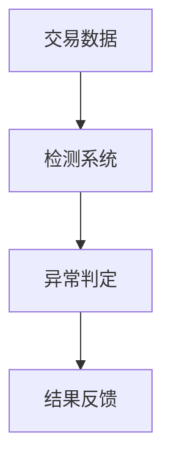
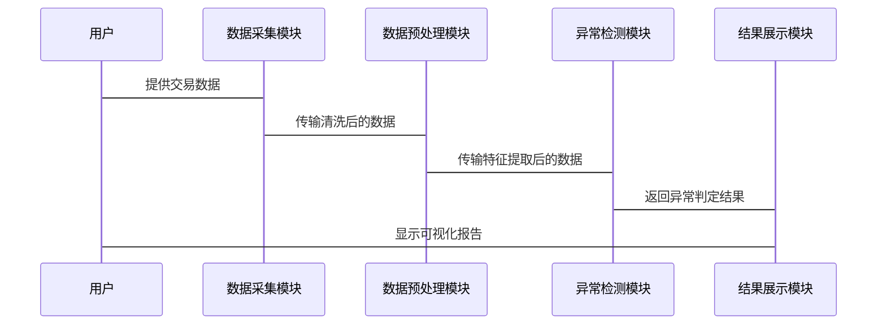

                 


# 设计智能化的企业财务异常交易检测系统

> 关键词：财务异常检测，智能化系统，机器学习，数据挖掘，企业风险管理

> 摘要：本文详细探讨了设计智能化企业财务异常交易检测系统的核心方法，结合实际案例和系统架构设计，系统性地分析了从数据采集、预处理、算法选择到系统实现的全过程，帮助读者全面理解并掌握如何构建高效的智能化检测系统。

---

# 第一部分: 背景介绍与核心概念

## 第1章: 企业财务异常交易检测的背景与问题

### 1.1 问题背景

#### 1.1.1 企业财务异常交易的定义与特点

企业财务异常交易指的是在企业财务数据中，由于人为错误、欺诈行为或系统故障等原因，导致财务数据偏离正常范围的交易。其特点包括：

- **隐蔽性**：异常交易往往隐藏在大量正常交易中，难以通过常规检查发现。
- **多样性**：异常交易的形式多样，可能涉及虚假交易、账务造假、资金挪用等。
- **动态性**：随着企业经营环境的变化，异常交易的模式也在不断演变。

#### 1.1.2 财务异常交易对企业的影响

- **财务损失**：直接导致企业资产损失，影响财务健康。
- **信用风险**：影响企业信用评级，可能导致融资困难。
- **法律风险**：涉及欺诈行为的交易可能引发法律纠纷。
- **声誉损失**：企业声誉受损，影响客户信任和市场地位。

#### 1.1.3 传统财务检测方法的局限性

- **人工检测效率低**：依赖人工审核，耗时且容易遗漏。
- **规则检测有限**：基于固定规则的检测方法难以应对复杂的异常模式。
- **数据孤岛问题**：缺乏跨部门数据整合，难以全面分析。

### 1.2 问题描述

#### 1.2.1 异常交易检测的核心目标

- 快速、准确地识别潜在异常交易。
- 提供实时或近实时的检测结果，支持及时决策。
- 支持事后审计和分析，提供详细交易记录。

#### 1.2.2 异常交易的典型场景与案例

- **虚假交易**：通过虚构交易虚增收入或利润。
- **资金挪用**：通过关联交易或资金划转挪用企业资金。
- **账务造假**：通过虚增收入、虚减支出等方式 manipulating financial statements。
- **舞弊交易**：员工或管理层利用职务之便进行的欺诈性交易。

#### 1.2.3 问题解决思路

- 引入智能化技术，如机器学习和大数据分析，提高检测效率和准确性。
- 构建数据驱动的检测模型，实现自动化识别和预警。
- 结合业务规则和统计分析，提升检测系统的全面性。

### 1.3 问题解决思路

#### 1.3.1 智能化检测的基本思路

- **数据驱动**：利用企业财务数据，通过机器学习算法训练模型。
- **模型驱动**：构建基于统计分析或深度学习的异常检测模型。
- **实时监控**：实现对交易的实时检测，提供即时反馈。

#### 1.3.2 数据流与信息处理流程

- 数据采集：从企业财务系统中获取交易数据。
- 数据预处理：清洗、归一化和特征提取。
- 模型训练：基于历史数据训练异常检测模型。
- 实时检测：对新交易数据进行实时分析，识别异常。

#### 1.3.3 系统设计的总体框架

- **数据采集模块**：负责从企业系统中获取交易数据。
- **数据预处理模块**：对数据进行清洗和特征提取。
- **异常检测模块**：基于机器学习算法进行检测。
- **结果展示模块**：将检测结果以可视化形式呈现。

### 1.4 边界与外延

#### 1.4.1 异常交易的边界定义

- **交易金额**：与历史交易金额相比是否异常。
- **交易时间**：交易发生的时间是否异常集中。
- **交易对手**：交易对手是否为关联方或高风险客户。
- **交易类型**：交易类型是否符合企业正常业务范围。

#### 1.4.2 系统的适用范围与限制

- **适用范围**：适用于企业日常交易监控、财务审计和风险管理。
- **限制**：依赖高质量的财务数据，对数据缺失或噪声敏感。

#### 1.4.3 与其他财务系统的区别与联系

- **区别**：专注于异常交易检测，其他系统可能侧重于财务核算或报告。
- **联系**：可与ERP系统、财务分析系统等集成，提供全面的财务管理解决方案。

### 1.5 核心概念结构

#### 1.5.1 检测系统的组成要素

- 数据源：企业财务交易数据。
- 数据处理：数据清洗、特征提取。
- 异常检测算法：基于机器学习的异常检测模型。
- 结果展示：可视化界面、预警通知。

#### 1.5.2 数据流与信息处理流程

- 数据从企业系统中采集，经过预处理后输入检测模型，模型输出异常结果并反馈给用户。

#### 1.5.3 异常检测的判定标准

- 统计阈值：基于历史数据设定的正常范围。
- 模型置信度：检测模型对异常的判定概率。
- 业务规则：根据企业内部规定设定的检测规则。

---

## 第2章: 智能化财务异常交易检测系统的核心概念

### 2.1 系统原理

#### 2.1.1 数据采集与预处理

- 数据采集：从ERP系统、财务系统中获取交易数据。
- 数据预处理：清洗、去重、标准化。

#### 2.1.2 异常检测算法的选择与应用

- 基于聚类的异常检测：K-means、DBSCAN。
- 基于分类的异常检测：SVM、随机森林。
- 基于深度学习的异常检测：RNN、LSTM。

#### 2.1.3 结果反馈与优化机制

- 反馈结果：检测结果的可视化展示。
- 模型优化：根据新数据更新模型参数。

### 2.2 核心概念对比

#### 2.2.1 传统检测方法 vs 智能化方法

| 特性               | 传统检测方法                 | 智能化检测方法                 |
|--------------------|------------------------------|-------------------------------|
| 检测效率           | 低，依赖人工审核             | 高，自动化检测                 |
| 检测准确性         | 有限，依赖固定规则           | 高，基于数据学习               |
| 适应性             | 低，难以应对新型异常模式     | 高，能自适应新的异常模式       |

#### 2.2.2 不同算法的优缺点对比

| 算法               | 优点                           | 缺点                           |
|--------------------|--------------------------------|--------------------------------|
| 基于聚类的异常检测 | 可发现数据中的簇状异常         | 对噪声数据敏感，检测效果不稳定 |
| 基于分类的异常检测 | 分类精度高，适合二分类问题     | 需要大量标注数据               |
| 基于深度学习的异常检测 | 对复杂模式的检测能力强         | 计算资源消耗大，训练时间长     |

#### 2.2.3 系统性能指标的对比分析

| 指标               | 基于聚类的异常检测 | 基于分类的异常检测 | 基于深度学习的异常检测 |
|--------------------|-------------------|-------------------|------------------------|
| 检测速度           | 较慢              | 较快              | 最慢                  |
| 检测准确性         | 中等              | 高                | 高                    |
| 资源消耗           | 低                | 中等              | 高                    |

### 2.3 实体关系图



---

## 第3章: 系统架构与功能设计

### 3.1 系统功能模块

#### 3.1.1 数据采集模块

- **功能**：从企业系统中采集交易数据。
- **输入**：交易时间、交易金额、交易对手等。
- **输出**：清洗后的交易数据。

#### 3.1.2 数据预处理模块

- **功能**：对数据进行清洗、标准化和特征提取。
- **输入**：原始交易数据。
- **输出**：预处理后的数据特征。

#### 3.1.3 异常检测模块

- **功能**：基于机器学习算法检测异常交易。
- **输入**：预处理后的数据特征。
- **输出**：异常交易判定结果。

#### 3.1.4 结果展示与反馈模块

- **功能**：将检测结果以可视化形式展示，并提供预警通知。
- **输入**：异常交易判定结果。
- **输出**：可视化报告、预警信息。

### 3.2 系统架构设计


### 3.3 系统接口设计

#### 3.3.1 数据接口

- **输入接口**：接收交易数据。
- **输出接口**：返回异常交易结果。

#### 3.3.2 算法接口

- **输入接口**：接收预处理后的数据特征。
- **输出接口**：返回异常判定结果。

#### 3.3.3 结果接口

- **输入接口**：接收异常判定结果。
- **输出接口**：返回可视化报告。

### 3.4 系统交互流程



---

## 第4章: 项目实战

### 4.1 环境安装

- **安装Python**：建议使用Python 3.8或更高版本。
- **安装依赖库**：`pandas`, `numpy`, `scikit-learn`, `matplotlib`.

### 4.2 核心代码实现

```python
import pandas as pd
from sklearn.cluster import DBSCAN
from sklearn.preprocessing import StandardScaler

# 数据预处理
def preprocess_data(data):
    # 删除缺失值
    data = data.dropna()
    # 标准化处理
    scaler = StandardScaler()
    scaled_data = scaler.fit_transform(data)
    return scaled_data

# 异常检测
def detect_anomalies(data):
    db = DBSCAN(eps=0.5, min_samples=5)
    db.fit(data)
    return db.fit_predict(data)

# 可视化
def visualize_results(data, labels):
    import matplotlib.pyplot as plt
    plt.scatter(data[:,0], data[:,1], c=labels, cmap='viridis')
    plt.title('Anomaly Detection Results')
    plt.show()

# 主函数
def main():
    # 读取数据
    data = pd.read_csv('transactions.csv')
    # 数据预处理
    processed_data = preprocess_data(data)
    # 检测异常
    labels = detect_anomalies(processed_data)
    # 可视化结果
    visualize_results(processed_data, labels)

if __name__ == "__main__":
    main()
```

### 4.3 代码解读与分析

- **数据预处理**：使用`StandardScaler`对数据进行标准化处理，消除特征之间的量纲差异。
- **异常检测**：采用DBSCAN算法，基于密度的聚类方法，能够发现密度较低的点作为异常。
- **结果可视化**：通过`matplotlib`将检测结果以颜色区分显示，直观展示异常点。

### 4.4 实际案例分析

假设我们有一个交易数据集`transactions.csv`，其中包含以下字段：

| 交易时间 | 交易金额 | 交易对手 | 交易类型 | 其他特征 |
|----------|----------|----------|----------|----------|
| 2023-01-01 | 1000 | A公司 | 正常交易 | ... |
| 2023-01-02 | 2000 | B公司 | 正常交易 | ... |
| ... | ... | ... | ... | ... |
| 2023-12-31 | 100000 | C公司 | 异常交易 | ... |

通过上述代码，我们可以检测出交易金额异常高的交易，并标记为异常。

### 4.5 项目小结

- **核心实现**：基于DBSCAN算法实现异常交易检测。
- **优势**：能够发现数据中的簇状异常，适用于交易数据的复杂场景。
- **局限性**：对噪声数据敏感，需要对数据进行充分预处理。

---

## 第5章: 最佳实践与总结

### 5.1 最佳实践 Tips

- **数据质量**：确保数据的完整性和准确性，数据预处理是关键。
- **模型选择**：根据具体场景选择合适的算法，如高维数据适合聚类算法。
- **实时性**：考虑系统的实时性需求，选择适合的计算框架。
- **可解释性**：选择可解释性较高的算法，便于结果分析和优化。

### 5.2 小结

智能化企业财务异常交易检测系统通过结合机器学习和大数据分析技术，能够有效提高检测效率和准确性。本文从系统设计、算法选择到实际实现，详细介绍了构建智能化检测系统的全过程。

### 5.3 注意事项

- **数据隐私**：确保数据的安全性和隐私性，遵守相关法律法规。
- **模型更新**：定期更新模型参数，确保检测效果。
- **异常处理**：建立完善的异常处理机制，应对模型误判情况。

### 5.4 拓展阅读

- 《机器学习实战》：学习更多机器学习算法和实践技巧。
- 《大数据分析与挖掘》：深入了解大数据分析方法和工具。

---

# 作者：AI天才研究院/AI Genius Institute & 禅与计算机程序设计艺术 /Zen And The Art of Computer Programming

