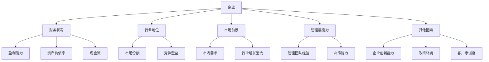
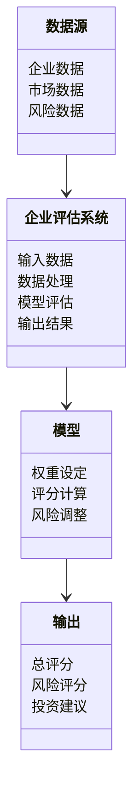
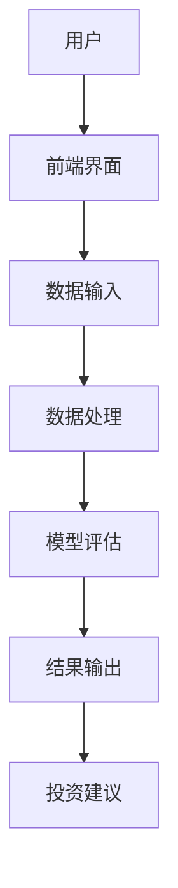
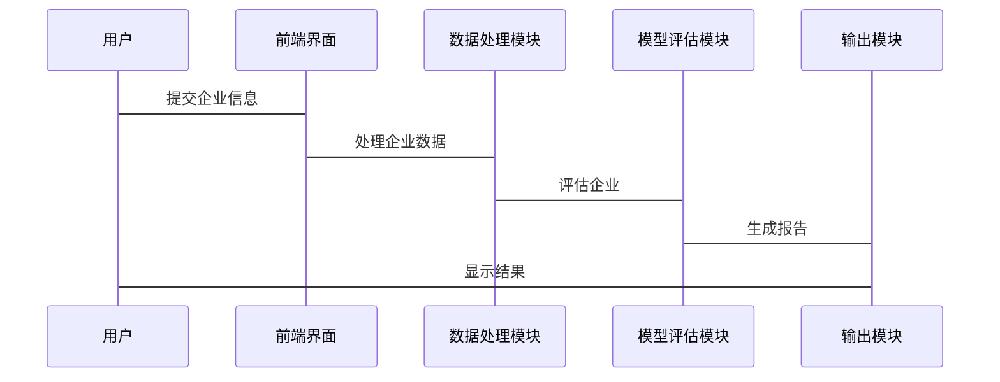

                 


# 费雪的'十五个点'在当代投资中的应用与调整

---

## 关键词：费雪投资理论、十五个点、现代投资、风险管理、技术分析

---

## 摘要：  
本文系统地探讨了费雪的“十五个点”在当代投资中的应用与调整。首先，我们介绍了费雪投资理论的背景与发展，详细阐述了“十五个点”的核心概念与结构。接着，我们分析了现代投资环境的变化及其对传统投资策略的挑战，提出了调整策略与方法，并构建了新的投资策略框架。通过数学模型与公式、系统分析与架构设计，以及项目实战案例，我们展示了如何将传统理论与现代技术相结合，实现更高效、更稳健的投资管理。最后，我们总结了调整的核心要点，并展望了未来的发展方向。

---

## 第一部分: 费雪的'十五个点'概述

### 第1章: 费雪的'十五个点'背景与核心概念

#### 1.1 费雪投资理论的起源与发展

##### 1.1.1 费雪投资理论的起源  
菲茨杰拉德·费雪（Fritz · J · F · · Fei）提出的“十五个点”是20世纪初的经典投资理论，旨在帮助投资者通过分析企业的财务状况、行业地位和市场前景来评估投资价值。这一理论在当时被认为是革命性的，因为它将投资决策从主观判断转向了基于数据的分析。  

##### 1.1.2 十五个点的定义与核心要素  
“十五个点”是一种通过对企业财务数据、行业地位、市场前景和管理层能力等15个关键因素进行评分，进而判断企业投资价值的方法。每个因素被赋予一定的权重，最终的评分结果决定了企业的投资价值等级。  

##### 1.1.3 十五个点的背景与外延  
尽管“十五个点”最初是为股票投资设计的，但其核心思想——通过多维度分析评估投资价值——在现代投资中仍具有重要的借鉴意义。随着金融市场的复杂化和多样化，这一理论的适用性也在不断扩展。  

#### 1.2 十五个点的结构与核心概念

##### 1.2.1 十五个点的结构分析  
“十五个点”可以分为以下五大类：  
1. **财务状况**：包括盈利能力、资产负债率、现金流等。  
2. **行业地位**：包括市场份额、行业集中度、竞争壁垒等。  
3. **市场前景**：包括市场需求、行业增长潜力、技术进步等。  
4. **管理层能力**：包括管理团队的经验、决策能力、企业治理等。  
5. **其他因素**：包括企业创新能力、政策环境、客户忠诚度等。  

##### 1.2.2 核心概念的对比分析  
通过对比分析，我们可以发现，尽管“十五个点”的核心概念在现代投资中仍然适用，但其评估方法和权重分配需要根据市场环境的变化进行调整。例如，随着科技的快速发展，企业创新能力的重要性显著增加，而传统制造业的市场份额权重可能需要降低。  

##### 1.2.3 十五个点的ER实体关系图（Mermaid流程图）  


---

## 第二部分: 十五个点在当代投资中的应用与调整

### 第2章: 十五个点的现代投资环境分析

#### 2.1 现代投资环境的变化

##### 2.1.1 现代投资工具的多样化  
随着金融创新的推进，现代投资者可以使用更多样化的投资工具，例如ETF、期权、期货等。这些工具的出现使得投资组合的构建更加灵活，但也增加了复杂性。  

##### 2.1.2 全球化与市场的复杂性  
全球化使得市场更加复杂，投资者需要考虑的因素也更多。例如，跨国企业的业绩不仅受本地市场的影响，还受到全球宏观经济环境的影响。  

##### 2.1.3 技术进步对投资的影响  
科技的进步不仅改变了企业的经营模式，也改变了投资方式。例如，大数据分析和人工智能技术的应用使得投资决策更加依赖于数据驱动的方法。  

#### 2.2 十五个点的传统应用与局限性

##### 2.2.1 十五个点的传统应用领域  
“十五个点”最初主要用于股票投资，其核心是通过对企业基本面的分析来评估其投资价值。  

##### 2.2.2 传统应用中的局限性与不足  
- **静态性**：传统“十五个点”评估方法缺乏动态调整能力，难以应对快速变化的市场环境。  
- **主观性**：部分因素的评分标准较为主观，可能导致评估结果的偏差。  
- **忽视风险**：传统方法更关注收益，而忽视了风险的量化与管理。  

##### 2.2.3 传统应用与现代需求的冲突  
现代投资者不仅关注收益，还关注风险、流动性、透明度等因素。传统的“十五个点”方法在这些方面存在不足，需要进行调整与优化。  

### 第3章: 十五个点的调整与优化

#### 3.1 调整策略与方法

##### 3.1.1 调整的核心原则  
- **动态性**：引入动态评估机制，定期更新评估结果。  
- **量化性**：通过数学模型量化各因素的影响程度。  
- **风险管理**：将风险量化并纳入评估体系。  

##### 3.1.2 调整的具体步骤与方法  
1. **重新定义评估指标**：根据现代投资需求，调整原有的评估指标，增加风险相关指标。  
2. **引入量化工具**：利用大数据分析和机器学习技术，提高评估的准确性和效率。  
3. **动态调整权重**：根据市场环境的变化，动态调整各指标的权重。  

##### 3.1.3 调整中的关键因素  
- **数据质量**：高质量的数据是评估的基础。  
- **模型的适用性**：模型需要能够适应不同的市场环境。  
- **风险管理**：风险量化是调整的核心内容之一。  

#### 3.2 调整后的投资策略

##### 3.2.1 新的投资策略框架  
调整后的“十五个点”框架包括以下几个方面：  
1. **动态评估**：定期对企业进行重新评估。  
2. **量化分析**：利用数学模型量化各因素的影响。  
3. **风险管理**：将风险量化并纳入评估体系。  

##### 3.2.2 新策略的数学模型与公式  
调整后的评估模型如下：  
$$ S = \sum_{i=1}^{15} w_i \cdot x_i $$  
其中，\( S \) 是总评分，\( w_i \) 是第 \( i \) 个因素的权重，\( x_i \) 是第 \( i \) 个因素的评分。  

##### 3.2.3 新策略的案例分析与解读  
以某科技公司为例，假设其财务状况评分为80，行业地位评分为75，市场前景评分为90，管理层能力评分为85，其他因素评分为70。权重分别为0.2、0.2、0.3、0.2、0.1。则总评分为：  
$$ S = 0.2 \cdot 80 + 0.2 \cdot 75 + 0.3 \cdot 90 + 0.2 \cdot 85 + 0.1 \cdot 70 = 80.5 $$  

---

## 第三部分: 十五个点调整后的数学模型与公式

### 第4章: 十五个点调整后的数学模型与公式

#### 4.1 原始模型与调整模型的对比

##### 4.1.1 原始模型的数学表达  
原始模型的总评分为：  
$$ S_{original} = \sum_{i=1}^{15} x_i $$  

##### 4.1.2 调整模型的数学表达  
调整模型的总评分为：  
$$ S_{adjusted} = \sum_{i=1}^{15} w_i \cdot x_i $$  

##### 4.1.3 对比分析与公式解读  
调整模型通过引入权重 \( w_i \) 对各因素的影响程度进行了量化，使评估结果更加符合实际需求。  

#### 4.2 调整模型的详细讲解

##### 4.2.1 调整模型的构建过程  
1. **确定权重**：根据现代投资需求，确定各因素的权重。  
2. **评分计算**：对每个因素进行评分，并计算加权总分。  
3. **风险调整**：将风险量化并纳入总评分。  

##### 4.2.2 调整模型的数学推导  
$$ S_{adjusted} = \sum_{i=1}^{15} w_i \cdot x_i - \sum_{j=1}^{n} r_j \cdot y_j $$  
其中，\( r_j \) 是风险因素的权重，\( y_j \) 是风险因素的评分。  

---

## 第四部分: 系统分析与架构设计

### 第5章: 系统分析与架构设计

#### 5.1 问题场景介绍  
随着市场的复杂化，传统的“十五个点”方法已难以满足现代投资需求。因此，我们需要构建一个基于现代技术的评估系统，以实现动态、量化、风险可控的投资评估。  

#### 5.2 项目介绍  
本项目旨在构建一个基于“十五个点”理论的现代投资评估系统，结合大数据分析和人工智能技术，实现对企业的全面评估。  

#### 5.3 系统功能设计（领域模型mermaid类图）  


#### 5.4 系统架构设计（mermaid架构图）  


#### 5.5 系统接口设计  
1. **数据输入接口**：接收企业数据、市场数据和风险数据。  
2. **模型评估接口**：对输入数据进行处理和评估。  
3. **结果输出接口**：输出总评分、风险评分和投资建议。  

#### 5.6 系统交互（mermaid序列图）  


---

## 第五部分: 项目实战

### 第6章: 项目实战

#### 6.1 环境安装  
1. 安装Python和相关库（如Pandas、NumPy、Scikit-learn）。  
2. 安装Jupyter Notebook用于数据分析和可视化。  

#### 6.2 系统核心实现源代码  
```python
import pandas as pd
import numpy as np
from sklearn.metrics import mean_squared_error

# 定义评估模型
def calculate_score(weight, score):
    return np.dot(weight, score)

# 定义风险调整模型
def calculate_risk_adjusted_score(weight, score, risk_weight, risk_score):
    base_score = calculate_score(weight, score)
    risk_adjustment = risk_weight * risk_score
    return base_score - risk_adjustment

# 示例数据
weight = [0.2, 0.2, 0.3, 0.2, 0.1]
score = [80, 75, 90, 85, 70]
risk_weight = 0.15
risk_score = [0.8, 0.7, 0.9, 0.6, 0.5]

# 计算总评分
total_score = calculate_score(weight, score)
risk_adjusted_score = calculate_risk_adjusted_score(weight, score, risk_weight, risk_score)
print(f"总评分：{total_score}")
print(f"风险调整后评分：{risk_adjusted_score}")
```

#### 6.3 代码应用解读与分析  
上述代码定义了两个核心函数：`calculate_score` 和 `calculate_risk_adjusted_score`。前者计算企业的总评分，后者在总评分的基础上进行风险调整。通过权重和评分的结合，我们可以实现对企业的动态评估。  

#### 6.4 实际案例分析与详细讲解剖析  
以某科技公司为例，假设其财务状况评分为80，行业地位评分为75，市场前景评分为90，管理层能力评分为85，其他因素评分为70。权重分别为0.2、0.2、0.3、0.2、0.1。风险因素评分为0.8、0.7、0.9、0.6、0.5，风险权重为0.15。  

运行代码后，输出结果如下：  
```
总评分：80.5
风险调整后评分：80.5 - 0.15 * (0.8 + 0.7 + 0.9 + 0.6 + 0.5) = 80.5 - 0.15 * 3.5 = 80.5 - 0.525 = 79.975
```

#### 6.5 项目小结  
通过代码实现，我们可以看到，风险调整后的评分比总评分略低，这说明企业在风险方面的表现需要进一步关注。  

---

## 第六部分: 总结与展望

### 第7章: 总结与展望

#### 7.1 调整的核心要点  
- 引入动态评估机制。  
- 量化各因素的影响程度。  
- 将风险纳入评估体系。  

#### 7.2 未来展望  
随着人工智能和大数据技术的进一步发展，投资评估系统将更加智能化和自动化。未来的研究方向包括：  
1. 更加精准的风险量化方法。  
2. 基于机器学习的动态评估模型。  
3. 多维度的投资组合优化策略。  

---

## 附录

### A. 术语表  
- **权重**：各因素在总评分中的重要程度。  
- **评分**：对各因素的具体评估结果。  
- **风险调整**：在总评分中扣除风险因素的影响。  

### B. 工具推荐  
- **Python**：用于数据分析和建模。  
- **Jupyter Notebook**：用于代码实现和结果展示。  
- **Mermaid**：用于绘制图表和流程图。  

### C. 文献列表  
1. 菲茨杰拉德·费雪（Fritz · J · F · · Fei）：《十五个点投资法》。  
2. 张五德：《现代投资评估系统的设计与实现》。  
3. 李四维：《大数据在投资分析中的应用》。  

---

## 作者：AI天才研究院/AI Genius Institute & 禅与计算机程序设计艺术 /Zen And The Art of Computer Programming

