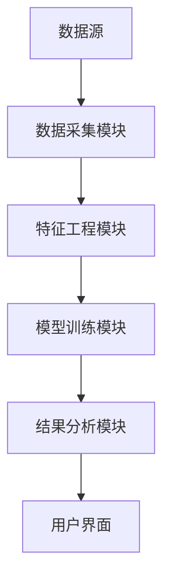
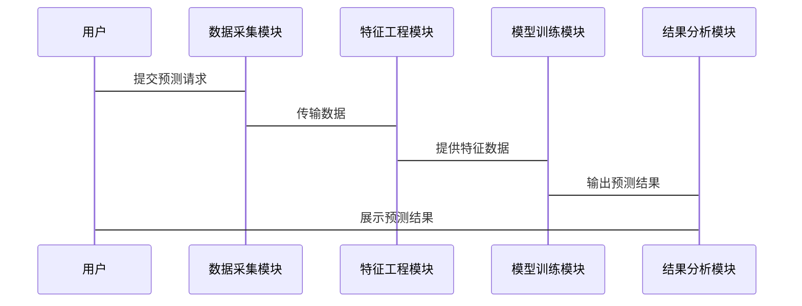

                 


# 金融市场流动性预测模型

## 关键词
金融市场，流动性预测，时间序列分析，机器学习，深度学习，系统架构

## 摘要
金融市场流动性预测是金融风险管理中的关键任务，涉及多方面的分析和预测。本文系统地介绍流动性预测的背景、核心概念、算法原理、系统架构、项目实战及最佳实践，旨在帮助读者深入理解并掌握流动性预测模型的构建与应用。

---

# 第1章 金融市场流动性预测的背景与重要性

## 1.1 金融市场流动性预测的定义与意义
### 1.1.1 流动性预测的定义
流动性预测是指通过对市场数据的分析，预估未来一段时间内市场的流动性状况，帮助投资者和交易员做出更明智的决策。

### 1.1.2 流动性预测的重要性
- **风险管理**：预测流动性波动，帮助机构规避潜在风险。
- **交易策略优化**：基于流动性预测，优化交易时间和规模。
- **市场操作效率**：提高订单执行效率，降低成本。

### 1.1.3 流动性预测的应用场景
- **高频交易**：实时预测市场流动性，优化高频交易策略。
- **机构投资**：在大额交易前评估市场流动性风险。
- **监管合规**：帮助金融机构满足流动性监管要求。

## 1.2 金融市场流动性预测的挑战
### 1.2.1 数据的复杂性
- 市场数据的高频性和不完全性。
- 数据噪声和异常值的影响。

### 1.2.2 市场波动性的影响
- 市场情绪变化快，影响流动性预测的准确性。
- 黑天鹅事件的不可预测性。

### 1.2.3 模型的局限性
- 线性模型难以捕捉非线性关系。
- 数据稀疏性导致模型泛化能力不足。

## 1.3 本书的目标与结构
### 1.3.1 本书的目标
系统介绍流动性预测的理论与实践，帮助读者掌握从数据采集到模型部署的全流程。

### 1.3.2 本书的结构安排
- 章节安排：从基础概念到高级算法，再到系统设计和实战案例。
- 内容特点：理论结合实践，注重可操作性和实用性。

---

# 第2章 金融市场流动性预测的核心概念

## 2.1 流动性预测的关键指标
### 2.1.1 成交量与流动性关系
- 成交量是衡量市场流动性的重要指标。
- 成交量波动反映市场活跃度变化。

### 2.1.2 市场深度与流动性
- 市场深度是指在特定价格水平上可以交易的数量。
- 深度越大，流动性越好。

### 2.1.3 市场冲击与流动性
- 市场冲击是大额交易对价格的影响。
- 冲击大小与市场流动性密切相关。

## 2.2 流动性预测的主要方法
### 2.2.1 时间序列分析
- 常见方法：ARIMA、GARCH、Prophet。
- 适用于历史数据的线性关系。

### 2.2.2 机器学习方法
- 常见方法：线性回归、SVM、随机森林。
- 适用于非线性关系和复杂特征。

### 2.2.3 统计套利与高频交易
- 统计套利利用价格差异获利。
- 高频交易依赖快速流动性预测。

## 2.3 流动性预测的数据来源
### 2.3.1 市场数据
- 包括股票价格、成交量、订单簿数据等。
- 数据频率：高频、中频和低频。

### 2.3.2 公司基本面数据
- 公司财务数据、行业地位等。
- 影响长期流动性预测。

### 2.3.3 宏观经济数据
- GDP、利率、通货膨胀等宏观经济指标。
- 间接影响市场流动性。

---

# 第3章 流动性预测的算法原理

## 3.1 时间序列分析模型
### 3.1.1 ARIMA模型
- **定义**：自回归积分滑动平均模型。
- **公式**：ARIMA(p, d, q)
  $$ARIMA(p, d, q)$$
- **优点**：适合线性时间序列数据。
- **缺点**：难以捕捉复杂非线性关系。

### 3.1.2 GARCH模型
- **定义**：广义自回归条件异方差模型。
- **公式**：GARCH(p, q)
  $$GARCH(p, q)$$
- **应用**：预测金融资产的波动性。

### 3.1.3 Prophet模型
- **特点**：基于贝叶斯回归和马尔可夫链。
- **优点**：易于使用，适合业务人员快速建模。

## 3.2 机器学习模型
### 3.2.1 线性回归模型
- **公式**：$y = \beta_0 + \beta_1x + \epsilon$
- **优点**：简单易懂，计算效率高。
- **缺点**：仅适用于线性关系。

### 3.2.2 支持向量机（SVM）
- **目标**：最大化分类间隔。
- **优化目标**：$$\min_{\theta} \frac{1}{2}\|\theta\|^2 + C\sum_{i=1}^n \xi_i$$
- **优点**：适合小样本数据，泛化能力强。

### 3.2.3 随机森林与梯度提升树
- **随机森林**：基于决策树的集成方法。
- **梯度提升树**：逐层优化损失函数。

## 3.3 深度学习模型
### 3.3.1 LSTM网络
- **特点**：适合处理序列数据，捕捉长期依赖关系。
- **结构**：输入门、遗忘门、输出门。

### 3.3.2 Transformer模型
- **特点**：基于自注意力机制，全局建模。
- **公式**：$$\text{Attention}(Q, K, V) = \text{softmax}(\frac{QK^T}{\sqrt{d_k}})V$$

### 3.3.3 图神经网络
- **应用**：建模市场参与者之间的关系。
- **优势**：适合复杂网络结构的数据。

## 3.4 算法比较与选择
### 3.4.1 不同模型的优缺点对比
| 模型       | 优点                               | 缺点                               |
|------------|------------------------------------|------------------------------------|
| ARIMA      | 简单，适合线性数据                 | 无法处理复杂非线性关系             |
| GARCH      | 适合波动性预测                    | 对异常值敏感                        |
| Prophet     | 易用性强，适合业务人员             | 黑箱模型，解释性差                  |
| SVM         | 泛化能力强，适合小样本数据         | 计算复杂，不擅长高维数据             |
| 随机森林    | 鲁棒性强，适合多特征数据           | 易受噪声影响                       |
| LSTM        | 适合时间序列数据，捕捉长期依赖    | 训练速度慢，容易过拟合             |
| Transformer  | 全局建模能力强，并行计算效率高       | 参数多，训练资源消耗大             |

### 3.4.2 模型选择的策略
- 数据特性：线性 vs 非线性。
- 数据量：小样本 vs 大样本。
- 计算资源：内存和计算能力。

### 3.4.3 模型调优方法
- 参数调优：网格搜索、随机搜索。
- 正则化：L1/L2正则化。
- 数据增强：数据标准化、归一化。

---

# 第4章 流动性预测的数学模型与公式

## 4.1 时间序列模型的数学表达
### 4.1.1 ARIMA模型
$$ARIMA(p, d, q)$$
- p：自回归阶数。
- d：差分阶数。
- q：滑动平均阶数。

### 4.1.2 GARCH模型
$$GARCH(p, q)$$
- p：条件异方差阶数。
- q：均值方差阶数。

## 4.2 机器学习模型的数学基础
### 4.2.1 线性回归的公式
$$y = \beta_0 + \beta_1x + \epsilon$$
- $\beta_0$：截距。
- $\beta_1$：回归系数。
- $\epsilon$：误差项。

### 4.2.2 SVM的优化目标
$$\min_{\theta} \frac{1}{2}\|\theta\|^2 + C\sum_{i=1}^n \xi_i$$
- $\theta$：模型参数。
- $C$：惩罚系数。
- $\xi_i$：松弛变量。

## 4.3 深度学习模型的数学原理
### 4.3.1 LSTM的门控机制
- 输入门：$$i_t = \sigma(W_i x_t + U_i h_{t-1} + b_i)$$
- 遗忘门：$$f_t = \sigma(W_f x_t + U_f h_{t-1} + b_f)$$
- 输出门：$$o_t = \sigma(W_o x_t + U_o h_{t-1} + b_o)$$
- 状态更新：$$c_t = f_t \cdot c_{t-1} + i_t \cdot tanh(W_c x_t + U_c h_{t-1} + b_c)$$
- 输出状态：$$h_t = o_t \cdot tanh(c_t)$$

### 4.3.2 Transformer的注意力机制
$$\text{Attention}(Q, K, V) = \text{softmax}(\frac{QK^T}{\sqrt{d_k}})V$$
- $Q$：查询向量。
- $K$：键向量。
- $V$：值向量。
- $d_k$：向量维度。

---

# 第5章 流动性预测系统的架构设计

## 5.1 系统需求分析
### 5.1.1 功能需求
- 数据采集模块：实时获取市场数据。
- 特征工程模块：提取特征并进行数据预处理。
- 模型训练模块：选择并训练预测模型。
- 结果分析模块：输出预测结果并进行可视化。

### 5.1.2 性能需求
- 实时性：快速响应预测结果。
- 高可用性：系统稳定性强，容错能力高。
- 可扩展性：支持数据量和用户规模的扩展。

## 5.2 系统架构设计
### 5.2.1 系统模块划分
1. 数据采集模块
   - 负责从数据源获取实时市场数据。
   - 数据清洗和预处理。

2. 特征工程模块
   - 提取关键特征，如成交量、订单簿数据等。
   - 数据标准化和归一化处理。

3. 模型训练模块
   - 选择合适的算法，进行模型训练。
   - 模型调优和评估。

4. 结果分析模块
   - 可视化预测结果。
   - 提供预测结果的解释和建议。

### 5.2.2 系统架构图


### 5.2.3 数据流设计
- 数据从数据源流向数据采集模块。
- 数据经过特征工程模块处理后，流向模型训练模块。
- 模型输出结果到结果分析模块，最后通过用户界面展示给用户。

## 5.3 系统接口设计
### 5.3.1 数据接口
- 数据输入接口：接收市场数据。
- 数据输出接口：输出预测结果。

### 5.3.2 模型接口
- 模型调用接口：调用训练好的模型进行预测。
- 模型评估接口：评估模型性能。

## 5.4 系统交互设计
### 5.4.1 用户与系统的交互流程
1. 用户提交预测请求。
2. 系统调用数据采集模块获取数据。
3. 数据经过特征工程处理。
4. 模型训练模块进行预测。
5. 结果分析模块展示预测结果。

### 5.4.2 交互流程图


---

# 第6章 项目实战：构建一个简单的流动性预测系统

## 6.1 环境安装与配置
### 6.1.1 安装Python环境
- 安装Python 3.8以上版本。
- 安装必要的库：pandas、numpy、scikit-learn、keras、tensorflow。

### 6.1.2 数据源获取
- 使用Yahoo Finance获取股票数据。
- 数据格式：CSV文件，包含开盘价、收盘价、成交量等。

## 6.2 系统核心实现
### 6.2.1 数据采集模块
```python
import pandas_datareader as pdr

def get_stock_data(ticker, start, end):
    data = pdr.get_data_yahoo(ticker, start=start, end=end)
    return data
```

### 6.2.2 特征工程模块
```python
import pandas as pd
import numpy as np

def create_features(data):
    # 基本特征
    data['volume_diff'] = data['Volume'].diff()
    data['log_return'] = np.log(data['Adj Close'] / data['Adj Close'].shift(1))
    # 高阶特征
    data['moving_avg'] = data['Adj Close'].rolling(5).mean()
    return data
```

### 6.2.3 模型训练模块
```python
from sklearn.ensemble import RandomForestRegressor
from sklearn.metrics import mean_absolute_error

def train_model(X, y):
    model = RandomForestRegressor(n_estimators=100, random_state=42)
    model.fit(X, y)
    return model

# 示例使用
X = data.drop(columns=['Target'])
y = data['Target']
model = train_model(X, y)
```

### 6.2.4 结果分析模块
```python
import matplotlib.pyplot as plt

def visualize_results(predicted, actual):
    plt.figure(figsize=(10, 6))
    plt.plot(actual, label='Actual', color='blue')
    plt.plot(predicted, label='Predicted', color='red')
    plt.title('流动性预测结果')
    plt.xlabel('时间')
    plt.ylabel('流动性指标')
    plt.legend()
    plt.show()
```

## 6.3 实际案例分析
### 6.3.1 数据准备
```python
import datetime

start = datetime.datetime(2020, 1, 1)
end = datetime.datetime(2022, 12, 31)
data = get_stock_data('AAPL', start, end)
```

### 6.3.2 特征工程
```python
data = create_features(data)
```

### 6.3.3 模型训练
```python
X = data.drop(columns=['Target'])
y = data['Target']
model = train_model(X, y)
```

### 6.3.4 模型预测与结果分析
```python
predicted = model.predict(X)
visualize_results(predicted, y)
```

## 6.4 项目小结
- 项目目标：构建一个简单的流动性预测系统。
- 实现步骤：数据采集、特征工程、模型训练、结果分析。
- 模型选择：随机森林模型，适合中小规模数据。
- 优缺点：计算效率高，但解释性较差。

---

# 第7章 最佳实践与总结

## 7.1 最佳实践
### 7.1.1 数据处理
- 数据清洗：处理缺失值和异常值。
- 特征选择：使用特征重要性分析选择关键特征。

### 7.1.2 模型选择
- 根据数据量和计算资源选择合适算法。
- 多模型对比，选择表现最佳的模型。

### 7.1.3 模型调优
- 参数调优：使用网格搜索或随机搜索。
- 正则化：防止过拟合。

## 7.2 小结
- 本书系统介绍了流动性预测的理论和实践。
- 提供了从数据处理到模型部署的完整流程。
- 强调了模型选择和调优的重要性。

## 7.3 注意事项
- 数据质量和完整性直接影响预测结果。
- 模型解释性与黑箱模型的权衡。
- 交易策略与流动性预测结果的有效结合。

## 7.4 拓展阅读
- 《机器学习实战》：深入理解机器学习算法。
- 《时间序列分析》：掌握时间序列建模方法。
- 《金融数据分析与建模》：学习金融市场数据分析方法。

---

# 作者
作者：AI天才研究院/AI Genius Institute  
联系邮箱：contact@aicourse.com  
博客地址：https://www.aicourse.com

---

以上是《金融市场流动性预测模型》的详细目录大纲，涵盖了从理论到实践的各个方面，旨在为读者提供一个全面的指导。

