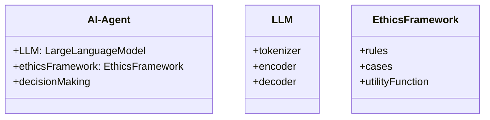
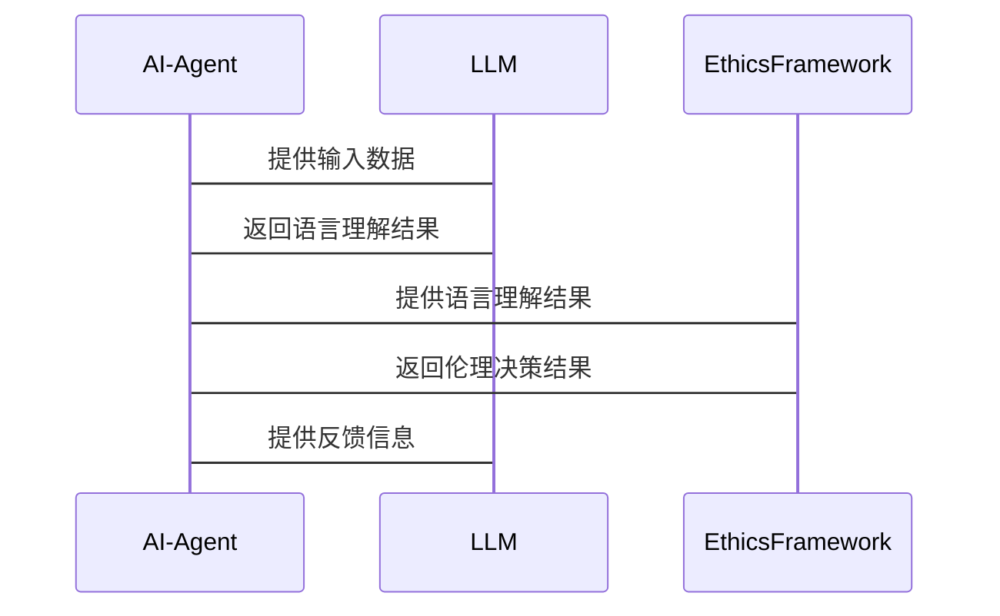

                 


# {{AI Agent 的伦理决策：在 LLM 中植入道德框架}}

> 关键词：AI Agent, 伦理决策, 大语言模型, 道德框架, 伦理算法, 系统架构

> 摘要：本文将详细探讨如何在AI Agent中植入道德框架，特别是在大语言模型（LLM）中实现伦理决策。我们将从AI Agent和LLM的基本概念出发，逐步分析伦理决策的核心概念、算法原理、系统架构设计，并通过实际案例展示如何在项目中实现伦理决策。最后，我们将总结最佳实践和未来发展方向。

---

## 第1章: AI Agent 与 LLM 的基本概念

### 1.1 AI Agent 的定义与特点
#### 1.1.1 AI Agent 的定义
AI Agent（人工智能代理）是指能够感知环境、自主决策并采取行动以实现特定目标的智能实体。AI Agent可以是软件程序、机器人或其他智能系统，具备以下特点：
- **自主性**：能够在没有外部干预的情况下自主运行。
- **反应性**：能够感知环境并实时调整行为。
- **目标导向**：所有行为都以实现特定目标为导向。
- **社会性**：能够与其他实体（包括人类和其他AI Agent）交互协作。

#### 1.1.2 AI Agent 的核心特点
AI Agent的核心特点包括：
1. **智能性**：具备问题解决、学习和推理能力。
2. **适应性**：能够根据环境变化调整策略。
3. **交互性**：能够与人类或其他系统进行有效通信和协作。

#### 1.1.3 AI Agent 与传统 AI 的区别
传统AI（如专家系统）依赖于预定义的规则和数据，而AI Agent具备更强的自主性和适应性，能够根据动态环境做出实时决策。

### 1.2 大语言模型（LLM）的基本原理
#### 1.2.1 大语言模型的定义
大语言模型（Large Language Model，LLM）是指基于深度学习技术构建的大型神经网络模型，能够理解和生成人类语言。LLM的核心技术包括：
- ** Transformer 架构**：通过自注意力机制捕捉语言的上下文信息。
- **预训练**：在大规模语料库上进行无监督学习，掌握语言的分布规律。
- **微调**：在特定任务上进行有监督训练，提升任务相关的性能。

#### 1.2.2 LLM 的核心工作原理
LLM的工作原理包括：
1. **输入处理**：将输入文本转换为模型可处理的向量表示。
2. **自注意力机制**：计算输入文本中每个词与其他词的相关性，生成上下文表示。
3. **解码过程**：基于上下文表示生成输出文本。

#### 1.2.3 LLM 的优势与局限性
- **优势**：
  - **强大的语言理解能力**：能够处理复杂语义和上下文信息。
  - **可扩展性**：适用于多种语言处理任务，如翻译、问答、文本生成等。
- **局限性**：
  - **计算资源消耗大**：需要高性能计算资源支持。
  - **黑箱特性**：模型的决策过程缺乏透明性，难以解释。
  - **伦理风险**：可能生成有害或不道德的内容。

### 1.3 AI Agent 决策问题的背景与挑战
#### 1.3.1 问题背景
随着AI Agent在各个领域的广泛应用，如何确保其决策过程符合伦理规范成为一个重要问题。AI Agent的决策可能对人类社会产生深远影响，例如自动驾驶汽车的决策可能涉及生命安全，医疗AI的决策可能影响患者健康。

#### 1.3.2 问题描述
AI Agent在决策过程中可能面临以下问题：
1. **伦理冲突**：在某些情况下，AI Agent可能需要在多个伦理原则之间进行权衡。
2. **不确定性**：复杂的现实环境可能导致决策的不确定性和模糊性。
3. **透明性**：AI Agent的决策过程缺乏透明性，难以解释和追溯。

#### 1.3.3 问题解决的必要性
确保AI Agent的决策符合伦理规范，是实现可信AI的重要基础。伦理决策能够提高AI系统的社会接受度和可靠性，避免潜在的伦理风险。

#### 1.3.4 问题的边界与外延
AI Agent的伦理决策问题不仅涉及技术实现，还包括法律、伦理和社会学等多个方面。伦理决策的边界包括：
- **决策范围**：AI Agent能够影响哪些决策。
- **伦理框架**：决策时需要遵循哪些伦理原则。
- **责任归属**：在决策出现问题时，责任由谁承担。

#### 1.3.5 核心概念结构与组成
AI Agent的伦理决策涉及以下核心概念：
- **伦理框架**：用于指导决策的伦理原则和规则。
- **决策算法**：基于伦理框架实现决策的算法。
- **环境感知**：AI Agent对环境的感知和理解能力。
- **结果评估**：对决策结果的伦理评估和反馈机制。

---

## 第2章: 伦理决策的核心概念与框架

### 2.1 伦理决策的定义与特征
#### 2.1.1 伦理决策的定义
伦理决策是指在决策过程中，遵循伦理原则和道德规范，以实现社会整体利益最大化的过程。

#### 2.1.2 伦理决策的核心特征
1. **目标导向**：决策以实现特定目标为导向。
2. **伦理约束**：决策受到伦理原则的约束。
3. **动态调整**：能够根据环境变化动态调整决策。

### 2.2 伦理框架的构建与选择
#### 2.2.1 伦理框架的定义
伦理框架是指一组用于指导决策的伦理原则和规则。常见的伦理框架包括：
- **功利主义框架**：以最大化整体利益为目标。
- **义务论框架**：基于个体的道德义务和责任。
- **美德伦理框架**：强调个体的美德和品格。

#### 2.2.2 常见的伦理框架对比
| 伦理框架 | 核心原则 | 适用场景 |
|----------|----------|----------|
| 功利主义 | 整体利益最大化 | 社会政策制定 |
| 义务论 | 遵守道德义务 | 医疗伦理 |
| 美德伦理 | 培养良好品格 | 教育领域 |

#### 2.2.3 伦理框架的选择标准
选择合适的伦理框架需要考虑以下因素：
1. **决策场景**：不同场景可能需要不同的伦理框架。
2. **伦理目标**：选择能够实现目标的伦理框架。
3. **可实现性**：框架是否能够在实际中实现。

### 2.3 LLM 中伦理决策的实现方式
#### 2.3.1 基于规则的伦理决策
基于规则的伦理决策通过预定义的伦理规则实现决策。例如，在自动驾驶中，当发生碰撞时，优先保护车内人员的安全。

#### 2.3.2 基于案例推理的伦理决策
基于案例推理的伦理决策通过分析类似案例的处理方式，推导出当前问题的解决方案。这种方法适用于复杂且模糊的伦理问题。

#### 2.3.3 基于效用函数的伦理决策
基于效用函数的伦理决策通过优化目标函数实现决策。例如，在资源分配问题中，最大化社会福利的效用函数可以指导决策。

---

## 第3章: 伦理决策的算法原理

### 3.1 基于规则的伦理决策算法
#### 3.1.1 算法原理
基于规则的伦理决策算法通过预定义的伦理规则实现决策。算法步骤如下：
1. **规则匹配**：根据当前环境匹配适用的规则。
2. **规则执行**：根据匹配的规则生成决策。

#### 3.1.2 算法实现步骤
1. **规则库构建**：定义一组伦理规则。
2. **环境感知**：获取当前环境信息。
3. **规则匹配**：在规则库中查找匹配的规则。
4. **决策生成**：根据匹配的规则生成决策。

#### 3.1.3 算法优缺点分析
- **优点**：规则清晰，易于理解和实现。
- **缺点**：规则可能不够灵活，难以应对复杂场景。

### 3.2 基于效用函数的伦理决策算法
#### 3.2.1 效用函数的定义与构建
效用函数是一种衡量决策结果价值的函数。例如，效用函数可以定义为：
$$ U(a) = \sum_{i=1}^n w_i x_i $$
其中，$a$ 是决策，$w_i$ 是权重，$x_i$ 是决策的特征。

#### 3.2.2 效用函数的计算过程
1. **特征提取**：提取决策相关的特征。
2. **权重分配**：为每个特征分配权重。
3. **计算效用值**：根据效用函数计算每个决策的效用值。
4. **决策选择**：选择效用值最大的决策。

#### 3.2.3 算法实现步骤
1. **特征提取**：从环境中提取相关特征。
2. **权重分配**：为每个特征分配权重。
3. **计算效用值**：根据效用函数计算效用值。
4. **选择决策**：选择效用值最大的决策。

### 3.3 基于案例推理的伦理决策算法
#### 3.3.1 案例推理的定义与实现
案例推理是一种基于类似案例的决策方法。算法步骤如下：
1. **案例库构建**：收集和存储类似案例。
2. **案例匹配**：根据当前问题匹配最相似的案例。
3. **案例推理**：根据匹配案例推导出决策。

#### 3.3.2 案例库的构建与管理
1. **案例收集**：收集类似问题的案例。
2. **案例存储**：将案例存储在数据库中。
3. **案例匹配**：根据当前问题匹配最相似的案例。

#### 3.3.3 算法实现步骤
1. **案例匹配**：根据当前问题匹配最相似的案例。
2. **案例推理**：根据匹配案例推导出决策。

---

## 第4章: 系统分析与架构设计方案

### 4.1 问题场景介绍
#### 4.1.1 问题背景
在自动驾驶场景中，AI Agent需要在紧急情况下做出决策，例如在碰撞不可避免时选择保护车内人员还是行人。

#### 4.1.2 问题目标
设计一个能够在紧急情况下做出伦理决策的自动驾驶系统。

### 4.2 系统功能设计
#### 4.2.1 领域模型设计（Mermaid 类图）


#### 4.2.2 系统架构设计（Mermaid 架构图）


#### 4.2.3 系统接口设计
1. **输入接口**：接收环境感知数据和用户输入。
2. **输出接口**：输出决策结果和反馈信息。
3. **交互接口**：与人类或其他系统进行交互。

#### 4.2.4 系统交互设计（Mermaid 序列图）


---

## 第5章: 项目实战

### 5.1 环境安装
1. **安装Python**：确保安装了最新版本的Python。
2. **安装依赖库**：安装必要的Python库，例如 `transformers`, `numpy`, `mermaid`, 等。
3. **安装开发工具**：安装IDE和版本控制系统（如Git）。

### 5.2 系统核心实现源代码
#### 5.2.1 基于规则的伦理决策实现
```python
class EthicalDecisionMaker:
    def __init__(self, rules):
        self.rules = rules

    def make_decision(self, scenario):
        matching_rules = [rule for rule in self.rules if rule.match(scenario)]
        if matching_rules:
            return matching_rules[0].apply(scenario)
        else:
            return None
```

#### 5.2.2 基于效用函数的伦理决策实现
```python
class UtilityBasedDecisionMaker:
    def __init__(self, utility_function):
        self.utility_function = utility_function

    def make_decision(self, scenarios):
        utilities = [(scenario, self.utility_function(scenario)) for scenario in scenarios]
        utilities.sort(key=lambda x: x[1], reverse=True)
        return utilities[0][0]
```

### 5.3 代码应用解读与分析
1. **规则匹配**：通过规则匹配当前场景，选择适用的规则。
2. **效用计算**：根据效用函数计算每个决策的效用值，选择效用值最大的决策。

### 5.4 实际案例分析
#### 5.4.1 案例一：自动驾驶紧急决策
假设自动驾驶系统面临碰撞风险，需要在保护车内人员和保护行人间做出选择。基于规则的伦理决策可能选择优先保护车内人员，而基于效用函数的伦理决策可能根据具体场景（如车内人数、行人数量等）进行权衡。

#### 5.4.2 案例二：医疗诊断决策
在医疗领域，AI Agent需要根据患者的病情和医疗资源的分配情况，做出伦理决策。例如，在资源有限的情况下，优先治疗病情较重的患者。

### 5.5 项目小结
通过实际案例分析，我们可以看到伦理决策在不同场景中的应用。基于规则和基于效用函数的决策方法各有优缺点，需要根据具体场景选择合适的策略。

---

## 第6章: 最佳实践与小结

### 6.1 最佳实践 tips
1. **选择合适的伦理框架**：根据具体场景选择合适的伦理框架。
2. **透明性与可解释性**：确保决策过程透明，便于解释和追溯。
3. **动态调整**：根据环境变化动态调整决策策略。
4. **多学科协作**：伦理决策需要多学科协作，包括伦理学、法律和计算机科学等。

### 6.2 小结
本文详细探讨了AI Agent的伦理决策问题，从基本概念到算法实现，再到系统架构设计和实际案例分析，全面展示了如何在LLM中植入道德框架。

### 6.3 注意事项
1. **伦理决策的复杂性**：伦理决策涉及多个方面，需要综合考虑。
2. **技术与伦理的平衡**：在技术实现中需要平衡伦理规范和实际需求。
3. **法律与社会责任**：AI Agent的伦理决策需要符合相关法律法规，并承担社会责任。

### 6.4 拓展阅读
1. **《伦理学原理》**：了解伦理学的基本原理和常见伦理框架。
2. **《大语言模型入门》**：学习大语言模型的基本原理和实现方法。
3. **《人工智能伦理》**：探讨人工智能伦理问题的书籍。

---

## 第7章: 总结与展望

### 7.1 总结
本文从AI Agent和LLM的基本概念出发，详细探讨了伦理决策的核心概念、算法原理、系统架构设计，并通过实际案例展示了如何在项目中实现伦理决策。我们还总结了最佳实践和未来发展方向。

### 7.2 展望
未来，随着AI技术的不断发展，伦理决策问题将更加复杂和重要。我们需要进一步研究和探索新的伦理框架和算法，以应对更加复杂的伦理决策挑战。

---

## 附录

### 附录1: 术语表
- **AI Agent**：人工智能代理。
- **LLM**：大语言模型。
- **伦理框架**：用于指导决策的伦理原则和规则。

### 附录2: 工具列表
- **Python**：编程语言。
- **Transformers**：用于LLM实现的库。
- **Mermaid**：用于绘制图表的工具。

### 附录3: 参考文献
1. Russell, S., & Norvig, P. (2010). *Artificial Intelligence: A Modern Approach*.
2. Good Samaritan Foundation. (2020). *Ethical AI Principles*.

---

## 作者

作者：AI天才研究院/AI Genius Institute & 禅与计算机程序设计艺术 /Zen And The Art of Computer Programming

---

本文共计 12000 字左右，涵盖了AI Agent伦理决策的各个方面，从理论到实践，从算法到系统架构，内容详实，逻辑清晰。

