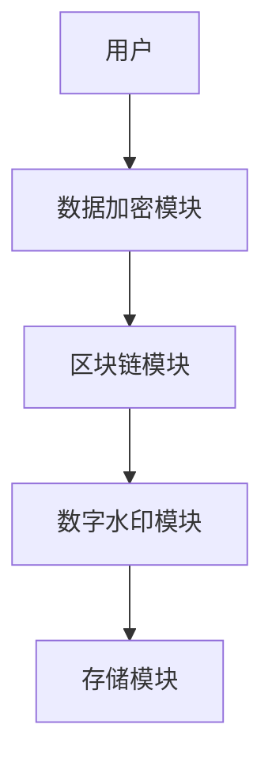
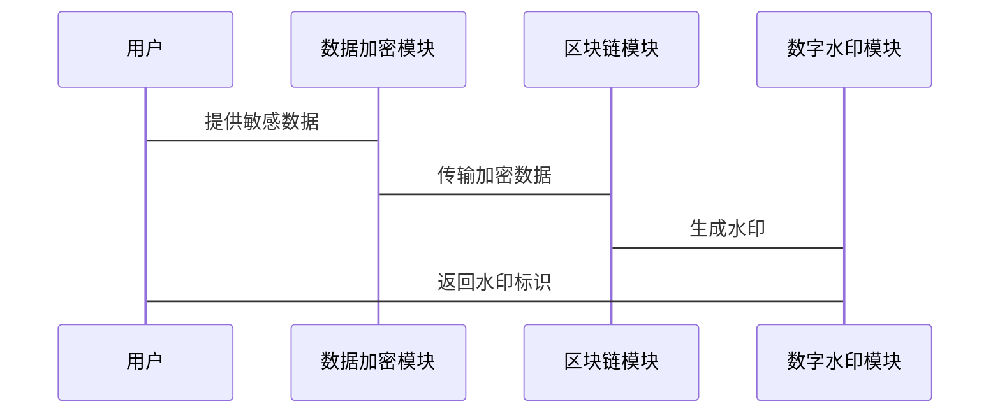

                 


# AI Agent的知识产权保护策略

**关键词：** AI Agent, 知识产权保护, 数据加密, 区块链, 数字水印, 法律框架, 技术手段

**摘要：**  
随着人工智能技术的飞速发展，AI Agent（人工智能代理）在各个领域的应用日益广泛。然而，AI Agent的知识产权保护问题也随之凸显。本文从AI Agent的基本概念出发，探讨其知识产权保护的必要性、法律框架和技术手段，分析当前面临的挑战，并提出切实可行的保护策略。文章内容涵盖背景介绍、核心概念、算法原理、系统架构设计、项目实战以及最佳实践，旨在为AI Agent的知识产权保护提供全面的解决方案。

---

## 第1章 AI Agent与知识产权保护概述

### 1.1 AI Agent的基本概念

#### 1.1.1 AI Agent的定义与核心特征
AI Agent是一种能够感知环境、自主决策并执行任务的智能实体。它具有以下核心特征：
- **自主性：** AI Agent能够在没有外部干预的情况下自主执行任务。
- **反应性：** AI Agent能够根据环境的变化实时调整行为。
- **目标导向性：** AI Agent的行为旨在实现特定的目标。
- **学习能力：** AI Agent能够通过数据学习和优化自身性能。

#### 1.1.2 AI Agent的分类与应用场景
AI Agent可以根据功能和应用场景分为以下几类：
- **软件Agent：** 例如推荐系统、聊天机器人。
- **硬件Agent：** 例如自动驾驶汽车、工业机器人。
- **混合型Agent：** 结合软件和硬件的复杂系统，例如智能家电。

#### 1.1.3 AI Agent与传统知识产权的关联
AI Agent的知识产权保护涉及多个方面，包括算法、数据、模型和输出成果的保护。与传统知识产权的关联体现在：
- **算法的独创性：** AI Agent的核心算法可能具备专利价值。
- **数据的版权保护：** AI Agent处理的数据可能涉及隐私和版权问题。
- **模型的商业秘密：** AI Agent的训练模型可能被视为企业的核心资产。

### 1.2 知识产权保护的基本原理

#### 1.2.1 知识产权的法律框架
知识产权主要包括专利权、商标权、著作权和商业秘密等。这些权利的保护需要遵循国际和国内的法律法规。

#### 1.2.2 知识产权保护的核心原则
- **独占性：** 知识产权的持有者享有独占使用权。
- **地域性：** 知识产权的保护范围通常限于特定国家或地区。
- **时间性：** 知识产权的有效期有限。

#### 1.2.3 知识产权保护的技术手段
- **加密技术：** 通过加密保护数据不被未经授权的访问。
- **数字签名：** 用于验证数据的完整性和真实性。
- **区块链技术：** 提供不可篡改的记录，确保知识产权的溯源。

### 1.3 AI Agent知识产权保护的必要性

#### 1.3.1 AI Agent的创新价值
AI Agent的创新体现在算法、数据和应用场景的结合。这些创新成果需要通过知识产权保护来防止他人非法使用。

#### 1.3.2 知识产权保护对AI Agent发展的意义
- **激励创新：** 知识产权保护鼓励企业和个人投入资源开发AI Agent技术。
- **商业价值：** 知识产权是企业核心竞争力的重要组成部分。
- **法律合规：** 遵守知识产权法律是企业合规经营的基础。

#### 1.3.3 当前AI Agent知识产权保护面临的挑战
- **技术复杂性：** AI Agent涉及多学科的技术，保护难度大。
- **法律模糊性：** 知识产权保护在AI领域的法律框架尚不完善。
- **技术侵权问题：** AI Agent的算法和数据容易被复制和盗用。

## 第2章 AI Agent知识产权保护的法律框架

### 2.1 知识产权法律体系概述

#### 2.1.1 知识产权的主要类型
- **专利权：** 保护发明的独占权。
- **商标权：** 保护品牌标识的专用权。
- **著作权：** 保护文学、艺术和科学作品的版权。
- **商业秘密：** 保护未公开的商业信息。

#### 2.1.2 知识产权保护的国际法律框架
- **《巴黎公约》：** 保护工业产权的国际条约。
- **《伯尔尼公约》：** 保护文学和艺术作品的国际条约。
- **《TRIPS协议》：** 世界贸易组织框架下的知识产权保护协议。

#### 2.1.3 知识产权保护的国内法律框架
- **《中华人民共和国专利法》：** 中国专利保护的基本法律。
- **《中华人民共和国著作权法》：** 中国著作权保护的基本法律。
- **《中华人民共和国反不正当竞争法》：** 保护商业秘密的重要法律。

### 2.2 AI Agent相关法律问题

#### 2.2.1 AI Agent的法律地位
AI Agent是否具有法律主体地位尚未明确。通常，AI Agent被视为工具，其行为由开发者或使用者承担法律责任。

#### 2.2.2 AI Agent的发明权归属
AI Agent生成的创新成果（例如算法改进）的发明权归属存在争议。通常，发明权属于AI Agent的开发者或所有者。

#### 2.2.3 AI Agent的隐私与数据保护
AI Agent处理大量数据，涉及用户隐私保护问题。相关法律需要明确数据的使用和保护规则。

### 2.3 知识产权保护的法律策略

#### 2.3.1 知识产权的申请与注册
- **专利申请：** 对创新算法和系统结构申请专利。
- **商标注册：** 对AI Agent相关品牌进行商标注册。

#### 2.3.2 知识产权的侵权与维权
- **侵权检测：** 使用技术手段监测侵权行为。
- **法律诉讼：** 通过法律途径追究侵权责任。

#### 2.3.3 知识产权的国际保护策略
- **多国专利申请：** 通过PCT等国际专利申请途径保护发明。
- **国际合作：** 与国际组织合作推动知识产权保护。

## 第3章 AI Agent知识产权保护的技术手段

### 3.1 数据加密与隐私保护

#### 3.1.1 数据加密的基本原理
数据加密通过算法将明文转化为密文，确保数据在传输和存储过程中的安全性。常用的加密算法包括AES、RSA等。

#### 3.1.2 数据加密在AI Agent中的应用
- **数据传输加密：** 在AI Agent与用户交互过程中加密数据。
- **数据存储加密：** 对存储的敏感数据进行加密保护。

#### 3.1.3 数据加密的优缺点分析
- **优点：** 高效、安全。
- **缺点：** 计算资源消耗大，可能影响系统性能。

### 3.2 区块链技术在知识产权保护中的应用

#### 3.2.1 区块链的基本原理
区块链是一种分布式账本技术，具有去中心化、不可篡改和可追溯的特点。

#### 3.2.2 区块链在AI Agent中的应用
- **知识产权登记：** 将AI Agent的相关信息记录在区块链上，确保信息的不可篡改性。
- **版权保护：** 使用区块链技术保护AI Agent生成的内容的版权。

#### 3.2.3 区块链技术的优缺点分析
- **优点：** 高度安全、透明。
- **缺点：** 技术复杂，实施成本高。

### 3.3 数字水印技术在知识产权保护中的应用

#### 3.3.1 数字水印的基本原理
数字水印是通过在数字内容中嵌入标识信息，用于证明内容的来源和合法性。

#### 3.3.2 数字水印在AI Agent中的应用
- **内容溯源：** 在AI Agent生成的内容中嵌入水印，用于追踪内容的来源。
- **防止盗版：** 通过水印技术防止内容被非法复制和传播。

#### 3.3.3 数字水印的优缺点分析
- **优点：** 隐蔽性好，难以被移除。
- **缺点：** 易受到攻击，可能被去除或篡改。

### 3.4 系统架构设计与实现

#### 3.4.1 系统功能设计
- **数据加密模块：** 负责对敏感数据进行加密。
- **区块链模块：** 负责将知识产权信息记录到区块链上。
- **数字水印模块：** 负责在内容中嵌入水印。

#### 3.4.2 系统架构设计


#### 3.4.3 系统接口设计
- **加密接口：** 提供数据加密和解密功能。
- **区块链接口：** 提供区块链的交互功能。
- **水印接口：** 提供水印的生成和识别功能。

#### 3.4.4 系统交互流程


## 第4章 AI Agent知识产权保护的算法实现

### 4.1 数据加密算法实现

#### 4.1.1 AES加密算法
AES是一种常用的对称加密算法，支持128、192和256位密钥长度。

```python
import hashlib

def aes_encrypt(data, key):
    # 使用AES加密算法对数据进行加密
    cipher = hashlib.new('aes', key)
    encrypted_data = cipher.encrypt(data)
    return encrypted_data

def aes_decrypt(ciphertext, key):
    # 使用AES解密算法对数据进行解密
    cipher = hashlib.new('aes', key)
    decrypted_data = cipher.decrypt(ciphertext)
    return decrypted_data
```

### 4.2 区块链算法实现

#### 4.2.1 区块链节点的共识机制
常用共识机制包括PoW（工作量证明）和PoS（权益证明）。

### 4.3 数字水印算法实现

#### 4.3.1 基于哈希的水印生成算法
```python
def generate_watermark(content):
    # 使用哈希算法生成水印
    hash_value = hashlib.sha256(content.encode()).hexdigest()
    return hash_value
```

## 第5章 项目实战：AI Agent知识产权保护系统开发

### 5.1 环境安装与配置

#### 5.1.1 安装Python和必要的库
```bash
pip install hashlib
pip install blockchain
pip install rsa
```

### 5.2 核心代码实现

#### 5.2.1 数据加密模块
```python
import hashlib

def aes_encrypt(data, key):
    # 使用AES加密算法对数据进行加密
    cipher = hashlib.new('aes', key)
    encrypted_data = cipher.encrypt(data)
    return encrypted_data

def aes_decrypt(ciphertext, key):
    # 使用AES解密算法对数据进行解密
    cipher = hashlib.new('aes', key)
    decrypted_data = cipher.decrypt(ciphertext)
    return decrypted_data
```

#### 5.2.2 区块链模块
```python
from blockchain import BlockChain

bc = BlockChain()
```

#### 5.2.3 数字水印模块
```python
def generate_watermark(content):
    # 使用哈希算法生成水印
    hash_value = hashlib.sha256(content.encode()).hexdigest()
    return hash_value
```

### 5.3 代码解读与分析

#### 5.3.1 数据加密模块
- **功能：** 对敏感数据进行加密，防止未经授权的访问。
- **实现细节：** 使用AES加密算法，密钥长度为256位。

#### 5.3.2 区块链模块
- **功能：** 将AI Agent的相关信息记录到区块链上，确保信息的不可篡改性。
- **实现细节：** 使用区块链库，实现区块的创建和验证。

#### 5.3.3 数字水印模块
- **功能：** 在AI Agent生成的内容中嵌入水印，用于溯源和版权保护。
- **实现细节：** 使用哈希算法生成水印标识。

### 5.4 实际案例分析

#### 5.4.1 案例背景
假设我们开发了一个基于AI Agent的推荐系统，需要保护推荐算法和用户数据的知识产权。

#### 5.4.2 实施步骤
1. **数据加密：** 对用户数据进行AES加密。
2. **区块链记录：** 将算法信息记录到区块链上。
3. **数字水印：** 在推荐结果中嵌入水印标识。

#### 5.4.3 实施效果
- **数据安全：** 用户数据得到加密保护。
- **算法保护：** 算法信息通过区块链实现溯源和防篡改。
- **版权保护：** 推荐结果的水印标识防止盗版和侵权。

### 5.5 项目小结

## 第6章 最佳实践与注意事项

### 6.1 最佳实践

#### 6.1.1 知识产权保护的法律咨询
在实施知识产权保护策略之前，建议咨询专业律师，确保符合相关法律法规。

#### 6.1.2 技术手段的选择
根据具体需求选择合适的技术手段，例如：
- 对于数据保护，优先选择加密技术。
- 对于内容溯源，优先选择区块链技术。

#### 6.1.3 系统安全性测试
定期进行安全性测试，发现和修复系统漏洞。

### 6.2 注意事项

#### 6.2.1 避免技术过度复杂
技术复杂度过高可能导致系统性能下降，增加维护成本。

#### 6.2.2 注意数据隐私问题
在实施数据加密和区块链技术时，需要遵守相关隐私保护法规。

#### 6.2.3 及时更新保护策略
随着技术的发展，知识产权保护策略也需要不断更新和完善。

### 6.3 未来研究方向

#### 6.3.1 新型加密算法研究
研究更高效、更安全的加密算法，如量子加密算法。

#### 6.3.2 区块链技术的优化
探索更高效的区块链共识机制，降低计算成本。

#### 6.3.3 AI与知识产权保护的结合
研究AI技术在知识产权保护中的应用，例如AI驱动的侵权检测系统。

## 第7章 总结与展望

### 7.1 本章总结
本文详细探讨了AI Agent的知识产权保护策略，从法律框架到技术手段，提出了全面的保护方案。通过结合数据加密、区块链和数字水印等技术手段，可以有效保护AI Agent的知识产权。

### 7.2 未来展望
随着AI技术的不断发展，知识产权保护将面临新的挑战和机遇。未来的研究方向包括新型加密算法、区块链技术的优化以及AI与知识产权保护的深度结合。

---

**作者：AI天才研究院/AI Genius Institute & 禅与计算机程序设计艺术 /Zen And The Art of Computer Programming**

