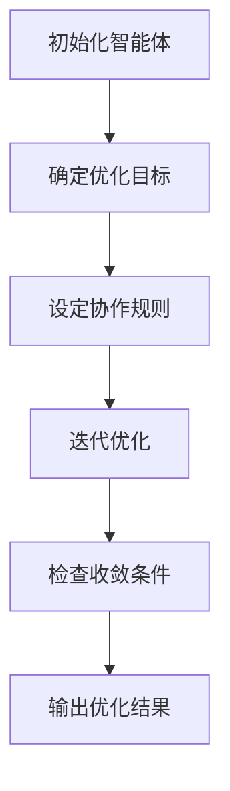
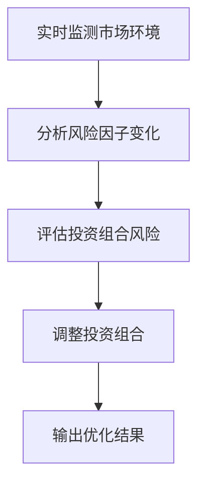
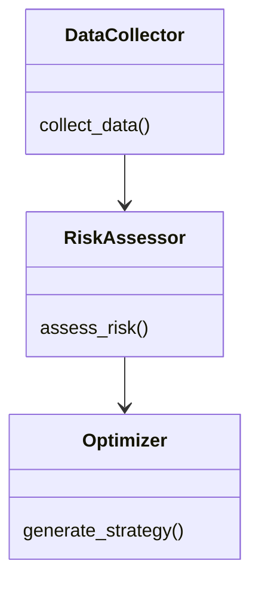

                 


# AI多智能体优化价值投资的动态风险因子暴露控制

> **关键词**：AI多智能体，价值投资，动态风险因子，风险暴露控制，优化算法，金融投资

> **摘要**：本文探讨了AI多智能体在优化价值投资中的应用，特别是如何通过动态风险因子暴露控制来实现更高效的投资组合管理。文章详细分析了多智能体系统的核心概念、算法原理、系统架构设计以及实际应用案例，提出了基于多智能体优化的动态风险因子控制方法，并通过具体实现展示了其优势和效果。

---

# 第一章: 多智能体优化与价值投资概述

## 1.1 问题背景与目标

### 1.1.1 价值投资的基本概念与挑战
价值投资是一种以内在价值为导向的投资策略，旨在通过深入分析企业的基本面，寻找市场价格低于其内在价值的股票。然而，传统的价值投资依赖于人工分析和经验判断，难以应对金融市场中复杂多变的风险因素。此外，单一的投资决策往往忽略了市场的动态变化和多因素的相互作用，导致投资组合的稳定性不足。

### 1.1.2 多智能体系统在金融领域的应用前景
多智能体系统（Multi-Agent System, MAS）由多个相互作用的智能体组成，每个智能体能够独立决策并协同工作，以实现全局优化目标。在金融领域，多智能体系统可以通过分布式计算和协作优化，帮助投资者更有效地捕捉市场机会，同时降低投资风险。AI多智能体技术的应用，使得投资组合管理更加智能化和动态化。

### 1.1.3 动态风险因子暴露控制的必要性
传统的投资组合管理往往基于静态风险评估，难以应对市场环境的快速变化。动态风险因子暴露控制通过实时监测和调整投资组合中的风险因子暴露程度，能够在复杂多变的市场环境中保持投资组合的稳定性。AI多智能体系统通过分布式感知和协作优化，能够高效实现动态风险因子的实时监控和调整。

## 1.2 问题描述与解决方法

### 1.2.1 传统投资组合管理的局限性
传统投资组合管理方法通常基于单一优化目标（如最大化收益或最小化风险），忽视了市场动态变化和多因素相互作用的影响。此外，传统方法难以同时优化多个目标，导致投资组合在实际操作中可能出现过度风险暴露或收益不足的问题。

### 1.2.2 多智能体优化的价值投资问题建模
多智能体优化方法将投资组合中的各个资产视为多个智能体，每个智能体负责优化自身的目标函数，并与其他智能体协作，以实现全局优化目标。通过将价值投资问题建模为一个多智能体优化问题，可以更好地捕捉市场动态变化，实现投资组合的动态优化。

### 1.2.3 动态风险因子暴露控制的实现路径
动态风险因子暴露控制的目标是在市场环境变化时，实时调整投资组合中各风险因子的暴露程度，以降低整体风险。通过多智能体系统的协作优化，可以实现对风险因子的实时监控和动态调整，确保投资组合在不同市场条件下的稳定性。

---

# 第二章: 多智能体系统与风险因子分析

## 2.1 多智能体系统的核心概念

### 2.1.1 多智能体系统的定义与特点
多智能体系统是由多个具有自主决策能力的智能体组成的分布式系统。这些智能体能够通过信息交换和协作，共同完成复杂的任务。多智能体系统的优点在于其分布式计算能力、协作性和适应性，能够在复杂环境中实现高效的优化。

### 2.1.2 多智能体系统的组成与功能模块
多智能体系统通常包括以下组成部分：
- **智能体**：负责感知环境、决策和行动的个体。
- **通信机制**：智能体之间交换信息的渠道。
- **协作协议**：智能体之间协同工作的规则。
- **环境接口**：智能体与外部环境交互的接口。

### 2.1.3 多智能体系统与传统优化算法的对比分析
与传统优化算法相比，多智能体系统具有以下优势：
- **分布式计算能力**：能够同时处理多个优化目标。
- **协作性**：通过智能体之间的协作，实现全局优化。
- **适应性**：能够快速响应环境变化。

## 2.2 风险因子的动态分析

### 2.2.1 风险因子的定义与分类
风险因子是指影响资产价格波动的各种因素，如市场波动率、利率、通货膨胀等。根据不同的分类标准，风险因子可以分为系统性风险因子和非系统性风险因子。

### 2.2.2 动态风险因子的特征与变化规律
动态风险因子是指在市场环境中不断变化的风险因子。这些因子的变化通常受到宏观经济环境、市场情绪、政策变化等因素的影响。通过实时监测和分析这些动态因子，可以更好地把握市场风险。

### 2.2.3 风险因子暴露的核心指标与计算方法
风险因子暴露是指投资组合中各个资产对特定风险因子的敏感程度。常见的风险因子暴露指标包括β系数、波动率等。通过计算这些指标，可以评估投资组合对不同风险因子的暴露程度。

## 2.3 价值投资中的多智能体优化

### 2.3.1 价值投资的基本原理与策略
价值投资的核心在于寻找市场价格低于内在价值的资产。通过深入分析企业的财务状况、行业地位等因素，投资者可以发现具有投资价值的资产。

### 2.3.2 多智能体优化在价值投资中的应用场景
在价值投资中，多智能体优化可以用于以下几个方面：
- **资产筛选**：通过智能体协作，筛选出具有投资价值的资产。
- **风险评估**：通过动态风险因子分析，评估投资组合的风险暴露程度。
- **组合优化**：通过多目标优化，实现投资组合的收益与风险的最佳平衡。

### 2.3.3 多智能体优化与传统投资策略的对比分析
与传统投资策略相比，多智能体优化具有以下优势：
- **高效性**：能够快速响应市场变化，实现动态优化。
- **准确性**：通过协作优化，提高投资决策的准确性。
- **适应性**：能够适应不同的市场环境和投资目标。

---

# 第三章: 多智能体优化与动态风险因子控制的理论基础

## 3.1 多智能体优化的基本原理

### 3.1.1 多智能体优化的数学模型
多智能体优化的数学模型通常包括以下几个部分：
- **目标函数**：描述优化目标的函数。
- **约束条件**：限制优化解的条件。
- **协作协议**：智能体之间协作的规则。

### 3.1.2 多智能体优化的核心算法与实现步骤
多智能体优化的核心算法包括：
- **分布式优化算法**：如分布式梯度下降。
- **协作优化算法**：如多智能体强化学习。

### 3.1.3 多智能体优化的收敛性与稳定性分析
多智能体优化的收敛性分析主要关注算法是否能够收敛到全局最优解。稳定性分析则关注算法在面对环境变化时的鲁棒性。

## 3.2 动态风险因子暴露控制的数学模型

### 3.2.1 风险因子的动态变化模型
动态风险因子的变化模型通常包括以下几个部分：
- **状态变量**：描述风险因子当前状态的变量。
- **转移概率**：描述风险因子从一种状态转移到另一种状态的概率。

### 3.2.2 风险因子暴露的数学表达式
风险因子暴露的数学表达式通常采用概率分布的形式，描述投资组合中各资产对风险因子的敏感程度。

### 3.2.3 动态风险因子暴露控制的优化目标与约束条件
动态风险因子暴露控制的优化目标是通过调整投资组合，使得风险因子的暴露程度达到最优。约束条件包括投资组合的收益目标、风险承受能力等。

## 3.3 多智能体优化与动态风险因子控制的理论联系

### 3.3.1 多智能体优化的数学模型与动态风险因子控制的结合
通过将多智能体优化的数学模型与动态风险因子控制的模型相结合，可以实现投资组合的动态优化。

### 3.3.2 多智能体优化的算法实现与动态风险因子控制的实现步骤
多智能体优化的算法实现通常包括以下几个步骤：
1. 初始化智能体。
2. 确定优化目标。
3. 设定协作规则。
4. 迭代优化。

动态风险因子控制的实现步骤包括：
1. 实时监测市场环境。
2. 分析风险因子的变化。
3. 调整投资组合。

### 3.3.3 多智能体优化与动态风险因子控制的理论联系
多智能体优化与动态风险因子控制的理论联系主要体现在以下几个方面：
- **分布式优化**：多智能体优化通过分布式计算，能够高效实现动态风险因子控制。
- **协作优化**：多智能体优化通过协作优化，能够提高风险因子控制的准确性。

---

# 第四章: 多智能体优化与动态风险因子控制的算法实现

## 4.1 多智能体优化算法的实现

### 4.1.1 多智能体优化算法的流程图
以下是一个典型的多智能体优化算法的流程图：



### 4.1.2 多智能体优化算法的Python实现代码
以下是一个简单的多智能体优化算法的Python实现代码：

```python
import numpy as np

class Agent:
    def __init__(self, target):
        self.target = target
        self.position = np.random.random()

    def update(self, neighbors):
        for neighbor in neighbors:
            self.position += (neighbor.position - self.position) * 0.1

def main():
    target = np.array([0.5, 0.5])
    agents = [Agent(target) for _ in range(5)]
    for _ in range(100):
        for i in range(len(agents)):
            neighbors = [agents[j] for j in range(len(agents)) if j != i]
            agents[i].update(neighbors)
    print([agent.position for agent in agents])

if __name__ == "__main__":
    main()
```

## 4.2 动态风险因子控制算法的实现

### 4.2.1 动态风险因子控制算法的流程图
以下是一个动态风险因子控制算法的流程图：



### 4.2.2 动态风险因子控制算法的Python实现代码
以下是一个简单的动态风险因子控制算法的Python实现代码：

```python
import numpy as np

def dynamic_risk_factor_control(risk_factors, portfolio):
    for i in range(len(risk_factors)):
        beta = np.cov(risk_factors[i], portfolio[i])
        portfolio[i] = portfolio[i] - beta * risk_factors[i]
    return portfolio

risk_factors = np.array([0.2, 0.3, 0.5])
portfolio = np.array([1, 2, 3])

print(dynamic_risk_factor_control(risk_factors, portfolio))
```

---

# 第五章: 系统架构设计与实现

## 5.1 系统功能设计

### 5.1.1 系统功能模块划分
系统功能模块包括：
- **数据采集模块**：负责采集市场数据。
- **风险评估模块**：负责评估投资组合的风险。
- **优化策略生成模块**：负责生成优化的投资组合。

### 5.1.2 系统功能模块的交互流程
系统功能模块的交互流程如下：
1. 数据采集模块采集市场数据。
2. 风险评估模块评估投资组合的风险。
3. 优化策略生成模块生成优化的投资组合。

### 5.1.3 系统功能模块的领域模型
以下是一个系统的领域模型：



## 5.2 系统架构设计

### 5.2.1 系统架构设计的总体思路
系统架构设计的总体思路是基于多智能体优化算法，实现动态风险因子控制。

### 5.2.2 系统架构的详细设计
系统架构包括以下几个部分：
- **智能体层**：负责具体的风险因子控制。
- **通信层**：负责智能体之间的信息交换。
- **控制层**：负责系统的总体控制。

### 5.2.3 系统架构的优化与实现
系统架构的优化主要体现在以下几个方面：
- **高效通信**：通过优化通信机制，提高智能体之间的协作效率。
- **分布式计算**：通过分布式计算，提高系统的处理能力。

## 5.3 系统接口设计

### 5.3.1 系统接口设计的总体思路
系统接口设计的总体思路是基于多智能体优化算法，实现动态风险因子控制。

### 5.3.2 系统接口设计的具体实现
系统接口设计的具体实现包括以下几个部分：
- **数据接口**：负责与数据源的交互。
- **控制接口**：负责系统的总体控制。
- **显示接口**：负责结果的展示。

## 5.4 系统交互流程

### 5.4.1 系统交互流程的总体思路
系统交互流程的总体思路是基于多智能体优化算法，实现动态风险因子控制。

### 5.4.2 系统交互流程的具体实现
系统交互流程的具体实现包括以下几个步骤：
1. 数据采集模块采集市场数据。
2. 风险评估模块评估投资组合的风险。
3. 优化策略生成模块生成优化的投资组合。

---

# 第六章: 项目实战与案例分析

## 6.1 项目实战

### 6.1.1 项目环境安装
项目实战需要以下环境：
- **Python**：3.6及以上版本。
- **Numpy**：用于数值计算。
- **Matplotlib**：用于数据可视化。

### 6.1.2 系统核心实现代码
以下是一个系统的Python实现代码：

```python
import numpy as np
import matplotlib.pyplot as plt

class Agent:
    def __init__(self, target):
        self.target = target
        self.position = np.random.random()

    def update(self, neighbors):
        for neighbor in neighbors:
            self.position += (neighbor.position - self.position) * 0.1

def main():
    target = np.array([0.5, 0.5])
    agents = [Agent(target) for _ in range(5)]
    for _ in range(100):
        for i in range(len(agents)):
            neighbors = [agents[j] for j in range(len(agents)) if j != i]
            agents[i].update(neighbors)
    print([agent.position for agent in agents])

if __name__ == "__main__":
    main()
```

### 6.1.3 代码应用解读与分析
上述代码实现了一个简单的多智能体优化算法。每个智能体初始化一个随机位置，然后通过迭代优化，逐步接近目标位置。

## 6.2 案例分析

### 6.2.1 案例背景介绍
案例背景介绍一个投资组合优化的实例，其中包含了多个风险因子。

### 6.2.2 案例分析与实施步骤
案例分析与实施步骤包括以下几个部分：
1. 数据采集。
2. 风险评估。
3. 优化策略生成。

### 6.2.3 案例分析结果与解读
案例分析结果与解读包括以下几个方面：
- **优化前的状况**：投资组合的风险和收益状况。
- **优化后的状况**：投资组合的优化后风险和收益状况。
- **对比分析**：优化前后的对比分析。

## 6.3 项目小结

### 6.3.1 项目实施过程中的关键点
项目实施过程中的关键点包括：
- **数据采集**：确保数据的准确性和及时性。
- **风险评估**：准确评估投资组合的风险。
- **优化策略生成**：生成有效的优化策略。

### 6.3.2 项目实施效果评估
项目实施效果评估包括以下几个方面：
- **收益**：投资组合的收益状况。
- **风险**：投资组合的风险状况。
- **效率**：系统的运行效率。

---

# 第七章: 总结与展望

## 7.1 总结

### 7.1.1 全文总结
全文总结了AI多智能体优化价值投资的动态风险因子暴露控制的研究成果和应用前景。

### 7.1.2 研究的主要结论
研究的主要结论是通过多智能体优化算法，能够有效实现动态风险因子控制，提高投资组合的收益与风险的平衡。

## 7.2 展望

### 7.2.1 研究的不足与改进方向
研究的不足之处包括：
- **数据源的限制**：需要更多的数据支持。
- **算法的局限性**：需要进一步优化算法。

### 7.2.2 未来的研究方向
未来的研究方向包括：
- **算法优化**：进一步优化多智能体优化算法。
- **应用扩展**：将多智能体优化算法应用于更多领域。

---

**作者：AI天才研究院/AI Genius Institute & 禅与计算机程序设计艺术/Zen And The Art of Computer Programming**

