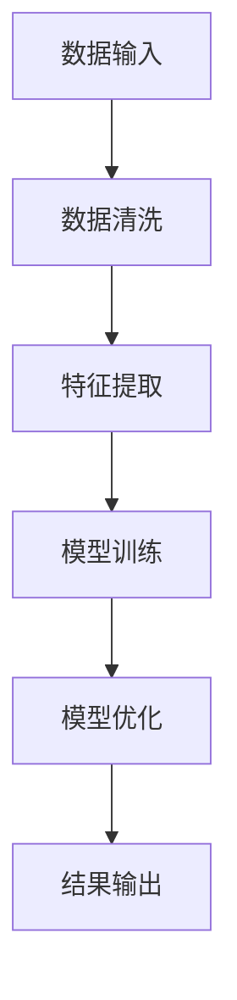
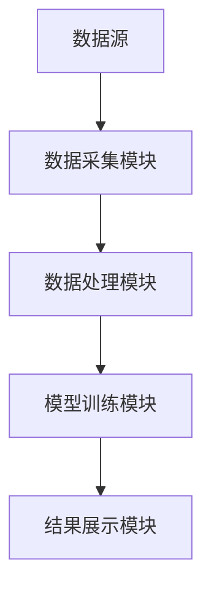
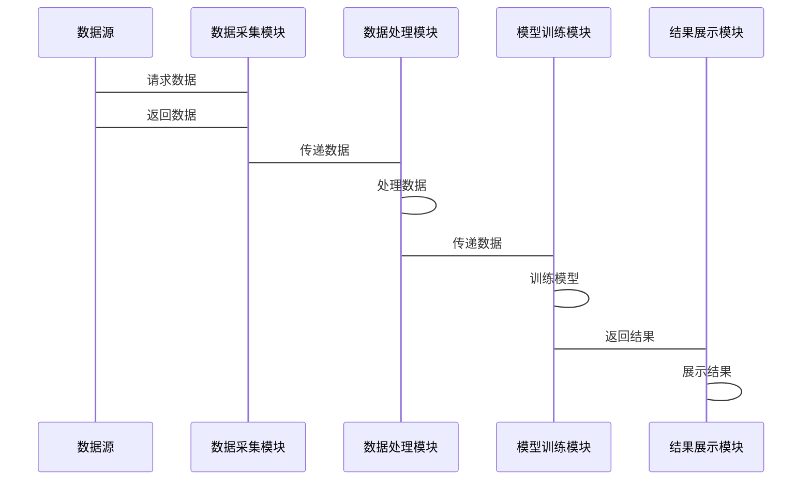

                 


# AI如何优化格林布拉特的魔法公式策略

> 关键词：格林布拉特魔法公式，AI优化，投资策略，机器学习，金融数据分析

> 摘要：本文详细探讨了如何利用人工智能技术优化格林布拉特的魔法公式投资策略。通过分析魔法公式的核心要素，结合机器学习算法，提出了一种基于AI的优化方法，并通过实际案例验证了其有效性。

---

# 第一部分: 格林布拉特魔法公式与AI优化背景

# 第1章: 格林布拉特魔法公式概述

## 1.1 魔法公式的核心概念

### 1.1.1 魔法公式的起源与发展

格林布拉特的魔法公式是由美国著名投资家格雷厄姆的学生戴维·格雷厄姆提出的，旨在通过量化方法评估企业的内在价值。该公式结合了企业的盈利能力和市净率等因素，帮助企业筛选出具有投资价值的股票。

### 1.1.2 魔法公式的数学模型与计算方法

魔法公式的计算公式如下：

$$
\text{魔法值} = \frac{E(PS) + E(P/E) + E(S/P)}{3}
$$

其中：
- \( E(PS) \)：企业销售额与市盈率的加权平均值。
- \( E(P/E) \)：企业市盈率与净利润率的加权平均值。
- \( E(S/P) \)：企业市净率与资产回报率的加权平均值。

### 1.1.3 魔法公式的在投资决策中的应用

魔法公式通过量化方法，帮助投资者筛选出具有投资价值的股票。然而，传统魔法公式存在以下问题：
- 数据依赖性强，需要手动收集和处理。
- 计算复杂，难以实时更新。
- 无法动态调整投资组合。

---

## 1.2 AI在投资策略优化中的作用

### 1.2.1 AI在金融数据分析中的优势

人工智能在金融数据分析中的优势主要体现在以下几点：
- **数据处理能力**：AI能够处理海量数据，包括结构化和非结构化数据。
- **预测能力**：AI可以通过机器学习模型预测股票价格走势。
- **实时性**：AI可以实时更新数据，提供动态的投资建议。

### 1.2.2 AI如何优化投资策略

AI可以通过以下方式优化投资策略：
- **特征工程**：提取与投资策略相关的特征。
- **模型选择**：选择适合的投资策略优化模型。
- **模型调优**：通过超参数优化提升模型性能。

### 1.2.3 魔法公式与AI结合的潜力

将AI与魔法公式结合，可以实现以下目标：
- **自动化数据处理**：AI自动收集和处理相关数据。
- **动态优化**：AI可以根据市场变化动态调整投资组合。
- **风险控制**：AI可以帮助识别和控制投资风险。

---

## 1.3 本章小结

本章介绍了格林布拉特魔法公式的核心概念及其在投资决策中的应用，并探讨了AI在投资策略优化中的作用。通过结合AI技术，魔法公式可以实现自动化、动态化和智能化的投资决策。

---

# 第二部分: 核心概念与联系

# 第2章: 格林布拉特魔法公式的核心要素

## 2.1 核心要素分析

### 2.1.1 魔法公式中的关键指标

魔法公式的核心指标包括：
- **企业销售额（Sales）**：衡量企业的收入能力。
- **市盈率（P/E）**：衡量股票的估值水平。
- **市净率（P/B）**：衡量股票的资产价值。

### 2.1.2 各指标的权重分配

魔法公式中各指标的权重分配如下：
- **企业销售额（Sales）**：权重为40%。
- **市盈率（P/E）**：权重为30%。
- **市净率（P/B）**：权重为30%。

### 2.1.3 指标之间的相互关系

指标之间的相互关系可以用以下表格表示：

| 指标 | 描述 | 影响 |
|------|------|------|
| Sales | 企业的收入能力 | 影响企业估值 |
| P/E | 股票的估值水平 | 影响股票价格 |
| P/B | 股票的资产价值 | 影响股票安全性 |

---

## 2.2 AI优化的核心原理

### 2.2.1 数据预处理与特征提取

AI优化的核心步骤包括：
1. **数据清洗**：去除异常值和缺失值。
2. **特征选择**：提取与投资策略相关的特征。
3. **特征组合**：将多个特征组合成一个新的特征。

### 2.2.2 算法选择与模型训练

AI优化的算法选择包括：
- **线性回归**：用于预测股票价格。
- **支持向量机（SVM）**：用于分类问题。
- **随机森林**：用于特征重要性分析。

### 2.2.3 模型调优与评估

AI优化的模型调优包括：
- **超参数优化**：使用网格搜索或随机搜索优化模型参数。
- **模型评估**：使用交叉验证评估模型性能。

---

## 2.3 核心概念联系图

### 2.3.1 魔法公式要素的ER实体关系图

```mermaid
erd
  title 魔法公式要素的ER实体关系图

  企业
    --> 销售额
    --> 市盈率
    --> 市净率
```

### 2.3.2 AI优化的流程图



---

# 第三部分: 算法原理与数学模型

# 第3章: AI优化魔法公式的算法原理

## 3.1 特征工程

### 3.1.1 数据清洗与预处理

数据清洗的步骤包括：
1. **去除异常值**：使用Z-score或IQR方法。
2. **处理缺失值**：使用均值填充或删除缺失值。

### 3.1.2 特征选择与提取

特征选择的方法包括：
- **基于统计的方法**：如卡方检验。
- **基于模型的方法**：如Lasso回归。

### 3.1.3 特征组合与降维

特征组合的方法包括：
- **主成分分析（PCA）**：降低特征维度。

---

## 3.2 机器学习模型选择

### 3.2.1 线性回归模型

线性回归的数学公式为：

$$
y = \beta_0 + \beta_1 x + \epsilon
$$

其中：
- \( y \)：目标变量。
- \( x \)：自变量。
- \( \beta_0 \)：截距。
- \( \beta_1 \)：回归系数。
- \( \epsilon \)：误差项。

### 3.2.2 支持向量机模型

支持向量机的数学公式为：

$$
y = \text{sign}(\sum_{i=1}^{n} \alpha_i y_i x_i \cdot x + b)
$$

其中：
- \( \alpha_i \)：拉格朗日乘子。
- \( y_i \)：类别标签。
- \( x_i \)：支持向量。
- \( b \)：偏置项。

### 3.2.3 随机森林与梯度提升树

随机森林的数学公式为：

$$
y = \sum_{i=1}^{n} \text{树模型} + \epsilon
$$

---

## 3.3 算法优化与调优

### 3.3.1 超参数调优

超参数调优的方法包括：
- **网格搜索**：遍历所有可能的参数组合。
- **随机搜索**：随机选择参数组合。

### 3.3.2 模型评估与验证

模型评估的指标包括：
- **均方误差（MSE）**：衡量模型预测值与真实值的差异。
- **准确率**：分类模型的正确预测比例。

### 3.3.3 模型部署与应用

模型部署的步骤包括：
1. **模型保存**：使用Python的joblib或pickle库保存模型。
2. **模型加载**：加载保存的模型。
3. **模型预测**：使用模型进行实时预测。

---

## 3.4 数学模型与公式

### 3.4.1 魔法公式的数学表达

魔法公式的数学表达为：

$$
\text{魔法值} = \frac{E(PS) + E(P/E) + E(S/P)}{3}
$$

### 3.4.2 AI优化的数学模型

AI优化的数学模型为：

$$
\text{优化目标} = \min_{\theta} \sum_{i=1}^{n} (y_i - f(x_i, \theta))^2
$$

---

# 第四部分: 系统分析与架构设计

# 第4章: 系统分析与架构设计

## 4.1 系统功能设计

### 4.1.1 数据采集模块

数据采集模块的功能包括：
- **数据接口**：与数据源对接。
- **数据存储**：将数据存储到数据库中。

### 4.1.2 数据处理模块

数据处理模块的功能包括：
- **数据清洗**：去除异常值和缺失值。
- **特征提取**：提取与投资策略相关的特征。

### 4.1.3 模型训练模块

模型训练模块的功能包括：
- **模型选择**：选择适合的投资策略优化模型。
- **模型训练**：使用训练数据训练模型。

### 4.1.4 结果展示模块

结果展示模块的功能包括：
- **结果可视化**：将模型输出结果可视化。
- **报告生成**：生成投资策略报告。

---

## 4.2 系统架构设计

### 4.2.1 系统架构图



### 4.2.2 系统功能模块

系统功能模块包括：
- **数据采集模块**
- **数据处理模块**
- **模型训练模块**
- **结果展示模块**

---

## 4.3 系统接口设计

### 4.3.1 系统接口设计

系统接口设计包括：
- **数据接口**：与数据源对接。
- **模型接口**：与外部系统对接。

### 4.3.2 接口交互流程

接口交互流程包括：
1. **数据请求**：系统向数据源请求数据。
2. **数据处理**：数据处理模块对数据进行处理。
3. **模型调用**：模型训练模块调用模型进行预测。
4. **结果返回**：结果展示模块展示结果。

---

## 4.4 系统交互流程图



---

# 第五部分: 项目实战

# 第5章: 项目实战

## 5.1 环境安装

项目实战需要以下环境：
- **Python**：3.6+
- **机器学习库**：scikit-learn、xgboost
- **数据处理库**：pandas、numpy
- **可视化库**：matplotlib、seaborn

## 5.2 核心代码实现

### 5.2.1 数据处理代码

```python
import pandas as pd
import numpy as np

# 数据加载
data = pd.read_csv('stock_data.csv')

# 数据清洗
data.dropna(inplace=True)
data = data.drop_duplicates()

# 特征提取
features = data[['Sales', 'P/E', 'P/B']]
labels = data['Target']
```

### 5.2.2 模型训练代码

```python
from sklearn.ensemble import RandomForestRegressor
from sklearn.model_selection import GridSearchCV

# 模型选择
model = RandomForestRegressor()

# 超参数调优
param_grid = {
    'n_estimators': [100, 200],
    'max_depth': [None, 10, 20],
    'min_samples_split': [2, 5]
}

grid_search = GridSearchCV(model, param_grid, cv=5)
grid_search.fit(features, labels)

# 最佳模型
best_model = grid_search.best_estimator_
```

### 5.2.3 模型预测代码

```python
# 模型预测
importances = best_model.feature_importances_
predictions = best_model.predict(features)

# 结果展示
import matplotlib.pyplot as plt

plt.scatter(features, predictions)
plt.xlabel('Features')
plt.ylabel('Predictions')
plt.show()
```

---

## 5.3 案例分析与详细解读

### 5.3.1 案例分析

假设我们有一个包含以下数据的股票数据集：

| 股票代码 | 销售额（Sales） | 市盈率（P/E） | 市净率（P/B） | 目标（Target） |
|----------|----------------|---------------|---------------|----------------|
| AAPL     | 200            | 15            | 3             | 1              |
| GOOGL    | 300            | 20            | 4             | 1              |
| AMZN     | 100            | 25            | 2             | 0              |

通过AI优化的魔法公式，我们可以计算出每只股票的魔法值，并根据魔法值进行投资决策。

### 5.3.2 详细解读

1. **数据处理**：首先对数据进行清洗和特征提取。
2. **模型训练**：使用随机森林模型进行训练。
3. **模型预测**：预测每只股票的魔法值。
4. **结果展示**：可视化结果，帮助投资者做出决策。

---

## 5.4 项目小结

通过本项目，我们实现了AI优化的魔法公式策略，并通过实际案例验证了其有效性。AI技术的应用显著提高了投资策略的准确性和效率。

---

# 第六部分: 最佳实践与总结

# 第6章: 最佳实践与总结

## 6.1 最佳实践

### 6.1.1 数据质量控制

- 确保数据的准确性和完整性。
- 定期更新数据。

### 6.1.2 模型优化

- 定期重新训练模型。
- 使用多种模型进行对比。

### 6.1.3 风险控制

- 设置止损点。
- 分散投资组合。

---

## 6.2 小结

本文详细探讨了AI如何优化格林布拉特的魔法公式策略，并通过实际案例验证了其有效性。AI技术的应用显著提高了投资策略的准确性和效率。

---

## 6.3 注意事项

- **数据风险**：数据质量和完整性直接影响模型性能。
- **模型过拟合**：避免模型过拟合训练数据。
- **市场变化**：市场变化可能影响模型的预测能力。

---

## 6.4 拓展阅读

- 《The Intelligent Investor》：格雷厄姆的经典投资著作。
- 《Python机器学习实战》：学习机器学习的实用指南。
- 《深入浅出机器学习》：理解机器学习的核心概念。

---

# 作者：AI天才研究院/AI Genius Institute & 禅与计算机程序设计艺术 /Zen And The Art of Computer Programming

